--- 
title: 'Geocomputation with R'
author: 'Robin Lovelace, Jakub Nowosad, Jannes Muenchow'
date: '2018-07-28'
knit: bookdown::render_book
site: bookdown::bookdown_site
documentclass: krantz
bibliography:
  - refs.bib
  - packages.bib
biblio-style: apalike
link-citations: yes
description: "Forthcoming book on geographic data with R."
github-repo: "Robinlovelace/geocompr"
url: 'https\://geocompr.robinlovelace.net'
---


# Welcome {-}

Welcome to the online home of *Geocomputation with R*, a forthcoming book with [CRC Press](https://www.crcpress.com/Chapman--HallCRC-The-R-Series/book-series/CRCTHERSER).

## Development {-}

Inspired by [**bookdown**](https://github.com/rstudio/bookdown) and other open source projects we are developing this book in the open.
This approach encourages contributions, ensures reproducibility and provides access to the material as it evolves.

The book development can be divided into three main phases:

1. Foundations
2. Extensions
3. Applications

New chapters will be added to this website as the project progresses, hosted at [geocompr.robinlovelace.net](https://geocompr.robinlovelace.net) and kept up-to-date thanks to [Travis](https://travis-ci.org/Robinlovelace/geocompr) which ensures the reproducibility:

[](https://travis-ci.org/Robinlovelace/geocompr)

The version of the book you are reading now was built on 2018-07-28 and was built on [Travis](https://travis-ci.org/Robinlovelace/geocompr).

## How to contribute? {-}

**bookdown** makes editing a book as easy as editing a wiki, provided you have a GitHub account ([sign-up at github.com](https://github.com/)).
Once logged-in to GitHub, click on the 'edit me' icon highlighted with a red ellipse in the image below.
This will take you to an editable version of the the source [R Markdown](http://rmarkdown.rstudio.com/) file that generated the page you're on:

[](https://github.com/Robinlovelace/geocompr/edit/master/index.Rmd)

To raise an issue about the book's content (e.g. code not running) or make a feature request, check-out the [issue tracker](https://github.com/Robinlovelace/geocompr/issues).

## Reproducibility {-}

To reproduce the book, you need a recent version of [R](https://cran.r-project.org/) and up-to-date packages, which can be installed with the following command (which requires [**devtools**](https://github.com/hadley/devtools)):


```r
devtools::install_github("robinlovelace/geocompr")
```

To build the book locally, clone or [download](https://github.com/Robinlovelace/geocompr/archive/master.zip) the [geocompr repo](https://github.com/Robinlovelace/geocompr/), load R in root directory (e.g. by opening [geocompr.Rproj](https://github.com/Robinlovelace/geocompr/blob/master/geocompr.Rproj) in RStudio) and run the following lines:


```r
bookdown::render_book("index.Rmd") # to build the book
browseURL("_book/index.html") # to view it
```

Further details can be found at [github.com/Robinlovelace/geocompr](https://github.com/Robinlovelace/geocompr#geocomputation-with-r).

<a rel="license" href="http://creativecommons.org/licenses/by-nc-nd/4.0/"></a><br />This work is licensed under a <a rel="license" href="http://creativecommons.org/licenses/by-nc-nd/4.0/">Creative Commons Attribution-NonCommercial-NoDerivatives 4.0 International License</a>.

# Preface {-}

This book is aimed at people who want to do spatial data analysis, visualization and modeling using open source software and reproducible workflows.
It is based on R, a flexible language for 'data science' with powerful geospatial capabilities and a strong ecosystem of add-on packages dedicated to spatial data (see the 'Spatial Task View' at [cran.r-project.org/web/views](https://cran.r-project.org/web/views/Spatial.html)).

R enables reproducibility through its command-line interface and ensures accessibility because it is freely available and works on most modern operating systems (including Linux, Windows and Mac).
The book will therefore be of interest to a wide range of people worldwide, although we expect it to be especially useful for:

- People who have learned spatial analysis skills using a desktop Geographic Information System (GIS) such as [QGIS](http://qgis.org/en/site/), [ArcMap](http://desktop.arcgis.com/en/arcmap/), [GRASS](https://grass.osgeo.org/) or [SAGA](http://www.saga-gis.org/en/index.html), who want access to a powerful (geo)statistical and visualization programming language and the benefits of a command-line approach [@sherman_desktop_2008]:

> With the advent of 'modern' GIS software, most people want to point and click their way through life. That’s good, but there is a tremendous amount of flexibility and power waiting for you with the command line.

- Graduate students and researchers from fields specializing in geographic data including Geography, Remote Sensing, Planning, GIS and Geographic Data Science
- Academics and post-graduate students working on projects in fields including Geology, Regional Science, Biology and Ecology, Agricultural Sciences (precision farming), Archaeology, Epidemiology, Transport Modeling, and broadly defined Data Science which require the power and flexibility of R for their research <!-- please add further fields-->
- Applied researchers and analysts in public, private or third-sector organizations who need the reproducibility, speed and flexibility of a command-line language such as R in applications dealing with spatial data as diverse as Urban and Transport Planning, Logistics, Geo-marketing (store location analysis) and Emergency Planning <!-- please add further examples-->

The book is designed for intermediate-to-advanced R users interested in geocomputation and R beginners who have prior experience with geographic data.
If you are new to both R and geographic data do not be discouraged: we provide links to further materials and describe the nature of spatial data from a beginner's perspective in Chapter \@ref(spatial-class) and in links provided below.

We aim to make R's famously steep learning curve more mellow and less rollercoaster:
the chapters increase in difficulty as the book progresses; each chapter starts relatively easy and covers the most important topics first to make the book as accessible as possible.
Exercises can be found at the end of each chapter.
Completing these encourages using R interactively to solve geospatial problems, ensuring you can operationalize the concepts and code in each chapter.

Impatient readers are welcome to dive straight into the practical examples, starting in Chapter \@ref(spatial-class).
However, we recommend reading about the wider context of *Geocomputation with R* in Chapter \@ref(intro) first.
If you are new to R we also recommend learning more about the language before attempting to run the code chunks provided in each chapter (unless you're reading the book for an understanding of the concepts).
Fortunately for R beginners R has supportive community that has developed a wealth of resources that can help.
We particularly recommend three tutorials:  [R for Data Science](http://r4ds.had.co.nz/) [@grolemund_r_2016] and [Efficient R Programming](https://csgillespie.github.io/efficientR/) [@gillespie_efficient_2016], especially [Chapter 2](https://csgillespie.github.io/efficientR/set-up.html#r-version) (on installing and setting-up R/RStudio) and [Chapter 10](https://csgillespie.github.io/efficientR/learning.html) (on learning to learn), and  [An introduction to R](http://colinfay.me/intro-to-r/) [@venables_introduction_2017].
A good interactive tutorial is DataCamp's [Introduction to R](https://www.datacamp.com/courses/free-introduction-to-r).
<!-- and tutorials created with [**learnr**](https://rstudio.github.io/learnr/examples.html). -->

Although R has a steep learning curve the command-line approach advocated in this book can quickly pay-off.
<!-- within a few months for most people, including programming novices. -->
As you'll learn in subsequent chapters, R is an effective tool for tackling a wide range of geographic data challenges.
We expect that, with practice, R will become the program of choice in your geospatial toolbox for many applications.
Typing and executing commands at the command-line is, in many cases, faster than pointing-and-clicking around the graphical user interface (GUI) a desktop GIS.
For some applications such as Spatial Statistics and modeling R may be the *only* realistic way to get the work done.

As outlined in section \@ref(why-geocomputation-with-r) there are many reasons for using R for geocomputation:
R is well-suited to the interactive use required in many geographic data analysis workflows compared with other languages.
R excels in the rapidly growing fields of Data Science (which includes data carpentry, statistical learning techniques and data visualization) and Big Data (via efficient interfaces to databases and distributed computing systems).
Furthermore R enables a reproducible workflow: sharing scripts underlying your analysis will allow others to build-on your work.
To ensure reproducibility in this book we have made its source code available at [github.com/Robinlovelace/geocompr](https://github.com/Robinlovelace/geocompr#geocomputation-with-r).
There you will find script files in the `code/` folder that generate figures:
when code generating a figure is not provided in the main text of the book the name of the script file that generated it is provided in the caption (see for example the caption for Figure \@ref(fig:zones)).

Other languages such as Python, Java and C++ can be used for geocomputation  and there are excellent resources for learning geocomputation *without R*, as discussed in section \@ref(software-for-geocomputation).
None of these provide the unique combination of package ecosystem, statistical capabilities, visualization options, powerful IDEs offered by the R community.
Furthermore, by teaching how to use one language (R) in depth, this book will equip you with the concepts and confidence needed to do geocomputation in other languages.

*Geocomputation with R* will equip you with knowledge and skills to tackle a wide range of issues, including those with scientific, societal and environmental implications, manifested in geographic data.
As described in section \@ref(what-is-geocomputation), geocomputation is not only about using computers to process geographic data:
it is also about real-world impact.
If you are interested in the wider context and motivations behind this book, read on:
these are covered in Chapter \@ref(intro).

<!-- to think about, not sure if needed but then this would be a good place to point out why our book might have advantages over other books. Compare with:
- Bivand, R., Pebesma, E., Gomez-Rubio, V. (2013): Applied spatial data analysis with R.
- Blangiardo, M. & Cameletti, M. (2015): Spatial and spatio-temporal Bayesian models with R - INLA.
- Brunsdon, C. & Comber, L. (2015): An introduction to R for spatial analysis and mapping.
- Dorman, M. (2014): Learning R for geospatial analysis.
- Hijmans, R. (2016): Spatial data analysis and modeling with R.  http://rspatial.org/intr/index.html (haven't read it but might be more suitable for beginners, however, it does not consider sf; additionally, it provides more code than text, and hence, probably less explanations than our book) 
- Quiang, S. (2016): Environmental and Ecological Statistics with R (not really a competitor, I have ordered a copy, this book is really about modeling, and I would rather prefer the Zuur et al. books over it)
- Wegmann, M., Leutner, B., Dech, S. (2016): Remote Sensing and GIS for ecologists: Using Open Source Software.
- Zuur, A., Ieno, E., Saveliev, A. (2017): Beginner's guide to spatial, temporal and spatial-temporal ecological data analysis with R-INLA.

Put the competing books into categories, e.g., introduction to spatial analysis (Brundsdon, Dorman, Hijmans), advanced spatial analysis (Bivand), topical spatial analysis (Quiang, Wegmann),  (mainly) spatial modeling (Bivand, Blangiardo, Hijmans, Quiang, Zuur).
Point out where our book fits in and which gap it is filling -> somewhere between advanced (but not that hard) and spatial modeling with a broad range of topics (not just one like ecology).
We try to address a broad audience with an interest in spatial data, and how things can be **get done**, not just theoretically but in an applied way.
On the other hand, we embed the shown methods into the bigger field of GIScience, provide context and refer to further literature for the interested reader.

-->

## Acknowledgements {-}


Many thanks to all the people who contributed to the book via GitHub: [katygregg](https://github.com/katygregg), [erstearns](https://github.com/erstearns), [eyesofbambi](https://github.com/eyesofbambi), [rsbivand](https://github.com/rsbivand), [pat-s](https://github.com/pat-s), [gisma](https://github.com/gisma), [ateucher](https://github.com/ateucher), [gavinsimpson](https://github.com/gavinsimpson), [Himanshuteli](https://github.com/Himanshuteli), [yutannihilation](https://github.com/yutannihilation), [katiejolly](https://github.com/katiejolly), [layik](https://github.com/layik), [mvl22](https://github.com/mvl22), [nickbearman](https://github.com/nickbearman), [richfitz](https://github.com/richfitz), [wdearden](https://github.com/wdearden), [chihinl](https://github.com/chihinl), [gregor-d](https://github.com/gregor-d), [p-kono](https://github.com/p-kono), [pokyah](https://github.com/pokyah), [tim-salabim](https://github.com/tim-salabim).


We thank Patrick Schratz (University of Jena) for fruitful discussions on **mlr** and for providing code input (Chapter \@ref(spatial-cv)).

<!-- add list of people who helped with this book -->

<a rel="license" href="http://creativecommons.org/licenses/by-nc-nd/4.0/"></a><br />This work is licensed under a <a rel="license" href="http://creativecommons.org/licenses/by-nc-nd/4.0/">Creative Commons Attribution-NonCommercial-NoDerivatives 4.0 International License</a>.

<!--chapter:end:index.Rmd-->


# Introduction {#intro}

This book is about harnessing the power of modern computers to *do things* with geographic data.
It teaches a range of spatial skills, including: reading, writing and manipulating geographic data; making static and interactive maps; applying geocomputation to solve real-world problems; and modeling geographic phenomena.
By demonstrating how various spatial operations can be linked, in reproducible 'code chunks' that intersperse the prose, the book also teaches a transparent and thus scientific workflow.
Learning how to use the wealth of geospatial tools available from the R command line can be exciting but creating *new ones* can be truly liberating, by removing constraints on your creativity imposed by software.
By the end of the book you should be able to create new tools for geocomputation in the form of shareable R scripts and functions.

Over the last few decades free and open source software for geospatial data (FOSS4G) has progressed at an astonishing rate.
Thanks to organisations such as [FOSS4G](http://foss4g.org/) and the wider open source movement geospatial analysis is no longer the preserve of those with expensive hardware and software: anyone can now download high performance spatial libraries on their computer.
Open source Geographic Information Systems (GIS) such as [QGIS](http://qgis.org/en/site/) have greatly reduced the 'barrier to entry'.
Furthermore many GIS programs provide a command-line interface, either from the system command line (the Unix terminal on Linux and Mac or Windows Powershell) via application programming interfaces (APIs) (see Chapter \@ref(gis)) and console windows (such as the [Python Console](https://docs.qgis.org/testing/en/docs/pyqgis_developer_cookbook/intro.html) in QGIS) to supplement the main graphical user interface (GUI).
Still, many GIS programs and teaching materials focus on the GUI, which can have the unintended consequence of discouraging reproducibility (see Table \@ref(tab:gdsl)).
Motivated by the importance of reproducibility for scientific research and other advantages of typing commands rather than pointing and clicking, this book focuses on R's Command Line Interface (CLI) for GIS operations.
The reproducible and 'computational' workflows enabled by R's CLI can also help unleash its statistical capabilities on geographic data (see section \@ref(why-geocomputation-with-r)).


Table: (\#tab:gdsl)Differences in emphasis between software packages (Graphical User Interface (GUI) of Geographic Information Systems (GIS) and R).

Attribute          Desktop GIS (GUI)          R                     
-----------------  -------------------------  ----------------------
Home disciplines   Geography                  Computing, Statistics 
Software focus     Graphical User Interface   Command line          
Reproducibility    Minimal                    Maximal               

\BeginKnitrBlock{rmdnote}<div class="rmdnote">Reproducibility is a major advantage of command-line interfaces, but what does it mean in practice?
We define it as follows:

> A process is reproducible only if the same results can be generated by others using publicly accessible code.

This may sound simple and easy to achieve (which it is if you carefully maintain your R code in script files) but has profound implications for teaching and the scientific process [@pebesma_r_2012].</div>\EndKnitrBlock{rmdnote}

A major aim of this book is to make geographic data analysis more accessible as part of a reproducible workflow.
R is a flexible language that allows access to many spatial software libraries (see section \@ref(why-geocomputation-with-r)).
Before going into the details of the software, however, it is worth taking a step back and thinking about what we mean by geocomputation.

## What is geocomputation?

Geocomputation is a relatively young field with a ~30 year history, dating back to the first conference on the subject in 1996.^[The conference took place at the University of Leeds, where one of the authors (Robin) is currently based and where the 21^st^ GeoComputation was hosted in 2017 (see
http://www.geocomputation.org/).]
<!-- todo: which chapters? -->
What distinguishes geocomputation from the older quantitative geography, is its emphasis on "creative and experimental" GIS applications [@longley_geocomputation:_1998].
Additionally, it is also about developing new, research-driven methods [@openshaw_geocomputation_2000]:

> GeoComputation is about using the various different types of geodata and about developing relevant geo-tools within the overall context of a 'scientific' approach.

This book aims to go beyond teaching methods and code: by the end of it you should be able use your geocomputational skills, to do "practical work that is beneficial or useful" [@openshaw_geocomputation_2000].

Our approach differs from early adopters such as Stan Openshaw in one important way, however.
At the turn of the 21^st^ Century it was unrealistic to expect readers to be able to reproduce code examples, due to barriers preventing access to the necessary hardware, software and data.
Fast-forward two decades and things have progressed rapidly.
Anyone with access to a laptop with ~4GB RAM can realistically expect to be able to install and run software for geocompuation on publicly accessible datasets, which are more widely available than ever before (as we will see in Chapter \@ref(read-write)).^[
A laptop with 4GB running a modern operating system such as Ubuntu 16.04 onwards should also be able to reproduce the contents of this book.
A laptop with this specification or above can be acquired second-hand for ~US$100 in many countries nowadays, reducing the financial/hardware barrier to geocomputation far below the levels in operation in the early 2000s, when high-performance computers were unaffordable for most people.
]
Unlike early works in the field all the work presented in this book is reproducible using code and example data supplied alongside the book, in R packages such as **spData**, the installation of which is covered in Chapter \@ref(spatial-class).

Geocomputation is closely related to other terms including Geographic Information Science (GIScience), Geomatics, Geoinformatics, Spatial Information Science, Geoinformation Engineering [@longley_geographic_2015], and the fledgling Geographic Data Science (GDS).
Each term shares an emphasis on a 'scientific' (implying reproducible and falsifiable) approach building on GIS software, although their origins and main fields of application differ.
GDS, for example, emphasizes 'data science' skills and large datasets, and can be used as a synonym for Geocomputation.
A distinguishing feature of Geocomputation, as advocated in this book, is its focus on applied geographic analysis and the application and development of new methods.

Geocomputation is young, but it builds on older fields.
It can be seen as a part of Geography, which has a 2000+ year history [@talbert_ancient_2014];
and an extension of *Geographic Information Systems* (GIS) [@neteler_open_2008], which emerged in the 1960s [@coppock_history_1991].

Geography has played an important role in explaining and influencing humanity's relationship with the natural world long before the invention of the computer, however.
Alexander von Humboldt's travels to South America in the early 1800s illustrates this role:
not only did the resulting observations lay the foundations for the traditions of physical and plant geography, they also paved the way towards policies to protect the natural world [@wulf_invention_2015].
This book aims to contribute to the 'Geographic Tradition' [@livingstone_geographical_1992] by harnessing the power of modern computers and open source software.
<!-- GIS has become almost synonymous with handling spatial data on a computer, and provides a basis for excellent open source tools which can be accessed from R, as we will see in Chapter 13. -->
<!-- todo - add dynamic reference to c13-->

The book's links to older disciplines were reflected in suggested titles for the book: *Geography with R* and *R for GIS*.
Each has advantages.
The former conveys the message that it comprises much more than just spatial data: 
non-spatial attribute data are inevitably interwoven with geometry data, and Geography is about more than where something is on the map.
The latter communicates that this is a book about using R as a GIS, to perform spatial operations on *geographic data* [@bivand_applied_2013].
However, the term GIS conveys some connotations (see Table \@ref(tab:gdsl)) which simply fail to communicate one of R's greatest strengths:
its console-based ability to seamlessly switch between geographic and non-geographic data processing, modeling and visualization tasks.
By contrast, the term geocomputation implies reproducible and creative programming.
Of course, (geocomputational) algorithms are powerful tools that can become highly complex.
However, all algorithms are composed of smaller parts.
By teaching you its foundations and underlying structure, we aim to empower you to create your own innovative solutions to geographic data problems.

## Why Geocomputation with R?

Early geographers used a variety of tools including barometers, compasses and [sextants](https://en.wikipedia.org/wiki/Sextant) to advance knowledge about the world [@wulf_invention_2015]. 
It was only with the invention of the marine [chronometer](https://en.wikipedia.org/wiki/Marine_chronometer) in 1761 that it became possible to calculate longitude at sea, enabling ships to take more direct routes and accurate maps of the world.

Nowadays such lack of geographic data is hard to imagine.
Every smartphone has a global positioning (GPS) receiver and a multitude of sensors on devides ranging from satellites and semi-autonomous vehicles to citizen scientists incessantly measure every part of the world.
The rate of data produced is overwhelming.
An autonomous vehicle, for example, can generate 100 GB of data per day [@theeconomist_autonomous_2016].
Remote sensing data from satellites has become too large to analyze the corresponding data with a single computer, leading to initiatives such as  [OpenEO](http://r-spatial.org/2016/11/29/openeo.html).

This 'geodata revolution' drives demand for high performance computer hardware and efficent, scalable software to handle and extract signal from the noise to understand and perhaps change the world.
'Geodatabases' enable storage and generation of manageble subsets from the vast geographic data stores, making interfaces for gaining knowledge from them vital tools for the future.
R is one such tool, with advanced analysis, modelling and visualization capabilities.
In this context the focus of the book is not on the language itself [see @wickham_advanced_2014].
Instead we use R as a 'tool for the trade' for understanding the world, similar to Humboldt's use of tools to gain a deep understanding of nature in all its complexity and interconnections @wulf_invention_2015.
Although programming can seem like a reductionist activity, the aim is to teach Geocomputation with R not only for fun, but for understanding the world.

R is a multi-platform, open source language and environment for statistical computing and graphics ([r-project.org/](https://www.r-project.org/)).
With a wide range of packages R also supports advanced geospatial statistics, modeling and visualization.
New integrated development environments (IDEs) such as RStudio have made R more user friendly for many, easing map making with a panel dedicated to interactive visualization.

At its core R is an object-oriented, [functional programming language](http://adv-r.had.co.nz/Functional-programming.html) [@wickham_advanced_2014], and was specifically designed as an interactive interface to other software [@chambers_extending_2016]. 
The latter also includes many 'bridges' to a treasure trove of GIS software, 'geolibraries' and functions (see Chapter \@ref(gis)).
It is thus ideal for quickly creating 'geo-tools', without needing to master lower level languages (compared to R) such as C, FORTRAN or Java (see section \@ref(software-for-geocomputation)). 
This can feel like breaking free from the metaphorical 'glass ceiling' imposed by GUI-based or proprietary geographic information systems (see Table \@ref(tab:gdsl) for a definition of GUI).
Furthermore R facilitates access to other languages:
the packages **Rcpp** and **reticulate** enable access to C++ and Python code, for example.
This means R can be used as a 'bridge' to a wide range of geospatial programs (see section \@ref(software-for-geocomputation)).

An example showing R's flexibility and evolving geographic capabilities is **leaflet** [@R-leaflet].
We'll see in Chapter \@ref(adv-map) how this interactive mapping package has been extended: there are now many ways to generate interactive geographic data visualizations from the R command line.
Thanks to these developments the statement that R has "limited interactive [plotting] facilities" [@bivand_applied_2013] is no longer true.
This is demonstrated by the following code chunk (which creates Figure \@ref(fig:interactive)).


```r
library(leaflet)
popup = c("Robin", "Jakub", "Jannes")
leaflet() %>%
  addProviderTiles("NASAGIBS.ViirsEarthAtNight2012") %>%
  addMarkers(lng = c(-3, 23, 11),
             lat = c(52, 53, 49), 
             popup = popup)
```

<div class="figure" style="text-align: center">
preserveeafaa9c56ba9f406
<p class="caption">(\#fig:interactive)Where the authors are from. The basemap is a tiled image of the Earth at Night provided by NASA. Interact with the online version at robinlovelace.net/geocompr, for example by zooming-in and clicking on the popups.</p>
</div>

It would have been difficult to produce Figure \@ref(fig:interactive) using R a few years ago, let alone as an interactive map.
This illustrates R's flexibility and how, thanks to developments such as **knitr** and **leaflet**, it can be used as an interface to other software, a theme that will recur throughout this book.
The use of R code, therefore, enables teaching geocomputation with reference to reproducible examples such as that provided in \@ref(fig:interactive) rather than abstract concepts.

## Software for geocomputation

R is a powerful language for geocomputation but there are many other options for spatial data analysis providing thousands of geographic functions.
Awareness of other languages for geocomputation will help decide when a different tool may be more appropriate for a specific task, and place R in the wider geospatial ecosystem.
<!-- JM: a bit out of context here
Various R interfaces or 'bridges' to dedicated GIS software have been created (see Chapter \@ref(gis)) so it's worth knowing what is out there even from an R spatial perspective: there may already be an existing (or in-development) bridge enabling functions implemented in other languages to be run from the R command line.
-->
This section briefly introduces the languages [C++](https://isocpp.org/), [Java](https://www.oracle.com/java/index.html) and [Python](https://www.python.org/) for geocomputation, in preparation for Chapter \@ref(gis).

An important feature of R (and Python) is that it is an interpreted language.
This is advantageous because it enables interactive programming in a Read–Eval–Print Loop (REPL):
code entered into the console is immediately executed and the result is printed, rather than waiting for the intermediate stage of compilation.
On the other hand compiled languages such as C++ and Java tend to run faster (once they have been compiled).

C++ provides the basis for many GIS packages such as [QGIS](www.qgis.org), [GRASS](https://grass.osgeo.org/) and [SAGA](www.saga-gis.org) so is a sensible starting point.
<!-- even [ArcGIS](https://www.arcgis.com/)) relies in great parts on it. -->
Well-written C++ is very fast, making it a good choice for performance-critical applications such as the processing of large spatial data but is harder to learn than Python or R.
C++ has become more accessible through the **Rcpp** package, which provides a good 'way in' to C programming for R users.
Proficiency with C++ opens the possibility of creating new, high-performance 'geoalgorithms' and a better understanding of the code underlying dedicated open-source GIS software such as GEOS (see Chapter \@ref(algorithms)).

Java is another important and versatile language for geocomputation.
GIS packages [gvSig](http://www.gvsig.com/en/products/gvsig-desktop), [OpenJump](http://openjump.org/) and [uDig](http://udig.refractions.net/) are all written in Java.
There are many GIS libraries written in Java, including [GeoTools](http://docs.geotools.org/) and JTS, the [Java Topology Suite](https://www.locationtech.org/projects/technology.jts) (GEOS is a C++ port of JTS).
Furthermore, many map server applications use Java including [Geoserver/Geonode](http://geonode.org/), [deegree](http://www.deegree.org/) and [52°North WPS](http://52north.org/communities/geoprocessing/wps/).

Java's object-oriented syntax is similar to that of C++.
<!-- but its memory management, at least from a user's perspective, is simpler and more robust. -->
<!-- Java is rather unforgiving regarding class, object and variable declarations, which encourages well-designed programming structure, useful in large projects with thousands of lines of codes placed in numerous files. -->
<!-- Following the *write once, run anywhere* principle, -->
A major advantage of Java is that it is platform-independent (which is unusual for a compiled language) and is highly scalable, making it a suitable language for IDEs such as RStudio, with which this book was written.
Java has fewer tools for statistical modeling and visualization than Python or R, although it can be used for data science [@brzustowicz_data_2017].
<!-- Furthermore Java is hard to use interactively. -->
<!-- Interpreted languages (such as R and Python) are better suited for the type of interactive workflow used in many geographic workflows than compiled languages (such as Java and C++). -->
<!-- Unlike Java (and most other languages) R has native support for data frames and matrices, making it especially well suited for (geographic) data analysis. -->

Python is an important language for geocomputation especially because many Desktop GIS such as GRASS, SAGA and QGIS provide a Python API (see Chapter \@ref(gis)).
Like R, it is a [popular](https://stackoverflow.blog/2017/10/10/impressive-growth-r/) tool for data science.
Both languages are object-oriented, and have many areas of overlap, leading to initiatives such as the **reticulate** package that facilitates access to Python from R and the [Ursa Labs](https://ursalabs.org/) initiative to support portable libraries of benefit to the entire open source data science ecosystem.

In practice both languages have their strengths and to some extent which you use is less important than the domain of application and communication of results.
Learning either will provide a head-start in learning the other.
However, there are major advantages of R over Python for geocomputation.
This includes its much better support of the spatial data models vector and raster in the language itself (see Chapter \@ref(spatial-class)) and corresponding visualization possibilities (see Chapters \@ref(spatial-class) & \@ref(adv-map)).
Equally important, R has unparalleled support for statistics, including spatial statistics, with hundreds of packages (unmatched by Python) supporting thousands of statistical methods.

The major advantage of Python is that it is a *general-purpose* programming language.
It is used in many domains, including desktop software, computer games, websites and data science.
<!--
R, by contrast, was originally developed for statistics.
It has been extended in many directions including, for example, web application development (see \@ref(adv-map)), but is still primarily used for statistics and data science, explaining its smaller (but rapidly growing) user base.
-->
Python is often the only shared language between different (geocomputation) communities and can be seen as the 'glue' that holds many GIS programs together.
Many geoalgorithms, including those in QGIS and ArcMap, can be accessed from the Python command line, making it well-suited as a starter language for command-line GIS.^[
Python modules providing access to geoalgorithms include `grass.script` for GRASS,
<!-- (https://grasswiki.osgeo.org/wiki/GRASS_and_Python), -->
`saga-python` for SAGA-GIS,
<!-- (http://saga-python.readthedocs.io/en/latest/), -->
`processing` for QGIS and `arcpy` for ArcGIS.
]

For spatial statistics and predictive modeling, however, R is second-to-none.
This does not mean you must chose either R or Python: Python supports most common statistical techniques (though R tends to support new developments in spatial statistics earlier) and many concepts learned from Python can be applied to the R world.
Like R Python also supports spatial data analysis and manipulation with packages such as **osgeo**, **Shapely**, **NumPy** and **PyGeoProcessing** [@garrard_geoprocessing_2016].

## R's spatial ecosystem

<!-- paragraphs (with references to chapters in the book): -->
<!-- 1. this book focus -> sf + raster/stars + leaflet/mapview (the recent state of spatial R); the history of R spatial is way longer -->

There are many ways to handle spatial data in R, with dozens of packages in the area.^[An overview of R's spatial ecosystem can be found in the CRAN Task View on the Analysis of Spatial Data
(see https://cran.r-project.org/web/views/Spatial.html).
]
In this book we endeavor to teach the state-of-the-art in the field whilst ensuring that the methods are future-proof.
Like many areas of software development, R's spatial ecosystem is rapidly evolving.
Because R is open source, these developments can easily build on previous work, by 'standing on the shoulders of giants', as Isaac Newton put it in [1675](http://digitallibrary.hsp.org/index.php/Detail/Object/Show/object_id/9285).
This approach is advantageous because it encourages collaboration and avoids 'reinventing the wheel'.
The package **sf** (covered in Chapter \@ref(spatial-class)), for example, builds on its predecessor **sp**.

A surge in development time (and interest) in 'R-Geo' has followed the award of a grant by the R Consortium for the development of support for Simple Features, an open-source standard and model to store and access vector geometries. 
This resulted in the **sf** package (covered in \@ref(intro-sf)).
Multiple places reflect the immense interest in **sf**. This is especially true for the [R-sig-Geo Archives](https://stat.ethz.ch/pipermail/r-sig-geo/), a long-standing open access email list containing much R-spatial wisdom accumulated over the years.
<!-- Many posts on the list now discuss **sf** and related packages, suggesting that R's spatial software developers are using the package and, therefore, it is here to stay. -->

<!-- We even propose that the release of **sf** heralds a new era for spatial data analysis and geocomputation in R. -->
<!-- This era ^[We refrain from labeling it the **geoverse** with any seriousness awaiting a better name!] clearly has the wind in its sails and is set to dominate future developments in R's spatial ecosystem for years to come. -->
<!-- So time invested in learning the 'new ways' of handling spatial data, and reading this book, is well spent! -->

<div class="figure" style="text-align: center">
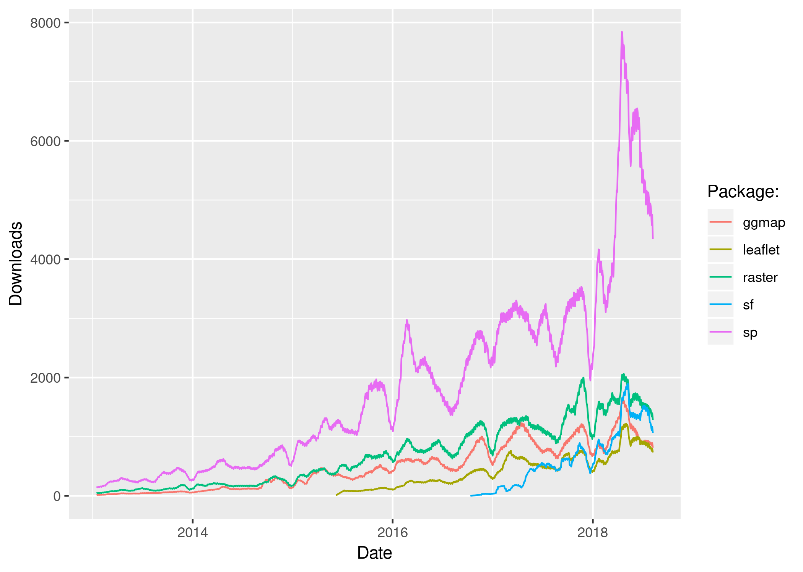
<p class="caption">(\#fig:cranlogs)The popularity of spatial packages in R. The y-axis shows average number of downloads per day, within a 30-day rolling window, of prominent spatial packages.</p>
</div>

It is noteworthy that shifts in the wider R community, as exemplified by the data processing package **dplyr** (released in [2014](https://cran.r-project.org/src/contrib/Archive/dplyr/)) influenced shifts in R's spatial ecosystem. 
Alongside other packages that have a shared style and emphasis on 'tidy data' (including e.g., **ggplot2**), **dplyr** was placed in the **tidyverse** 'metapackage' in late [2016](https://cran.r-project.org/src/contrib/Archive/tidyverse/).
The **tidyverse** approach, with its focus on long-form data and fast intuitively named functions, has become immensely popular.
This has led to a demand for 'tidy spatial data' which has been partly met by **sf** and other approaches such as **tabularaster**.
An obvious feature of the **tidyverse** is the tendency for packages to work in harmony.
There is no equivalent **geoverse** but there are attempts at harmonization between packages hosted on in the [r-spatial](https://github.com/r-spatial/discuss/issues/11) organisation and a growing number of packages use **sf** (Table \@ref(tab:revdep)). 


Table: (\#tab:revdep)The top 5 most downloaded packages that depend on sf, in terms of average number of downloads per day over the previous month. As of 2018-07-22 there are 90 packages which import sf.

package    Downloads
--------  ----------
ggplot2        16087
plotly          1704
raster          1495
spData          1395
leaflet          871

## The history of R-spatial

There are many benefits of using recent spatial packages such as **sf**, but it also important to be aware of the history of R's spatial capabilities: many functions, use-cases and teaching material are contained in older packages.
These can still be useful today, provided you know where to look.

R's spatial capabilities originated in early spatial packages in the S language [@bivand_implementing_2000].
The 1990s saw the development of numerous S scripts and a handful of packages for spatial statistics.
R packages arose from these and by 2000 there were R packages for various spatial methods "point pattern analysis, geostatistics, exploratory spatial data analysis and spatial econometrics", according to an [article](http://www.geocomputation.org/2000/GC009/Gc009.htm) presented at GeoComputation 2000 [@bivand_open_2000]
Some of these, notably **spatial**, **sgeostat** and **splancs** are still available on CRAN [@rowlingson_splancs:_1993; @rowlingson_splancs:_2017;@venables_modern_2002; @majure_sgeostat_2016].

A subsequent article in R News (the predecessor of [The R Journal](https://journal.r-project.org/)) contained an overview of spatial statistical software in R at the time, much of which was based on previous code written for S/S-PLUS [@ripley_spatial_2001].
This overview described packages for spatial smoothing and interpolation, including **akima** and **geoR** [@akima_akima:_2016; @jr_geor_2016], and point pattern analysis, including **splancs** [@rowlingson_splancs:_2017] and **spatstat**, which  remains dominant in the field of spatial point pattern analysis [@baddeley_spatial_2015].

The following R News issue (Volume 1/3) put spatial packages in the spotlight again, with an introduction to **splancs** and a commentary on future prospects regarding spatial statistics [@bivand_more_2001].
Additionally, the issue introduced two packages for testing spatial autocorrelation that eventually became part of **spdep** [@bivand_spdep:_2017].
Notably, the commentary mentions the need for standardization of spatial interfaces, efficient mechanisms for exchanging data with GIS, and handling of spatial metadata such as coordinate reference systems (CRS).

**maptools** [written by Nicholas Lewin-Koh; @bivand_maptools:_2017] is another important package from this time.
Initially **maptools** just contained a wrapper around [shapelib](http://shapelib.maptools.org/) and permitted the reading of ESRI Shapefiles into geometry nested lists. 
The corresponding and nowadays obsolete S3 class called "Map" stored this list alongside an attribute data frame. 
The work on the "Map" class representation was nevertheless important since it directly fed into **sp** prior to its publication on CRAN.

In 2003, @hornik_approaches_2003 published an extended review of spatial packages. 
Around this time the development of R's spatial capabilities increasingly supported interfaces to external libraries, especially to GDAL and PROJ.
These interfaces facilitated geographic data I/O (meaning input output and covered in chapter \@ref(read-write)) and CRS transformations, respectively.
@hornik_approaches_2003 proposed a spatial data class system, including support for points, lines, polygons and grids based on GDAL's support for a wide range of spatial data formats.
All these ideas contributed to the packages **rgdal** and **sp**, which became the foundational packages for spatial data analysis with R [@bivand_applied_2013].

**rgdal**, released in 2003, provided GDAL bindings for R which greatly enhanced its ability to import data from previously unavailable geographic data formats.
The initial release supported only raster drivers but subsequent enhancements provided support for coordinate reference systems (via the PROJ library), reprojections and import of vector file formats (see Chapter \@ref(read-write) for more on file formats). 
Many of these additional capabilities were developed by Barry Rowlingson and released in the **rgdal** codebase in 2006 [see @rowlingson_rasp:_2003 and the [R-help](https://stat.ethz.ch/pipermail/r-help/2003-January/028413.html) email list for context].

<!-- ^[ -->
<!-- A presentation at the 2003 DSC conference in Vienna gives the background as he saw it then [@rowlingson_rasp:_2003]; see also his announcement of the **Rmap** package on [R-help](https://stat.ethz.ch/pipermail/r-help/2003-January/028413.html) in early 2003.] -->

**sp**, released in 2005, overcame R's inability to distinguish spatial and non-spatial objects [@pebesma_classes_2005].
<!-- It grew from a [workshop](http://spatial.nhh.no/meetings/vienna/index.html) before, and a session at the 2003 DSC conference in Vienna, gathering input from most interested package developers.  -->
**sp** grew from a [workshop](http://spatial.nhh.no/meetings/vienna/index.html) in Vienna in 2003 and was hosted at sourceforge before migrating to [R-Forge](https://r-forge.r-project.org).
<!-- removed: r-sig-geo is mentioned elsewhere -->
<!-- five years later) and the [R-sig-geo mailing list](https://stat.ethz.ch/mailman/listinfo/r-sig-geo) was started. -->
Prior to 2005, geographic coordinates were generally treated like any other number. 
**sp** changed this with its classes and generic methods supporting points, lines, polygons and grids, and attribute data.

<!--???-->
<!-- points, multipoints, pixels, full grid, line, lines, spatial lines, polygon, polygons, spatial polygons -->
**sp** stores information such as bounding box, coordinate reference system and attributes in slots in `Spatial` objects using the S4 class system,
<!-- These can be accessed via the `@` symbol which can be accessed  `x@data`. -->
<!-- This enables non-spatial data operations to work alongside spatial operations (see section \@ref(why-simple-features)). -->
enabling data operations to work on geographic data (see section \@ref(why-simple-features)).
Further, **sp** provides generic methods such as `summary()` and `plot()` for geographic data.
In the following decade, **sp** classes rapidly became the go-to standard for spatial data in R and the number of packages that depended on it increased from around 20 in 2008 and over 100 in 2013 [@bivand_applied_2013].
As of 2018 almost 500 packages rely on **sp**, making it an important part of the R ecosystem. 
<!-- https://github.com/Robinlovelace/geocompr/issues/58 -->
<!-- https://github.com/edzer/sfr/issues/387#issuecomment-308949140 -->
Prominent R packages using **sp** include: **gstat**, for spatial and spatio-temporal geostatistics; **geosphere**, for spherical trigonometry; and **adehabitat** used for the analysis of habitat selection by animals [@R-gstat; @calenge_package_2006; @hijmans_geosphere:_2016].

While **rgdal** and **sp** solved many spatial issues, R was still lacked the ability to do geometric operations (see chapter \@ref(geometric-operations)).
Colin Rundel addressed this issue by developing **rgeos**, an R interface to  the open-source geometry library (GEOS) during a Google Summer of Coding project in 2010 [@R-rgeos].
**rgeos** enabled GEOS to manipulate **sp** objects, with functions such as `gIntersection()`.

Another limitation of **sp** --- its limited support for raster data --- was overcome by **raster**, first released in 2010 [@R-raster].
Its class system and functions support a range raster operations as outlined in section \@ref(raster-data).
A key feature of **raster** is its ability to work with datasets that are too large to fit into the main memory (RAM), thereby overcoming one of R's major limitations with respect to spatial data.
**raster** also supports map algebra (see section \@ref(map-algebra)).

In parallel with these developments of class systems and methods came the support for R as an interface to dedicated GIS software.
**GRASS** [@bivand_using_2000] and follow-on packages **spgrass6** and **rgrass7** (for GRASS GIS 6 and 7, respectively) were prominent examples in this direction [@bivand_spgrass6:_2016;@bivand_rgrass7:_2016].
Other examples of bridges between R and GIS include **RSAGA** [@R-RSAGA, first published in 2008], **ArcGIS** [@brenning_arcgis_2012, first published in 2008], and **RQGIS** [@muenchow_rqgis:_2017, first published in 2016] (see Chapter \@ref(gis)).

Visualization was not a focus initially, with the bulk of R-spatial development focussed on analysis and geographic operations.
**sp** provided methods for map making using both the base and lattice plotting system but demand was growing for advanced map making capabilities, especially after the release of **ggplot2** in 2007.
**ggmap** extended **ggplot2**'s spatial capabilities [@kahle_ggmap:_2013], by facilitating access to 'basemap' tiles from online services such as Google Maps. 
<!--Additionally, *ggmap** lets you use (mainly Google's) geocoding and routing services.-->
Though **ggmap** facilitated map-making with **ggplot2**, its utility was limited by the need to `fortify` spatial objects, which means converting them into long data frame.
While this works well for points it is computationally inefficient for lines and polygons, since each coordinate (vertex) is converted into a row, leading to huge data frames to represent complex geometries.
<!-- This is especially disadvantageous if you need to deal with tens of thousands of polygons. -->
<!-- With the introduction of simple features to R this limitation disappears, and it seems likely that this will make **ggplot2** the standard tool for the visualization of vector data.  -->
Although geographic visualization tended to focus on vector data, raster visualisation is supported in **raster** and received a boost with the release of **rasterVis** [@lamigueiro_displaying_2014].
<!-- More recently, new packages aim at easing the creation of complex, high-quality maps with minimal code. -->
<!-- The **tmap** package (released in 2014) might serve as an archetype for this kind of development [@R-tmap]. -->
<!-- It facilitates the user-friendly creation of thematic maps with an intuitive command-line interface (see also [**mapmisc**](https://cran.r-project.org/package=mapmisc)) .  -->
<!-- ADD THIS LATTER -->
<!-- CITE the paper Tennekes, M. (2017) tmap: Thematic Maps in R. Forthcoming in the Journal
of Statistical Software http://von-tijn.nl/tijn/research/presentations/tmap_user2017.pdf-->
As of 2018 map making in R is a hot topic with dedicated packages such as **tmap**, **leaflet** and **mapview** all supporting the class system provided by **sf**, the focus of the next chapter (see Chapter \@ref(adv-map) for more on vizualization).
<!-- **tmap** is a sophisticated yet user friendly mapping package which works in harmony with the **leaflet** package (released in 2015) for interactive map making [@R-leaflet].  -->
<!-- Similarly, the **mapview** package builds also on top of **leaflet** [@R-mapview] for interactive mapping based on **sp** or **sf** objects. **mapview** allows the access of a wide range of background maps, scale bars and more. -->

<!-- The release of **sf** in 2016 is important development  in R's spatial ecosystem [@R-sf]. -->
<!-- Naturally, this is the reason why we will describe **sf** in detail in Chapter \@ref(spatial-class). -->

<!-- ## How to read this book -->

## Exercises

1. Think about the terms 'GIS', 'GDS' and 'Geocomputation' described above. Which is your favorite, and why?

1. Provide three reasons for using a scriptable language such as R for geocomputation instead of using an established GIS program such as QGIS.

1. Name two advantages and two disadvantages of using mature packages compared with 'cutting edge' packages for spatial data (for example **sp** vs **sf**).


<!--chapter:end:01-introduction.Rmd-->


# (PART) Foundations {-}

# Geographic data in R {#spatial-class}

## Prerequisites {-}

This is the first practical chapter of the book, and therefore it comes with some software requirements.
We assume that you have an up-to-date version of R installed and that you are comfortable using software with a command-line interface such as the integrated development environment (IDE) RStudio.

If you are new to R, we recommend reading Chapter 2 of the free online book *Efficient R Programming* @gillespie_efficient_2016, particularly sections 2.3 and 2.5, for details on R installation and [set-up](https://csgillespie.github.io/efficientR/set-up.html).
It is also worth learning the basics of the language, using resources such as @gillespie_efficient_2016, @grolemund_r_2016 or interactive guides such as [DataCamp](https://www.datacamp.com/courses/free-introduction-to-r) before proceeding.
We recommend organizing your work as you learn with RStudio projects and clearly named script files (such as `chapter-02.R` for example) containing code you have typed (not copy-pasted!) as you learn.

<!-- '[project](https://csgillespie.github.io/efficientR/set-up.html#project-management)' called `geocomp-learning`. -->
<!--     Creating new script for each chapter or section of interest will help consolidate and extend the skills learned. -->
<!--     The code you type to help learn the content of this chapter could be placed in a file called `chapter-02.R`, for example. -->
<!--     Everyone learns in a different way; structure your work so it makes sense to you; and avoid copy-pasting to get used to typing code. -->

<!-- Another option is to use the RStudio project provided in the root directory of the [`geocompr`](https://github.com/Robinlovelace/geocompr) GitHub repository. -->
<!-- This will make it easier to run this book's worked examples on your computer. -->

After you've checked you R installation and brushed-up on your R skills where appropriate, the next step is to install and load the packages used in this chapter.
Packages are installed with the `install.packages()` function which can be used to get the prerequisites on your computer:^[
Note that **spDataLarge** is not on CRAN, meaning that the `repos` and `type` arguments must be set for it to install.
<!-- In case the installation fails, for example if you do not have rights to install non CRAN packages on your organisation's computers, the data in **spDataLarge** can be loaded by running the script [`spData.R`](https://github.com/Robinlovelace/geocompr/blob/master/code/spData.R) from the `code` folder in the book's GitHub repo at [github.com/Robinlovelace/geocompr](https://github.com/Robinlovelace/geocompr). -->
]


```r
install.packages("sf")
```

\BeginKnitrBlock{rmdnote}<div class="rmdnote">On Mac and Linux a few requirements must be met to install **sf**.
These are described in the package's README at [github.com/r-spatial/sf](https://github.com/r-spatial/sf).</div>\EndKnitrBlock{rmdnote}


```r
install.packages("raster")
install.packages("spData")
install.packages("spDataLarge", repos = "https://nowosad.github.io/drat/",
                 type = "source")
```

Packages are 'loaded' (technically they are attached) with the `library()` function, which is used to load the two spatial data processing packages installed previously as follows:


```r
library(sf)          # classes and functions for vector data
library(raster)      # classes and functions for raster data
```

The other packages that were installed contain data that will be used in the book:


```r
library(spData)        # load geographic data
library(spDataLarge)   # load larger geographic data
```

This chapter will provide brief explanations of the fundamental geographic data models: vector and raster.
We will introduce the theory behind each data model and the disciplines in which they predominate, before demonstrating their implementation in R.
<!-- Vector and raster models are vital to geospatial analysis [@longley_geographic_2015]. -->

The *vector data model* represents the world using points, lines and polygons.
These have discrete, well-defined borders, meaning that vector datasets usually have a high level of precision (but not necessarily accuracy as we will see in \@ref(units)).
The *raster data model* divides the surface up into cells of constant size.
Raster datasets are the basis of background images used in web-mapping and have been a vital source of geographic data since the origins of aerial photography and satellite-based remote sensing devices.
Rasters aggregate spatially specific features to a given resolution, meaning that they are consistent over space and scalable (many worldwide raster datasets are available).
<!-- The downside of this is that small features can be blurred or lost. (commented - too specific) -->
<!-- todo: add figure(s) showing raster data and blurring? -->

Which to use?
The answer likely depends on your domain of application:

- Vector data tends to dominate the social sciences because human settlements tend to have discrete borders.
- Raster often dominates in environmental sciences because of the reliance on remote sensing data. 

There is much overlap in some fields and raster and vector datasets can be used side-by-side:
ecologists and demographers, for example, commonly use both vector and raster data.
Whether your work involves more use of vector or raster datasets, it is worth understanding the underlying data model before using them, as discussed in subsequent chapters.
This book uses **sf** and **raster** packages to work with vector data and raster datasets respectively.

## Vector data

\BeginKnitrBlock{rmdnote}<div class="rmdnote">Take care when using the word 'vector' as it can have two meanings in this book:
geographic vector data and the `vector` class (note the `monospace` font) in R.
The former is a data model, the latter is an R class just like `data.frame` and `matrix`.
Still, there is a link between the two: the spatial coordinates which are at the heart of the geographic vector data model can be represented in R using `vector` objects.</div>\EndKnitrBlock{rmdnote}

The geographic vector model is based on points located within a coordinate reference system (CRS).
Points can represent self-standing features (e.g. the location of a bus stop) or they can be linked together to form more complex geometries such as lines and polygons.
Most point geometries contain only two dimensions (3 dimensional CRSs contain an additional $z$ value, typically representing height above sea level).

In this system London, for example, can be represented by the coordinates `c(-0.1, 51.5)`.
This means that its location is -0.1 degrees east and 51.5 degrees north of the origin.
The origin in this case is at 0 degrees longitude (the Prime Meridian) and 0 degree latitude (the Equator) in a geographic ('lon/lat') CRS (Figure \@ref(fig:vectorplots), left panel).
The same point could also be approximated in a projected CRS with 'Easting/Northing' values of `c(530000, 180000)` in the British National Grid ([BNG](https://en.wikipedia.org/wiki/Ordnance_Survey_National_Grid)), meaning that London is located 530 km *East* and 180 km *North* of the $origin$ of the CRS.
This can be verified visually: slightly more than 5 'boxes' --- square areas bounded by the gray grid lines 100 km in width --- separate the point representing London from the origin (Figure \@ref(fig:vectorplots), right panel).

The location of BNG's origin, in the sea beyond South West Peninsular, ensures that most locations in the UK have positive Easting and Northing values.^[
The origin we are referring to, depicted in blue in Figure \@ref(fig:vectorplots), is in fact the 'false' origin.
The 'true' origin, the location at which distortions are at a minimum, is located at 2° W and 49° N.
This was selected by the Ordnance Survey to be roughly in the center of the British landmass longitudinally.
<!-- This was selected by the [Ordnance Survey](https://www.ordnancesurvey.co.uk/support/the-national-grid.html) to be roughly in the center of the British landmass longitudinally. -->
]
There is more to CRSs, as described in sections \@ref(crs-intro) and \@ref(reproj-geo-data) but, for the purposes of this section, it is sufficient to know that coordinates consist of two numbers representing distance from an origin, usually in $x$ then $y$ dimensions.


<div class="figure" style="text-align: center">

<p class="caption">(\#fig:vectorplots)Illustration of vector (point) data in which location of London (the red X) is represented with reference to an origin (the blue circle). The left plot represents a geographic CRS with an origin at 0° longitude and latitude. The right plot represents a projected CRS with an origin located in the sea west of the South West Peninsula.</p>
</div>

**sf** is a package providing a class system for geographic vector data.
Not only does it supercede **sp** it also provides a consistent command-line interface to GEOS and GDAL, superceding **rgeos** and **rgdal** (described in section \@ref(the-history-of-r-spatial)).
<!-- Really? not necessary so removed (RL) -->
<!-- In theory this should make **sf** faster than **sp**/**rgdal**/**rgeos**. -->
This section introduces **sf** classes in preparation for subsequent chapters (Chapters \@ref(geometric-operations) and \@ref(read-write) cover the GEOS and GDAL interface respectively).


<!-- Commented out: not really necessary here - keeping as could be useful elsewhere: -->
<!-- In mathematical notation these points are typically represented as numbers separated by commas and enclosed by a pair of brackets:  -->
<!-- $(1, 3)$ for example, represents a point located one unit to the right and three units above the origin. -->
<!-- Instead of creating these points manually, one would commonly read-in data with functions such as `read_csv()` from the **tidyverse** or `read_sf()` from the **sf** package (see chapter \@ref(read-write)). -->
<!-- To generate new data (e.g., for testing), one can use the command `c()` (think of 'c' for 'combine'), as illustrated -->
<!-- below:^[Other methods for generating numbers include with the `seq()` function (short for 'sequence') for generating regular sequences or `runif()`, `rnorm()` and other functions generating random numbers following some kind of probability distribution. -->
<!-- The **mapedit** package can be used to create spatial data manually on an interactive map. -->
<!-- ] -->

<!-- ```{r} -->
<!-- p = c(1, 3) -->
<!-- ``` -->

<!-- Now this can be plotted in Cartesian space, as illustrated in figure \@ref(fig:cartesian): -->

<!-- ```{r cartesian, fig.cap="Illustration of vector point data in base R."} -->
<!-- plot(x = p[1], y = p[2], xlim =  c(0, 5), ylim = c(0, 5)) -->
<!-- ``` -->

### An introduction to simple features {#intro-sf}

Simple features is an [open standard](http://portal.opengeospatial.org/files/?artifact_id=25355) developed and endorsed by the Open Geospatial Consortium (OGC), a not-for-profit organization whose activities we will revisit in a later chapter (in section \@ref(file-formats)).
Simple Features is a hierarchical data model that represents a wide range of geometry types.
Of 68 geometry types supported by the specification, only 7 are used in the vast majority of geographic research (see Figure \@ref(fig:sf-ogc));
these core geometry types are fully supported by R package **sf** [@pebesma_simple_2018].^[
The full OGC standard includes rather exotic geometry types including 'surface' and 'curve' geometry types, which currently have limited application in real world applications.
All 68 types can be represented with the **sf** package, although (as of summer 2018) plotting only works for the 'core 7'.
]

<div class="figure" style="text-align: center">

<p class="caption">(\#fig:sf-ogc)The subset of the Simple Features class hierarchy supported by sf.</p>
</div>

**sf** can represent all common vector geometry types (raster data classes are not supported by **sf**): points, lines, polygons and their respective 'multi' versions (which group together features of the same type into a single feature).
**sf** also supports geometry collections, which can contain multiple geometry types in a single object.
Given the breadth of geographic data forms, it may come as a surprise that a class system to support all of them is provided in a single package, which can be installed from CRAN:^[The
development version, which may contain new features, can be installed with `devtools::install_github("r-spatial/sf").`
]
**sf** incorporates the functionality of the three main packages of the **sp** paradigm, **sp** [@R-sp] for the class system, **rgdal** [@R-rgdal] for reading and writing data, **rgeos** [@R-rgeos] for spatial operations undertaken by GEOS, in a single, cohesive whole.
This is well-documented in **sf**'s [vignettes](http://cran.rstudio.com/package=sf).


As the first vignette explains, simple feature objects in R are stored in a data frame, with geographic data occupying a special column, a 'list-column'. This column is usually named 'geom' or 'geometry'.
We will use the `world` dataset provided by the **spData**, loaded at the beginning of this chapter (see [nowosad.github.io/spData](https://nowosad.github.io/spData/) for a list datasets loaded by the package).
`world` is a spatial object containing spatial and attribute columns, the names of which are returned by the function `names()` (the last column contains the geographic information):


```r
names(world)
#>  [1] "iso_a2"    "name_long" "continent" "region_un" "subregion"
#>  [6] "type"      "area_km2"  "pop"       "lifeExp"   "gdpPercap"
#> [11] "geom"
```

It is the contents of this modest-looking `geom` column that gives `sf` objects their spatial powers, a 'list-column' that contains all the coordinates.
The **sf** package provides a `plot()` method for visualizing geographic data:
the follow command creates Figure \@ref(fig:world-all).


```r
plot(world)
```

<div class="figure" style="text-align: center">

<p class="caption">(\#fig:world-all)A spatial plot of the world using the sf package, with a facet for each attribute.</p>
</div>

Note that instead of creating a single map, as most GIS programs would, the `plot()` command has created multiple maps, one for each variable in the `world` datasets.
This behavior can be useful for exploring the spatial distribution of different variables and is discussed further in \@ref(basic-map) below.

Being able to treat spatial objects as regular data frames with spatial powers has many advantages, especially if you are already used to working with data frames.
The commonly used `summary()` function, for example, provides a useful overview of the variables within the `world` object.


```r
summary(world["lifeExp"])
#>     lifeExp                geom    
#>  Min.   :50.6   MULTIPOLYGON :177  
#>  1st Qu.:65.0   epsg:4326    :  0  
#>  Median :72.9   +proj=long...:  0  
#>  Mean   :70.9                      
#>  3rd Qu.:76.8                      
#>  Max.   :83.6                      
#>  NA's   :10
```

Although we have only selected one variable for the `summary` command, it also outputs a report on the geometry.
This demonstrates the 'sticky' behavior of the geometry columns of **sf** objects, meaning the geometry is kept unless the user deliberately removes them, as we'll see in section \@ref(vector-attribute-manipulation).
The result provides a quick summary of both the non-spatial and spatial data contained in `world`: the mean average life expectancy is 71 years (ranging from less than 50 to more than 80 years with a median of 73 years) across all countries.

\BeginKnitrBlock{rmdnote}<div class="rmdnote">The word `MULTIPOLYGON` in the summary output above refers to the geometry type of features (countries) in the `world` object.
This representation is necessary for countries with islands such as Indonesia and Greece.
Other geometry types are described in section \@ref(sf-classes).</div>\EndKnitrBlock{rmdnote}

<!-- TODO: cross-reference section covering CRSs. -->
It is worth taking a deeper look at the basic behavior and contents of this simple feature object, which can usefully be thought of as a '**S**patial data**F**rame).

`sf` objects are easy to subset.
The code below shows its first two rows and three columns.
The output shows two major differences compared with a regular `data.frame`: the inclusion of additional geographic data (`geometry type`, `dimension`, `bbox` and CRS information - `epsg (SRID)`, `proj4string`), and the presence of final `geometry` column:


```r
world[1:2, 1:3]
#> Simple feature collection with 2 features and 3 fields
#> geometry type:  MULTIPOLYGON
#> dimension:      XY
#> bbox:           xmin: -180 ymin: -18.3 xmax: 180 ymax: -0.95
#> epsg (SRID):    4326
#> proj4string:    +proj=longlat +datum=WGS84 +no_defs
#>   iso_a2 name_long continent                           geom
#> 1     FJ      Fiji   Oceania MULTIPOLYGON (((180 -16.1, ...
#> 2     TZ  Tanzania    Africa MULTIPOLYGON (((33.9 -0.95,...
```

All this may seem rather complex, especially for a class system that is supposed to be simple.
However, there are good reasons for organizing things this way and using **sf**.

<!-- It's a `MULTIPOLYGON` with 177 features and a geographic (longitude/latidue) coordinate reference system (CRS) with an EPSG code of `4326`. -->

### Why simple features?

Simple features is a widely supported data model that underlies data structures in many GIS applications including QGIS and PostGIS.
A major advantage of this is that using the data model ensures your work is cross-transferable to other set-ups, for example importing from and exporting to spatial databases.

A more specific question from an R perspective is "why use the **sf** package when **sp** is already tried and tested"?
There are many reasons (linked to the advantages of the simple features model) including:

- Fast reading and writing of data
- Enhanced plotting performance
- **sf** objects can be treated as data frames in most operations
- **sf** functions can be combined using `%>%` operator and works well with the [tidyverse](http://tidyverse.org/) collection of R packages
- **sf** function names are relatively consistent and intuitive (all begin with `st_`)

Due to such advantages some spatial packages (including **tmap**, **mapview** and **tidycensus**) have added support for **sf**.
However, it will take many years for most packages to transition and some will never switch.
Fortunately these can still be used in a workflow based on `sf` objects, by converting them to the `Spatial` class used in **sp**: 


```r
library(sp)
world_sp = as(world, Class = "Spatial")
# sp functions ...
```

`Spatial` objects can be converted back to `sf` in the same way or with `st_as_sf()`:


```r
world_sf = st_as_sf(world_sp, "sf")
```


### Basic map making {#basic-map}

Basic maps are created in **sf** with `plot()`.
By default this creates a multi-panel plot (like **sp**'s `spplot()`), one sub-plot for each variable of the object, as illustrated in the left-hand panel in Figure \@ref(fig:sfplot).
A legend or 'key' with a continuous color is produced if the object to be plotted has a single variable (see the right-hand panel).
Colors can also be set with `col = `, although this will not create a continuous palette or a legend. 


```r
plot(world[3:6])
plot(world["pop"])
```

<div class="figure" style="text-align: center">
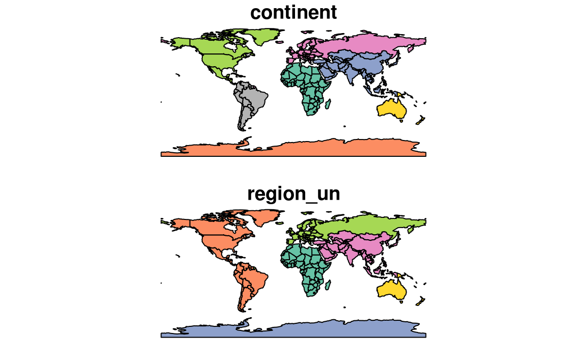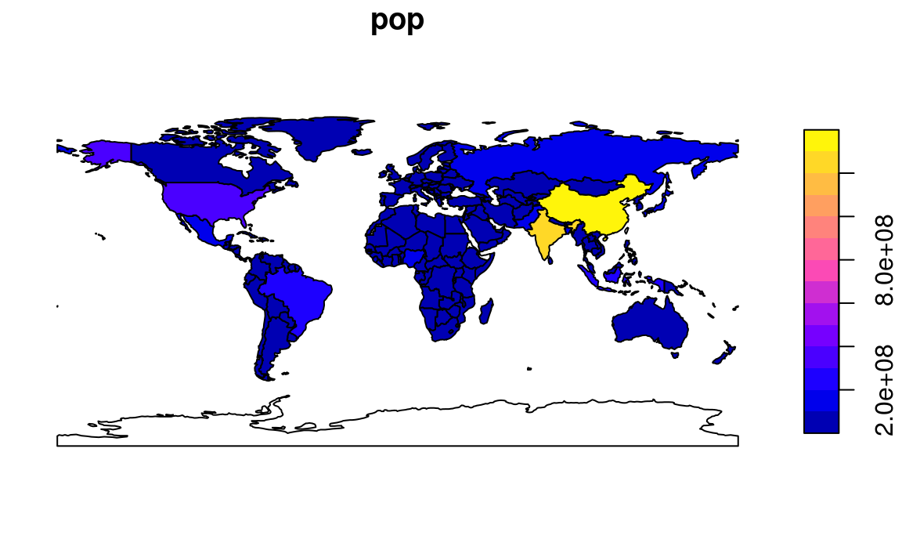
<p class="caption">(\#fig:sfplot)Plotting with sf, with multiple variables (left) and a single variable (right).</p>
</div>

Plots are added as layers to existing images by setting `add = TRUE`.^[
`plot()`ing of **sf** objects uses `sf:::plot.sf()` behind the scenes.
`plot()` is a generic method that behaves differently depending on the class of object being plotted.
]
To demonstrate this, and to provide a taster of content covered in chapters \@ref(attr) and \@ref(spatial-operations) on attribute and spatial data operations, the subsequent code chunk combines countries in Asia:


```r
asia = world[world$continent == "Asia", ]
asia = st_union(asia)
```

We can now plot the Asian continent over a map of the world.
Note that the first plot must only have one facet for `add = TRUE` to work.
If the first plot has a key, `reset = FALSE` must be used (result not shown):


```r
plot(world["pop"], reset = FALSE)
plot(asia, add = TRUE, col = "red")
```

Adding layers in this way can be used to verify the geographic correspondence between layers: 
the `plot()` function is fast to execute and requires few lines of code, but does not create interactive maps with a wide range of options.
For more advanced map making we recommend using dedicated visualization packages such as **tmap** (see Chapter \@ref(adv-map)).

<!-- 
- plot() function 
- map export 
-->

<!-- Maybe show also somewhere that `world[0]` produces only a plot of the geometry which is rather useful if you do not want to plot a specific attribute. This way, you can for example dismiss the col = "white"-argument in your Nigeria example.
Sorry for commenting on this again but just to clarify africa[0] selects zero columns but since the geometry column is sticky it won't be dismissed. Nevertheless, to be more explicit one should probably use plot(st_geometry(africa))-->


### Base plot arguments {#base-args}

Advanced map making is covered in detail in Chapter \@ref(adv-map).
However, it is worth knowing how to modify plots using the **sf** package for quick and flexible visualization.
Because **sf** extends base R plotting methods `plot()`'s arguments such as `main =` --- which specifies the title of the map --- work with `sf` objects (see `?graphics::plot` and `?par`).^[
Note: many plot arguments are ignored in facet maps, when more than one `sf` column is plotted.
]


Figure \@ref(fig:contpop) illustrates this flexibility by overlaying circles, whose diameters (set with `cex =`) represent country populations, on a map of the world.
A basic version of the map can be created with the following commands (see exercises at the end of this chapter and the script [`02-contplot.R`](https://github.com/Robinlovelace/geocompr/blob/master/code/02-contpop.R) to create Figure \@ref(fig:contpop)):


```r
plot(world["continent"], reset = FALSE)
cex = sqrt(world$pop) / 10000
world_cents = st_centroid(world, of_largest = TRUE)
plot(st_geometry(world_cents), add = TRUE, cex = cex)
```

<div class="figure" style="text-align: center">
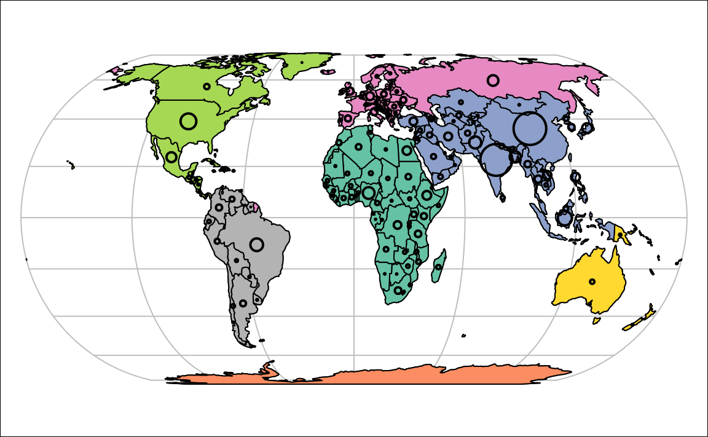
<p class="caption">(\#fig:contpop)Country continents (represented by fill color) and 2015 populations (represented by circles, with area proportional to population).</p>
</div>

The code above uses the function `st_centroid()` to convert one geometry type (polygon) to another (point).
Here is not the place to explain how the function works (this is covered in Chapter \@ref(geometric-operations)).
The point is that simple feature geometries can come in different forms, the topic of the next section.

### Simple feature classes {#sf-classes}

This section shows how vector spatial classes are created.
Before describing each geometry type that the **sf** package supports, it is worth taking a step back to understand the building blocks of `sf` objects. 
Section \@ref(intro-sf) shows how simple features are data frames, with special geometry columns.
These spatial columns are often called `geom` or `geometry`: `world$geom` refers to the spatial element of the `world` object described above.
These geometry columns are 'list columns' of class `sfc`.
In turn, `sfc` objects are composed of one or more objects of class `sfg`: simple feature geometries.

To understand how the spatial components of simple features work, it is vital to understand simple feature geometries.
For this reason we cover each currently supported `sfg` type in the next subsections before moving on to describe how these can be combined to form `sfc` and eventually full `sf` objects.

#### Simple feature geometry types {#geometry}

<!-- This section demonstrates how the full range of geometry types supported by the **sf** package can be created, combined and plotted. -->
Geometries are the basic building blocks of simple features.
Simple features in R can take on one of the 17 geometry types supported by the **sf** package.
In this chapter we will focus on the seven most commonly used types: `POINT`, `LINESTRING`, `POLYGON`, `MULTIPOINT`, `MULTILINESTRING`, `MULTIPOLYGON` and `GEOMETRYCOLLECTION`.<!--FIG-->
Find the whole list of possible feature types in [the PostGIS manual ](http://postgis.net/docs/using_postgis_dbmanagement.html).

Generally, well-known binary (WKB) or well-known text (WKT) are the standard encoding for simple feature geometries.
WKB representations are usually hexadecimal strings easily readable for computers.
This is why GIS and spatial databases use WKB to transfer and store geometry objects.
WKT, on the other hand, is a human-readable text markup description of simple features. 
Both formats are exchangeable, and if we present one, we will naturally choose the WKT representation.

The basis for each geometry type is the point. 
A point is simply a coordinate in 2D, 3D or 4D space (see `vignette("sf1")` for more information) such as (see left panel in Figure \@ref(fig:sfcs)):

- `POINT (5 2)`

A linestring is a sequence of points with a straight line connecting the points, for example (see middle panel in Figure \@ref(fig:sfcs)):

- `LINESTRING (1 5, 4 4, 4 1, 2 2, 3 2)`

A polygon is a sequence of points that form a closed, non-intersecting ring.
Closed means that the first and the last point of a polygon have the same coordinates (see right panel in Figure \@ref(fig:sfcs)).^[
By definition, a polygon has one exterior boundary (outer ring) and can have zero or more interior boundaries (inner rings), also known as holes.
A polygon with a hole would be, for example, `POLYGON ((1 5, 2 2, 4 1, 4 4, 1 5), (2 4, 3 4, 3 3, 2 3, 2 4))`
]

- Polygon without a hole - `POLYGON ((1 5, 2 2, 4 1, 4 4, 1 5))`

<div class="figure" style="text-align: center">

<p class="caption">(\#fig:sfcs)Illustration of point, linestring and polygon geometries.</p>
</div>


So far we have created geometries with only one geometric entity per feature.
However, **sf** also allows multiple geometries to exist within a single feature (hence the term 'geometry collection') using "multi" version of each geometry type:

- Multipoint - `MULTIPOINT (5 2, 1 3, 3 4, 3 2)`
- Multistring - `MULTILINESTRING ((1 5, 4 4, 4 1, 2 2, 3 2), (1 2, 2 4))`
- Multipolygon - `MULTIPOLYGON (((1 5, 2 2, 4 1, 4 4, 1 5), (0 2, 1 2, 1 3, 0 3, 0 2)))`

<div class="figure" style="text-align: center">

<p class="caption">(\#fig:multis)Illustration of multipoint, mutlilinestring and multipolygon geometries.</p>
</div>

Finally, a geometrycollection might contain any combination of geometries including (multi)points and linestrings (see Figure \@ref(fig:geomcollection)):

- Geometry collection - `GEOMETRYCOLLECTION (MULTIPOINT (5 2, 1 3, 3 4, 3 2), LINESTRING (1 5, 4 4, 4 1, 2 2, 3 2))`

<div class="figure" style="text-align: center">

<p class="caption">(\#fig:geomcollection)Illustration of geometry collection.</p>
</div>

#### Simple feature geometry (sfg) objects {#sfg}

The `sfg` class represents the different simple feature geometry types: point, linestring, polygon (and their 'multi' equivalents, such as multipoints) or geometry collection.

Usually you are spared the tedious task of creating geometries on your own since you can simply import an already existing spatial file.
However, there are a set of functions to create simple feature geometry objects (`sfg`) from scratch if needed.
The names of these functions are simple and consistent, as they all start with the `st_`  prefix and end with the name of the geometry type in lowercase letters:

- A point - `st_point()`
- A linestring - `st_linestring()`
- A polygon - `st_polygon()`
- A multipoint - `st_multipoint()`
- A multilinestring - `st_multilinestring()`
- A multipolygon - `st_multipolygon()`
- A geometry collection - `st_geometrycollection()`

`sfg` objects can be created from three native data types:

1. A numeric vector - a single point
2. A matrix - a set of points, where each row contains a point - a multipoint or linestring
3. A list - any other set, e.g. a multilinestring or geometry collection

To create point objects, we use the `st_point()` function in conjunction with a numeric vector:


```r
# note that we use a numeric vector for points
st_point(c(5, 2)) # XY point
#> POINT (5 2)
st_point(c(5, 2, 3)) # XYZ point
#> POINT Z (5 2 3)
st_point(c(5, 2, 1), dim = "XYM") # XYM point
#> POINT M (5 2 1)
st_point(c(5, 2, 3, 1)) # XYZM point
#> POINT ZM (5 2 3 1)
```

<!-- is this really important? -->
XY, XYZ and XYZM types of points are automatically created based on the length of a numeric vector. 
Only the XYM type needs to be specified using a `dim` argument.

By contrast, use matrices in the case of multipoint (`st_multipoint()`) and linestring (`st_linestring()`) objects:


```r
# the rbind function simplifies the creation of matrices
## MULTIPOINT
multipoint_matrix = rbind(c(5, 2), c(1, 3), c(3, 4), c(3, 2))
st_multipoint(multipoint_matrix)
#> MULTIPOINT (5 2, 1 3, 3 4, 3 2)
## LINESTRING
linestring_matrix = rbind(c(1, 5), c(4, 4), c(4, 1), c(2, 2), c(3, 2))
st_linestring(linestring_matrix)
#> LINESTRING (1 5, 4 4, 4 1, 2 2, 3 2)
```

Finally, use lists for the creation of multilinestrings, (multi-)polygons and geometry collections:


```r
## POLYGON
polygon_list = list(rbind(c(1, 5), c(2, 2), c(4, 1), c(4, 4), c(1, 5)))
st_polygon(polygon_list)
#> POLYGON ((1 5, 2 2, 4 1, 4 4, 1 5))
```


```r
## POLYGON with a hole
polygon_border = rbind(c(1, 5), c(2, 2), c(4, 1), c(4, 4), c(1, 5))
polygon_hole = rbind(c(2, 4), c(3, 4), c(3, 3), c(2, 3), c(2, 4))
polygon_with_hole_list = list(polygon_border, polygon_hole)
st_polygon(polygon_with_hole_list)
#> POLYGON ((1 5, 2 2, 4 1, 4 4, 1 5), (2 4, 3 4, 3 3, 2 3, 2 4))
```


```r
## MULTILINESTRING
multilinestring_list = list(rbind(c(1, 5), c(4, 4), c(4, 1), c(2, 2), c(3, 2)), 
                            rbind(c(1, 2), c(2, 4)))
st_multilinestring((multilinestring_list))
#> MULTILINESTRING ((1 5, 4 4, 4 1, 2 2, 3 2), (1 2, 2 4))
```


```r
## MULTIPOLYGON
multipolygon_list = list(list(rbind(c(1, 5), c(2, 2), c(4, 1), c(4, 4), c(1, 5))),
                         list(rbind(c(0, 2), c(1, 2), c(1, 3), c(0, 3), c(0, 2))))
st_multipolygon(multipolygon_list)
#> MULTIPOLYGON (((1 5, 2 2, 4 1, 4 4, 1 5)), ((0 2, 1 2, 1 3, 0 3, 0 2)))
```


```r
## GEOMETRYCOLLECTION
gemetrycollection_list = list(st_multipoint(multipoint_matrix),
                              st_linestring(linestring_matrix))
st_geometrycollection(gemetrycollection_list)
#> GEOMETRYCOLLECTION (MULTIPOINT (5 2, 1 3, 3 4, 3 2), LINESTRING (1 5, 4 4, 4 1, 2 2, 3 2))
```

<!-- table -->
<!-- figure - image/fig1.jpg -->
<!-- they are interconnected - points could create mulitpoints or lines; -->
<!-- lines could create mutlilines or polygons, etc. -->
<!-- https://r-spatial.github.io/sf/articles/sf1.html -->

#### Simple feature geometry column {#sfc}

One `sfg` object contains only a single simple feature geometry. 
A simple feature geometry column (`sfc`) is a list of `sfg` objects, which is additionally able to contain information about the coordinate reference system in use.
For instance, to combine two simple features into one object with two features, we can use the `st_sfc()` function. 
This is important since `sfc` represents the geometry column in **sf** data frames:


```r
# sfc POINT
point1 = st_point(c(5, 2))
point2 = st_point(c(1, 3))
st_sfc(point1, point2)
#> Geometry set for 2 features 
#> geometry type:  POINT
#> dimension:      XY
#> bbox:           xmin: 1 ymin: 2 xmax: 5 ymax: 3
#> epsg (SRID):    NA
#> proj4string:    NA
#> POINT (5 2)
#> POINT (1 3)
```

In most cases, an `sfc` object contains objects of the same geometry type.
Therefore, when we convert `sfg` objects of type polygon into a simple feature geometry column, we would also end up with an `sfc` object of type polygon. 
Equally, a geometry column of multilinestrings would result in an `sfc` object of type multilinestring:


```r
# sfc POLYGON
polygon_list1 = list(rbind(c(1, 5), c(2, 2), c(4, 1), c(4, 4), c(1, 5)))
polygon1 = st_polygon(polygon_list1)
polygon_list2 = list(rbind(c(0, 2), c(1, 2), c(1, 3), c(0, 3), c(0, 2)))
polygon2 = st_polygon(polygon_list2)
st_sfc(polygon1, polygon2)
#> Geometry set for 2 features 
#> geometry type:  POLYGON
#> dimension:      XY
#> bbox:           xmin: 0 ymin: 1 xmax: 4 ymax: 5
#> epsg (SRID):    NA
#> proj4string:    NA
#> POLYGON ((1 5, 2 2, 4 1, 4 4, 1 5))
#> POLYGON ((0 2, 1 2, 1 3, 0 3, 0 2))
```


```r
# sfc MULTILINESTRING
multilinestring_list1 = list(rbind(c(1, 5), c(4, 4), c(4, 1), c(2, 2), c(3, 2)), 
                            rbind(c(1, 2), c(2, 4)))
multilinestring1 = st_multilinestring((multilinestring_list1))
multilinestring_list2 = list(rbind(c(2, 9), c(7, 9), c(5, 6), c(4, 7), c(2, 7)), 
                            rbind(c(1, 7), c(3, 8)))
multilinestring2 = st_multilinestring((multilinestring_list2))
st_sfc(multilinestring1, multilinestring2)
#> Geometry set for 2 features 
#> geometry type:  MULTILINESTRING
#> dimension:      XY
#> bbox:           xmin: 1 ymin: 1 xmax: 7 ymax: 9
#> epsg (SRID):    NA
#> proj4string:    NA
#> MULTILINESTRING ((1 5, 4 4, 4 1, 2 2, 3 2), (1 ...
#> MULTILINESTRING ((2 9, 7 9, 5 6, 4 7, 2 7), (1 ...
```

It is also possible to create an `sfc` object from `sfg` objects with different geometry types:


```r
# sfc GEOMETRY
st_sfc(point1, multilinestring1)
#> Geometry set for 2 features 
#> geometry type:  GEOMETRY
#> dimension:      XY
#> bbox:           xmin: 1 ymin: 1 xmax: 5 ymax: 5
#> epsg (SRID):    NA
#> proj4string:    NA
#> POINT (5 2)
#> MULTILINESTRING ((1 5, 4 4, 4 1, 2 2, 3 2), (1 ...
```

<!-- if you want to use it - st_cast() to a proper geometry type -->
<!-- or st_is to select only one geometry type -->
<!-- http://r-spatial.org/r/2017/01/12/newssf.html -->
<!-- methods(class = "sfc") -->

As mentioned before, `sfc` objects can additionally store information on the coordinate reference systems (CRS).
<!-- What's CRS -->
To specify a certain CRS, we can use the `epsg (SRID)` or `proj4string` attributes of an `sfc` object.
The default value of `epsg (SRID)` and `proj4string` is `NA` (*Not Available*):


```r
st_sfc(point1, point2)
#> Geometry set for 2 features 
#> geometry type:  POINT
#> dimension:      XY
#> bbox:           xmin: 1 ymin: 2 xmax: 5 ymax: 3
#> epsg (SRID):    NA
#> proj4string:    NA
#> POINT (5 2)
#> POINT (1 3)
```

All geometries in an `sfc` object must have the same CRS. 

We can add coordinate reference system as a `crs` argument of `st_sfc()`. 
This argument accepts either an integer with the `epsg` code (for example, `4326`)  or a `proj4string` character string (for example, `"+proj=longlat +datum=WGS84 +no_defs"`) (see section \@ref(crs-intro)). 


```r
# EPSG definition
st_sfc(point1, point2, crs = 4326)
#> Geometry set for 2 features 
#> geometry type:  POINT
#> dimension:      XY
#> bbox:           xmin: 1 ymin: 2 xmax: 5 ymax: 3
#> epsg (SRID):    4326
#> proj4string:    +proj=longlat +datum=WGS84 +no_defs
#> POINT (5 2)
#> POINT (1 3)
```


```r
# PROJ4STRING definition
st_sfc(point1, point2, crs = "+proj=longlat +datum=WGS84 +no_defs")
#> Geometry set for 2 features 
#> geometry type:  POINT
#> dimension:      XY
#> bbox:           xmin: 1 ymin: 2 xmax: 5 ymax: 3
#> epsg (SRID):    4326
#> proj4string:    +proj=longlat +datum=WGS84 +no_defs
#> POINT (5 2)
#> POINT (1 3)
```

For example, we can set the UTM Zone 11N projection with `epsg` code `2955`:


```r
st_sfc(point1, point2, crs = 2955)
#> Geometry set for 2 features 
#> geometry type:  POINT
#> dimension:      XY
#> bbox:           xmin: 1 ymin: 2 xmax: 5 ymax: 3
#> epsg (SRID):    2955
#> proj4string:    +proj=utm +zone=11 +ellps=GRS80 +towgs84=0,0,0,0,0,0,0 +units=m +no_defs
#> POINT (5 2)
#> POINT (1 3)
```

As you can see above, the `proj4string` definition was automatically added.
Now we can try to set the CRS using `proj4string`:


```r
crs_utm = "+proj=utm +zone=11 +ellps=GRS80 +towgs84=0,0,0,0,0,0,0 +units=m +no_defs"
st_sfc(point1, point2, crs = crs_utm)
#> Geometry set for 2 features 
#> geometry type:  POINT
#> dimension:      XY
#> bbox:           xmin: 1 ymin: 2 xmax: 5 ymax: 3
#> epsg (SRID):    NA
#> proj4string:    +proj=utm +zone=11 +ellps=GRS80 +towgs84=0,0,0,0,0,0,0 +units=m +no_defs
#> POINT (5 2)
#> POINT (1 3)
```

However, the `epsg` string of our result remained empty. 
This is because there is no general method to convert from `proj4string` to `epsg`.

<!-- precision -->
<!-- plots can be made -->

#### Simple feature objects {#sf}

So far, we have only dealt with the pure geometries.
Most of the time, however, these geometries come with a set of attributes describing them. 
These attributes could represent the name of the geometry, measured values, groups to which the geometry belongs, and many more.
For example, we measured a temperature of 25°C on Trafalgar Square in London on June 21^st^ 2017. 
Hence, we have a specific point in space (the coordinates), the name of the location (Trafalgar Square), a temperature value and the date of the measurement.
Other attributes might include a urbanity category (city or village), or a remark if the measurement was made using an automatic station.

The simple feature class, `sf`, is a combination of an attribute table (`data.frame`) and a simple feature geometry column (`sfc`).
Simple features are created using the `st_sf()` function:


```r
# sfg objects
london_point = st_point(c(0.1, 51.5))
ruan_point = st_point(c(-9, 53))
# sfc object
our_geometry = st_sfc(london_point, ruan_point, crs = 4326)
# data.frame object
our_attributes = data.frame(name = c("London", "Ruan"),
                            temperature = c(25, 13),
                            date = c(as.Date("2017-06-21"), as.Date("2017-06-22")),
                            category = c("city", "village"),
                            automatic = c(FALSE, TRUE))
# sf object
sf_points = st_sf(our_attributes, geometry = our_geometry)
```

The above example illustrates the components of `sf` objects. 
Firstly, coordinates define the geometry of the simple feature geometry (`sfg`).
Secondly, we can combine the geometries in a simple feature geometry column (`sfc`) which also stores the CRS.
Subsequently, we store the attribute information on the geometries in a `data.frame`.
Finally, the `st_sf()` function combines the attribute table and the `sfc` object in an `sf` object.


```r
sf_points
#> Simple feature collection with 2 features and 5 fields
#> geometry type:  POINT
#> dimension:      XY
#> bbox:           xmin: -9 ymin: 51.5 xmax: 0.1 ymax: 53
#> epsg (SRID):    4326
#> proj4string:    +proj=longlat +datum=WGS84 +no_defs
#>     name temperature       date category automatic         geometry
#> 1 London          25 2017-06-21     city     FALSE POINT (0.1 51.5)
#> 2   Ruan          13 2017-06-22  village      TRUE    POINT (-9 53)
```


```r
class(sf_points)
#> [1] "sf"         "data.frame"
```

The result shows that `sf` objects actually have two classes, `sf` and `data.frame`.
Simple features are simply data frames (square tables), but with spatial attributes (usually stored in a special `geom` list-column in the data frame).
This duality is central to the concept of simple features:
most of the time a `sf` can be treated as and behaves like a `data.frame`.
Simple features are, in essence, data frames with a spatial extension.

<!-- https://r-spatial.github.io/sf/articles/sf1.html#how-attributes-relate-to-geometries -->

## Raster data

The geographic raster data model usually consists of a raster header
and a matrix (with rows and columns) representing equally spaced cells (often also called pixels; Figure \@ref(fig:raster-intro-plot):A).^[
Depending on the file format the header is part of the actual image data file, e.g., GeoTiff, or stored in an extra header or world file, e.g., ASCII grid formats. There is also the headerless (flat) binary raster format which should fascilitate the import into various software programs.
<!-- To convert these files into other raster formats requiring a header information, the user is often forced to provide the header information manually, see e.g. https://lta.cr.usgs.gov/glcc/technote. -->
]
The raster header defines the coordinate reference system, the extent and the origin.
The origin (or starting point) is frequently the coordinate of the lower-left corner of the matrix (the **raster** package, however, uses the upper left corner, by default (Figure  \@ref(fig:raster-intro-plot):B)).
The header defines the extent via the number of columns, the number of rows and the cell size resolution.
Hence, starting from the origin, we can easily access and modify each single cell by either using the ID of a cell  (Figure  \@ref(fig:raster-intro-plot):B) or by explicitly specifying the rows and columns.
This matrix representation avoids storing explicitly the coordinates for the four corner points (in fact it only stores one coordinate, namely the origin) of each cell corner as would be the case for rectangular vector polygons.
This and map algebra makes raster processing much more efficient and faster than vector data processing.
However, in contrast to vector data, the cell of one raster layer can only hold a single value.
The value might be numeric or categorical (Figure  \@ref(fig:raster-intro-plot):C).

<div class="figure" style="text-align: center">
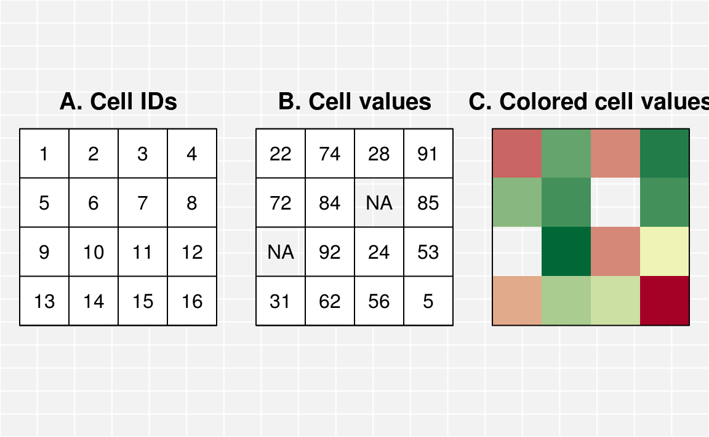
<p class="caption">(\#fig:raster-intro-plot)Raster data: A - cell IDs; B - cell values; C - a colored raster map.</p>
</div>

Raster maps usually represent continuous phenomena such as elevation, temperature, population density or spectral data (Figure \@ref(fig:raster-intro-plot2)).
Of course, we can represent discrete features such as soil or land-cover classes also with the help of a raster data model (Figure \@ref(fig:raster-intro-plot2)).
Consequently, the discrete borders of these features become blurred, and depending on the spatial task a vector representation might be more suitable.

<div class="figure" style="text-align: center">
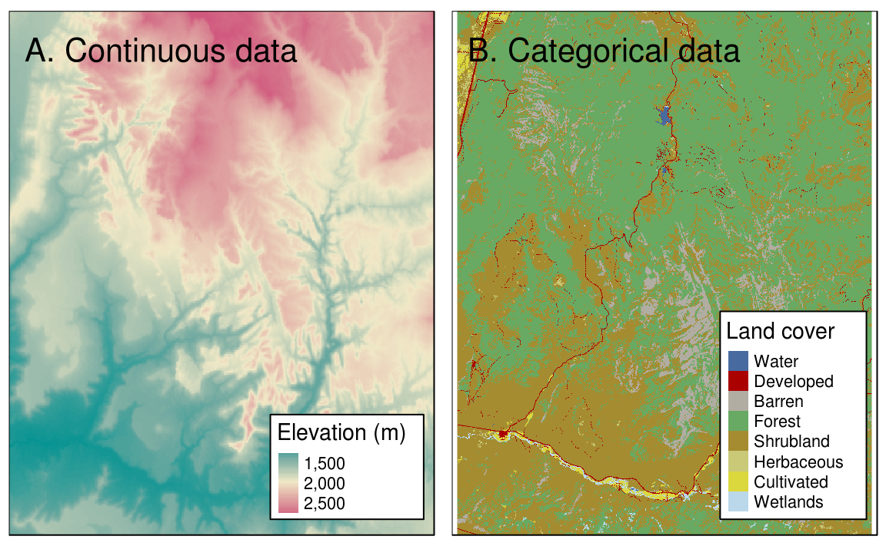
<p class="caption">(\#fig:raster-intro-plot2)Examples of continuous (left) and categorical (right) raster.</p>
</div>

### An introduction to raster

The **raster** package supports raster objects in R. 
It provides an extensive set of functions to create, read, export, manipulate and process raster datasets.
Aside from general raster data manipulation, **raster** provides many low level functions that can form the basis to develop more advanced raster functionality.
**raster** also lets you work on large raster datasets that are too large to fit into the main memory. 
In this case, **raster** provides the possibility to divide the raster into smaller chunks (rows or blocks), and processes these iteratively instead of loading the whole raster file into RAM (for more information, please refer to `vignette("functions", package = "raster")`.

For the illustration of **raster** concepts, we will use datasets from the **spDataLarge** (note these packages were loaded at the beginning of the chapter).
It consists of a few raster and one vector datasets covering an area of the Zion National Park (Utah, USA).
For example, `srtm.tif` is a digital elevation model of this area (for more details - see its documentation `?srtm`)
First of all, we would like to create a `RasterLayer` object named `new_raster`:


```r
raster_filepath = system.file("raster/srtm.tif", package = "spDataLarge")
new_raster = raster(raster_filepath)
```

Typing the name of the raster into the console, will print out the raster header (extent, dimensions, resolution, CRS) and some additional information (class, data source name, summary of the raster values): 


```r
new_raster
#> class       : RasterLayer 
#> dimensions  : 457, 465, 212505  (nrow, ncol, ncell)
#> resolution  : 0.000833, 0.000833  (x, y)
#> extent      : -113, -113, 37.1, 37.5  (xmin, xmax, ymin, ymax)
#> coord. ref. : +proj=longlat +datum=WGS84 +no_defs +ellps=WGS84 +towgs84=0,0,0 
#> data source : /home/travis/R/Library/spDataLarge/raster/srtm.tif 
#> names       : srtm 
#> values      : 1024, 2892  (min, max)
```

To access individual header information, you can use following commands: `dim(new_raster)` (dimensions - number of rows, number of columns, number of raster layers), `ncell(new_raster)` (number of raster cells), `res(new_raster)` (spatial resolution), `extent(new_raster)` (spatial extent), and `crs(new_raster)` (coordinate reference system).

<!--CRSargs(CRS("+init=epsg:4326"))-->
Note that in contrast to the **sf** package, **raster** only accepts the `proj4string` representation of the coordinate reference system.

<!--
You can also summarize and plot raster cell values in a non-spatial fashion using base R functions such as `summary()` and `hist()`.


```r
# numerical summary of the data
summary(new_raster)
#> Warning in .local(object, ...): summary is an estimate based on a sample of 1e+05 cells (47.06% of all cells)
#>         srtm
#> Min.    1034
#> 1st Qu. 1535
#> Median  1839
#> 3rd Qu. 2115
#> Max.    2892
#> NA's       0
```


```r
# histogram of the values
hist(new_raster)
#> Warning in .hist1(x, maxpixels = maxpixels, main = main, plot = plot, ...):
#> 47% of the raster cells were used. 100000 values used.
```

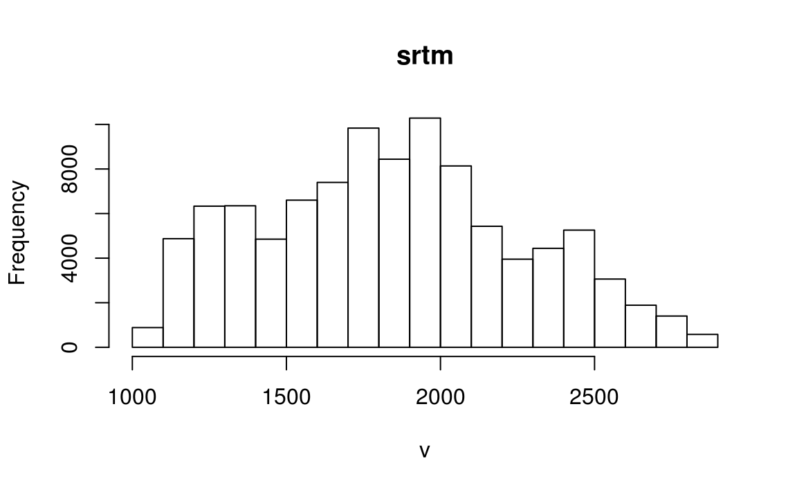

`getValues()` extracts the values of a raster as a numerical vector.
To only select specific rows, use the `row` parameter.


```r
new_raster_values = getValues(new_raster)
head(new_raster_values)
#> [1] 1728 1718 1715 1710 1703 1701
```

The new vector, `new_raster_values`, can serve as input for subsequent statistical operations.
-->

Sometimes it is important to know if all values of a raster are currently in memory or on disk.
Find out with the `inMemory()` function:


```r
inMemory(new_raster)
#> [1] FALSE
```

`help(package = "raster", topic = "raster-package")` returns a full list of all available **raster** functions.

\BeginKnitrBlock{rmdnote}<div class="rmdnote">The **raster** package is not yet fully compatible with objects from the **sf** package.
Thus, we suggest to convert **sf** objects to Spatial^*^ class() when using a vector data inside a **raster** function, for example `crop(raster_obj, as(sf_object, "Spatial")`.</div>\EndKnitrBlock{rmdnote}

### Basic map making {#basic-map-raster}

Similar to the **sf** package, **raster** also provides `plot()` methods for its own classes.


```r
plot(new_raster)
```

<div class="figure" style="text-align: center">

<p class="caption">(\#fig:basic-new-raster-plot)Basic raster plot.</p>
</div>

<!-- Moreover, it is possible to plot a raster and overlay it with vector data. -->
<!-- For this purpose, we need to read-in a vector dataset: -->

<!-- ```{r, message=FALSE, results='hide'} -->
<!-- vector_filepath = system.file("vector/zion.gpkg", package="spDataLarge") -->
<!-- new_vector = st_read(vector_filepath) -->
<!-- ``` -->

<!-- Our new object, `new_vector`, is a polygon representing the borders of Zion National Park (`?zion`). -->
<!-- We can add the borders to the elevation map using the `add` argument of the `plot()`: -->

<!-- ```{r basic-new-raster-vector-plot} -->
<!-- plot(new_raster) -->
<!-- plot(new_vector$geom, add = TRUE) -->
<!-- ``` -->

There are several different approaches to plot raster data in R:

- You can use `spplot()` to visualize several (such as spatiotemporal) layers at once. You can also do so  with the **rasterVis** package which provides more advanced methods for plotting raster objects.
- Packages such as **tmap**, **mapview** and **leaflet** facilitate especially interactive mapping of both raster and vector objects. 
<!-- TODO: cross reference advanced mapping chapter -->

### Raster classes {#raster-classes}

The `RasterLayer` class represents the simplest form of a raster object, and consists of only one layer.
The easiest way to create a raster object in R is to read-in a raster file from disk or from a server.


```r
raster_filepath = system.file("raster/srtm.tif", package = "spDataLarge")
new_raster = raster(raster_filepath)
```

The **raster** package supports numerous drivers with the help of **rgdal**.
To find out which drivers are available on your system, run `raster::writeFormats()` and `rgdal::gdalDrivers()`.

Rasters can also be created from scratch using the `raster()` function.
This is illustrated in the subsequent code chunk, which results in a new `RasterLayer` object.
The resulting raster consists of 36 cells (6 columns and 6 rows specified by `nrow` and `ncol`) centered around the Prime Meridian and the Equator (see `xmn`, `xmx`, `ymn` and `ymx` parameters).
The CRS is the default of raster objects: WGS84.
This means the unit of the resolution is in degrees which we set to 0.5 (`res`). 
Values (`vals`) are assigned to each cell: 1 to cell 1, 2 to cell 2, and so on.
Remember: `raster()` fills cells row-wise (unlike `matrix()`) starting at the upper left corner, meaning the top row contains the values 1 to 6, the second 7 to 12 etc.


```r
new_raster2 = raster(nrow = 6, ncol = 6, res = 0.5, 
                     xmn = -1.5, xmx = 1.5, ymn = -1.5, ymx = 1.5,
                     vals = 1:36)
```

For still further ways of creating a raster object have a look at the help file - `?raster`.
<!--
There are several ways to add new values to the `Raster*` objects.
Values for the whole object could be add with `setValues()`:


```r
# adding random values to the raster object
new_random_values = sample(seq_len(ncell(new_raster4)))
setValues(new_raster4, new_random_values)
```


It is also possible to replace cell values by specifying cell numbers, or row and column numbers:


```r
# change the value of 15th cell to 826
new_raster4[15] = 826
# change the value of the cell in the second row and forth column to 826
new_raster4[2, 4] = 826 
```
-->

Aside from `RasterLayer`, there are two additional classes: `RasterBrick` and `RasterStack`.
Both can handle multiple layers, but differ regarding the number of supported file formats, type of internal representation and processing speed.

A `RasterBrick` consists of multiple layers, which typically correspond to a single multispectral satellite file or a single multilayer object in memory. 
The `brick()` function creates a `RasterBrick` object.
Usually, you provide it with a filename to a multilayer raster file but might also use another raster object and other spatial objects (see its help page for all supported formats).


```r
multilayer_raster_filepath = system.file("raster/landsat.tif", package = "spDataLarge")
r_brick = brick(multilayer_raster_filepath)
r_brick
#> class       : RasterBrick 
#> dimensions  : 1428, 1128, 1610784, 4  (nrow, ncol, ncell, nlayers)
#> resolution  : 30, 30  (x, y)
#> extent      : 301905, 335745, 4111245, 4154085  (xmin, xmax, ymin, ymax)
#> coord. ref. : +proj=utm +zone=12 +datum=WGS84 +units=m +no_defs +ellps=WGS84 +towgs84=0,0,0 
#> data source : /home/travis/R/Library/spDataLarge/raster/landsat.tif 
#> names       : landsat.1, landsat.2, landsat.3, landsat.4 
#> min values  :      7550,      6404,      5678,      5252 
#> max values  :     19071,     22051,     25780,     31961
```

The `nlayers` function retrieves the number of layers stored in a `Raster*` object:


```r
nlayers(r_brick)
#> [1] 4
```

A `RasterStack` is similar to a `RasterBrick` in the sense that it consists also of multiple layers.
However, in contrast to `RasterBrick`, `RasterStack` allows you to connect several raster objects stored in different files or multiply objects in memory.
More specifically, a `RasterStack` is a list of `RasterLayer` objects with the same extent and resolution. 
Hence, one way to create it is with the help of spatial objects already existing in R's global environment. 
And again, one can simply specify a path to a file stored on disk.
<!-- The possibility to create a `RasterStack` from a file stored on disk and an object residing in R's global environment is one of the main differences compared to a `RasterBrick`. -->


```r
raster_on_disk = raster(r_brick, layer = 1)
raster_in_memory = raster(xmn = 301905, xmx = 335745,
                          ymn = 4111245, ymx = 4154085, 
                          res = 30)
values(raster_in_memory) = sample(seq_len(ncell(raster_in_memory)))
crs(raster_in_memory) = crs(raster_on_disk)
```


```r
r_stack = stack(raster_in_memory, raster_on_disk)
r_stack
#> class       : RasterStack 
#> dimensions  : 1428, 1128, 1610784, 2  (nrow, ncol, ncell, nlayers)
#> resolution  : 30, 30  (x, y)
#> extent      : 301905, 335745, 4111245, 4154085  (xmin, xmax, ymin, ymax)
#> coord. ref. : +proj=utm +zone=12 +datum=WGS84 +units=m +no_defs +ellps=WGS84 +towgs84=0,0,0 
#> names       :   layer, landsat.1 
#> min values  :       1,      7550 
#> max values  : 1610784,     19071
```

Another difference is that the processing time for `RasterBrick` objects is usually shorter than for `RasterStack` objects.

Decision on which `Raster*` class should be used depends mostly on a character of input data. 
Processing of a single mulitilayer file or object is the most effective with `RasterBrick`, while `RasterStack` allows calculations based on many files, many `Raster*` objects, or both.

\BeginKnitrBlock{rmdnote}<div class="rmdnote">Operations on `RasterBrick` and `RasterStack` objects will typically return a `RasterBrick`.</div>\EndKnitrBlock{rmdnote}

## Coordinate Reference Systems {#crs-intro}

Vector and raster spatial data types share concepts intrinsic to spatial data.
Perhaps the most fundamental of these is the Coordinate Reference System (CRS), which defines how the spatial elements of the data relate to the surface of the Earth (or other bodies).
<!-- Coordinates are meaningless without a CRS, as we don't know theirs units (meters, feets, degrees) or what's the origin -->
<!-- (-12579102, 4439107) = (-113, 37) -->
CRSs are either geographic or projected, as introduced at the beginning of this chapter (see Figure \@ref(fig:vectorplots)).
This section will will explain each type, laying the foundations for section \@ref(reproj-geo-data) on CRS transformations.

### Geographic coordinate systems

Geographic coordinate systems identify any location on the Earth's surface using two values --- longitude and latitude. 
*Longitude* is location in the East-West direction in angular distance from the Prime Meridian plane.
*Latitude* is angular distance North or South of the equatorial plane.
Distance in geographic CRSs are therefore not measured in meters.
This has important consequences, as demonstrated in section \@ref(reproj-geo-data).

The surface of the Earth in geographic coordinate systems is represented by a spherical or ellipsoidal surface.
Spherical models assume that the Earth is a perfect sphere of a given radius.
Spherical models have the advantage of simplicity but are rarely used because they are inaccurate: the Earth is not a sphere!
Ellipsoidal models are defined by two parameters: the equatorial radius and the polar radius.
These are suitable because the Earth is compressed: the equatorial radius is around 11.5 km longer than the polar radius [@maling_coordinate_1992].^[
The degree of compression is often referred to as *flattening*, defined in terms of the equitorial radius ($a$) and polar radius ($b$) as follows: $f = (a - b) / a$. The terms *ellipticity* and *compression* can also be used [@maling_coordinate_1992].
<!-- The degree of compression is often referred to as [*flattening*](https://en.wikipedia.org/wiki/Flattening), defined in terms of the equitorial radius ($a$) and polar radius ($b$) as follows: $f = (a - b) / a$. The terms *ellipticity* and *compression* can also be used [@maling_coordinate_1992]. -->
Because $f$ is a rather small value, digital ellipsoid models use the 'inverse flattening' ($rf = 1/f$) to define the Earth's compression.
Values of $a$ and $rf$ used in a variety of ellipsoidal models can be seen be executing `st_proj_info(type = "ellps")`.
]

Ellipsoids are part of a wider component of CRSs: the *datum*.
This contains information on what ellipsoid to use (with the `ellps` parameter in the proj4 CRS library) and the precise relationship between the Cartesian coordinates and location on the Earth's surface.
These additional details are stored in the `towgs84` argument of  [proj4](http://proj4.org/parameters.html#towgs84-datum-transformation-to-wgs84) notation (see [proj4.org/parameters.html](http://proj4.org/parameters.html) for details).
These allow local variations in Earth's surface, e.g. due to large mountain ranges, to be accounted for in a local CRS.
There are two types of datum --- local and geocentric.
In a *local datum* such as `NAD83` the ellipsoidal surface is shifted to align with the surface at a particular location.
In a *geocentric datum*  such as `WGS84` the center is the Earth's center of gravity and the accuracy of projections is not optimized for a specific location.
Available datum definitions can be seen by executing `st_proj_info(type = "datum")`.
<!-- plots? -->
<!-- plus maybe table (few examples) -->

### Projected coordinate systems 

Projected CRSs are based on Cartesian coordinates on an implicitly flat surface.
They have an origin, x and y axes, and a linear unit of measurement such as meters.
All projected CRSs are based on a geographic CRS, described in the previous section, and rely on map projections to convert the three-dimensional surface of the Earth into Easting and Northing (x and y) values in a projected CRS.

This transition cannot be done without adding some distortion.
Therefore, some properties of the Earth's surface are distorted in this process, such as area, direction, distance, and shape.
A projected coordinate system can preserve only one or two of those properties.
Projections are often named based on a property they preserve: equal-area preserves area, azimuthal preserve direction, equidistant preserve distance, and conformal preserve local shape.

There are three main groups of projection types - conic, cylindrical, and planar.
In a conic projection, the Earth's surface is projected onto a cone along a single line of tangency or two lines of tangency. 
Distortions are minimized along the tangency lines and rise with the distance from those lines in this projection.
Therefore, it is the best suited for maps of mid-latitude areas.
A cylindrical projection maps the surface onto a cylinder.
This projection could also be created by touching the Earth's surface along a single line of tangency or two lines of tangency. 
Cylindrical projections are used most often when mapping the entire world.
A planar projection projects data onto a flat surface touching the globe at a point or along a line of tangency. 
It is typically used in mapping polar regions.
<!-- other projections? -->
<!-- https://en.wikipedia.org/wiki/List_of_map_projections -->
<!-- plus maybe table (few examples) -->
<!-- add good reference to projections -->
`st_proj_info(type = "proj")` gives a list of the available projections supported by the PROJ library.

<!-- maybe a new section - how to pick the best projection? -->
<!-- https://source.opennews.org/articles/choosing-right-map-projection/ -->

### CRSs in R {#crs-in-r}

Two main ways to describe CRS in R are an `epsg` code or a `proj4string` definition.
Both of these approaches have advantages and disadvantages. 
An `epsg` code is usually shorter, and therefore easier to remember. 
The code also refers to only one, well-defined coordinate reference system. 
On the other hand, a `proj4string` definition allows you more flexibility when it comes to specifying different parameters such as the projection type, the datum and the ellipsoid.^[
A complete list of the `proj4string` parameters can be found at https://proj4.org/.
] 
This way you can specify many different projections, and modify existing ones.
This also makes the `proj4string` approach more complicated.
<!-- ^[In the background, `sf` and `raster` use the [PROJ](http://proj4.org/) software, which enables transformations between different projections]. -->
`epsg` points to exactly one particular CRS.

Spatial R packages support a wide range of CRSs and they use the long-established [proj4](http://proj4.org/) library.
Other than searching for EPSG codes online, another quick way to find out about available CRSs is via the `rgdal::make_EPSG()` function, which outputs a data frame of available projections.
Before going into more detail, it's worth learning how to view and filter them inside R, as this could save time trawling the internet.
The following code will show available CRSs interactively, allowing you to filter ones of interest (try filtering for the OSGB CRSs for example):


```r
crs_data = rgdal::make_EPSG()
View(crs_data)
```

In **sf** the CRS of an object can be retrieved using `st_crs()`.
For this, we need to read-in a vector dataset:


```r
vector_filepath = system.file("vector/zion.gpkg", package="spDataLarge")
new_vector = st_read(vector_filepath)
```

Our new object, `new_vector`, is a polygon representing the borders of Zion National Park (`?zion`).


```r
st_crs(new_vector) # get CRS
#> Coordinate Reference System:
#>   No EPSG code
#>   proj4string: "+proj=utm +zone=12 +ellps=GRS80 +towgs84=0,0,0,0,0,0,0 +units=m +no_defs"
```

In cases when a coordinate reference system (CRS) is missing or the wrong CRS is set, the `st_set_crs()` function can be used:


```r
new_vector = st_set_crs(new_vector, 26912) # set CRS
```

The warning message informs us that the `st_set_crs()` function does not transform data from one CRS to another.

<div class="figure" style="text-align: center">

<p class="caption">(\#fig:vector-crs)Examples of geographic (WGS 84; left) and projected (NAD83 / UTM zone 12N; right) and coordinate systems for a vector data type.</p>
</div>

The `projection()` function can be used to access CRS information from a `Raster*` object: 


```r
projection(new_raster) # get CRS
#> [1] "+proj=longlat +datum=WGS84 +no_defs +ellps=WGS84 +towgs84=0,0,0"
```

The same function, `projection()`, is used to set a CRS for raster objects.
The main difference, compared to vector data, is that raster objects only accept `proj4` definitions:


```r
projection(new_raster) = "+proj=utm +zone=12 +ellps=GRS80 +towgs84=0,0,0,0,0,0,0 
                            +units=m +no_defs" # set CRS
```

<div class="figure" style="text-align: center">

<p class="caption">(\#fig:raster-crs)Examples of geographic (WGS 84; left) and projected (NAD83 / UTM zone 12N; right) and coordinate systems for a raster data type</p>
</div>

We will expand on CRSs and how to project from one CRS to another in much more detail in chapter \@ref(reproj-geo-data).
<!-- comparing projections? == -->
<!-- - st_as_sf(x, coords = c("x","y")) -->
<!-- - st_bbox -->

## Units

<!-- https://cran.r-project.org/web/packages/units/vignettes/measurement_units_in_R.html -->
An important feature of CRSs is that they contain information about spatial units.
Clearly it is vital to know whether a house's measurements are in feet or meters, and the same applies to maps.
It is good cartographic practice to add a *scale bar* onto maps to demonstrate the relationship between distances on the page or screen and distances on the ground.
Likewise, it is important to formally specify the units in which the geometry data or pixels are measured to provide context, and ensure that subsequent calculations are done in context.

A novel feature of geometry data in `sf` objects is that they have *native support* for units.
This means that distance, area and other geometric calculations in **sf** return values that come with a `units` attribute, defined by the **units** package [@pebesma_measurement_2016].
This is advantageous because it prevents confusion caused by the fact that different CRSs use different units (most use meters, some use feet).
Furthermore, it also provides information on dimensionality, as illustrated by the following calculation which reports the area of Nigeria:


```r
nigeria = world[world$name_long == "Nigeria", ]
```


```r
st_area(nigeria)
#> 9.05e+11 m^2
```

The result is in units of square meters (m^2^), showing a) that the result represents two-dimensional space and b) and that Nigeria is a large country!
This information, stored as an attribute (which interested readers can discover with `attributes(st_area(nigeria))`) is advantageous for many reasons, for example it could feed into subsequent calculations such as population density.
Reporting units prevents confusion.
To take the Nigeria example, if the units remained unspecified, one could incorrectly assume that the units were in km^2^.
To translate the huge number into a more digestible size, it is tempting to divide the results by a million (the number of square meters in a square kilometer):


```r
st_area(nigeria) / 1000000
#> 905062 m^2
```

However, the result is incorrectly given again as square meters.
The solution is to set the correct units with the **units** package:


```r
units::set_units(st_area(nigeria), km^2)
#> 905062 km^2
```

<!-- Is that right? I mean, the units DESCRIPTION says "Support for measurement units in R vectors, matrices and arrays". Since raster datasets are just matrices, units might be easily used with them?-->
Units are of equal importance in the case of raster data.
However, so far **sf** is the only spatial package that supports units, meaning that people working on raster data should approach changes in the units of analysis (for example, converting pixel widths from imperial to decimal units) with care.
The `new_raster` object (see above) uses a UTM projection with meters as units.
Consequently, its resolution is also given in meters but you have to know it, since the `res()` function simply returns a numeric vector.


```r
res(new_raster)
#> [1] 0.000833 0.000833
```

If we used the WGS84 projection, the units would change.


```r
repr = projectRaster(new_raster, crs = "+init=epsg:4326")
res(repr)
#> [1] 7.47e-09 7.52e-09
```

Again, the `res()` command gives back a numeric vector without any unit, forcing us to know that the unit of the WGS84 projection is decimal degrees.

<!-- Something about when units are not set: -->
<!-- ```{r} -->
<!-- st_distance(sf_point1, sf_point2) -->
<!-- ``` -->

<!-- ## Precision -->

## Exercises {#ex2}

<!-- vector exercises -->
1. What does the summary of the `geometry` column tell us about the `world` dataset, in terms of:
    - The geometry type?
    - How many countries there are?
    - The coordinate reference system (CRS)?
1. Using **sf**'s `plot()` command, create a map of Nigeria in context, building on the code that creates and plots Asia above (see Figure \@ref(fig:asia) for an example of what this could look like). 
    - Hint: this used the `lwd`, `main` and `col` arguments of `plot()`. 
    - Bonus: make the country boundaries a dotted gray line.
    - Hint: `border` is an additional argument of `plot()` for **sf**  objects.
1. What does the `cex` argument do in the `plot()` function that generates Figure \@ref(fig:contpop)?
    - Why was `cex` set to the `sqrt(world$pop) / 10000` instead of just the population directly?
    - Bonus: what equivalent arguments to `cex` exist in the dedicated visualization package **tmap**?
1. Re-run the code that 'generated' Figure \@ref(fig:contpop) at the end of \@ref(base-args) and find 3 similarities and 3 differences between the plot produced on your computer and that in the book.
    - What is similar?
    - What has changed?
    - Bonus: play around with and research base plotting arguments to make your version of Figure \@ref(fig:contpop) more attractive. Which arguments were most useful?
    - Advanced: try to reproduce the map presented in Figure \@ref(base-args). Copy-and-pasting is prohibited!
<!-- raster exercises -->
1. Read the `raster/nlcd2011.tif` file from the **spDataLarge** package. 
What kind of information can you get about the properties of this file?
<!-- (crs, ncols, nrow, ncells, bbox, navalues) -->
1. Create an empty `RasterLayer` object called `my_raster` with 10 columns and 10 rows and resolution of 10 units.
Assign random values between 0 and 10 to the new raster and plot it.
<!-- crs exercises -->
<!-- 1. pros and cons of the projection types -->
<!-- 1. pros and cons of epsg/proj4 -->
<!-- units exercises -->
<!-- 1. ?? -->

<!--chapter:end:02-spatial-data.Rmd-->


# Attribute operations {#attr}

## Prerequisites {-}

- This chapter requires the following packages to be installed and attached: 


```r
library(sf)
library(raster)
library(tidyverse)
```

- It also relies on **spData**, which loads datasets used in the code examples of this chapter:


```r
library(spData)
```

## Introduction

Attribute data is non-spatial information associated with geographic (geometry) data.
A bus stop provides a simple example: its position would typically be represented by latitude and longitude coordinates (geometry data), in addition to its name.
The name is an *attribute* of the feature (to use Simple Features terminology) that bears no relation to its geometry.
<!-- idea: add an example of a bus stop (or modify a previous example so it represents a bus stop) in the previous chapter  -->

Another example is the elevation value (attribute) for a specific grid cell in raster data.
Unlike vector data, the raster data model stores the coordinate of the grid cell only indirectly:
There is a less clear distinction between attribute and spatial information in raster data.
Say, we are in the 3^rd^ row and the 4^th^ column of a raster matrix.
To derive the corresponding coordinate, we have to move from the origin three cells in x-direction and four cells in y-direction with the cell resolution defining the distance for each x- and y-step.
The raster header gives the matrix a spatial dimension which we need when plotting the raster or when we want to combine two rasters, think, for instance, of adding the values of one raster to another (see also next chapter).
<!-- should we somewhere add a table comparing advantages/disadvantages of using the vector or raster data model, would fit nicely into chapter 2 -->

The focus of this chapter is manipulating geographic objects based on attributes such as the name of a bus stop and elevation.
For vector data this means operations such as subsetting and aggregation (see sections \@ref(vector-attribute-subsetting) and \@ref(vector-attribute-aggregation)).
These non-spatial operations have spatial equivalents:
the `[` operator in base R, for example, works equally for subsetting objects based on their attribute and spatial objects, as we will see in Chapter \@ref(spatial-operations).
This is good news: skills developed here are cross-transferable, meaning that this chapter lays the foundation for Chapter \@ref(spatial-operations), which extends the methods presented here to the spatial world.
Sections \@ref(vector-attribute-joining) and \@ref(vec-attr-creation) demonstrate how to join data onto simple feature objects using a shared ID and how to create new variables, respectively.

Raster attribute data operations are covered in Section \@ref(manipulating-raster-objects), which covers creating continuous and categorical raster layers and extracting cell values from one layer and multiple layers (raster subsetting). 
Section \@ref(summarizing-raster-objects) provides an overview of 'global' raster operations which can be used to characterize entire raster datasets.

## Vector attribute manipulation

Geographic vector data in R are well-support by `sf`, a class which extends the `data.frame`.
Thus `sf` objects have one column per attribute variable (such as 'name') and one row per observation, or *feature* (e.g. per bus station).
`sf` objects also have a special column to contain geometry data, usually named `geometry`.
The `geometry` column is special because it is a *list-colum*, which can contain multiple geographic entities (points, lines, polygons) per row.
In Chapter \@ref(spatial-class) we saw how to perform *generic methods* such as `plot()` and `summary()` on `sf` objects.
**sf** also provides methods that allow `sf` objects to behave like regular data frames:


```r
methods(class = "sf") # methods for sf objects, first 12 shown
```


```r
#>  [1] aggregate             cbind                 coerce               
#>  [4] initialize            merge                 plot                 
#>  [7] print                 rbind                 [                    
#> [10] [[<-                  $<-                   show                 
```


Many of these functions, including `rbind()` (for binding rows of data together) and `$<-` (for creating new columns) were developed for data frames.
A key feature of `sf` objects is that they store spatial and non-spatial data in the same way, as columns in a `data.frame` (the geometry column is typically called `geometry`).

\BeginKnitrBlock{rmdnote}<div class="rmdnote">The geometry column of `sf` objects is typically called `geometry` but any name can be used.
The following command, for example, creates a geometry column named g:
  
`st_sf(data.frame(n = world$name_long), g = world$geom)`

This enables geometries imported from spatial databases to have a variety of names such as `wkb_geometry` and `the_geom`.</div>\EndKnitrBlock{rmdnote}

`sf` objects also support `tibble` and `tbl` classes used in the tidyverse, allowing 'tidy' data analysis workflows for spatial data.
Thus **sf** enables the full power of R's data analysis capabilities to be unleashed on geographic data.
Before using these capabilities it's worth re-capping how to discover the basic properties of vector data objects.
Let's start by using base R functions to get a measure of the `world` dataset:


```r
dim(world) # it is a 2 dimensional object, with rows and columns
#> [1] 177  11
nrow(world) # how many rows?
#> [1] 177
ncol(world) # how many columns?
#> [1] 11
```

Our dataset contains ten non-geographic columns (and one geometry list-column) with almost 200 rows representing the world's countries.

Extracting the attribute data of an `sf` object is the same as removing its geometry:


```r
world_df = st_set_geometry(world, NULL)
class(world_df)
#> [1] "data.frame"
```

This can be useful if the geometry column causes problems, e.g. by occupying large amounts of RAM, or to focus the attention on the attribute data.
For most cases, however, there is no harm in keeping the geometry column because non-spatial data operations on `sf` objects only change an object's geometry when appropriate (e.g. by dissolving borders between adjacent polygons following aggregation).
This means that proficiency with attribute data in `sf` objects equates to proficiency with data frames in R.
For many applications, the tidyverse package **dplyr** offers the most effective and intuitive approach of working with data frames, hence the focus on this approach in this section.^[
Unlike objects of class `Spatial*` of the **sp** package, `sf` objects are also compatible with the **tidyverse** packages **dplyr** and **ggplot2**.
The former provides fast and powerful functions for data manipulation 
<!-- (see [Section 6.7](https://csgillespie.github.io/efficientR/data-carpentry.html#data-processing-with-data.table) of @gillespie_efficient_2016),  -->
and the latter provides powerful plotting capabilities.
]

### Vector attribute subsetting

Base R subsetting functions include `[`, `subset()` and  `$`.
**dplyr** subsetting functions include `select()`, `filter()`, and `pull()`.
Both sets of functions preserve the spatial components of attribute data in `sf` objects.

The `[` operator can subset both rows and columns. 
You use indices to specify the elements you wish to extract from an object, e.g. `object[i, j]`, with `i` and `j` typically being numbers or logical vectors --- `TRUE`s and `FALSE`s --- representing rows and columns (they can also be character strings, indicating row or column names).
<!-- you can also use `[`(world, 1:6, 1) -->
Leaving `i` or `j` empty returns all rows or columns, so `world[1:5, ]` returns the first five rows and all columns.
The examples below demonstrate subsetting with base R.
The results are not shown; check the results on your own computer:


```r
world[1:6, ] # subset rows by position
world[, 1:3] # subset columns by position
world[, c("name_long", "lifeExp")] # subset columns by name
```

A demonstration of the utility of using `logical` vectors for subsetting is shown in the code chunk below.
This creates a new object, `small_countries`, containing nations whose surface area is smaller than 10,000 km^2^:


```r
sel_area = world$area_km2 < 10000
summary(sel_area) # a logical vector
#>    Mode   FALSE    TRUE 
#> logical     170       7
small_countries = world[sel_area, ]
```

The intermediary `sel_object` is a logical vector that shows that only seven countries match the query.
A more concise command, that omits the intermediary object, generates the same result:


```r
small_countries = world[world$area_km2 < 10000, ]
```

The base R function `subset()` provides yet another way to achieve the same result:


```r
small_countries = subset(world, area_km2 < 10000)
```

<!-- , after the package has been loaded: [or - it is a part of tidyverse] -->
Base R functions are mature and widely used.
However, the more recent **dplyr** approach has several advantages.
It enables intuitive workflows.
It is fast, due to its C++ backend.
This is especially useful when working with big data as well as **dplyr**'s database integration.
The main **dplyr** subsetting functions are `select()`, `slice()`, `filter()` and `pull()`.

<div class="rmdnote">
<p><strong>raster</strong> and <strong>dplyr</strong> packages have a function called <code>select()</code>. When using both packages, the function in the most recently attached package will be used, ‘masking’ the incumbent function. This can generate error messages containing text like: <code>unable to find an inherited method for function ‘select’ for signature ‘&quot;sf&quot;’</code>. To avoid this error message, and prevent ambiguity, we use the long-form function name, prefixed by the package name and two colons (usually omitted from R scripts for concise code): <code>dplyr::select()</code>.</p>
</div>

`select()` selects columns by name or position.
For example, you could select only two columns, `name_long` and `pop`, with the following command (note the sticky `geom` column remains):


```r
world1 = dplyr::select(world, name_long, pop)
names(world1)
#> [1] "name_long" "pop"       "geom"
```

`select()` also allows subsetting of a range of columns with the help of the `:` operator: 


```r
# all columns between name_long and pop (inclusive)
world2 = dplyr::select(world, name_long:pop)
```

Omit specific columns with the `-` operator:


```r
# all columns except subregion and area_km2 (inclusive)
world3 = dplyr::select(world, -subregion, -area_km2)
```

Conveniently, `select()` lets you subset and rename columns at the same time, for example:


```r
world4 = dplyr::select(world, name_long, population = pop)
names(world4)
#> [1] "name_long"  "population" "geom"
```

This is more concise than the base R equivalent:


```r
world5 = world[, c("name_long", "pop")] # subset columns by name
names(world5)[names(world5) == "pop"] = "population" # rename column manually
```

`select()` also works with 'helper functions' for advanced subsetting operations, including `contains()`, `starts_with()` and `num_range()` (see the help page with `?select` for details).

All **dplyr** functions including `select()` always return a dataframe-like object. 
To extract a single vector, one has to explicitly use the `pull()` command.
The subsetting operator in base R (see `?[`), by contrast, tries to return objects in the lowest possible dimension.
This means selecting a single column returns a vector in base R.
To turn off this behavior, set the `drop` argument to `FALSE`.


```r
# create throw-away dataframe
d = data.frame(pop = 1:10, area = 1:10)
# return dataframe object when selecting a single column
d[, "pop", drop = FALSE]
select(d, pop)
# return a vector when selecting a single column
d[, "pop"]
pull(d, pop)
```

Due to the sticky geometry column, selecting a single attribute from an sf-object with the help of `[()` returns also a dataframe.
Contrastingly, `pull()` and `$` will give back a vector.


```r
# dataframe object
world[, "pop"]
# vector objects
world$pop
pull(world, pop)
```

`slice()` is the row-equivalent of `select()`.
The following code chunk, for example, selects the 3^rd^ to 5^th^ rows:


```r
slice(world, 3:5)
```

`filter()` is **dplyr**'s equivalent of base R's `subset()` function.
It keeps only rows matching given criteria, e.g. only countries with a very high average of life expectancy:


```r
# Countries with a life expectancy longer than 82 years
world6 = filter(world, lifeExp > 82)
```

The standard set of comparison operators can be used in the `filter()` function, as illustrated in Table \@ref(tab:operators): 


Table: (\#tab:operators)Table of comparison operators that result in boolean (TRUE/FALSE) outputs.

Symbol      Name                            
----------  --------------------------------
`==`        Equal to                        
`!=`        Not equal to                    
`>, <`      Greater/Less than               
`>=, <=`    Greater/Less than or equal      
`&, |, !`   Logical operators: And, Or, Not 

<!-- describe these: ==, !=, >, >=, <, <=, &, | -->
<!-- add warning about = vs == -->
<!-- add info about combination of &, |, ! -->

**dplyr** works well with the ['pipe'](http://r4ds.had.co.nz/pipes.html) operator `%>%`, which takes its name from the Unix pipe `|` [@grolemund_r_2016].
It enables expressive code: the output of a previous becomes the first argument of the next function, enabling *chaining*.
This is illustrated below, in which the `world` dataset is subset by columns (`name_long` and `continent`) and the first five rows (result not shown).


```r
world7 = world %>%
  filter(continent == "Asia") %>%
  dplyr::select(name_long, continent) %>%
  slice(1:5)
```

The above chunk shows how the pipe operator allows commands to be written in a clear order:
the above run from top to bottom (line-by-line) and left to right.
The alternative to `%>%` is nested function calls, which is harder to read:


```r
world8 = slice(
  dplyr::select(
    filter(world, continent == "Asia"),
    name_long, continent),
  1:5)
```

<!-- I commented-this out as it's overly wordy (RL) -->
<!-- This generates the same result --- verify this with `identical(world7, world8)` --- in the same number of lines of code, but in a much more confusing way, starting with the function that is called last! -->

<!-- There are additional advantages of pipes from a communication perspective: they encourage adding comments to self-contained functions and allow single lines *commented-out* without breaking the code. -->

### Vector attribute aggregation

Aggregation operations summarize datasets by a 'grouping variable', typically an attribute column (spatial aggregation is covered in the next chapter).
An example of attribute aggregation is calculating the number of people per continent based on country-level data (one row per country).
The `world` dataset contains the necessary ingredients: the columns `pop` and `continent`, the population and the grouping variable respectively.
The aim is to find the `sum()` of country populations for each continent.
This can be done with the base R function `aggregate()` as follows:


```r
world_agg1 = aggregate(pop ~ continent, FUN = sum, data = world, na.rm = TRUE)
class(world_agg1)
#> [1] "data.frame"
```

The result is a non-spatial data frame with six rows, one per continent, and two columns reporting the name and population of each continent (see Table \@ref(tab:continents) with results for the top 3 most populous continents).

`aggregate()` is a generic function which means that it behaves differently depending on its inputs.
**sf** provides a function that can be called directly with `sf:::aggregate()` that is activated when a `by` argument is provided, rather than using the `~` to refer to the grouping variable:


```r
world_agg2 = aggregate(world["pop"], by = list(world$continent),
                       FUN = sum, na.rm = TRUE)
class(world_agg2)
#> [1] "sf"         "data.frame"
```

As illustrated above, an object of class `sf` is returned this time.
`world_agg2` which is a spatial object containing 6 polygons representing the columns of the world.

`summarize()` is the **dplyr** equivalent of `aggregate()`.
It usually follows `group_by()`, which specifies the grouping variable, as illustrated below:


```r
world_agg3 = world %>%
  group_by(continent) %>%
  summarize(pop = sum(pop, na.rm = TRUE))
```

This approach is flexible and gives control over the new column names.
This is illustrated below: the command calculates the Earth's population (~7 billion) and number of countries (result not shown):


```r
world %>% 
  summarize(pop = sum(pop, na.rm = TRUE), n = n())
```

In the previous code chunk `pop` and `n` are column names in the result.
`sum()` and `n()` were the aggregating functions.
The result is an `sf` object with a single row representing the world (this works thanks to the geometric operation 'union', as explained in section \@ref(geometry-unions)).

Let's combine what we've learned so far about **dplyr** by chaining together functions to find the world's 3 most populous continents (with `dplyr::n()` ) and the number of countries they contain (the result of this command is presented in Table \@ref(tab:continents)):


```r
world %>% 
  dplyr::select(pop, continent) %>% 
  group_by(continent) %>% 
  summarize(pop = sum(pop, na.rm = TRUE), n_countries = n()) %>% 
  top_n(n = 3, wt = pop) %>%
  st_set_geometry(value = NULL) 
```


Table: (\#tab:continents)The top 3 most populous continents, and the number of countries in each.

continent           pop   n_countries
----------  -----------  ------------
Africa       1154946633            51
Asia         4311408059            47
Europe        669036256            39

\BeginKnitrBlock{rmdnote}<div class="rmdnote">More details are provided in the help pages (which can be accessed via `?summarize` and `vignette(package = "dplyr")` and Chapter 5 of [R for Data Science](http://r4ds.had.co.nz/transform.html#grouped-summaries-with-summarize). </div>\EndKnitrBlock{rmdnote}

<!-- `sf` objects are well-integrated with the **tidyverse**, as illustrated by the fact that the aggregated objects preserve the geometry of the original `world` object. -->
<!-- Here, we even had to make some efforts to prevent a spatial operation. -->
<!-- When `aggregate()`ing the population we have just used the population vector.  -->
<!-- Had we used the spatial object (world[, "population"]), `aggregate()` would have done a spatial aggregation of the polygon data.  -->
<!-- The same would have happened, had we not dismissed the geometry prior to using the `summarize()` function. -->
<!-- We will explain this so-called 'dissolving polygons' in more detail in the the next chapter. -->

<!-- Todo (optional): add exercise exploring similarities/differences with `world_continents`? -->

<!-- should it stay or should it go (?) aka should we present the arrange function?: -->
<!-- Jannes: I would suggest to leave the arrange function as an exercise to the reader. -->

<!-- ```{r} -->
<!-- # sort variables -->
<!-- ## by name -->
<!-- world_continents %>%  -->
<!--   arrange(continent) -->
<!-- ## by population (in descending order) -->
<!-- world_continents %>%  -->
<!--   arrange(-pop) -->
<!-- ``` -->

###  Vector attribute joining

<!-- https://github.com/dgrtwo/fuzzyjoin -->
<!-- http://r4ds.had.co.nz/relational-data.html -->
<!-- non-unique keys -->

Combining data from different sources is a common task in data preparation. 
Joins do this by combining tables based on a shared 'key' variable.
**dplyr** has multiple join functions including `left_join()` and `inner_join()` --- see `vignette("two-table")` for a full list.
These function names follow conventions used in the database language [SQL](http://r4ds.had.co.nz/relational-data.html) [@grolemund_r_2016, Chapter 13]; using them to join non spatial datasets to `sf` objects is the focus of this section.
**dplyr** join functions work the same on data frames and `sf` objects, the only important difference being the `geometry` list column.
The result of data joins can be either an `sf` or `data.frame` object.
The most common type of attribute join on spatial data takes an `sf` object as the first argument and adds columns to it from a `data.frame` specified as the second argument.

To illustrate the utility of joins, imagine that you are researching global coffee production.
You have managed to extract data hidden-away in a PDF document supplied by the International Coffee Organization (ICO).
The results are stored in a data frame called `coffee_data` which has 3 columns:
one (`name_long`) containing the names of coffee-producing nations and the other two reporting coffee production statistics for 2016 and 2017 (see `?coffee_data` for further information).
We will use a 'left join' (meaning the left-hand dataset is kept intact) to merge this dataset with the pre-existing `world` dataset.
The result of the code chunk below is a new `sf` object.


```r
world_coffee = left_join(world, coffee_data)
#> Joining, by = "name_long"
#> Warning: Column `name_long` joining factor and character vector, coercing
#> into character vector
class(world_coffee)
#> [1] "sf"         "data.frame"
```

The resulting simple features object is the same as the orignal `world` object but has two new variables (with column indeces 11 and 12) reporting coffee production by year.
This can be plotted as a map, as illustrated in Figure \@ref(fig:coffeemap), generated with the `plot()` function below:


```r
names(world_coffee)
#>  [1] "iso_a2"                 "name_long"             
#>  [3] "continent"              "region_un"             
#>  [5] "subregion"              "type"                  
#>  [7] "area_km2"               "pop"                   
#>  [9] "lifeExp"                "gdpPercap"             
#> [11] "coffee_production_2016" "coffee_production_2017"
#> [13] "geom"
plot(world_coffee["coffee_production_2017"])
```

<div class="figure" style="text-align: center">
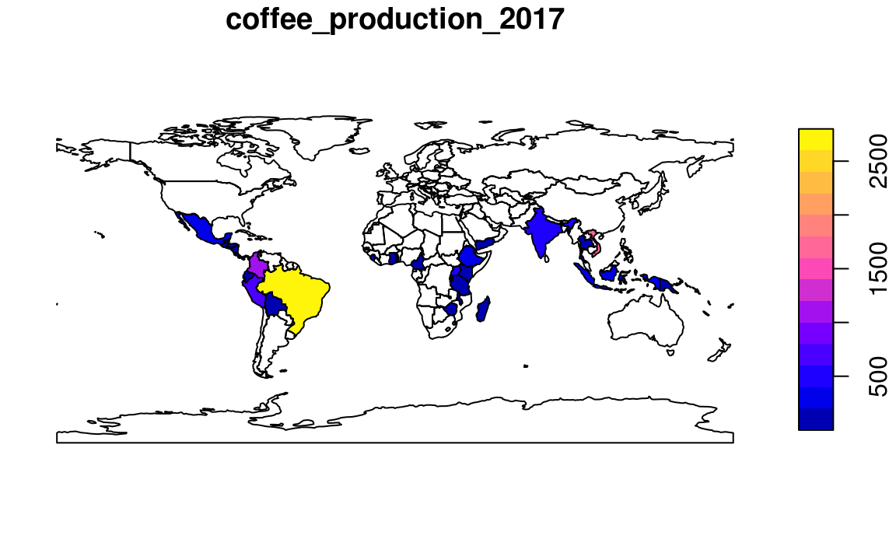
<p class="caption">(\#fig:coffeemap)World coffee production (thousand 60 kg bags) by country, 2017. Source: International Coffee Organization.</p>
</div>

For joining to work a 'key variable' must be supplied in both datasets.
By default **dplyr** uses all variables with matching names.
In this case both `world_coffee` and `world` objects contained a variable called `name_long`, explaining the message `Joining, by = "name_long"`.
In the majority of cases where variable names are not the same you have two options:

1. Rename the key variable in one of the objects so they match.
2. Use the `by` argument to specify the joining variables.

The latter approach is demonstrated below on a renamed version of `coffee_data`:


```r
coffee_renamed = rename(coffee_data, nm = name_long)
world_coffee2 = left_join(world, coffee_renamed, by = c(name_long = "nm"))
#> Warning: Column `name_long`/`nm` joining factor and character vector,
#> coercing into character vector
```


Note that the name in the original object is kept, meaning that `world_coffee` and the new object `world_coffee2` are identical.
Another feature of the result is that it has the same number of rows as the original dataset.
Although there are only 47 rows of data in `coffee_data` all 177 the country records are kept intact in `world_coffee` and `world_coffee2`:
rows in the original dataset with no match are assigned `NA` values for the new coffee production variables.
What if we only want to keep countries that have a match in the key variable?
In that case an inner join can be used:


```r
world_coffee_inner = inner_join(world, coffee_data)
#> Joining, by = "name_long"
#> Warning: Column `name_long` joining factor and character vector, coercing
#> into character vector
nrow(world_coffee_inner)
#> [1] 45
```

Note that the result of `inner_join()` has only 44 rows compared with 47 in `coffee_data`.
What happened to the remaining rows?
We can identify the rows that did not match using the `setdiff()` function as follows:


```r
setdiff(coffee_data$name_long, world$name_long)
#> [1] "Congo, Dem. Rep. of" "Others"
```

The result shows that 2 countries have not matched due to name discrepancies.
These discrepancies can be fixed by identifying the value that they were expected to have in the `world` dataset and updating the names accordingly.
In this case we will use string matching to find out what `Congo, Dem. Rep. of` and `Côte d'Ivoire` are called:


```r
str_subset(world$name_long, "Ivo|Cong")
#> [1] "Democratic Republic of the Congo" "Côte d'Ivoire"                   
#> [3] "Republic of the Congo"
```

From these results we can identify the matching names and update the names in `coffee_data` accordingly.
As demonstrated below, `inner_join()`ing the updated data frame returns a result with all 46 coffee producing nations represented in the dataset:


```r
coffee_data_match = mutate_if(coffee_data, is.character, recode,
            `Congo, Dem. Rep. of` = "Democratic Republic of the Congo",
            `Côte d'Ivoire` = "Ivory Coast")
world_coffee_match = inner_join(world, coffee_data_match)
#> Joining, by = "name_long"
#> Warning: Column `name_long` joining factor and character vector, coercing
#> into character vector
nrow(world_coffee_match)
#> [1] 45
```

It is also possible to join in the other direction: starting with a non-spatial dataset and adding variables from a simple features object.
This is demonstrated below, which starts with the `coffee_data_match` object and adds variables from the original `world` dataset.
In contrast with the previous joins, the result is *not* another simple feature object, but a data frame in the form of a **tidyverse** tibble:
the output of a join tends to match its first argument:


```r
coffee_world = left_join(coffee_data_match, world)
#> Joining, by = "name_long"
#> Warning: Column `name_long` joining character vector and factor, coercing
#> into character vector
class(coffee_world)
#> [1] "tbl_df"     "tbl"        "data.frame"
```

\BeginKnitrBlock{rmdnote}<div class="rmdnote">In most cases the geometry column is only useful in an `sf` object.
The geometry column can only be used for creating maps and spatial operations if R 'knows' it is a spatial object, defined by a spatial package such as **sf**.
Fortunately non-spatial data frames with a geometry list column (like `coffee_world`) can be coerced into an `sf` object as follows: `st_as_sf(coffee_world)`. </div>\EndKnitrBlock{rmdnote}

The contents of this section should equip you with know-how to deal with the majority of spatial data use cases.
For more advanced coverage of joins, beyond that in @grolemund_r_2016, we recommend checking-out the capabilities of **data.table**, a high-performance data processing package that is compatible with `sf` objects, and other on-line materials.^[
The use of **data.table** for geocomputation is not well-documented but a taster of what is possible is provided in a blog post entitled *Using data.table and Rcpp to scale geo-spatial analysis with sf* by Tim Applehans hosted at r-spatial.org.
A more in-depth explanation of joining is provided in `join.Rmd`, a reproducible document in the `vignettes/` folder hosted at github.com/Robinlovelace/geocompr.
]
Another type of join is a spatial join, covered in the next chapter (section \@ref(spatial-joining)).

### Creating attributes and removing spatial information {#vec-attr-creation}
<!-- lubridate? -->

Often, we would like to create a new column based on already existing columns.
For example, we want to calculate population density for each country.
For this we need to divide a population column, here `pop`, by an area column , here `area_km2` with unit area in square km.
Using base R, we can type:


```r
world_new = world # do not overwrite our original data
world_new$pop_dens = world_new$pop / world_new$area_km2
```

Alternatively, we can use one of **dplyr** functions - `mutate()` or `transmute()`.
`mutate()` adds new columns at the penultimate position in the `sf` object (the last one is reserved for the geometry):


```r
world %>% 
  mutate(pop_dens = pop / area_km2)
```

The difference between `mutate()` and `transmute()` is that the latter skips all other existing columns (except for the sticky geometry column):


```r
world %>% 
  transmute(pop_dens = pop / area_km2)
```

`unite()` pastes together existing columns. 
For example, we want to combine the `continent` and `region_un` columns into a new column named `con_reg`.
Additionally, we can define a separator (here: a colon `:`) which defines how the values of the input columns should be joined, and if the original columns should be removed (here: `TRUE`):


```r
world_unite = world %>%
  unite("con_reg", continent:region_un, sep = ":", remove = TRUE)
```

The `separate()` function does the opposite of `unite()`: it splits one column into multiple columns using either a regular expression or character positions.


```r
world_separate = world_unite %>% 
  separate(con_reg, c("continent", "region_un"), sep = ":")
```


The two functions `rename()` and `set_names()` are useful for renaming columns.
The first replaces an old name with a new one.
The following command, for example, renames the lengthy `name_long` column to simply `name`:


```r
world %>% 
  rename(name = name_long)
```

`set_names()` changes all column names at once, and requires a character vector with a name matching each column.
This is illustrated below, which outputs the same `world` object, but with very short names: 


```r
new_names = c("i", "n", "c", "r", "s", "t", "a", "p", "l", "gP", "geom")
world %>% 
  set_names(new_names)
```

It is important to note that attribute data operations preserve the geometry of the simple features.
As mentioned at the outset of the chapter, it can be useful to remove the geometry.
To do this, you have to explicitly remove it because `sf` explicitly makes the geometry column sticky.
This behavior ensures that data frame operations do not accidentally remove the geometry column.
Hence, an approach such as `select(world, -geom)` will be unsuccessful and you should instead use `st_set_geometry()`.^[
`st_geometry(world_st) = NULL` also works to remove the geometry from `world` but overwrites the original object.
]


```r
world_data = world %>% st_set_geometry(NULL)
class(world_data)
#> [1] "data.frame"
```

## Manipulating raster objects

In contrast to the vector data model underlying simple features (which represents points, lines and polygons as discrete entities in space), raster data represent continuous surfaces.
This section shows how raster objects work, by creating them *from scratch*, building on section \@ref(an-introduction-to-raster).
Because of their unique structure, subsetting and other operations on raster datasets work in a different way, as demonstrated in section \@ref(raster-subsetting).

The following code recreates the raster dataset used in section \@ref(raster-classes), the result of which is illustrated in Figure \@ref(fig:cont-raster).
This demonstrates how the `raster()` function works to create an example raster named `elev` (representing elevations).


```r
elev = raster(nrow = 6, ncol = 6, res = 0.5,
              xmn = -1.5, xmx = 1.5, ymn = -1.5, ymx = 1.5,
              vals = 1:36)
```

The result is a raster object with 6 rows and 6 columns (specified by the `nrow` and `ncol` arguments), and a minimum and maximum spatial extent in x and y direction (`xmn`, `xmx`, `ymn`, `ymax`).
The `vals` argument sets the values that each cell contains: numeric data ranging from 1 to 36 in this case.
Raster objects can also contain categorical values of class `logical` or `factor` variables in R.
The following code creates a raster representing grain sizes (Figure \@ref(fig:cont-raster)):


```r
grain_order = c("clay", "silt", "sand")
grain_char = sample(grain_order, 36, replace = TRUE)
grain_fact = factor(grain_char, levels = grain_order)
grain = raster(nrow = 6, ncol = 6, res = 0.5, 
               xmn = -1.5, xmx = 1.5, ymn = -1.5, ymx = 1.5,
               vals = grain_fact)
```


\BeginKnitrBlock{rmdnote}<div class="rmdnote">`raster` objects can contain values of class `numeric`, `integer`, `logical` or `factor`, but not `character`.
To use character values they must first be converted into an appropriate class, for example using the function `factor()`. 
The `levels` argument was used in the preceding code chunk to create an ordered factor:
clay < silt < sand in terms of grain size.
See the [Data structures](http://adv-r.had.co.nz/Data-structures.html) chapter of @wickham_advanced_2014 for further details on classes.</div>\EndKnitrBlock{rmdnote}

`raster` objects represent categorical variables as integers, so `grain[1, 1]` returns a number that represents a unique identifier, rather than "clay", "silt" or "sand". 
The raster object stores the corresponding look-up table or "Raster Attribute Table" (RAT) as a data frame in a new slot named `attributes`, which can be viewed with `ratify(grain)` (see `?ratify()` for more information).
Use the function `levels()` for retrieving and adding new factor levels to the attribute table:


```r
levels(grain)[[1]] = cbind(levels(grain)[[1]], wetness = c("wet", "moist", "dry"))
levels(grain)
#> [[1]]
#>   ID VALUE wetness
#> 1  1  clay     wet
#> 2  2  silt   moist
#> 3  3  sand     dry
```

This behavior demonstrates that raster cells can only possess one value, an identifier which can be used to look up the attributes in the corresponding attribute table (stored in a slot named `attributes`).
This is illustrated in command below, which returns the grain size and wetness of cell IDs 1, 11 and 35, we can run:


```r
factorValues(grain, grain[c(1, 11, 35)])
#>   VALUE wetness
#> 1  sand     dry
#> 2  silt   moist
#> 3  clay     wet
```

<div class="figure" style="text-align: center">

<p class="caption">(\#fig:cont-raster)Raster datasets with numeric (left) and categorical values (right).</p>
</div>

### Raster subsetting

Raster subsetting is done with the base R operator `[`, which accepts a variety of inputs:

- row-column indexing
- cell IDs
- coordinates
- another raster object

The latter two represent spatial subsetting (see section \@ref(raster-subsetting) in the next chapter).
The first two subsetting options are demonstrated in the commands below ---
both return the value of the top left pixel in the raster object `elev` (results not shown):


```r
# row 1, column 1
elev[1, 1]
# cell ID 1
elev[1]
```

To extract all values or complete rows, you can use `values()` and `getValues()`.
For multi-layered raster objects `stack` or `brick`, this will return the cell value(s) for each layer.
For example, `stack(elev, grain)[1]` returns a matrix with one row and two columns --- one for each layer.
<!-- In this example we have used cell ID subsetting, of course, you can also use row-column or coordinate indexing. -->
For multi-layer raster objects another way to subset is with `raster::subset()`, which extracts layers from a raster stack or brick. The `[[` and `$` operators can also be used:


```r
r_stack = stack(elev, grain)
names(r_stack) = c("elev", "grain")
# three ways to extract a layer of a stack
raster::subset(r_stack, "elev")
r_stack[["elev"]]
r_stack$elev
```

Cell values can be modified by overwriting existing values in conjunction with a subsetting operation.
The following code chunk, for example, sets the upper left cell of `elev` to 0:


```r
elev[1, 1] = 0
elev[]
#>  [1]  0  2  3  4  5  6  7  8  9 10 11 12 13 14 15 16 17 18 19 20 21 22 23
#> [24] 24 25 26 27 28 29 30 31 32 33 34 35 36
```

Leaving the square brackets empty is a shortcut version of `values()` for retrieving all values of a raster.
Multiple cells can also be modified in this way:


```r
elev[1, 1:2] = 0
```

### Summarizing raster objects

**raster** contains functions for extracting descriptive statistics for entire rasters.
Printing a raster object to the console by typing its name, returns minimum and maximum values of a raster.
`summary()` provides common descriptive statistics (minimum, maximum, interquartile range and number of `NA`s).
Further summary operations such as the standard deviation (see below) or custom summary statistics can be calculated with `cellStats()`. 


```r
cellStats(elev, sd)
```

\BeginKnitrBlock{rmdnote}<div class="rmdnote">If you provide the `summary()` and `cellStats()` functions with a raster stack or brick object, they will summarize each layer separately, as can be illustrated by running: `summary(brick(elev, grain))`</div>\EndKnitrBlock{rmdnote}

Raster value statistics can be visualized in a variety of ways.
Specific functions such as `boxplot()`, `density()`, `hist()` and `pairs()` work also with raster objects, as demonstrated in the histogram created with the command below (not shown):


```r
hist(elev)
```

In case a visualization function does not work with raster objects, one can extract the raster data to be plotted with the help of `values()` or `getValues()`.

Descriptive raster statistics belong to the so-called global raster operations.
These and other typical raster processing operations are part of the map algebra scheme which are covered in the next chapter (section \@ref(map-algebra)).

<div class="rmdnote">
<p>Some function names clash between packages (e.g. <code>select</code>, as discussed in a previous note). In addition to not loading packages by referring to functions verbosely (e.g. <code>dplyr::select()</code>) another way to prevent function names clashes is by unloading the offending package with <code>detach()</code>. The following command, for example, unloads the <strong>raster</strong> package (this can also be done in the <em>package</em> tab which resides by default in the right-bottom pane in RStudio): <code>detach(&quot;package:raster&quot;, unload = TRUE, force = TRUE)</code>. The <code>force</code> argument makes sure that the package will be detached even if other packages depend on it. This, however, may lead to a restricted usability of packages depending on the detached package, and is therefore not recommended.</p>
</div>

## Exercises

For these exercises we will use the `us_states` and `us_states_df` datasets from the **spData** package:


```r
library(spData)
data(us_states)
data(us_states_df)
```

`us_states` is a spatial object (of class `sf`), containing geometry and a few attributes (including name, region, area, and population) of states within the contiguous United States.
`us_states_df` is a data frame (of class `data.frame`) containing the name and additional variables (including median income and poverty level, for years 2010 and 2015) of US states, including Alaska, Hawaii and Puerto Rico.
The data comes from the US Census Bureau, and is documented in `?us_states` and `?us_states_df`.

<!-- Attribute subsetting -->
1. Create a new object called `us_states_name` that contains only the `NAME` column from the `us_states` object. 
What is the class of the new object? <!--why there is a "sf" part? -->
1. Select columns from the `us_states` object which contain population data.
Obtain the same result using a different command (bonus: try to find three ways of obtaining the same result).
Hint: try to use helper functions, such as `contains` or `starts_with` from **dplyr** (see `?contains`).
1. Find all states with the following characteristics (bonus find *and* plot them):
    - Belong to the Midwest region.
    - Belong to the West region, have an area below 250,000 km^2^ *and* in 2015 a population greater than 5,000,000 residents (hint: you may need to use the function `units::set_units()` or `as.numeric()`).
    - Belong to the South region, had an area larger than 150,000 km^2^ or a total population in 2015 larger than 7,000,000 residents.
<!-- Attribute aggregation -->
1. What was the total population in 2015 in the `us_states` dataset?
What was the minimum and maximum total population in 2015?
1. How many states are there in each region?
1. What was the minimum and maximum total population in 2015 in each region?
What was the total population in 2015 in each region?
<!-- Attribute joining -->
1. Add variables from `us_states_df` to `us_states`, and create a new object called `us_states_stats`.
What function did you use and why?
Which variable is the key in both datasets?
What is the class of the new object?
1. `us_states_df` has two more variables than `us_states`.
How can you find them? (hint: try to use the `dplyr::anti_join` function)
<!-- Attribute creation -->
1. What was the population density in 2015 in each state?
What was the population density in 2010 in each state?
1. How much has population density changed between 2010 and 2015 in each state?
Calculate the change in percentages and map them.
1. Change the columns names in `us_states` to lowercase. (Hint: helper functions - `tolower()` and `colnames()` may help).
<!-- Mixed exercises -->
<!-- combination of use of select, mutate, group_by, summarize, etc  -->
1. Using `us_states` and `us_states_df` create a new object called `us_states_sel`.
The new object should have only two variables - `median_income_15` and `geometry`.
Change the name of the `median_income_15` column to `Income`.
1. Calculate the change in median income between 2010 and 2015 for each state.
Bonus: what was the minimum, average and maximum median income in 2015 for each region?
What is the region with the largest increase of the median income?
<!-- Raster exercises -->
1. Create a raster from scratch with nine rows and columns and a resolution of 0.5 decimal degrees (WGS84).
Fill it with random numbers.
Extract the values of the four corner cells. 
1. What is the most common class of our example raster `grain` (hint: `modal()`)?
1. Plot the histogram and the boxplot of the `data(dem, package = "RQGIS")` raster. 
1. Now attach also `data(ndvi, package = "RQGIS")`. 
Create a raster stack using `dem` and `ndvi`, and make a `pairs()` plot

<!--chapter:end:03-attribute-operations.Rmd-->


# Spatial operations

## Prerequisites {-}

- This chapter requires the same packages used in Chapter \@ref(attr): 


```r
library(sf)
library(raster)
library(tidyverse)
library(spData)
```

## Introduction

Spatial operations are a vital part of geocomputation.
This chapter shows how spatial objects can be modified in a multitude of ways based on their location and shape.
The content builds on the previous chapter because many spatial operations have a non-spatial (attribute) equivalent.
This is especially true for *vector* operations: section \@ref(vector-attribute-manipulation) on vector attribute manipulation provides the basis for understanding its spatial counterpart, namely spatial subsetting (covered in section \@ref(spatial-subsetting)).
Spatial joining (section \@ref(spatial-joining)) and aggregation (\@ref(spatial-aggr)) also have non-spatial counterparts, covered in the previous chapter.

Spatial operations differ from non-spatial operations in some ways, however.
To illustrate the point, imagine you are researching road safety.
Spatial joins can be used to find road speed limits related with administrative zones, even when no zone ID is provided.
<!-- This could be a good example that - a candidate to replace the rather contrived asia example below. -->
But this raises the question: should the road completely fall inside a zone for its values to be joined?
Or is simply crossing or being within a certain distance sufficent?
When posing such questions it becomes apparent that spatial operations differ substantially from attribute operations on data frames:
the *type* of spatial relationship between objects must be considered.
These are covered in section \@ref(topological-relations), on topological relations.

Another unique aspect of spatial objects is distance.
All spatial objects are related through space and distance calculations, covered in section \@ref(distance-relations), can be used to explore the strength of this relationship.

Naturally, we can also subset *rasters* based on location and coordinates (section \@ref(spatial-raster-subsetting)) and merge different raster tiles into one raster (covered in section \@ref(merging-rasters)). 
The most important spatial operation on raster data, however, is *map algebra*. 
Map algebra makes raster processing very elegant and fast (covered in sections \@ref(map-algebra) to \@ref(global-operations-and-distances)).
Map algebra is also the prerequisite for distance calculations on rasters \@ref(global-operations-and-distances).

\BeginKnitrBlock{rmdnote}<div class="rmdnote">It is important to note that spatial operations that use two spatial objects rely on both objects having the same coordinate reference system, a topic that was introduced in \@ref(crs-intro) and which will be covered in more depth in Chapter \@ref(reproj-geo-data).</div>\EndKnitrBlock{rmdnote}

## Spatial operations on vector data {#spatial-vec}

This section provides an overview of spatial operations on vector geographic data represented as simple features in the **sf** package before section \@ref(spatial-ras), which presents spatial methods using the **raster** package.

### Spatial subsetting

Spatial subsetting is the process of selecting features of a spatial object based on whether or not they in some way *relate* in space to another object.
It is analogous to *attribute subsetting* (covered in section \@ref(vector-attribute-subsetting)) and can be done with the base R square bracket (`[`) operator or with the `filter()` function from the **tidyverse**.

An example of spatial subsetting is provided by the `nz` and `nz_height` datasets in **spData**.
These contain projected data on the 16 main regions and 101 highest points in New Zealand respectively (Figure \@ref(fig:nz-subset)).
The following code chunk first creates an object representing Canterbury, then uses spatial subsetting to return all high points in the region:


```r
canterbury = nz %>% filter(Name == "Canterbury")
canterbury_height = nz_height[canterbury, ]
```

<div class="figure" style="text-align: center">

<p class="caption">(\#fig:nz-subset)Illustration of spatial subsetting with red triangles representing 101 high points in New Zealand, clustered near the central Canterbuy region (left). The points in Canterbury were created with the `[` subsetting operator (highlighted in grey, right).</p>
</div>

Like attribute subsetting `x[y, ]` subsets features of a *target* `x` using the contents of a *source* object `y`.
Instead of `y` being of class `logical` or `integer` --- a vector of `TRUE` and `FALSE` values or whole numbers --- for spatial subsetting it is another spatial (`sf`) object.

Various *topological relations* can be used for spatial subsetting.
These determine the type of spatial relationship that features in the target object must have with the subsetting object to be selected, including *touches*, *crosses* or *within* (see section \@ref(topological-relations)). 
*Intersects* is the default spatial subsetting operator, a default that returns `TRUE` for many types of spatial relations, including *touches*, *crosses* and *is within*.
These alternative spatial operators can be specified with the `op =` argument, a third argument that can be passed to the `[` operator for `sf` objects.
This is demonstrated in the following command which returns the opposite of `st_intersect()`, points that do not intersect with Canterbury (see in section \@ref(topological-relations)):


```r
nz_height[canterbury, , op = st_disjoint]
```

\BeginKnitrBlock{rmdnote}<div class="rmdnote">Note the empty argument --- donoted with `, ,` --- in the preceding code chunk is included to highlight `op`, the third argument in `[` for `sf` objects.
One can use this to change the subsetting operation in many ways.
`nz_height[canterbury, 2, op = st_disjoint]`, for example, returns the same rows but only includes the second attribute column (see `` sf:::`[.sf` `` and the `?sf` for details)</div>\EndKnitrBlock{rmdnote}

For many applications this is all you'll need to know about spatial subsetting for vector data.
In this case, you can safely skip to the next section (\@ref(topological-relations)).

If you're interested in the details, including other ways of subsetting, read-on.
Another way of doing spatial subsetting uses objects returned by *topological operators*.
This is demonstrated in the first command below:


```r
sel_sgbp = st_intersects(x = nz_height, y = canterbury)
class(sel_sgbp)
#> [1] "sgbp"
sel_logical = lengths(sel_sgbp) > 0
canterbury_height2 = nz_height[sel_logical, ]
```

In the above code chunk an object of class `sgbp` (a sparse geometry binary predicate, a list of length `x` in the spatial operation) is created and then converted into a logical vector `sel_logical` (containing only `TRUE` and `FALSE` values).
The function `lengths()` identifies which features in `nz_height` intersect with *any* objects in `y`.
In this case 1 is the greatest possible value but for more complex operations one could use the method to subset only features that intersect with, for example, 2 or more features from the source object.

\BeginKnitrBlock{rmdnote}<div class="rmdnote">Note: another way to return a logical output is by setting `sparse = FALSE` (meaning 'return a dense matrix not a sparse one') in operators such as `st_intersects()`. The command `st_intersects(x = nz_height, y = canterbury, sparse = FALSE)[, 1]`, for example, would return an output identical `sel_logical`.
Note: the solution involving `sgbp` objects is more generalisable though, as it works for many-to-many operations and has lower memory requirements.</div>\EndKnitrBlock{rmdnote}

It should be noted that the logical selection object can also be used with `filter()` as follows:


```r
canterbury_height3 = nz_height %>% filter(sel_logical)
```

At this point there are three versions of `canterbury_height`, one created with spatial subsetting directly and the other two via intermediary selection objects.
To explore these objects in more detail and understand spatial subsetting in more depth see the supplementary vignette [`09-advanced-subsetting.Rmd`](https://github.com/Robinlovelace/geocompr/blob/master/vignettes/09-advanced-subsetting.Rmd).

### Topological relations

<!-- http://lin-ear-th-inking.blogspot.com/2007/06/subtleties-of-ogc-covers-spatial.html -->
<!-- https://edzer.github.io/sfr/articles/sf3.html -->
<!-- https://github.com/edzer/sfr/wiki/migrating#relevant-commands-exported-by-rgeos -->
<!-- Relations and inverse relations -->
<!-- http://desktop.arcgis.com/en/arcmap/latest/extensions/data-reviewer/types-of-spatial-relationships-that-can-be-validated.htm -->
<!-- Topological relations: + difference between datatypes -->
<!-- ?geos_binary_pred -->
<!-- Distance relations -->
<!-- Subset (1) points in polygons <-> (2) -->
Topological relations define the spatial relationships between objects.
To understand them, it helps to have some simple test data to work with.
Figure \@ref(fig:relation-objects) contains a polygon (`a`), a line (`l`) and some points (`p`), which are created in the code below.


```r
# create a polygon
a_poly = st_polygon(list(rbind(c(-1, -1), c(1, -1), c(1, 1), c(-1, -1))))
a = st_sfc(a_poly)
# create a line
l_line = st_linestring(x = matrix(c(-1, -1, -0.5, 1), ncol = 2))
l = st_sfc(l_line)
# create points
p_matrix = matrix(c(0.5, 1, -1, 0, 0, 1, 0.5, 1), ncol = 2)
p_multi = st_multipoint(x = p_matrix)
p = st_cast(st_sfc(p_multi), "POINT")
```

<div class="figure" style="text-align: center">
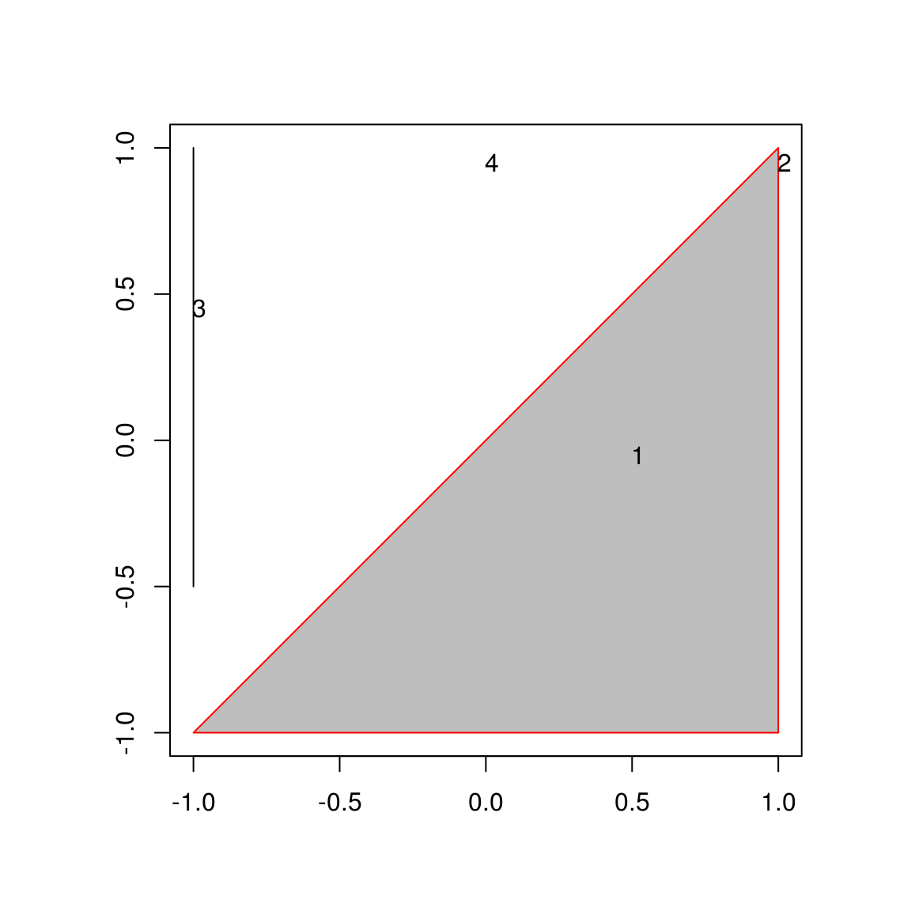
<p class="caption">(\#fig:relation-objects)Points (p 1 to 4), line and polygon objects arranged to demonstrate spatial relations.</p>
</div>

A simple query is: which of the points in `p` intersect in some way with polygon `a`?
The question can be answered by inspection (points 1 and 2 are over or touch the triangle).
It can also be answered by using the topological relation *intersects*, implemented in **sf** as follows:


```r
st_intersects(p, a)
#> Sparse geometry binary predicate list of length 4, where the predicate was `intersects'
#>  1: 1
#>  2: 1
#>  3: (empty)
#>  4: (empty)
```

The contents of the result should be as you expected:
the function returns a positive (`1`) result for the first two points, and a negative result (represented by an empty vector) for the last two.
What may be unexpected is that the result comes in the form of a list of vectors.
This *sparse matrix* output only registers a relation if one exists, reducing the memory requirements of topological operations on multi-feature objects.
As we saw in the previous section a *dense matrix* consisting of `TRUE` or `FALSE` values for each combination of features can also be returned when `sparse = FALSE`:


```r
st_intersects(p, a, sparse = FALSE)
#>       [,1]
#> [1,]  TRUE
#> [2,]  TRUE
#> [3,] FALSE
#> [4,] FALSE
```

The output is a matrix in which each row represents a feature in the target object and each column represents a feature in the selecting object.
In this case only the first two features in `p` intersect with `a` and there is only one feature in `a` so the result has only one column.
The result can be used for subsetting as we saw in section \@ref(spatial-subsetting).

Note that `st_intersects()` returns `TRUE` for the second feature in the object `p` even though it just touches the polygon `a`: *intersects* is a 'catch-all' topological operation which identifies many types of spatial relation.

The opposite of `st_intersects()` is `st_disjoint()`, which returns only objects that do not spatially relate in any way to the selecting object (note `[, 1]` converts the result into a vector):


```r
st_disjoint(p, a, sparse = FALSE)[, 1]
#> [1] FALSE FALSE  TRUE  TRUE
```

`st_within()` returns `TRUE` only for objects that are completely within the selecting object.
This applies only to the first object, which is inside the triangular polygon, as illustrated below:


```r
st_within(p, a, sparse = FALSE)[, 1]
#> [1]  TRUE FALSE FALSE FALSE
```

Note that although the first point is *within* the triangle, it does not *touch* any part of its border.
For this reason `st_touches()` only returns `TRUE` for the second point:


```r
st_touches(p, a, sparse = FALSE)[, 1]
#> [1] FALSE  TRUE FALSE FALSE
```

What about features that do not touch, but *almost touch* the selection object?
These can be selected using `st_is_within_distance()`, which has an additional `dist` argument.
It can be used to set how close target objects need to be before they are selected.
Note that although point 4 is one unit of distance from the nearest node of `a` (at point 2 in Figure \@ref(fig:relation-objects)), it is still selected when the distance is set to 0.9.
This is illustrated in the code chunk below, the second line of which converts the lengthy list output into a `logical` object:


```r
sel = st_is_within_distance(p, a, dist = 0.9) # can only return a sparse matrix
lengths(sel) > 0
#> [1]  TRUE  TRUE FALSE  TRUE
```


\BeginKnitrBlock{rmdnote}<div class="rmdnote">Functions for calculating topological relations use spatial indices to largely speed up spatial query performance.
They achieve that using the Sort-Tile-Recursive (STR) algorithm.
The `st_join` function, mentioned in the next section, also uses the spatial indexing. 
You can learn more at https://www.r-spatial.org/r/2017/06/22/spatial-index.html.</div>\EndKnitrBlock{rmdnote}


<!-- Equals: -->
<!-- https://postgis.net/docs/ST_Equals.html -->

<!-- ```{r, eval=FALSE} -->
<!-- st_equals(a, b, sparse = FALSE) -->
<!-- ``` -->

<!-- Contains: -->
<!-- https://postgis.net/docs/ST_Contains.html -->
<!-- https://postgis.net/docs/ST_ContainsProperly.html -->

<!-- ```{r, eval=FALSE} -->
<!-- st_contains(a, b, sparse = FALSE) -->
<!-- st_contains_properly(a, b, sparse = FALSE) -->
<!-- ``` -->

<!-- Covers: -->
<!-- https://postgis.net/docs/ST_Covers.html -->
<!-- https://postgis.net/docs/ST_CoveredBy.html -->

<!-- ```{r, eval=FALSE} -->
<!-- st_covers(a, b, sparse = FALSE) -->
<!-- st_covered_by(a, b, sparse = FALSE) -->
<!-- ``` -->

<!-- Within: -->
<!-- https://postgis.net/docs/ST_Within.html -->

<!-- ```{r, eval=FALSE} -->
<!-- st_within(a, b, sparse = FALSE) -->
<!-- ``` -->

<!-- Overlaps: -->
<!-- https://postgis.net/docs/ST_Overlaps.html -->

<!-- ```{r, eval=FALSE} -->
<!-- st_overlaps(a, b, sparse = FALSE) -->
<!-- ``` -->

<!-- Intersects: -->
<!-- https://postgis.net/docs/ST_Intersects.html -->

<!-- ```{r, eval=FALSE} -->
<!-- st_intersects(a, b, sparse = FALSE) -->
<!-- ``` -->

<!-- Disjoint: -->
<!-- https://postgis.net/docs/ST_Disjoint.html -->

<!-- ```{r, eval=FALSE} -->
<!-- st_disjoint(a, b, sparse = FALSE) -->
<!-- ``` -->

<!-- Touches: -->
<!-- https://postgis.net/docs/ST_Touches.html -->

<!-- ```{r, eval=FALSE} -->
<!-- st_touches(a, b, sparse = FALSE) -->
<!-- ``` -->

<!-- Crosses: -->
<!-- https://postgis.net/docs/ST_Crosses.html -->

<!-- ```{r, eval=FALSE} -->
<!-- st_crosses(a, b, sparse = FALSE) -->
<!-- ``` -->

<!-- DE9-IM - https://en.wikipedia.org/wiki/DE-9IM -->
<!-- https://edzer.github.io/sfr/reference/st_relate.html -->

<!-- ```{r, eval=FALSE} -->
<!-- st_relate(a, b, sparse = FALSE) -->
<!-- ``` -->

<!-- examples (points/polygons) -->
<!-- examples (points/lines) -->
<!-- examples (lines/polygons) -->

<!-- TODO? create a series of polygons distributed evenly over the surface of the Earth and clip them. -->
<!-- set.seed(2018) -->
<!-- blob_points = st_sample(x = world, size = 2) -->
<!-- blobs = st_buffer(x = blob_points, dist = 1) -->
<!-- plot(blobs) -->

### Spatial joining 

Joining two non-spatial datasets relies on a shared 'key' variable, as described in section \@ref(vector-attribute-joining).
Spatial data joining applies the same concept, but instead relies on shared areas of geographic space (it is also know as spatial overlay).
As with attribute data, joining adds a new column to the target object (the argument `x` in joining functions), from a source object (`y`).

The process can be illustrated by an example.
Imagine you have 10 points randomly distributed across the Earth's surface.
Of the points that are on land, which countries are they in?
Random points to demonstrate spatial joining are created as follows:


```r
set.seed(2018) # set seed for reproducibility
(bb_world = st_bbox(world)) # the world's bounds
#>   xmin   ymin   xmax   ymax 
#> -180.0  -90.0  180.0   83.6
random_df = tibble(
  x = runif(n = 10, min = bb_world[1], max = bb_world[3]),
  y = runif(n = 10, min = bb_world[2], max = bb_world[4])
)
random_points = random_df %>% 
  st_as_sf(coords = c("x", "y")) %>% # set coordinates
  st_set_crs(4326) # set geographic CRS
```

<!-- This may seem a trivial question but if you consider being placed somewhere at random it would surely take some time to discover where you were and you'd probably have to ask someone. **comment - removed as it's too long-winded (RL)** -->
The scenario is illustrated in Figure \@ref(fig:spatial-join).
The `random_points` object (left) has no attribute data, while the `world` (middle) does.
The spatial join operation is done by `st_join()`, which adds the `name_long` variable to the points, resulting in `random_joined` which is illustrated in Figure \@ref(fig:spatial-join) (right --- see [`04-spatial-join.R`](https://github.com/Robinlovelace/geocompr/blob/master/code/04-spatial-join.R)).


```r
world$name_long = as.character(world$name_long)
world_random = world[random_points, ]
random_joined = st_join(random_points, world["name_long"])
```

<div class="figure" style="text-align: center">
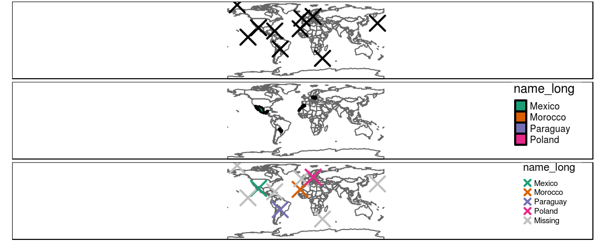
<p class="caption">(\#fig:spatial-join)Illustration of a spatial join. A new attribute variable is added to random points (top left) from source world object (top right) resulting the data represented in the final panel.</p>
</div>

By default, `st_join()` performs a left join (see section \@ref(vector-attribute-joining)), but it can also do inner joins by setting the argument `left = FALSE`.
Like spatial subsetting, the default topological operator used by `st_join()` is `st_intersects()`.
This can be changed with the `join` argument (see `?st_join` for details).
In the example above, we have added features of a polygon layer to a point layer.
In other cases, we might want to join point attributes to a polygon layer.
There might be occassions where more than one point falls inside one polygon. 
In such a case `st_join()` duplicates the polygon feature, i.e. adds a new row to the polygon layer, for each multiple match.

### Non-overlapping joins

Sometimes two geographic datasets do not touch but still have a strong geographic relationship enabling joins.
The datasets `cycle_hire` and `cycle_hire_osm`, already attached in the **spData** package, provide a good example.
Plotting them shows that they are often closely related but they do not touch, as shown in Figure \@ref(fig:cycle-hire), a base version of which is created with the following code below:


```r
plot(st_geometry(cycle_hire), col = "blue")
plot(st_geometry(cycle_hire_osm), add = TRUE, pch = 3, col = "red")
```

We can check if any points are the same `st_intersects()` as shown below:


```r
any(st_touches(cycle_hire, cycle_hire_osm, sparse = FALSE))
#> [1] FALSE
```


<div class="figure" style="text-align: center">
preservecbb19aad056d7028
<p class="caption">(\#fig:cycle-hire)The spatial distribution of cycle hire points in London based on official data (blue) and OpenStreetMap data (red).</p>
</div>

Imagine that we need to join the `capacity` variable in `cycle_hire_osm` onto the official 'target' data contained in `cycle_hire`.
This is when a non-overlapping join is needed.
The simplest method is to use the topological operator `st_is_within_distance()` shown in section \@ref(topological-relations), using a threshold distance of 20 m.
Note that before performing the relation both datasets must be transformed into a projected CRS, saved as new objects denoted by the affix `P` (for projected) below:


```r
cycle_hire_P = st_transform(cycle_hire, 27700)
cycle_hire_osm_P = st_transform(cycle_hire_osm, 27700)
sel = st_is_within_distance(cycle_hire_P, cycle_hire_osm_P, dist = 20)
summary(lengths(sel) > 0)
#>    Mode   FALSE    TRUE 
#> logical     304     438
```

This shows that there are 438 points in the target object `cycle_hire_P` within the threshold distance of `cycle_hire_osm_P`.
How to retrieve the *values* associated with the respective `cycle_hire_osm_P` points?
The solution is again with `st_join()`, but with an addition `dist` argument (set to 20 m below):


```r
z = st_join(cycle_hire_P, cycle_hire_osm_P, st_is_within_distance, dist = 20)
nrow(cycle_hire)
#> [1] 742
nrow(z)
#> [1] 762
```

Note that the number of rows in the joined result is greater than the target.
This is because some cycle hire stations in `cycle_hire_P` have multiple matches in `cycle_hire_osm_P`.
To aggregate the values for the overlapping points and return the mean, we can use the aggregation methods learned in Chapter \@ref(attr), resulting in an object with the same number of rows as the target:


```r
z = z %>% 
  group_by(id) %>% 
  summarize(capacity = mean(capacity))
nrow(z) == nrow(cycle_hire)
#> [1] TRUE
```

The capacity of nearby stations can be verified by comparing a plot of the capacity of the source `cycle_hire_osm` data with the results in this new object (plots not shown):


```r
plot(cycle_hire_osm["capacity"])
plot(z["capacity"])
```

<!-- Nearest neighbour analysis -->
<!-- e.g. two point's datasets (non-overlapping) -->
<!-- e.g. two point's datasets (overlapping) -->
<!-- ? topological problems of joining lines/polygons? -->
<!-- joining different types (e.g. points + polygons = geometry) -> save as GPKG? -->
<!-- `merge()`; `st_interpolate_aw()` -->

The result of this join has used a spatial operation to change the attribute data associated with simple features but the geometry associated with each feature has remained unchanged.

### Spatial data aggregation {#spatial-aggr}

Like attribute data aggregation, covered in section \@ref(vector-attribute-aggregation), spatial data aggregation can be a way of *condensing* data.
Aggregated data show some statistics about a variable (typically average or total) in relation to some kind of *grouping variable*.
Section \@ref(vector-attribute-aggregation) demonstrated how `aggregate()` and `group_by() %>% summarize()` condense data based on attribute variables.
This section demonstrates how the same functions work using spatial grouping variables.

Returning to the example of New Zealand, imagine you want to find out the average height of high points in each region.
This is a good example of spatial aggregation: it is the geometry of the source (`y` or `nz` in this case) that defines how values in the target object (`x` or `nz_height`) are grouped.
This is illustrated using the base `aggregate()` function below:


```r
nz_avheight = aggregate(x = nz_height, nz, FUN = mean)
```

The result of the previous command is an `sf` object with the same geometry as the (spatial) aggregating object (`nz`).^[
This can be verified with `identical(st_geometry(nz), st_geometry(nz_avheight))`.
]
The result of the previous operation is illustrated in Figure \@ref(fig:spatial-aggregation).
The same result can also be generated using the 'tidy' functions `group_by()` and `summarize()` (used in combination with `st_join()`):


```
#> Some legend labels were too wide. These labels have been resized to 0.62, 0.62, 0.62, 0.62. Increase legend.width (argument of tm_layout) to make the legend wider and therefore the labels larger.
```

<div class="figure" style="text-align: center">

<p class="caption">(\#fig:spatial-aggregation)Average height of the top 101 high points across the regions of New Zealand.</p>
</div>


```r
nz_avheight2 = nz %>%
  st_join(nz_height) %>%
  group_by(Name) %>%
  summarize(elevation = mean(elevation, na.rm = TRUE))
```

The resulting `nz_avheight` objects have the same geometry as the aggregating object `nz` but with a new column representing the mean average height of points within each region of New Zealand (other summary functions such as `median()` and `sd()` can be used in place of `mean()`).
Note that regions containing no points have an associated `elevation` value of `NA`.
For aggregating operations which also create new geometries, see section \@ref(geometry-unions).

Spatial congruence is an important concept related to spatial aggregation.
An *aggregating object* (which we will refer to as `y`) is *congruent* with the target object (`x`) if the two objects have shared borders.
Often this is the case for administrative boundary data, whereby the larger units (e.g. Middle Layer Super Output Areas in the UK or districts in many other European countries) are composed of many smaller units (Output Areas in the UK, see [ons.gov.uk](https://www.ons.gov.uk/methodology/geography/ukgeographies/censusgeography) for further details or municipalities in many other European countries).

*Incongruent* aggregating objects, by contrast, do not share common borders with the target [@qiu_development_2012].
This is problematic for spatial aggregation (and other spatial operations) illustrated in Figure \@ref(fig:areal-example).
Areal interpolation can help to alleviate this issue.
It helps to transfer data from one set of areal units to another.
A number of algorithms have been developed for areal interpolation, including area weighted and pycnophylactic interpolation methods [@tobler_smooth_1979].

<div class="figure" style="text-align: center">
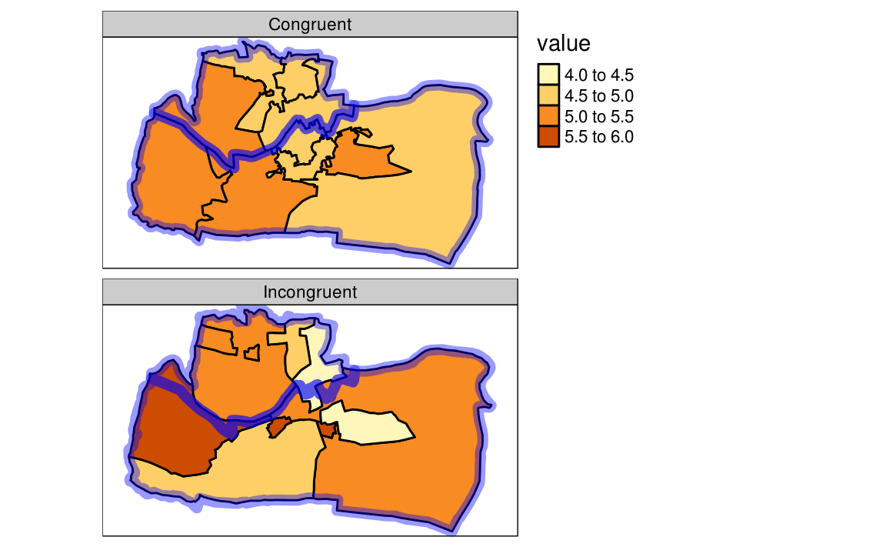
<p class="caption">(\#fig:areal-example)Illustration of congruent (left) and incongruent (right) areal units with respect to larger aggregating zones (translucent blue borders).</p>
</div>

The **spData** package contains a dataset named `incongruent` (colored polygons with black borders in the right panel of Figure \@ref(fig:areal-example)) and a dataset named aggregating_zones (the two polygons with the translucent blue border in the right panel of Figure \@ref(fig:areal-example)).
Let us assume that the `value` column of `incongruent` refers to the total regional income in million Euros.
How can we transfer the values of the underlying nine spatial polygons into the two polygons of `aggregating_zones`?
The simplest useful method for this is *area weighted* spatial interpolation.
In this case values from the `incongruent` object are allocated to the `aggregating_zones` in proportion to the area, i.e. the larger the spatial intersection  between input and output features, the larger the corresponding value. 
For instance, if one intersection of `incongruent` and `aggregating_zones` is 1.5 km^2^ but the whole incongruent polygon in question has 2 km^2^ and a total income of 4 million Euros, then the target aggregating zone will obtain three quarters of the income, in this case 3 million Euros.
This is implemented in `st_interpolate_aw()`, as demonstrated in the code chunk below.


```r
agg_aw = st_interpolate_aw(incongruent[, "value"], aggregating_zones, extensive = TRUE)
#> Warning in st_interpolate_aw(incongruent[, "value"], aggregating_zones, :
#> st_interpolate_aw assumes attributes are constant over areas of x
# show the aggregated result
agg_aw$value
#> [1] 19.6 25.7
```

In our case it is meaningful to sum up the values of the intersections falling into the aggregating zones since total income is a so-called spatially extensive variable.
This would be different for spatially intensive variables as for example income per head.
In this case it is more meaningful to apply an average function when doing the aggregation instead of a sum function.
To do so, one would only have to set the `extensive` parameter to `FALSE`.

<!-- - `aggregate.sf()` - aggregate an sf object, possibly union-ing geometries -->
<!-- - disaggregation?? `st_cast()` - https://github.com/edzer/sfr/wiki/migrating -->
<!-- - `group_by()` + `summarise()` - potential errors -->
<!-- - ? generalization **rmapsharper** - https://github.com/ateucher/rmapshaper -->
<!-- `st_union` -->

### Distance relations 

While topological relations are binary --- a feature either intersects with another or does not --- distance relations are continuous.
The distance between two objects is calculated with the `st_distance()` function.
This is illustrated in the code chunk below, which finds the distance between the highest point in New Zealand and the geographic centroid of the Canterbury region, created in section \@ref(spatial-subsetting):


```r
nz_heighest = nz_height %>% top_n(n = 1, wt = elevation)
canterbury_centroid = st_centroid(canterbury)
st_distance(nz_heighest, canterbury_centroid)
#> Units: m
#>        [,1]
#> [1,] 115540
```

There are two potentially surprising things about the result:

- It has `units`, telling us the distance is 100,000 meters, not 100,000 inches, or any other measure of distance.
- It is returned as a matrix, even though the result only contains a single value.

This second feature hints at another useful feature of `st_distance()`, its ability to return *distance matrices* between all combinations of features in objects `x` and `y`.
This is illustrated in the command below, which finds the distances between the first three features in `nz_height` and the Otago and Canterbury regions of New Zealand represented by the object `co`.


```r
co = filter(nz, grepl("Canter|Otag", Name))
st_distance(nz_height[1:3, ], co)
#> Units: m
#>        [,1]  [,2]
#> [1,] 123537 15498
#> [2,]  94283     0
#> [3,]  93019     0
```

Note that the distance between the second and third feature in `nz_height` and the second feature in `co` is zero.
This demonstrates the fact that distances between points and polygons refer to the distance to *any part of the polygon*:
The second and third points in `nz_height` are *in* Otago, which can be verified by plotting them (result not shown):


```r
plot(st_geometry(co)[2])
plot(st_geometry(nz_height)[2:3], add = TRUE)
```

## Spatial operations on raster data {#spatial-ras}

This section builds on section \@ref(manipulating-raster-objects), which highlights various basic methods for manipulating raster datasets, to demonstrate more advanced and explicitly spatial raster operations, and uses the objects `elev` and `grain` manually created in section \@ref(manipulating-raster-objects).
For the reader's convenience, these datasets can be also found in the **spData** package.

### Spatial subsetting {#spatial-raster-subsetting}

The previous chapter (section \@ref(manipulating-raster-objects)) demonstrated how to subset raster datasets using cell IDs.
Raster cell values can also be extracted by location (coordinates) and other spatial objects.
To use coordinates for subsetting, one can 'translate' the coordinates into a cell ID with the **raster** function `cellFromXY()`.
An alternative is to use `raster::extract()` (be careful, there is also a function called `extract()` in the **tidyverse**) to extract values.
Both methods are demonstrated below to find the value of the cell that covers a point located 0.1 units from the origin.


```r
id = cellFromXY(elev, xy = c(0.1, 0.1))
elev[id]
# the same as
raster::extract(elev, data.frame(x = 0.1, y = 0.1))
```

It is convenient that both functions also accept objects of class `Spatial* Objects`.
Raster objects can also be subset with another raster object, as illustrated in Figure \@ref(fig:raster-subset) (left panel) and demonstrated in the code chunk below:


```r
clip = raster(nrow = 3, ncol = 3, res = 0.3, xmn = 0.9, xmx = 1.8, 
              ymn = -0.45, ymx = 0.45, vals = rep(1, 9))
elev[clip]
#> [1] 18 24
# we can also use extract
# extract(elev, extent(clip))
```

Basically, this amounts to retrieving the values of the first raster (here: `elev`) falling within the extent of a second raster (here: `clip`).

<div class="figure" style="text-align: center">

<p class="caption">(\#fig:raster-subset)Subsetting raster values with the help of another raster (left). Raster mask (middle). Output of masking a raster (right).</p>
</div>

Another typical use case is having two rasters with the same extent and resolution where one raster object serves as a mask (Figure \@ref(fig:raster-subset) middle and right panel).
In these case, we can use `[` or the `mask()` and `overlay()` commands:


```r
rmask = raster(nrow = 6, ncol = 6, res = 0.5, 
               xmn = -1.5, xmx = 1.5, ymn = -1.5, ymx = 1.5,
               vals = sample(c(FALSE, TRUE), 36, replace = TRUE))
elev[rmask, drop = FALSE]
# using the mask command
mask(elev, rmask, maskvalue = TRUE)

# or using overlay
# first we replace FALSE by NA
rmask[!rmask] = NA
# then we retrieve the maximum values
overlay(elev, rmask, fun = "max")
```

In the code chunk above, we have created a mask object called `rmask` randomly setting its values to `FALSE` and `TRUE`.
Next we only want to keep those values of `elev` which are `TRUE` in `rmask`, or expressed differently, we want to mask `elev` with `rmask`.
These operations are in fact Boolean local operations since we compare cell-wise two rasters.
The next subsection explores these and related operations in more detail.

### Map algebra

Map algebra makes raster processing really fast.
This is because raster datasets only implicitly store coordinates.
To derive the coordinate of a specific cell, we have to calculate it using its matrix position and the raster resolution and origin.
For the processing, however, the geographic position of a cell is barely relevant as long as we make sure that the cell position is still the same after the processing (one-to-one locational correspondence).
Additionally, if two or more raster datasets share the same extent, projection and resolution, one could treat them as matrices for the processing.
This is exactly what map algebra is doing in R.
First, the **raster** package checks the headers of the rasters on which to perform any algebraic operation, and only if they are correspondent to each other, the processing goes on.^[
Map algebra operations are also possible with headerless rasters but in this case the user has to make sure that in fact there exists a one-to-one locational correspondence.
An example showing how to import a headerless raster into R is provided in a post at https://stat.ethz.ch/pipermail/r-sig-geo/2013-May/018278.html.
]
And secondly, map algebra retains the so-called one-to-one locational correspondence.
This is where it substantially differs from matrix algebra which changes positions when for example multiplying or dividing matrices.

Map algebra (or cartographic modeling) divides raster operations into four subclasses [@tomlin_geographic_1990], with each of them either working on one or several grids simultaneously:

1. *Local* or per-cell operations.
2. *Focal* or neighborhood operations.
Most often the output cell value is the result of a 3 x 3 input cell block.
3. *Zonal* operations are similar to focal operations but instead of a predefined neighborhood, classes, which can take on any, i.e. also an irregular size and shape, are the basis for calculations.
<!-- sentence structure could be confusing in the sentence above -->
4. *Global* or per-raster operations, that means the output cell derives its value potentially from one or several entire rasters.

This classification scheme uses basically the number of cells involved in a processing step as distinguishing feature.
For the sake of completeness, we should mention that raster operations can also be classified by discipline such as terrain, hydrological analysis or image classification.
The following sections explain how each type of map algebra operations can be used, with reference to worked examples (also see `vignette("Raster")` for a technical description of map algebra).

### Local operations

**Local** operations comprise all cell-by-cell operations in one or several layers.
A good example is the classification of intervals of numeric values into groups such as grouping a digital elevation model into low (class 1), middle (class 2) and high elevations (class 3).
Using the `reclassify()` command, we need first to construct a reclassification matrix, where the first column corresponds to the lower and the second column to the upper end of the class.
The third column represents the new value for the specified ranges in column one and two.
Here, we assign the raster values in the ranges 0--12, 12--24 and 24--36 are *reclassified* to take values 1, 2 and 3, respectively.


```r
rcl = matrix(c(0, 12, 1, 12, 24, 2, 24, 36, 3), ncol = 3, byrow = TRUE)
recl = reclassify(elev, rcl = rcl)
```

We will perform several reclassifactions in chapter \@ref(location).

Raster algebra is another classical use case of local operations.
This includes adding, subtracting and squaring two rasters.
Raster algebra also allows logical operations such as finding all raster cells that are greater than a specific value (5 in our example below).
The **raster** package supports all these operations and more, as described in `vignette("Raster")` and demonstrated below (results not show):


```r
elev + elev
elev^2
log(elev)
elev > 5
```

Instead of arithmetic operators, one can also use the `calc()` and `overlay()` functions.
These functions are more efficient, hence, they are preferable in the presence of large raster datasets. 
Additionally, they allow you to directly store an output file.

The calculation of the normalized difference vegetation index (NDVI) is one of the most famous local, i.e. pixel-by-pixel, raster operations.
It ranges between - 1 and 1 with positive values indicating the presence of living plants (mostly > 0.2).
To calculate the NDVI, one uses the red and near-infrared bands of remotely sensed imagery (e.g. Landsat or Sentinel imagery) exploiting the fact that vegetation absorbs light heavily in the visible light spectrum, and especially in the red channel, while reflecting it in the near-infrared spectrum.

$$
\begin{split}
NDVI&= \frac{\text{NIR} - \text{Red}}{\text{NIR} + \text{Red}}\\
\end{split}
$$
where NIR refers to the near infrared channel and Red to the red channel.

Predictive mapping is another interesting application of local raster operations.
The response variable corresponds to measured or observed points in space, for example, species richness, the presence of landslides, tree disease or crop yield.
Consequently, we can easily retrieve space- or airborne predictor variables from various rasters (elevation, pH, precipitation, temperature, landcover, soil class, etc.).
Subsequently, we model our response as a function of our predictors using `lm`, `glm`, `gam` or a machine-learning technique. 
To make a spatial prediction, all we have to do, is to apply the estimated coefficients to the predictor rasters, and summing up the resulting output rasters (<!--Chapter ??; -->see also @muenchow_predictive_2013).
<!-- add reference to chapter ecological modeling -->

### Focal operations

While local functions operate on one cell, though possibly from multiple layers, **focal** operations take into account a central cell and its neighbors.
The neighborhood (also named kernel, filter or moving window) under consideration is typically of size 3-by-3 cells (that is the central cell and its eight surrounding neighbors) but can take on any other (not necessarily rectangular) shape as defined by the user.
A focal operation applies an aggregation function to all cells within the specified neighborhood, uses the corresponding output as the new value for the the central cell, and moves on to the next central cell (Figure \@ref(fig:focal-example)).
Other names for this operation are spatial filtering and convolution [@burrough_principles_2015].

In R, we can use the `focal()` function to perform spatial filtering. 
We define the shape of the moving window with a `matrix` whose values correspond to weights (see `w` parameter in the code chunk below).
Secondly, the `fun` parameter lets us specify the function we wish to apply to this neighborhood.
Here, we choose the minimum, but any other summary function, including `sum()`, `mean()`, or `var()` can be used.


```r
r_focal = focal(elev, w = matrix(1, nrow = 3, ncol = 3), fun = min)
```

<div class="figure" style="text-align: center">

<p class="caption">(\#fig:focal-example)Input raster (left) and resulting output raster (right) due to a focal operation - summing up 3-by-3 windows.</p>
</div>

We can quickly check if the output meets our expectations.
In our example, the minimum value has to be always the upper left corner of the moving window (remember we have created the input raster by rowwise incrementing the cell values by one starting at the upper left corner).
In this example, the weighting matrix consists only of 1s, meaning each cell has the same weight on the output, but this can be changed.

Focal functions or filters play a dominant role in image processing.
Low-pass or smoothing filters use the mean function to remove extremes.
In the case of categorical data, we can replace the mean with the mode, which is the most common value.
By contrast, high-pass filters accentuate features.
The line detection Laplace and Sobel filters might serve as an example here.
Check the `focal()` help page for how to use them in R (this will also be used in the excercises at the end of this chapter).

Also, terrain processing uses heavily focal functions.
Think, for instance, of the calculation of the slope, aspect and flow directions.
The `terrain()` function lets you compute a few of these terrain characteristics but has not implemented all popular methods.
For example, the Zevenbergen and Thorne method to compute the slope is missing.
Equally, many other terrain and GIS functions are **not** implemented in R such as curvatures, contributing areas, different wetness indexes, and many more.
Fortunately, desktop GIS commonly provide these algorithms.
In Chapter \@ref(gis) we will learn how to access GIS functionality from within R.

### Zonal operations

*Zonal* operations are similar to focal operations.
The difference is that zonal filters can take on any shape instead of just a predefined window.
Our grain size raster is a good example (Figure \@ref(fig:cont-raster)) because the different grain sizes are spread in an irregular fashion throughout the raster.

To find the mean elevation for each grain size class, we can use the `zonal()` command.
This kind of operation is also known as *zonal statistics* in the GIS world. 


```r
z = zonal(elev, grain, fun = "mean") %>%
  as.data.frame
z
#>   zone mean
#> 1    1 17.8
#> 2    2 18.5
#> 3    3 19.2
```

This returns the statistics for each category, here the mean altitude for each grain size class, and can be added to the attribute table of the ratified raster (see previous chapter).

### Global operations and distances

*Global* operations are a special case of zonal operations with the entire raster dataset representing a single zone.
The most common global operations are descriptive statistics for the entire raster dataset such as the minimum or maximum (see section \@ref(summarizing-raster-objects)).
Aside from that, global operations are also useful for the computation of distance and weight rasters.
In the first case, one can calculate the distance from each cell to a specific target cell.
For example, one might want to compute the distance to the nearest coast (see also `raster::distance()`).
We might also want to consider topography, that means, we are not only interested in the pure distance but would like also to avoid the crossing of mountain ranges when going to the coast.
To do so, we can weight the distance with elevation so that each additional altitudinal meter 'prolongs' the euclidean distance.
Visibility and viewshed computations also belong to the family of global operations (in the exercises of Chapter \@ref(gis) you will compute a viewshed raster).

Many map algebra operations have a counterpart in vector processing [@liu_essential_2009].
Computing a distance raster (zonal operation) while only considering a maximum distance (logical focal operation) is the equivalent to a vector buffer operation (section \@ref(clipping)).
Reclassifying raster data (either local or zonal function depending on the input) is equivalent to dissolving vector data (section \@ref(spatial-joining)). 
Overlaying two rasters (local operation), where one contains `NULL` or `NA` values representing a mask, is similar to vector clipping (section \@ref(clipping)).
Quite similar to spatial clipping is intersecting two layers (section \@ref(spatial-subsetting)). 
The difference is that these two layers (vector or raster) simply share an overlapping area (see Figure \@ref(fig:venn-clip) for an example).
However, be careful with the wording.
Sometimes the same words have slightly different meanings for raster and vector data models.
Aggregating in the case of vector data refers to dissolving polygons while it means increasing the resolution in the case of raster data.
In fact, one could see dissolving or aggregating polygons as decreasing the resolution. 
However, zonal operations might be the better raster equivalent compared to changing the cell resolution. 
Zonal operations can dissolve the cells of one raster in accordance with the zones (categories) of another raster using an aggregation function (see above).

### Merging rasters

Suppose we would like to compute the NDVI (see section \@ref(local-operations)), and additionally want to compute terrain attributes from elevation data for observations within a study area.
Before such computations we would have to acquire airborne or remotely sensed information.
The corresponding imagery is often divided into scenes covering a specific spatial extent.
Frequently, a study area covers more than one scene.
In these cases we would like to merge the scenes covered by our study area. 
In the easiest case, we can just merge these scenes, that is put them side to side.
This is possible with digital elevation data (SRTM, ASTER).
In the following code chunk we first download the SRTM elevation data for Austria and Switzerland (for the country codes have a look at `ccodes()`).
In a second step, we merge the two rasters into one.


```r
aut = getData("alt", country = "AUT", mask = TRUE)
ch = getData("alt", country = "CHE", mask = TRUE)
aut_ch = merge(aut, ch)
```

**Raster**'s `merge()` command combines two images, and in case they overlap, it uses the value of the first raster.
You can do exactly the same with `gdalUtils::mosaic_rasters()` which is faster, and therefore recommended if you have to merge a multitude of large rasters stored on disk.

The merging approach is of little use when the overlapping values do not correspond to each other.
This is frequently the case when you want to combine spectral imagery from scenes that were taken on different dates.
The `merge()` command will still work but you will see a clear border in the resulting image.
The `mosaic()` command lets you define a function for the overlapping area. 
For instance, we could compute the mean value. 
This might smooth the clear border in the merged result but it will most likely not make it disappear.
To do so, we need a more advanced approach. 
Remote sensing scientists frequently apply histogram matching or use regression techniques to align the values of the first image with those of the second image.
The packages **landsat** (`histmatch()`, `relnorm()`, `PIF()`), **satellite** (`calcHistMatch()`) and **RStoolbox** (`histMatch()`, `pifMatch()`) provide the corresponding functions.

<!-- ## Spatial data creation -->

<!-- where should "area" example be? in this or the previous chapter? -->
<!-- Not here - I think this chapter should focus on geomtry data -->
<!-- `st_centroid()` -->
<!-- `st_buffer()` -->
<!-- http://r-spatial.org//r/2017/06/09/mapedit_0-2-0.html -->

<!-- Commented out - think this would be better in c3 (RL) -->
<!-- ```{r} -->
<!-- # add a new column -->
<!-- africa$area = set_units(st_area(africa), value = km^2) -->
<!-- africa$pop_density = africa$pop / africa$area -->

<!-- # OR -->
<!-- africa = africa %>% -->
<!--         mutate(area = set_units(st_area(.), value = km^2)) %>% -->
<!--         mutate(pop_density = pop / area) -->
<!-- ``` -->

<!-- Note that this has created a attributes for the area and population density variables: -->

<!-- ```{r} -->
<!-- attributes(africa$area) -->
<!-- attributes(africa$pop_density) -->
<!-- ``` -->

<!-- These can be set to `NULL` as follows: -->

<!-- ```{r} -->
<!-- attributes(africa$area) = NULL -->
<!-- attributes(africa$pop_density) = NULL -->
<!-- ``` -->

<!-- ## Spatial data transformation -->
<!-- changes classes; polygonize, etc-->

## Exercises
<!-- vector exercises -->
1. It was established in section \@ref(spatial-vec) that Canterbury was the region of New Zealand containing most of 100 highest points in the country. How many of these high points does Canterbury Region contain?

1. Which region has the second highest number of `nz_height` points in, and how many does it have?

1. Generalizing the question to all regions: how many of New Zealand's 16 regions contain points which belong to the top 100 highest points in the country? Which regions?
    - Bonus: create a table listing these regions in order of the number of points and their name.
<!-- Raster exercises-->
1. Use `data(dem, package = "RQGIS")`, and reclassify the elevation in three classes: low, middle and high.
Secondly, compute the NDVI (`data(ndvi, package = "RQGIS")`) and the mean elevation for each altitudinal class.
1. Apply a line detection filter to `data(dem, package = "RQGIS")`.
1. Calculate the NDVI of a Landsat image. 
Use the Landsat image provided by the **spDataLarge** package (`system.file("raster/landsat.tif", package="spDataLarge")`).
1. This [post](https://stackoverflow.com/questions/35555709/global-raster-of-geographic-distances) shows how to compute distances to the nearest coastline using `raster::distance()`.
Retrieve a digital elevation model of Spain, and compute a raster which represents the distance to the coast.
(Hint: Have a look at `getData()` to retrieve a digital elevation model and administrative boundaries for Spain.)
Before computing the distance raster, you might want to increase the resolution of the input dem raster, otherwise computing time might become too long. 
Secondly, weight the distance raster with elevation.
Every 100 altitudinal meters should increase the distance to the coast by 10 km.
Finally, compute the difference between the raster using the euclidean distance and the raster weighted by elevation.
(Note that this is a very simple weighting approach.
A more advanced approach might instead weight by flow direction, i.e. favor the steepest drop or the slightest increase in elevation.)

<!--chapter:end:04-spatial-operations.Rmd-->


# Geometric operations

## Prerequisites {-}

- This chapter uses the same packages as Chapter \@ref(spatial-operations) but with the addition of **spDataLarge**, which was installed in Chapter \@ref(spatial-class):


```r
library(sf)
library(raster)
library(tidyverse)
library(spData)
library(spDataLarge)
```

## Introduction

The previous three chapters have demonstrated how geographic datasets are structured in R (Chapter \@ref(spatial-class)) and how to manipulate them based on their non-geographic attributes (Chapter \@ref(attr)) and spatial properties (Chapter \@ref(spatial-operations)).
This chapter extends these skills.
After reading it --- and attempting the exercises at the end --- you should understand and have control over the geometry column in `sf` objects and the geographic location of pixels represented in rasters.

Section \@ref(geo-vec) covers transforming vector geometries with 'unary' and 'binary' operations.
<!-- TODO: add something on n-ary ops (RL) -->
Unary operations work on a single geometry in isolation.
This includes simplification (of lines and polygons), the creation of buffers and centroids, and shifting/scaling/rotating single geometries using 'affine transformations' (sections \@ref(simplification) to \@ref(affine-transformations)).
Binary transformations modify one geometry based on the shape of another.
This includes clipping and geometry unions, covered in sections \@ref(clipping) and \@ref(geometry-unions) respectively.
Type transformations (from a polygon to a line, for example) are demonstrated in section \@ref(type-trans).

Section \@ref(geo-ras) covers geometric transformations on raster objects.
This involves changing the size and number of the underlying pixels, and assigning them new values.
It teaches how to change the resolution (also called raster aggregation and dis-aggregation), the extent and the origin of a raster.
These operations are especially useful if one would like to align raster datasets from diverse sources.
Aligned raster objects share a one-to-one correspondence between pixels, allowing them to be processed using map algebra operations, described in section \@ref(map-algebra). 

Section \@ref(raster-vector) connects vector and raster objects. 
It includes raster cropping and masking based on vector data location, raster values extraction using vector objects, and raster-vector conversions.

## Geometric operations on vector data {#geo-vec}

This section is about operations that in some way change the geometry of vector (`sf`) objects.
It is more advanced than the spatial data operations presented in the previous chapter (in section \@ref(spatial-vec)) because here we drill down into the geometry:
the functions discussed in this section work on objects of class `sfc` in addition to objects of class `sf`.

### Simplification

Simplification is a process for generalization of vector objects (lines and polygons) usually for use in smaller scale maps.
Another reason for simplifying objects is to reduce the amount of memory, disk space and network bandwidth they consume:
it may be wise to simplify complex geometries before publishing them as interactive maps. 
The **sf** package provides `st_simplify()`, which uses the GEOS implementation of the Douglas-Peucker algorithm to reduce the vertex count.
`st_simplify()` uses the `dTolerance` to control the level of generalization in map units [see @douglas_algorithms_1973 for details].
<!-- I have no idea what the next sentence means -->
<!-- As a result, all vertices in the simplified geometry will be within this value from the original ones. -->
Figure \@ref(fig:seine-simp) illustrates simplification of a `LINESTRING` geometry representing the river Seine and tributaries.
The simplified geometry was created by the following command:


```r
seine_simp = st_simplify(seine, dTolerance = 2000)  # 2000 m
```

<div class="figure" style="text-align: center">

<p class="caption">(\#fig:seine-simp)Comparison of the original and simplified `seine` geometry.</p>
</div>

The resulting `seine_simp` object is a copy of the original `seine` but with fewer vertices.
This is apparent, with the result being visually simpler (Figure \@ref(fig:seine-simp), right) and consuming less memory than the original object, as verified below:


```r
object.size(seine)
#> 17304 bytes
object.size(seine_simp)
#> 8320 bytes
```

Simplification is also applicable for polygons.
This is illustrated using `us_states`, representing the contiguous United States.
As we showed in section \@ref(reproj-geo-data), GEOS assumes that the data is in a projected CRS and this could lead to unexpected results when using a geographic CRS.
Therefore, the first step is to project the data into some adequate projected CRS, such as US National Atlas Equal Area (epsg = 2163) (on the left in Figure \@ref(fig:us-simp)):


```r
us_states2163 = st_transform(us_states, 2163)
```

`st_simplify()` works equally well with projected polygons:


```r
us_states_simp1 = st_simplify(us_states2163, dTolerance = 100000)  # 100 km
```

A limitation with `st_simplify()` is that it simplifies objects on a per-geometry basis.
This means the 'topology' is lost, resulting in overlapping and 'holy' areal units illustrated in Figure \@ref(fig:us-simp) (middle panel).
`ms_simplify()` from **rmapshaper** provides an alternative that overcomes this issue.
By default it uses the Visvalingam algorithm, which overcomes some limitations of the Douglas-Peucker algorithm [@visvalingam_line_1993].
<!-- https://bost.ocks.org/mike/simplify/ -->
The following code chunk uses this function to simplify `us_states2163`.
The result has only 1% of the vertices of the input (set using the argument `keep`) but its number of objects remains intact because we set `keep_shapes = TRUE`:^[
Simplification of multipolygon objects cane remove small internal polygons, even if the `keep_shapes` argument is set to TRUE. To prevent this, you need to set `explode = TRUE`. This option converts all mutlipolygons into separate polygons before its simplification.
]


```r
# proportion of points to retain (0-1; default 0.05)
us_states2163$AREA = as.numeric(us_states2163$AREA)    
us_states_simp2 = rmapshaper::ms_simplify(us_states2163, keep = 0.01,
                                          keep_shapes = TRUE)
```

Finally, the visual comparison of the original dataset and the two simplified versions shows differences between the Douglas-Peucker (`st_simplify`) and Visvalingam (`ms_simplify`) algorithm outputs (Figure \@ref(fig:us-simp)):

<div class="figure" style="text-align: center">
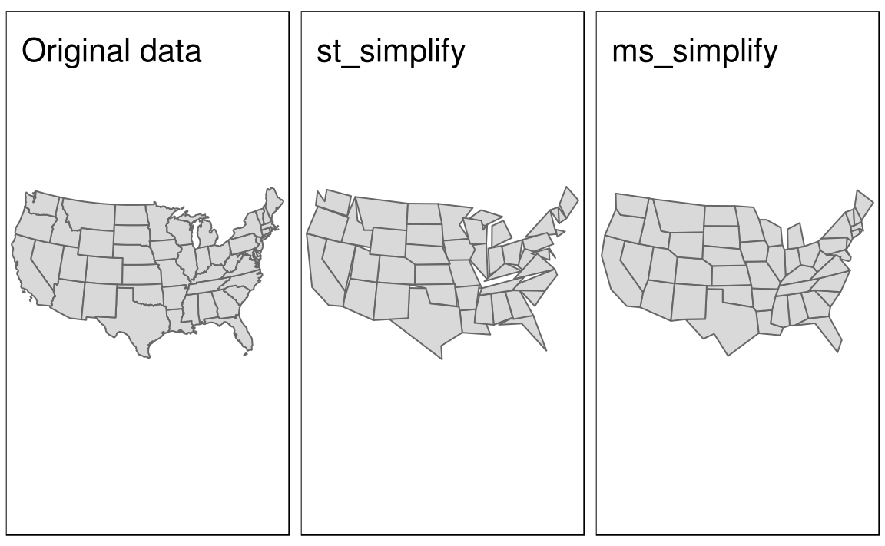
<p class="caption">(\#fig:us-simp)Polygon simplification in action, comparing the original geometry of the contiguous United States with simplified versions, generated with functions from **sf** (center) and **rmapshaper** (right) packages.</p>
</div>

### Centroids

Centroid operations identify the center of geographic objects.
Like statistical measures of central tendency (including mean and median definitions of 'average'), there are many ways to define the geographic center of an object.
All of create single point representations of more complex vector objects.

The most commonly used centroid operation is the *geographic centroid*.
This type of centroid operation (often referred to as 'the centroid') represents the center of mass in a spatial object (think of balancing a plate on your finger).
Geographic centroids have many uses, for example to create a simple point representation of complex geometries, or to estimate distances between polygons.
They can be calculated with the **sf** function `st_centroid()` as demonstrated in the code below, which generates the geographic centroids of regions in New Zealand and tributaries to the River Seine, illustrated with black points in Figure \@ref(fig:centr).


```r
nz_centroid = st_centroid(nz)
seine_centroid = st_centroid(seine)
```

Sometimes the geographic centroid falls outside the boundaries of their parent objects (think of a doughnut).
In such cases *point on surface* operations can be used to guarantee the point will be in the parent object (e.g. for labeling irregular multipolygon objects such as island states), as illustrated by the red points in Figure \@ref(fig:centr).
Notice that these red points always lie on their parent objects.
They were created with `st_point_on_surface()` as follows:^[
A description of how `st_point_on_surface()` works is provided at https://gis.stackexchange.com/q/76498.
]


```r
nz_pos = st_point_on_surface(nz)
seine_pos = st_point_on_surface(seine)
```

<div class="figure" style="text-align: center">

<p class="caption">(\#fig:centr)Centroids (black points) and 'points on surface' (red points) of New Zeleand's regions (left) and the Seine (right) datasets.</p>
</div>

Other types of centroid exist, including the *Chebyshev center* and the *visual center*.
We will not explore these here but it is possible to calculate them using R, as we'll see Chapter \@ref(algorithms).

### Buffers

Buffers are polygons representing the area within a given distance of a geometric feature:
regardless of whether the input is a point, line or polygon, the output is polygon.
Unlike simplification (which is often used for visualization and reducing file size) buffering tends to be used for geographic data analysis.
How many points are within a given distance of this line?
Which demographic groups are within travel distance of this new shop?
These kinds of questions can be answered and visualized by creating buffers around the geographic entities of interest.

Figure \@ref(fig:buffs) illustrates buffers of different sizes (5 and 20 km) surrounding the river Seine and tributaries.
These buffers were created with commands below, which show that the command `st_buffer()` requires at least two arguments: an input geometry and a distance, provided in the units of the CRS (in this case meters):


```r
seine_buff_5km = st_buffer(seine, dist = 5000)
seine_buff_50km = st_buffer(seine, dist = 50000)
```

<div class="figure" style="text-align: center">

<p class="caption">(\#fig:buffs)Buffers around the `seine` datasets of 5km (left) and 50km (right). Note the colors, which reflect the fact that one buffer is created per geometry feature.</p>
</div>

\BeginKnitrBlock{rmdnote}<div class="rmdnote">The third and final argument of `st_buffer()` is `nQuadSegs`, which means 'number of segments per quadrant' and is set by default to 30 (meaning circles created by buffers are composed of $4 \times 30 = 120$ lines).
This argument rarely needs be set.
Unusual cases where it may be useful include when the memory consumed by the output of a buffer operation is a major concern (in which case it should be reduced) or when very high precision is needed (in which case it should be increased).</div>\EndKnitrBlock{rmdnote}


### Affine transformations

Affine transformation is any transformation that preserves lines and parallelism.
<!-- The midpoint of a line segment remains a midpoint and all points lying on a line initially still lie on a line after an affine transformation. -->
However, angles or length are not necessarily preserved.
Affine transformations include, among others, shifting (translation), scaling and rotation.
<!-- translation, scaling, homothety, similarity transformation, reflection, rotation, shear mapping -->
Additionally, it is possible to use any combination of these.
Affine transformations are an essential part of geocomputation.
For example, shifting is needed for labels placement, scaling is used in non-contiguous area cartograms (see Section \@ref(other-mapping-packages)), and many affine transformations are applied when reprojecting or improving the geometry that was created based on a distorted or wrongly projected map.
The **sf** package implements affine transformation for objects of classes `sfg` and `sfc`.


```r
nz_sfc = st_geometry(nz)
```

Shifting moves every point by the same distance in map units.
It could be done by adding a numerical vector to a vector object.
For example, the code below shifts all y-coordinates by 100,000 meters to the north but leaves the x-coordinates untouched (left panel on the Fig. \@ref(fig:affine-trans)). 


```r
nz_shift = nz_sfc + c(0, 100000)
```

Scaling enlarges or shrinks objects by a factor.
It can be applied either globally or locally. <!-- my terms - jn-->
Global scaling increases or decreases all coordinates values in relation to the origin coordinates, while keeping all geometries topological relations intact.
It can by done by subtraction or multiplication of a`sfg` or `sfc` object.


Local scaling treats geometries independently and requires points around which geometries are going to be scaled, e.g. centroids.
In the example below, each geometry is shrunk by a factor of two around the centroids (central panel on the Fig. \@ref(fig:affine-trans)).
To achieve that, each object is firstly shifted in a way that its center has coordinates of `0, 0` (`(nz_sfc - nz_centroid_sfc)`). 
Next, the sizes of the geometries are reduced by half (`* 0.5`).
Finally, each object's centroid is moved back to the input data coordinates (`+ nz_centroid_sfc`). 


```r
nz_centroid_sfc = st_centroid(nz_sfc)
nz_scale = (nz_sfc - nz_centroid_sfc) * 0.5 + nz_centroid_sfc
```

Rotation of two-dimensional coordinates requires a rotation matrix:

$$
R =
\begin{bmatrix}
\cos \theta & -\sin \theta \\  
\sin \theta & \cos \theta \\
\end{bmatrix}
$$

It rotates points in a counterclockwise direction.
The rotation matrix could be implemented in R as:
<!-- https://r-spatial.github.io/sf/articles/sf3.html#affine-transformations -->

```r
rotation = function(a){
  r = a * pi / 180 #degrees to radians
  matrix(c(cos(r), sin(r), -sin(r), cos(r)), nrow = 2, ncol = 2)
} 
```

The `rotation` function accepts one argument `a` - a rotation angle in degrees.
Rotation could be done around selected points, such as centroids (right panel on the Fig. \@ref(fig:affine-trans)).
See `vignette("sf3")` for more examples.


```r
nz_rotate = (nz_sfc - nz_centroid_sfc) * rotation(30) + nz_centroid_sfc
```

<div class="figure" style="text-align: center">
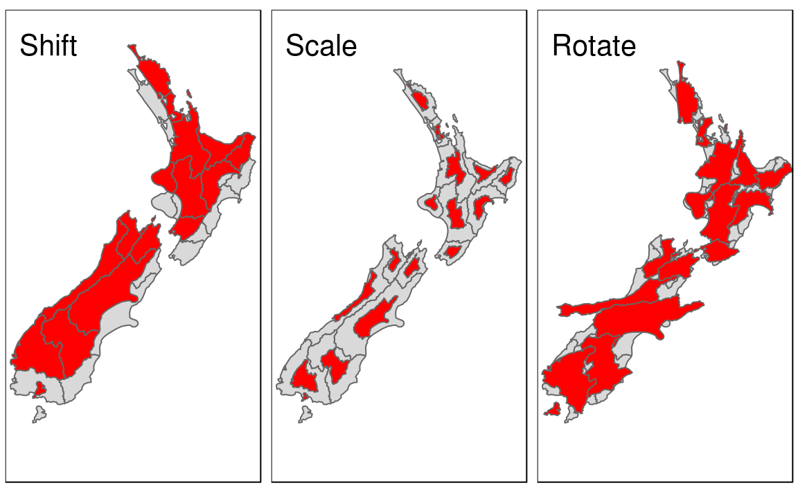
<p class="caption">(\#fig:affine-trans)Illustrations of affine transformations: shift, scale and rotate.</p>
</div>


Finally, the newly created geometries can replace the old ones with the `st_set_geometry()` function: 


```r
nz_scale_sf = st_set_geometry(nz, nz_scale)
```

### Clipping {#clipping}

Spatial clipping is a form of spatial subsetting that involves changes to the `geometry` columns of at least some of the affected features.

Clipping can only apply to features more complex than points: 
lines, polygons and their 'multi' equivalents.
To illustrate the concept we will start with a simple example:
two overlapping circles with a center point one unit away from each other and a radius of one:


```r
b = st_sfc(st_point(c(0, 1)), st_point(c(1, 1))) # create 2 points
b = st_buffer(b, dist = 1) # convert points to circles
l = c("x", "y")
plot(b)
text(x = c(-0.5, 1.5), y = 1, labels = l) # add text
```

<div class="figure" style="text-align: center">

<p class="caption">(\#fig:points)Overlapping circles.</p>
</div>

Imagine you want to select not one circle or the other, but the space covered by both `x` *and* `y`.
This can be done using the function `st_intersection()`, illustrated using objects named `x` and `y` which represent the left and right-hand circles:


```r
x = b[1]
y = b[2]
x_and_y = st_intersection(x, y)
plot(b)
plot(x_and_y, col = "lightgrey", add = TRUE) # color intersecting area
```


The subsequent code chunk demonstrates how this works for all combinations of the 'Venn' diagram representing `x` and `y`, inspired by [Figure 5.1](http://r4ds.had.co.nz/transform.html#logical-operators) of the book R for Data Science [@grolemund_r_2016].
<!-- Todo: reference r4ds -->

<div class="figure" style="text-align: center">

<p class="caption">(\#fig:venn-clip)Spatial equivalents of logical operators.</p>
</div>

To illustrate the relationship between subsetting and clipping spatial data, we will subset points that cover the bounding box of the circles `x` and `y` in Figure \@ref(fig:venn-clip).
Some points will be inside just one circle, some will be inside both and some will be inside neither.
`st_sample()` is used below to generate a *simple random* distribution of points within the extent of circles `x` and `y`, resulting in output illustrated in Figure \@ref(fig:venn-subset).


```r
bb = st_bbox(st_union(x, y))
pmat = matrix(c(bb[c(1, 2, 3, 2, 3, 4, 1, 4, 1, 2)]), ncol = 2, byrow = TRUE)
box = st_polygon(list(pmat))
set.seed(2017)
p = st_sample(x = box, size = 10)
plot(box)
plot(x, add = TRUE)
plot(y, add = TRUE)
plot(p, add = TRUE)
text(x = c(-0.5, 1.5), y = 1, labels = l)
```

<div class="figure" style="text-align: center">

<p class="caption">(\#fig:venn-subset)Randomly distributed points within the bounding box enclosing circles x and y.</p>
</div>

The logical operator way would find the points inside both `x` and `y` using a spatial predicate such as `st_intersects()` whereas the intersection method simply finds the points inside the intersecting region created above as `x_and_y`.
As demonstrated below the results are identical, but the method that uses the clipped polygon is more concise:


```r
sel_p_xy = st_intersects(p, x, sparse = FALSE)[, 1] &
  st_intersects(p, y, sparse = FALSE)[, 1]
p_xy1 = p[sel_p_xy]
p_xy2 = p[x_and_y]
identical(p_xy1, p_xy2)
#> [1] TRUE
```


### Geometry unions

As we saw in section \@ref(vector-attribute-aggregation), spatial aggregation can silently dissolve the geometries of touching polygons in the same group.
This is demonstrated in the code chunk below in which 49 `us_states` are aggregated into 4 regions using base and **tidyverse** functions (see results in Figure \@ref(fig:us-regions)):


```r
regions = aggregate(x = us_states[, "total_pop_15"], by = list(us_states$REGION),
                    FUN = sum, na.rm = TRUE)
regions2 = us_states %>% group_by(REGION) %>%
  summarize(pop = sum(total_pop_15, na.rm = TRUE))
```


<div class="figure" style="text-align: center">

<p class="caption">(\#fig:us-regions)Spatial aggregation on contiguous polygons, illustrated by aggregating the population of US states into regions, with population represented by color. Note the operation automatically dissolves boundaries between states.</p>
</div>

What is going on in terms of the geometries?
Behind the scenes, both `aggregate()` and `summarize()` combine the geometries and dissolve the boundaries between them using `st_union()`.
This is demonstrated in the code chunk below which creates a united western US: 


```r
us_west = us_states[us_states$REGION == "West", ]
us_west_union = st_union(us_west)
```

The function can take two geometries and union them, as demonstrated in the code chunk below which creates a united western block incorporating Texas (challenge: reproduce and plot the result):


```r
texas = us_states[us_states$NAME == "Texas", ]
texas_union = st_union(us_west_union, texas)
```


### Type transformations {#type-trans}

Geometry casting is a powerful operation which enables transformation of the geometry type.
It is implemented in the `st_cast` function from the `sf` package.
Importantly, `st_cast` behaves differently on single simple feature geometry (`sfg`) objects, simple feature geometry column (`sfc`) and simple features objects.

Let's create a multipoint to illustrate how geometry casting works on simple feature geometry (`sfg`) objects:


```r
multipoint = st_multipoint(matrix(c(1, 3, 5, 1, 3, 1), ncol = 2))
```

In this case, `st_cast` can be useful to transform the new object into linestring or polygon (Figure \@ref(fig:single-cast)):

<!-- a/ points -> lines -> polygons  -->

```r
linestring = st_cast(multipoint, "LINESTRING")
polyg = st_cast(multipoint, "POLYGON")
```

<div class="figure" style="text-align: center">
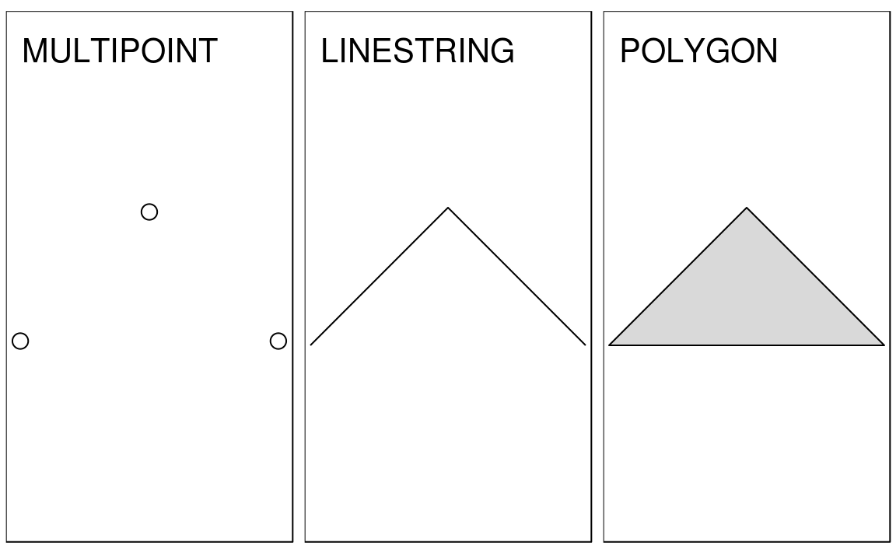
<p class="caption">(\#fig:single-cast)Examples of linestring and polygon 'casted' from a multipoint geometry.</p>
</div>

Conversion from mulitpoint to linestring is a common operation that creates a line object from ordered point observations, such as GPS measurements or geotagged media.
This allows spatial operations such as the length of the path traveled.
Conversion from multipoint or linestring to polygon is often used to calculate an area, for example from the set of GPS measurements taken around a lake or from the corners of a building lot.

The transformation process can be also reversed using `st_cast`:


```r
multipoint_2 = st_cast(linestring, "MULTIPOINT")
multipoint_3 = st_cast(polyg, "MULTIPOINT")
all.equal(multipoint, multipoint_2, multipoint_3)
#> [1] TRUE
```

\BeginKnitrBlock{rmdnote}<div class="rmdnote">For single simple feature geometries (`sfg`), `st_cast` also provides geometry casting from non-multi to multi types (e.g. `POINT` to `MULTIPOINT`) and from multi types to non-multi types.
However, only the first element of the old object would remain in the second group of cases.</div>\EndKnitrBlock{rmdnote}


Geometry casting of simple features geometry column (`sfc`) and simple features objects works the same as for single geometries in most of the cases. 
One important difference is conversion between multi to non-multi types.
As a result of this process, multi-objects are split into many non-multi objects.

Table \@ref(tab:sfs-st-cast) shows possible geometry type transformations on simple feature objects.
(Note the abbreviated geometry type names: POI, MPOI, LIN and GC for example refer to POINT, MULTIPOINT, LINESTRING and GEOMETRYCOLLECTION respectively.)
Each input simple feature object with only one element (first column) is transformed directly into another geometry type.
Several of the transformations are not possible, for example, you cannot convert a single point into a multilinestring or a polygon (so the cells `[1, 4:5]` in the table are NA).
On the other hand, some of the transformations are splitting the single element input object into multi-element one.
You can see that, for example, when you cast a multipoint consisting of five pairs of coordinated into a point.


Table: (\#tab:sfs-st-cast)Geometry casting on simple feature geometries (see section 2.1, type names abbreviated) with input type by row and output type by column. Values like (1) represent the number of features; NA means the operation is not possible.

           POI   MPOI   LIN   MLIN   POL   MPOL   GC
--------  ----  -----  ----  -----  ----  -----  ---
POI(1)       1      1     1     NA    NA     NA   NA
MPOI(1)      4      1     1      1     1     NA   NA
LIN(1)       5      1     1      1     1     NA   NA
MLIN(1)      7      2     2      1    NA     NA   NA
POL(1)       5      1     1      1     1      1   NA
MPOL(1)     10      1    NA      1     2      1    1
GC(1)        9      1    NA     NA    NA     NA    1

Let's try to apply geometry type transformations on a new object, `multilinestring_sf`, as an example (on the left in Figure \@ref(fig:line-cast)):


```r
multilinestring_list = list(matrix(c(1, 4, 5, 3), ncol = 2), 
                            matrix(c(4, 4, 4, 1), ncol = 2),
                            matrix(c(2, 4, 2, 2), ncol = 2))
multilinestring = st_multilinestring((multilinestring_list))
multilinestring_sf = st_sf(geom = st_sfc(multilinestring))
multilinestring_sf
#> Simple feature collection with 1 feature and 0 fields
#> geometry type:  MULTILINESTRING
#> dimension:      XY
#> bbox:           xmin: 1 ymin: 1 xmax: 4 ymax: 5
#> epsg (SRID):    NA
#> proj4string:    NA
#>                             geom
#> 1 MULTILINESTRING ((1 5, 4 3)...
```

You can imagine it as a road or river network. 
The new object has only one row that defines all the lines.
This restricts the number of operations that can be done, for example it prevents adding names to each line segment or calculating lengths of single lines.
The `st_cast` function can be used in this situation, as it separates one mutlilinestring into three linestrings:


```r
linestring_sf2 = st_cast(multilinestring_sf, "LINESTRING")
linestring_sf2
#> Simple feature collection with 3 features and 0 fields
#> geometry type:  LINESTRING
#> dimension:      XY
#> bbox:           xmin: 1 ymin: 1 xmax: 4 ymax: 5
#> epsg (SRID):    NA
#> proj4string:    NA
#>                geometry
#> 1 LINESTRING (1 5, 4 3)
#> 2 LINESTRING (4 4, 4 1)
#> 3 LINESTRING (2 2, 4 2)
```

<div class="figure" style="text-align: center">
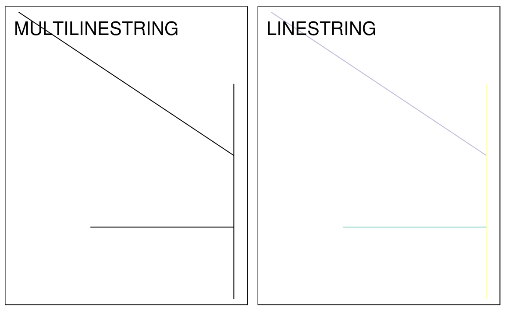
<p class="caption">(\#fig:line-cast)Examples of type casting between MULTILINESTRING (left) and LINESTRING (right).</p>
</div>

The newly created object allows for attributes creation (see more in section \@ref(vec-attr-creation)) and length measurements:


```r
linestring_sf2$name = c("Riddle Rd", "Marshall Ave", "Foulke St")
linestring_sf2$length = st_length(linestring_sf2)
linestring_sf2
#> Simple feature collection with 3 features and 2 fields
#> geometry type:  LINESTRING
#> dimension:      XY
#> bbox:           xmin: 1 ymin: 1 xmax: 4 ymax: 5
#> epsg (SRID):    NA
#> proj4string:    NA
#>                geometry         name length
#> 1 LINESTRING (1 5, 4 3)    Riddle Rd   3.61
#> 2 LINESTRING (4 4, 4 1) Marshall Ave   3.00
#> 3 LINESTRING (2 2, 4 2)    Foulke St   2.00
```

<!-- idea: example where a collection of points referring to different objects are combined to MULTIPOINT by object, then casted to LINESTRING geometries per object -->

## Geometric operations on raster data {#geo-ras}

Geometric raster operations include the shift, flipping, mirroring, scaling, rotation or warping of images.
These operations are e.g. necessary when geolocating a raster image.
In turn, geolocating requires the rectification of the image, which usually includes some manual intervention one or several of the following steps depending on the task at hand [see also @liu_essential_2009]:

- Georeferencing with ground control points.
- Orthorectification also georeferences an image but additionally takes into account local topography.
- Image (co-)registration is the process of aligning one image with another (in terms of CRS, origin and resolution). 
Registration becomes necessary for images from the same scene but shot from different sensors or from different angles or at different points in time.

R is unsuitable for the first two points since these often require manual intervention which is why they are usually done with the help of a Desktop GIS (see also Chapter \@ref(gis)).
On the other hand, aligning several images is possible in R and this section shows among other how to do so.
This often includes changing the extent, the resolution and the origin of an image.
A matching projection is of course also required but is already covered in section \@ref(reprojecting-raster-geometries).
In any case, there are other reasons why to perform a geometric operation on a single raster image.
For instance, in chapter \@ref(location) we define metropolitan areas in Germany as 20 km^2^ pixels with more than 500,000 inhabitants. 
The original inhabitant raster, however, has a resolution of 1 km^2^ which is why we will decrease (aggregate) the resolution by a factor of 20 (see section \@ref(define-metropolitan-areas)).
Another reason for aggregating a raster is simply to decrease run-time or save disk space.
Of course, this is only possible if the task at hand allows a coarser resolution.
Sometimes a coarser resolution is sufficient for the task at hand.

### Geometric intersections

In section \@ref(spatial-raster-subsetting) we have shown how to extract values from a raster overlaid by other spatial objects.
To retrieve a spatial output, we can use almost the same subsetting syntax.
The only difference is that we have to make clear that we would like to keep the matrix structure by setting the `drop`-parameter to `FALSE`.
This will return a raster object containing the cells whose midpoints overlap with `clip`.


```r
data("elev", package = "spData")
clip = raster(nrow = 3, ncol = 3, res = 0.3, xmn = 0.9, xmx = 1.8, 
              ymn = -0.45, ymx = 0.45, vals = rep(1, 9))
elev[clip, drop = FALSE]
#> class       : RasterLayer 
#> dimensions  : 2, 1, 2  (nrow, ncol, ncell)
#> resolution  : 0.5, 0.5  (x, y)
#> extent      : 1, 1.5, -0.5, 0.5  (xmin, xmax, ymin, ymax)
#> coord. ref. : +proj=longlat +datum=WGS84 +ellps=WGS84 +towgs84=0,0,0 
#> data source : in memory
#> names       : layer 
#> values      : 18, 24  (min, max)
```

For the same operation we can also use the `intersect()` and `crop()` command.

### Extent and origin

When merging or performing map algebra on rasters, their resolution, projection, origin and/or extent has to match. Otherwise, how should we add the values of one raster with a resolution of 0.2 decimal degrees to a second with a resolution of 1 decimal degree?
The same problem arises when we would like to merge satellite imagery from different sensors with different projections and resolutions. 
We can deal with such mismatches by aligning the rasters.

In the simplest case, two images only differ in a mismatch in extent.
<!--The `projectRaster()` function reprojects one raster to a desired projection, say from UTM to WGS84.-->
Following code adds one row and two columns to each side of the raster while setting all new values to an elevation of 1000 meters (\@ref(fig:extend-example)).


```r
data(elev, package = "spData")
elev_2 = extend(elev, c(1, 2), value = 1000)
plot(elev_2)
```

<div class="figure" style="text-align: center">

<p class="caption">(\#fig:extend-example)Original raster extended by 1 one row on each side (top, bottom) and two columns on each side (right, left).</p>
</div>

Performing an algebraic operation on two objects with differing extents in R, the **raster** package returns the result for the intersection, and says so in a warning.


```r
elev_3 = elev + elev_2
#> Warning in elev + elev_2: Raster objects have different extents. Result for
#> their intersection is returned
```

However, we can also align the extent of two rasters with `extend()`. 
Instead of telling the function how many rows or columns should be added (as done before), we allow it to figure it out by using another raster object.
Here, we extend the `elev` object to the extent of `elev_2`. 
The newly added rows and column receive the default value of the `value` parameter, i.e. `NA`.


```r
elev_4 = extend(elev, elev_2)
```

The origin is the point closest to (0, 0) if you moved towards it (starting from any given cell corner of the raster) in steps of x and y resolution.


```r
origin(elev_4)
#> [1] 0 0
```

If two rasters have different origins, their cells do not overlap completely which would make map algebra impossible.
To change the origin , use `origin()`.^[
If the origins of two raster datasets are just marginally apart, it sometimes is sufficient to simply increase the `tolerance` argument  of `raster::rasterOptions()`.
]
Looking at figure \@ref(fig:origin-example) reveals the effect of changing the origin.


```r
# change the origin
origin(elev_4) = c(0.25, 0.25)
plot(elev_4)
# and add the original raster
plot(elev, add = TRUE)
```

<div class="figure" style="text-align: center">

<p class="caption">(\#fig:origin-example)Plotting rasters with the same values but different origins.</p>
</div>

Note that changing the resolution frequently (next section) also changes the origin.

### Aggregation and disaggregation

Raster datasets can also differ with regard to their resolution. 
To match resolutions, one can either decrease  (`aggregate()`) or increase (`disaggregate()`) the resolution of one raster.^[
Here we refer to spatial resolution.
In remote sensing the spectral (spectral bands), temporal (observations through time of the same area) and radiometric (color depth) resolution are also important.
Check out the `stackApply()` example in the documentation for getting an idea how to do temporal raster aggregation.
]
As an example, we here change the spatial resolution of `dem` (found in the **RQGIS** package) by a factor of 5 (Fig. \@ref(fig:aggregate-example)).
Additionally, the output cell value should correspond to the mean of the input cells (note that one could use other functions as well, such as `median()`, `sum()` etc.):


```r
data("dem", package = "RQGIS")
dem_agg = aggregate(dem, fact = 5, fun = mean)
```


```r
p_ar1 = tm_shape(dem) + tm_raster(style = "cont", legend.show = FALSE) +
  tm_layout(main.title = "Original")
p_ar2 = tm_shape(dem_agg) + tm_raster(style = "cont", legend.show = FALSE) +
  tm_layout(main.title = "Aggregated")
tmap_arrange(p_ar1, p_ar2, ncol = 2)
```

<div class="figure" style="text-align: center">

<p class="caption">(\#fig:aggregate-example)Original raster (left). Aggregated raster (right).</p>
</div>

By contrast, the`disaggregate()` function increases the resolution.
However, we have to specify a method how to fill the new cells.
The `disaggregate()` function provides two methods.
The first (nearest neighbor, `method = ""`) simply gives all output cells the value of the nearest input cell, and hence duplicates values which leads to a blocky output image.

The `bilinear` method, in turn, is an interpolation technique that uses the four nearest pixel centers of the input image (salmon colored points in Fig. \@ref(fig:bilinear)) to compute an average weighted by distance (arrows in Fig. \@ref(fig:bilinear) as the value of the output cell - square in the upper left corner in Fig. \@ref(fig:bilinear)).


```r
dem_disagg = disaggregate(dem_agg, fact = 5, method = "bilinear")
identical(dem, dem_disagg)
#> [1] FALSE
```

<div class="figure" style="text-align: center">

<p class="caption">(\#fig:bilinear)The distance-weighted average of the four closest input cells determine the output when using the bilinear method for disaggregation.</p>
</div>

Comparing the values of `dem` and `dem_disagg` tells us that they are not identical (you can also use `compareRaster()` or `all.equal()`).
However, this was hardly to be expected, since disaggregating is a simple interpolation technique.
It is important to keep in mind that disaggregating results in a finer resolution, the corresponding values, however, are only as accurate as their lower resolution source.

The process of computing values for new pixel locations is also called resampling. 
In fact, the **raster** package provides a `resample()` function.
It lets you align several raster properties in one go, namely origin, extent and resolution.
By default, it uses the `bilinear`-interpolation.


```r
# add 2 rows and columns, i.e. change the extent
dem_agg = extend(dem_agg, 2)
dem_disagg_2 = resample(dem_agg, dem)
```

Finally, in order to align many (possibly hundreds or thousands of) images stored on disk, you could use the `gdalUtils::align_rasters()` function.
However, you may also use **raster** with very large datasets. 
This is because **raster**:

1. Lets you work with raster datasets that are too large to fit into the main memory (RAM) by only processing chunks of it.
2. Tries to facilitate parallel processing.
For more information see the help pages of `beginCluster()` and `clusteR()`.
Additionally, check out the *Multi-core functions* section in `vignette("functions", package = "raster")`.

## Raster-vector interactions {#raster-vector}

This section focuses on interactions between raster and vector geographic data models, introduced in Chapter \@ref(spatial-class).
It includes four main techniques:
raster cropping and masking using vector objects (section \@ref(raster-cropping));
extracting raster values using different types of vector data (section \@ref(raster-extraction));
and raster-vector conversion (sections \@ref(rasterization) and \@ref(spatial-vectorization)).
<!-- operations are not symmetrical, for example: -->
<!-- - raster clipping - no vector counterpart -->
<!-- - raster extraction is connected to some methods used in vectorization and rasterization -->
<!-- - etc. -->
The above concepts are demonstrated using data used in previous chapters to understand their potential real-world applications.

### Raster cropping

Many geographic data projects involve integrating data from many different sources, such as remote sensing images (rasters) and administrative boundaries (vectors).
Often the extent of input raster datasets is larger than the area of interest.
In this case raster **cropping** and **masking** are useful for unifying the spatial extent of input data.
Both operations reduce object memory use and associated computational resources for subsequent analysis steps, and may be a necessary preprocessing step before creating attractive maps involving raster data.

We will use two objects to illustrate raster cropping:

- A `raster` object `srtm` representing elevation (meters above sea level) in Southwestern Utah.
- A vector (`sf`) object `zion` representing Zion National Park.

Both target and cropping objects must have the same projection.
The following code chunk therefore not only loads the datasets, from the **spDataLarge** package installed in Chapter \@ref(spatial-class).
It also reprojects `zion` (see section \@ref(reproj-geo-data) for more on reprojection):


```r
srtm = raster(system.file("raster/srtm.tif", package = "spDataLarge"))
zion = read_sf(system.file("vector/zion.gpkg", package = "spDataLarge"))
zion = st_transform(zion, projection(srtm))
```

We will use `crop()` from the **raster** package to crop the `srtm` raster.
`crop()` reduces the rectangular extent of the object passed to its first argument based on the extent of the object passed to its second argument, as demonstrated in the command below (which generates Figure \@ref(fig:cropmask):B --- note the smaller extent of the raster background):


```r
srtm_cropped = crop(srtm, as(zion, "Spatial"))
```

Related to `crop()` is the **raster** function `mask()`, which sets values outside of the bounds a the object passed to its second argument to `NA`.
The following command therefore masks every cell outside of the the Zion National Park boundaries (Figure \@ref(fig:cropmask):C):


```r
srtm_masked = mask(srtm, as(zion, "Spatial"))
```

Changing the settings of `mask()` yields in different results.
Setting `maskvalue = 0`, for example, would set all pixels outside the national park to 0.
Setting `inverse = TRUE` would mask everything *inside* the bounds of the park (see `?mask` for details) (Figure \@ref(fig:cropmask):D).


```r
srtm_inv_masked = mask(srtm, as(zion, "Spatial"), inverse = TRUE)
```

<div class="figure" style="text-align: center">
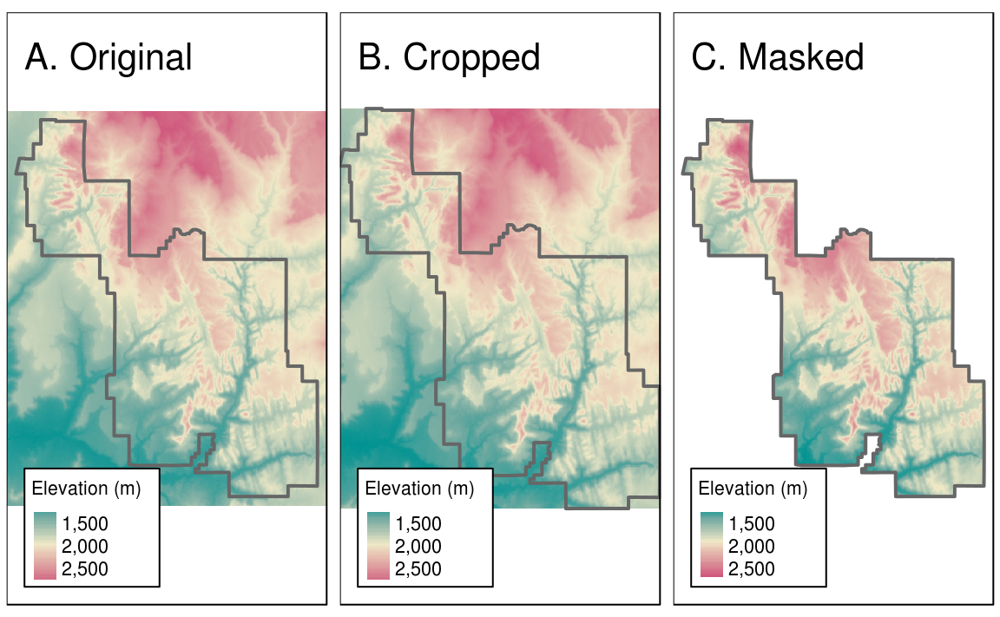
<p class="caption">(\#fig:cropmask)Illustration of raster cropping and raster masking.</p>
</div>

### Raster extraction

Raster extraction is the process of identifying and returning the values associated with a 'target' raster at specific locations, based on a (typically vector) geographic 'selector' object.
The results depend on the type of selector used (points, lines or polygons) and arguments passed to the `raster::extract()` function, which we use to demonstrate raster extraction.
The reverse of raster extraction --- assigning raster cell values based on vector objects --- is rasterization, described in section \@ref(rasterization).

The simplest example is extracting the value of a raster cell at specific **points**.
For this purpose we will use `zion_points`, which contain a sample of 30 locations within the Zion National Park (Figure \@ref(fig:pointextr)). 
<!-- They could represent places where soils properties were measured and we want to know what is the elevation of each point. -->
The following command extracts elevation values from `srtm` and assigns the resulting vector to a new column (`elevation`) in the `zion_points` dataset: 

```r
zion_points$elevation = raster::extract(srtm, as(zion_points, "Spatial"))
```


The `buffer` argument can be used to specify a buffer radius (in meters) around each point.
The result of `raster::extract(srtm, zion_points, buffer = 1000)`, for example, is a list of vectors, each of which representing the values of cells inside the buffer associated with each point.
In practice this example is a special case of extraction with a polygon selector, described below.

<div class="figure" style="text-align: center">

<p class="caption">(\#fig:pointextr)Locations of points used for raster extraction.</p>
</div>

Raster extraction also works with **line** selectors.
To demonstrate this, the code below creates `zion_transect`, a straight line going from northwest to southeast of the Zion National Park, illustrated in Figure \@ref(fig:lineextr):A (see section \@ref(vector-data) for a recap on the vector data model):


```r
zion_transect = cbind(c(-113.2, -112.9), c(37.45, 37.2)) %>%
  st_linestring() %>% 
  st_sfc(crs = projection(srtm)) %>% 
  st_sf()
```


The utility of extracting heights from a linear selector is illustrated by imagining that you are planning a hike.
The method demonstrated below provides an 'elevation profile' of the route (the line does not need to be straight), useful for estimating how long it will take due to long climbs:


```r
transect = raster::extract(srtm, as(zion_transect, "Spatial"),
                           along = TRUE, cellnumbers = TRUE)
```

Note the use of `along = TRUE` and `cellnumbers = TRUE` arguments to return cell IDs *along* the path. 
The result is a list containing a matrix of cell IDs in the first column and elevation values in the second.
The number of list elements is equal to the number of lines or polygons from which we are extracting values.
The subsequent code chunk first converts this tricky matrix-in-a-list object into a simple data frame, returns the coordinates associated with each extracted cell and finds the associated distances along the transect (see `?geosphere::distm()` for details):


```r
transect_df = map_dfr(transect, as_data_frame, .id = "ID")
transect_coords = xyFromCell(srtm, transect_df$cell)
transect_df$dist = c(0, cumsum(geosphere::distGeo(transect_coords)))    
```

The resulting `transect_df` can be used to create elevation profiles, as illustrated in Figure \@ref(fig:lineextr):B.

<div class="figure" style="text-align: center">
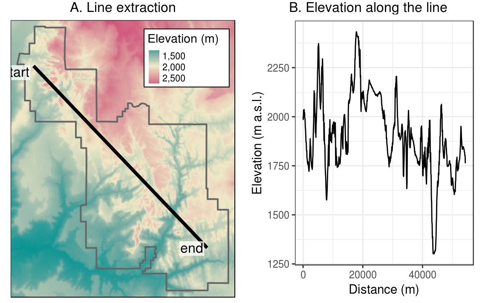
<p class="caption">(\#fig:lineextr)Location of a line used for raster extraction (left) and the elevation along this line (right).</p>
</div>

The final type of geographic vector object for raster extraction is **polygons**.
Like lines and buffers, polygons tend to return many raster values per polygon.
This is demonstrated in the command below, which results in a data frame with column names  `ID` (the row number of the polygon) and `srtm` (associated elevation values):


```r
zion_srtm_values = raster::extract(x = srtm, y = as(zion, "Spatial"), df = TRUE)
```

Such results can be used to generate summary statistics for raster values per polygon, for example to  to characterize a single region or to compare many regions.
The generation of summary statistics is demonstrated the code below, which creates the object `zion_srtm_df` containing summary statistics for elevation values in Zion National Park (see \@ref(fig:polyextr):A):


```r
group_by(zion_srtm_values, ID) %>% 
  summarize_at(vars(srtm), funs(min, mean, max))
#> # A tibble: 1 x 4
#>      ID   min  mean   max
#>   <dbl> <dbl> <dbl> <dbl>
#> 1    1. 1122. 1818. 2661.
```

The preceding code chunk used the **tidyverse** to provide summary statistics for cell values per polygon ID, as described in Chapter \@ref(attr).
The results provide useful summaries, for example that the maximum height in the park is around 2,661 meters (other summary statistics such as standard deviation can also be calculated in this way).
Because there is only one polygon in the example a data frame with a single row is returned, but the method works when multiple selector polygons are used.

The same approach works for counting occurrences of categorical raster values within polygons.
This is illustrated with a land cover dataset (`nlcd`) from the **spDataLarge** package in \@ref(fig:polyextr):B and demonstrated in the code below:


```r
zion_nlcd = raster::extract(nlcd, as(zion, "Spatial"), df = TRUE, factors = TRUE)
dplyr::select(zion_nlcd, ID, levels) %>% 
  gather(key, value, -ID) %>%
  group_by(ID, key, value) %>%
  tally() %>% 
  spread(value, n, fill = 0)
#> # A tibble: 1 x 9
#> # Groups:   ID, key [1]
#>      ID key    Barren Cultivated Developed  Forest Herbaceous Shrubland
#>   <dbl> <chr>   <dbl>      <dbl>     <dbl>   <dbl>      <dbl>     <dbl>
#> 1    1. levels 98285.        62.     4205. 298299.       235.   203701.
#> # ... with 1 more variable: Wetlands <dbl>
```

<div class="figure" style="text-align: center">
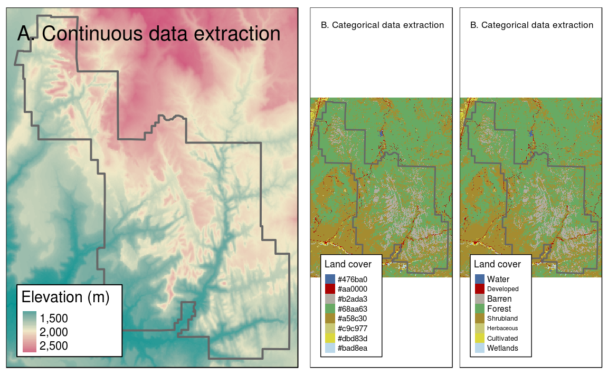
<p class="caption">(\#fig:polyextr)Area used for continuous (left) and categorical (right) raster extraction.</p>
</div>

So far we have seen how `raster::extract()` is a flexible way of extracting raster cell values from a range of input geographic objects.
An issue with the function, however, is that it is slow.
If this is a problem it is useful to know about alternatives and work-arounds, three of which are presented below.

- **Parallelization**: this approach works when using many geographic vector selector objects by splitting them into groups and extracting cell values independently for each group (see `?raster::clusterR()` for details of this approach).
<!-- tabularaster (ref to the vignette - https://cran.r-project.org/web/packages/tabularaster/vignettes/tabularaster-usage.html)-->
- Use the **velox** package [@hunziker_velox:_2017], which provides a fast method for extracting raster data that fits in memory (see the packages [`extract`](https://hunzikp.github.io/velox/extract.html) vignette for details).
- Using **R-GIS bridges** (see Chapter \@ref(gis)): efficient calculation of raster statistics from polygons can be found in the SAGA function `saga:gridstatisticsforpolygons`, for example, which can be accessed via **RQGIS**.
<!-- Methods similar to `raster::extract` can be found in GRASS GIS (e.g. v.rast.stats) -->
<!-- https://grass.osgeo.org/grass74/manuals/v.rast.stats.html - test -->
<!-- https://twitter.com/mdsumner/status/976978499402571776 -->
<!-- https://gist.github.com/mdsumner/d0b26238321a5d2c2c2ba663ff684183 -->

### Rasterization {#rasterization}

Rasterization is the conversion of vector objects into their representation in raster objects.
Usually, the output raster is used for quantitative analysis (e.g. analysis of terrain) or modeling.
As we saw in Chapter \@ref(spatial-class) the raster data model has some characteristics that make it conducive to certain methods.
Furthermore, the process of rasterization can help simplify datasets because the resulting values all have the same spatial resolution: rasterization can be seen as a special type of geographic data aggregation.

The **raster** package contains the function `rasterize()` for doing this work.
Its first two arguments are `x`, vector object to be rasterized and `y`, a 'template raster' object defining the extent, resolution and CRS of the output.
The geographic resolution of the input raster has a major impact on the results: if it is too low (cell size is too large) the result may miss the full geographic variability of the vector data; if it is too high computational times may be excessive.
There are no simple rules to follow when deciding an appropriate geographic resolution, which is heavily dependent on the intended use of the results.
Often the target resolution is imposed on the user, for example when the output of rasterization needs to be aligned to the existing raster.

To demonstrate rasterization in action, we will use a template raster that has the same extent and CRS as the input vector data `cycle_hire_osm_projected` (a dataset on cycle hire points in London illustrated in Figure \@ref(fig:vector-rasterization1):A) and spatial resolution of 1000 meters:


```r
cycle_hire_osm_projected = st_transform(cycle_hire_osm, 27700)
raster_template = raster(extent(cycle_hire_osm_projected), resolution = 1000,
                         crs = st_crs(cycle_hire_osm_projected)$proj4string)
```

Rasterization is a very flexible operation: the results depend not only on the nature of the template raster, but also on the type of input vector (e.g. points, polygons) and a variety arguments taken by the `rasterize()` function.

To illustrate this flexibility we will try three different approaches rasterization.
First we create a raster representing the presence or absence of cycle hire points (known as presence/absence rasters).
In this case `rasterize()` requires only one argument in addition to `x` and `y` (the aforementioned vector and raster objects): a value to be transferred to all non-empty cells specified by `field` (results illustrated Figure \@ref(fig:vector-rasterization1):B).


```r
ch_raster1 = rasterize(cycle_hire_osm_projected, raster_template, field = 1)
```

The `fun` argument specifies summary statistics used to covert multiple observations in close proximity into associate cells in the raster object.
By default `fun = "last"` is used but other options such as `fun = "count"` can be used,  in this case to count the number of cycle hire points in each grid cell (the results of this operation are illustrated in Figure \@ref(fig:vector-rasterization1):C).


```r
ch_raster2 = rasterize(cycle_hire_osm_projected, raster_template, 
                       field = 1, fun = "count")
```

The new output, `ch_raster2`, shows the number of cycle hire points in each grid cell.
The cycle hire locations have different numbers of bicycles described by the `capacity` variable, raising the question, what's the capacity in each grid cell?
To calculate that we must `sum` the field (`"capacity"`), resulting in output illustrated in Figure \@ref(fig:vector-rasterization1):D, calculated with the following command (other summary functions such as `mean` could be used):


```r
ch_raster3 = rasterize(cycle_hire_osm_projected, raster_template, 
                       field = "capacity", fun = sum)
```

<div class="figure" style="text-align: center">
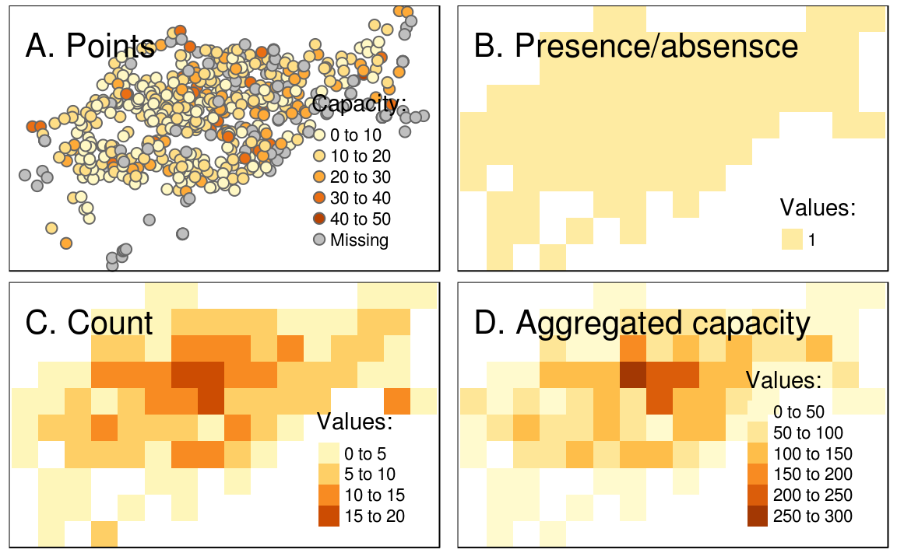
<p class="caption">(\#fig:vector-rasterization1)Examples of point's rasterization.</p>
</div>

Another dataset based on California's polygons and borders (created below) illustrates raterization of lines.
After casting the polygon objects into a multilinestring, a template raster is created, with a resolution of a 0.5 degree:


```r
california = dplyr::filter(us_states, NAME == "California")
california_borders = st_cast(california, "MULTILINESTRING")
raster_template2 = raster(extent(california), resolution = 0.5,
                         crs = st_crs(california)$proj4string)
```

Line rasterization is demonstrated in the code below.
In the resulting raster, all cells that are touched by a line get a value, as illustrated in Figure \@ref(fig:vector-rasterization2):A.


```r
california_raster1 = rasterize(as(california_borders, "Spatial"), raster_template2)
```

Polygon rasterization, by contrast, selects only cells whose centroids are inside the selector polygon, as illustrated in Figure \@ref(fig:vector-rasterization2):B.


```r
california_raster2 = rasterize(as(california, "Spatial"), raster_template2)
```

<!-- getCover? -->
<!-- the fraction of each grid cell that is covered by the polygons-->
<!-- ```{r, echo=FALSE, eval=FALSE} -->
<!-- california_raster3 = rasterize(california, raster_template2, getCover = TRUE) -->
<!-- r3po = tm_shape(california_raster3) + -->
<!--   tm_raster(legend.show = TRUE, title = "Values: ", style = "fixed", breaks = c(0, 1, 25, 50, 75, 100)) + -->
<!--   tm_shape(california) + -->
<!--   tm_borders() + -->
<!--   tm_layout(outer.margins = rep(0.01, 4), -->
<!--             inner.margins = rep(0, 4)) -->
<!-- ``` -->

<!-- It is also possible to use the `field` or `fun` arguments for lines and polygons rasterizations. -->

<div class="figure" style="text-align: center">
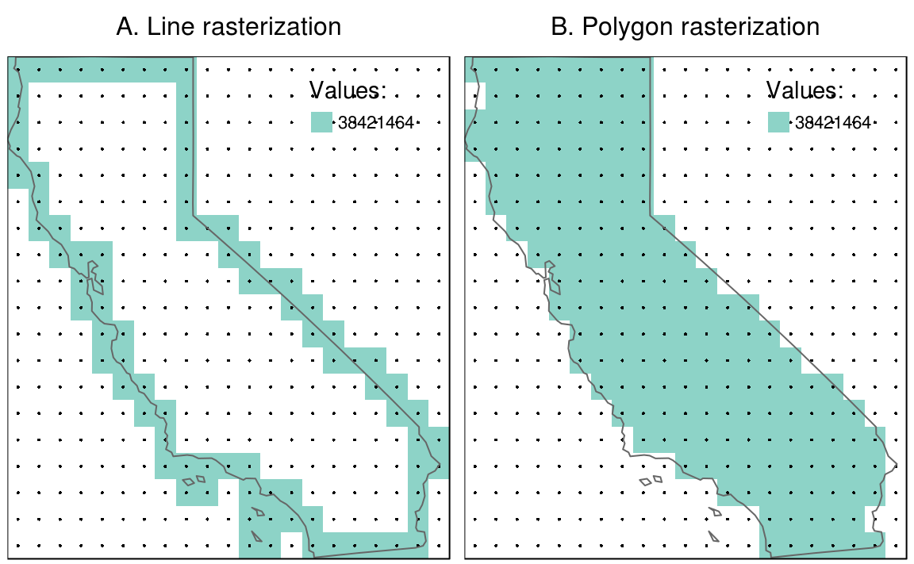
<p class="caption">(\#fig:vector-rasterization2)Examples of line and polygon rasterizations.</p>
</div>

As with `raster::extract()`,  `raster::rasterize()` works well for most cases but is not performance optimized. 
Fortunately, there are several alternatives, including the `fasterize::fasterize()` and `gdalUtils::gdal_rasterize()`. 
The former is much (100 times+) faster than `rasterize()` but is currently limited to polygon rasterization.
The latter is part of GDAL and therefore requires a vector file (instead of an `sf` object) and rasterization parameters (instead of a `Raster*` template object) as inputs.^[
See more at http://gdal.org/gdal_rasterize.html.
]

### Spatial vectorization

Spatial vectorization is the counterpart of rasterization \@ref(rasterization), but in the opposite direction.
It involves converting spatially continuous raster data into spatially discrete vector data such as points, lines or polygons.

\BeginKnitrBlock{rmdnote}<div class="rmdnote">Be careful with the wording!
In R vectorization refers to the possibility of replacing `for`-loops and alike by doing things like `1:10 / 2` (see also @wickham_advanced_2014).</div>\EndKnitrBlock{rmdnote}

The simplest form of vectorization is to convert the centroids of raster cells into points.
`rasterToPoints()` does exactly this for all non-`NA` raster grid cells (Figure \@ref(fig:raster-vectorization1)).
Setting the `spatial` parameter to `TRUE` ensures the output is a spatial object, not a matrix.


```r
elev_point = rasterToPoints(elev, spatial = TRUE) %>% 
  st_as_sf()
```

<div class="figure" style="text-align: center">

<p class="caption">(\#fig:raster-vectorization1)Raster and point representation of `elev`.</p>
</div>

Another common type of spatial vectorization is the creation of contour lines representing lines of continuous height or temperatures (isotherms) for example.
We will use a real-world digital elevation model (DEM) because the artificial raster `elev` produces parallel lines (task: verify this and explain why this happens).
<!-- because when creating it we made the upper left corner the lowest and the lower right corner the highest value while increasing cell values by one from left to right. -->
Contour lines can be created with the **raster** function `rasterToContour()`, which is itself a wrapper around `contourLines()`, as demonstrated below:


```r
# not shown
data(dem, package = "RQGIS")
plot(dem, axes = FALSE)
cl = rasterToContour(dem)
plot(cl, add = TRUE)
```

Contours can also be added to existing plots with functions such as `contour()`, `rasterVis::contourplot()` or `tmap::tm_iso()`.
As illustrated in Figure \@ref(fig:contour), isolines can be labelled.


```r
data("dem", package = "RQGIS")
# create hillshade
hs = hillShade(slope = terrain(dem, "slope"), aspect = terrain(dem, "aspect"))
plot(hs, col = gray(0:100 / 100), legend = FALSE)
# overlay with DEM
plot(dem, terrain.colors(25), alpha = 0.5, legend = FALSE, add = TRUE)
# add contour lines
contour(dem, col = "white", add = TRUE)
```

<div class="figure" style="text-align: center">

<p class="caption">(\#fig:contour)DEM hillshade of the southern flank of Mt. Mongón overlaid with contour lines.</p>
</div>


The final type of vectorization involves conversion of rasters to polygons.
This can be done with `raster::rasterToPolygons()`, which converts each raster cell into a polygon consisting of five coordinates, all of which are stored in memory (explaining why rasters are often fast compared with vectors!).

This is illustrated below by converting the `grain` object into polygons and subsequently dissolving borders between polygons with the same attribute values (also see the `dissolve` argument in `rasterToPolygons()`).
Attributes in this case are stored in a column called `layer` (see section \@ref(geometry-unions) and Figure \@ref(fig:raster-vectorization2)).
(Note: a convenient alternative for converting rasters into polygons is `spex::polygonize()` which by default returns an `sf` object.)


```r
grain_poly = rasterToPolygons(grain) %>% 
  st_as_sf()
grain_poly2 = grain_poly %>% 
  group_by(layer) %>%
  summarize()
```

<div class="figure" style="text-align: center">
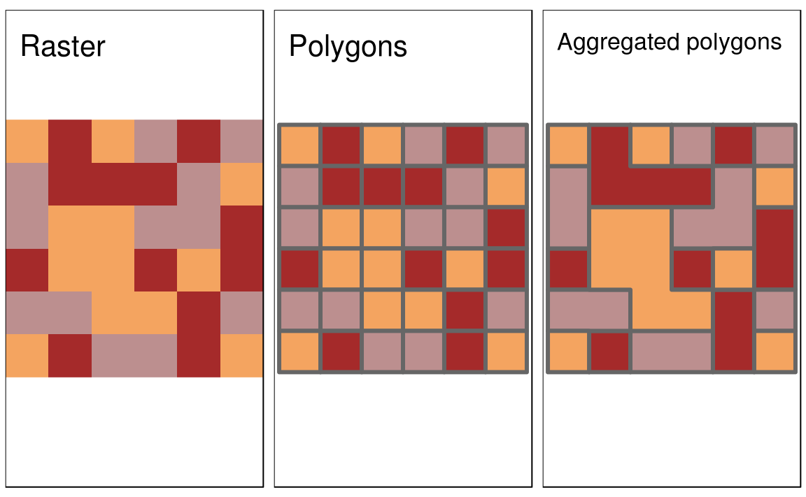
<p class="caption">(\#fig:raster-vectorization2)Illustration of vectorization of raster (left) into polygon (center) and polygon aggregation (right).</p>
</div>

<!-- ## distances? -->

## Exercises

Some of the exercises will use a vector (`random_points`) and raster dataset (`ndvi`) from the **RQGIS** package.
It also uses a polygonal 'convex hull' derived from the vector dataset (`ch`) to represent the area of interest:

```r
library(RQGIS)
data(random_points)
data(ndvi)
ch = st_combine(random_points) %>% 
  st_convex_hull()
```
1. Generate and plot simplified versions of the `nz` dataset.
Experiment with different values of `keep` (ranging from 0.5 to 0.00005) for `ms_simplify()` and `dTolerance` (from 100 to 100,000) `st_simplify()` .
    - At what value does the form of the result start to break-down for each method, making New Zealand unrecognizable?
    - Advanced: What is different about the geometry type of the results from `st_simplify()` compared with the geometry type of `ms_simplify()`? What problems does this create and how can this be resolved?

1. In the first exercise in Chapter \@ref(spatial-operations) it was established that Canterbury region had 61 of the 101 highest points in New Zealand. Using `st_buffer()`, how many points in `nz_height` are within 100 km of Canterbury?

1. Find the geographic centroid of New Zealand. How far is it from the geographic centroid of Canterbury?

1. Most world maps have a north-up orientation.
A world map with a south-up orientation could be created by a reflection (one of the affine transformations not mentioned in \@ref(affine-transformations)) of the `world` object's geometry.
Write code to do so.
Hint: you need to use a two-element vector for this transformation.
    - Bonus: create a upside down map of your country.

1. Subset the point in `p` that is contained within `x` *and* `y` (see section \@ref(clipping) and Figure \@ref(fig:venn-clip)).
    - Using base subsetting operators.
    - Using an intermediary object created with `st_intersection()`.

1. Calculate the length of the boundary lines of US states in meters.
Which state has the longest border and which has the shortest?
Hint: The `st_length` function computes the length of a `LINESTRING` or `MULTILINESTRING` geometry.

1. Aggregate the raster counting high points in New Zealand (created in the previous exercise), reduce its geographic resolution by half (so cells are 6 by 6 km) and plot the result.
    - Resample the lower resolution raster back to a resolution of 3 km. How have the results changed?
    - Name two advantages and disadvantages of reducing raster resolution.

1. Crop the `ndvi` raster using (1) the `random_points` dataset and (2) the `ch` dataset.
Are there any difference in the output maps?
Next, mask `ndvi` using these two datasets.
Can you see any difference now?
How can you explain that?

1. Firstly, extract values from `ndvi` at the points represented in `random_points`.
Next, extract average values of `ndvi` using a 90 buffer around each point from `random_points` and compare these two sets of values. 
When would extracting values by buffers be more suitable than by points alone?

1. Subset points higher than 3100 meters in New Zealand (the `nz_height` object) and create a template raster with a resolution of 3km. 
Using these objects:
    - Count numbers of the highest points in each grid cell.
    - Find the maximum elevation in each grid cell.

1. Polygonize the `grain` dataset and filter all squares representing clay.
    - Name two advantages and disadvantages of vector data over raster data.
    -  At which points would it be useful to convert rasters to vectors in your work?


<!--chapter:end:05-geometry-operations.Rmd-->


# Reprojecting geographic data {#reproj-geo-data}

## Prerequisites {-}

- This chapter requires the following packages (**lwgeom** is also used, but does not need to be attached):


```r
library(sf)
library(raster)
library(tidyverse)
library(spData)
library(spDataLarge)
```

## Introduction

<!-- A vital type of geometry transformation is *reprojecting* from one coordinate reference system (CRS) to another. -->
<!-- Because of the importance of reprojection, introduced in Chapter \@ref(spatial-class), and the fact that it applies to raster and vector geometries alike, it is the topic of the first section in this chapter. -->

Section \@ref(crs-intro) introduced coordinate reference systems (CRSs) and demonstrated their importance.
This chapter goes further.
It highlights issues that can arise when using inappropriate CRSs and how to *transform* data from one CRS to another.

As illustrated in Figure \@ref(fig:vectorplots), there are two types of CRS: *geographic* ('lon/lat', with units in degrees longitude and latitude) and *projected* (typically in units of meters from a datum).
This has consequences because many geometric operations require a *projected* CRS:
many geometric operations in **sf**, for example, assume a projected CRS and generate warnings if the data is *geographic*, using the function `st_is_longlat()` (this is because under the hood GEOS assumes projected data).
Unfortunately R does not always know the CRS of an object, as shown below using the example of London introduced in section \@ref(vector-data):

<!-- , which is created by *coercing* a `data.frame` into an `sf` object (the `coords` argument specifies the coordinates): -->


```r
london = data.frame(lon = -0.1, lat = 51.5) %>% 
  st_as_sf(coords = c("lon", "lat"))
st_is_longlat(london)
#> [1] NA
```

This shows that unless a CRS is manually specified or is loaded from a source that has CRS metadata, the CRS is `NA`.
A CRS can be added to `sf` objects with `st_set_crs()` as follows:^[
The CRS can also be added when creating `sf` objects with the `crs` argument (e.g. `st_sf(geometry = st_sfc(st_point(c(-0.1, 51.5))), crs = 4326)`).
The same argument can also be used to set the CRS when creating raster datasets (e.g. `raster(crs = "+proj=longlat")`).
]


```r
london_geo = st_set_crs(london, 4326)
st_is_longlat(london_geo)
#> [1] TRUE
```

Datasets without a specified CRS can cause problems.
An example is provided below, which creates a buffer of one unit around `london` and `london_geo` objects:


```r
london_buff_no_crs = st_buffer(london, dist = 1)
london_buff = st_buffer(london_geo, dist = 1)
#> Warning in st_buffer.sfc(st_geometry(x), dist, nQuadSegs): st_buffer does
#> not correctly buffer longitude/latitude data
#> dist is assumed to be in decimal degrees (arc_degrees).
```

Only the second operation generates a warning.
The warning message is useful, telling us that the result may be of limited use because it is in units of latitude and longitude, rather than meters or some other suitable measure of distance assumed by `st_buffer()`.
The consequences of a failure to work on projected data are illustrated in Figure \@ref(fig:crs-buf) (left panel):
the buffer is elongated in the north-south direction because lines of longitude converge towards the Earth's poles.

\BeginKnitrBlock{rmdnote}<div class="rmdnote">The distance between two lines of longitude, called meridians, is around 111 km at the equator (execute `geosphere::distGeo(c(0, 0), c(1, 0))` to find the precise distance).
This shrinks to zero at the poles.
At the latitude of London, for example, meridians are less than 70 km apart (challenge: execute code that verifies this).
<!-- `geosphere::distGeo(c(0, 51.5), c(1, 51.5))` -->
Lines of latitude, by contrast, have constant distance from each other irrespective of latitude: they are always around 111 km apart, including at the equator and near the poles.
This is illustrated in Figures \@ref(fig:crs-buf) and \@ref(fig:wintriproj).  </div>\EndKnitrBlock{rmdnote}

Do not interpret the warning about the geographic (`longitude/latitude`) CRS as "the CRS should not be set": it almost always should be!
It is better understood as a suggestion to *reproject* the data onto a projected CRS.
This suggestion does not always need to be heeded: performing spatial and geometric operations makes little or no difference in some cases (e.g. spatial subsetting).
But for operations involving distances such as buffering, the only way to ensure a good result is to create a projected copy of the data and run the operation on that.
This is done in the code chunk below:


```r
london_proj = data.frame(x = 530000, y = 180000) %>% 
  st_as_sf(coords = 1:2, crs = 27700)
```

The result is a new object that is identical to `london`, but reprojected onto a suitable CRS (the British National Grid, which has an EPSG code of 27700 in this case) that has units of meters. 
We can verify that the CRS has changed using `st_crs()` as follows (some of the output has been replaced by `...`):


```r
st_crs(london_proj)
#> Coordinate Reference System:
#>   EPSG: 27700 
#>   proj4string: "+proj=tmerc +lat_0=49 +lon_0=-2 ... +units=m +no_defs"
```

Notable components of this CRS description include the EPSG code (`EPSG: 27700`), the projection ([transverse Mercator](https://en.wikipedia.org/wiki/Transverse_Mercator_projection), `+proj=tmerc`), the origin (`+lat_0=49 +lon_0=-2`) and units (`+units=m`).^[
For a short description of the most relevant projection parameters and related concepts, see the fourth lecture by Jochen Albrecht hosted at
http://www.geography.hunter.cuny.edu/~jochen/GTECH361/lectures/ and information at https://proj4.org/parameters.html.
<!-- [geography.hunter.cuny.edu/~jochen/GTECH361/lectures/](http://www.geography.hunter.cuny.edu/~jochen/GTECH361/lectures/lecture04/concepts/Map%20coordinate%20systems/Projection%20parameters.htm) as well as [http://proj4.org/parameters.html](http://proj4.org/parameters.html). -->
Other great resources on projections are spatialreference.org and progonos.com/furuti/MapProj.
]
The fact that the units of the CRS are meters (rather than degrees) tells us that this is a projected CRS: `st_is_longlat(london_proj)` now returns `FALSE` and geometry operations on `london_proj` will work without a warning, meaning buffers can be produced from it using proper units of distance.
<!-- 
1 degree distance (great circle distance) at the equator:
geosphere::alongTrackDistance(c(0, 0), c(0, 1), c(0, 1)) 
but 1 degree converted into m distance at the latitude of London:
coords = st_coordinates(london)
geosphere::alongTrackDistance(coords, coords + c(1, 0), coords + c(1, 0))
-->
As pointed out above, moving one degree means moving a bit more than 111 km at the equator (to be precise: 111,320 meters).
This is used as the new buffer distance:


```r
london_proj_buff = st_buffer(london_proj, 111320)
```

The result in Figure \@ref(fig:crs-buf) (right panel) shows that buffers based on a projected CRS are not distorted:
every part of the buffer's border is equidistant to London.

<div class="figure" style="text-align: center">

<p class="caption">(\#fig:crs-buf)Buffer on vector representations of London with a geographic (left) and projected (right) CRS. The circular point represents London and the grey outline represents the outline of the UK.</p>
</div>

The importance of CRSs (primarily whether they are projected or geographic) has been demonstrated using the example of London.
The subsequent sections go into more depth, exploring which CRS to use and the details of reprojecting vector and raster objects.

## When to reproject?

The previous section showed how to set the CRS manually, with `st_set_crs(london, 4326)`.
In real world applications, however, CRSs are usually set automatically when data is read-in.
The main task involving CRSs is often to *transform* objects, from one CRS into another.
But when should data be transformed? And into which CRS?
There are no clear-cut answers to these questions and CRS selection always involves trade-offs [@maling_coordinate_1992].
However there are some general principles, provided in this section, that can help decide. 

First it's worth considering *when to transform*.
In some cases transformation to a projected CRS is essential, such as when using geometric functions such as `st_buffer()`, as Figure \@ref(fig:crs-buf) shows.
Conversely, publishing data online with the **leaflet** package may require a geographic CRS.
<!-- If the visualization phase of a project involves publishing results using [leaflet](https://github.com/Leaflet/Leaflet) via the common format [GeoJSON](http://geojson.org/) (a common scenario) projected data should probably be transformed to WGS84.  -->
Another case is when two objects with different CRSs must be compared or combined, as shown when we try to find the distance between two objects with different CRSs:


```r
st_distance(london_geo, london_proj)
# > Error: st_crs(x) == st_crs(y) is not TRUE
```

To make the `london` and `london_proj` objects geographically comparable one of them must be transformed into the CRS of the other.
But which CRS to use?
The answer is usually 'to the projected CRS', which in this case is the British National Grid (BNG, EPSG:27700):


```r
london2 = st_transform(london_geo, 27700)
```

Now that a transformed version of `london` has been created, using the **sf** function `st_transform()`, the distance between the two representations of London can be found.
It may come as a surprise that `london` and `london2` are just over 2 km apart!^[
The difference in location between the two points is not due to imperfections in the transforming operation (which is in fact very accurate) but the low precision of the manually-created coordinates that created `london` and `london_proj`.
Also surprising may be that the result is provided in a matrix with units of meters.
This is because `st_distance()` can provide distances between many features and because the CRS has units of meters.
Use `as.numeric()` to coerce the result into a regular number.
]


```r
st_distance(london2, london_proj)
#> Units: m
#>      [,1]
#> [1,] 2018
```

## Which CRS to use?

The question of *which CRS* is tricky, and there is rarely a 'right' answer:
"There exist no all-purpose projections, all involve distortion when far from the center of the specified frame" [@bivand_applied_2013].
For geographic CRSs the answer is often [WGS84](https://en.wikipedia.org/wiki/World_Geodetic_System#A_new_World_Geodetic_System:_WGS_84), not only for web mapping (covered in the previous paragraph) but also because GPS datasets and thousands of raster and vector datasets are provided in this CRS by default.
WGS84 is the most common CRS in the world, so it is worth knowing its EPSG code: 4326.
This 'magic number' can be used to convert objects with unusual projected CRSs into something that is widely understood.

What about when a projected CRS is required?
In some cases it is not something that we are free to decide:
"often the choice of projection is made by a public mapping agency" [@bivand_applied_2013].
This means that when working with local data sources, it is likely preferable to work with the CRS in which the data was provided, to ensure compatibility, even if the official CRS is not the most accurate.
The example of London was easy to answer because a) the CRS 'BNG' (with its associated EPSG code 27700) is well-known and b) the original dataset (`london`) already had that CRS.

In cases where an appropriate CRS is not immediately clear, the choice of CRS should depend on the properties that are most important to preserve in the subsequent maps and analysis.
All CRSs are either equal area, equi-distant, conformal (with shapes remaining unchanged), or some combination of compromises of those.
Custom CRSs with local parameters can be created for a region of interest and multiple CRSs can be used in projects when no single CRS suits all tasks.
'Geodesic calculations' can provide a fall-back if no CRSs are appropriate (see [proj4.org/geodesic.html](https://proj4.org/geodesic.html)).
For any projected CRS the results may not be accurate when used on geometries covering hundreds of kilometers.

When deciding a custom CRS we recommend the following:^[
Many thanks to an anonymous reviewer whose comments formed the basis of this advice.
]

- A Lambert azimuthal equal-area ([LAEA](https://en.wikipedia.org/wiki/Lambert_azimuthal_equal-area_projection)) projection for a custom local projection (set `lon_0` and `lat_0` to the center of the study area), which is an equal-area projection at all locations but distorts shapes beyond thousands of kilometres.
-  Azimuthal equidistant ([AEQD](https://en.wikipedia.org/wiki/Azimuthal_equidistant_projection)) projections for a specifically accurate straight-line distance between a point and the centre point of the local projection.
- Lambert conformal conic ([LCC](https://en.wikipedia.org/wiki/Lambert_conformal_conic_projection)) projections for regions covering thousands of kilometres, with the cone set to keep distance and area properties reasonable between the secant lines.
- Stereographic ([STERE](https://en.wikipedia.org/wiki/Stereographic_projection)) projections for polar regions, but taking care not to rely on area and distance calculations thousands of kilometres from the center.

A commonly used default is Universal Transverse Mercator ([UTM](https://en.wikipedia.org/wiki/Universal_Transverse_Mercator_coordinate_system)), a set of CRSs that divides the Earth into 60 longitudinal wedges and 20 latitudinal segments.
The transverse Mercator projection used by UTM CRSs is conformal but distorts areas and distances with increasing severity with distance from the center of the UTM zone.
Documentation from the GIS software Manifold therefore suggests restricting the longitudinal extent of projects using UTM zones to 6 degrees from the central meridian (source: [manifold.net](http://www.manifold.net/doc/mfd9/universal_transverse_mercator_projection.htm)).

Almost everywhere on Earth has a UTM code, such as "60H" which refers to northern New Zealand where R was invented.
All UTM projections have the same datum (WGS84) and their EPSG codes run sequentially from 32601 to 32660 (for northern hemisphere locations) and 32701 to 32760 (southern hemisphere locations).


To show how the system works let's create a function, `lonlat2UTM()` to calculate the EPSG code associated with any point on the planet as [follows](https://stackoverflow.com/a/9188972/): 

<!-- Idea: create full function with message and flexibility in later chapter (RL) -->
<!-- I think this code needs a short description (JM)-->

```r
lonlat2UTM = function(lonlat) {
  utm = (floor((lonlat[1] + 180) / 6) %% 60) + 1
  if(lonlat[2] > 0) utm + 32600 else
    utm + 32700
}
```

The following commands uses this function to identify the UTM zone and associated EPSG code for Auckland and London:


```r
epsg_utm_auk = lonlat2UTM(c(174.7, -36.9))
epsg_utm_lnd = lonlat2UTM(st_coordinates(london))
st_crs(epsg_utm_auk)$proj4string
#> [1] "+proj=utm +zone=60 +south +datum=WGS84 +units=m +no_defs"
st_crs(epsg_utm_lnd)$proj4string
#> [1] "+proj=utm +zone=30 +datum=WGS84 +units=m +no_defs"
```

Maps of UTM zones such as that provided by [dmap.co.uk](http://www.dmap.co.uk/utmworld.htm) confirm that London is in UTM zone 30U.
<!-- London can be transformed into this CRS as follows (result not shown): -->
<!-- idea: create figure showing UTM zones -->

<!-- ```{r} -->
<!-- lnd_utm = st_transform(london, crs = epsg_utm) -->
<!-- ``` -->

Another approach to automatically selecting a projected CRS specific to a local dataset is to create an azimuthal equidistant ([AEQD](https://en.wikipedia.org/wiki/Azimuthal_equidistant_projection)) projection for the center-point of the study area.
This involves creating a custom CRS (with no EPSG code) with units of meters based on the centerpoint of a dataset.
This approach should be used with caution: no other datasets will be compatible with the custom CRS created and results may not be accurate when used on extensive datasets covering hundreds of kilometers.

Although we used vector datasets to illustrate the points outlined in this section, the principles apply equally to raster datasets.
The subsequent sections explain features of CRS transformation that are unique to each geographic data model, continuing with vector data in the next section (section \@ref(reproj-vec-geom)) and moving-on to explain how raster transformation is different, in section \@ref(reprojecting-raster-geometries).

<!-- This approach is used in the **stplanr** function `geo_select_crs()` which returns a CRS object that can be used in other functions (see `?stplanr::geo_select_aeq` for further details): -->

<!-- ```{r} -->
<!-- stplanr::geo_select_aeq(london) -->
<!-- ``` -->

<!-- Another **stplanr** function, `geo_buffer()`, uses this behind the scenes to enable buffers to be created around objects with geographic CRSs with units of metres, and returns the result in the original CRS, as illustrated in the code chunk below: -->

<!-- ```{r} -->
<!-- london_proj_buff2 = stplanr::geo_buffer(london, dist = 111320) -->
<!-- ``` -->

<!-- ```{r, eval=FALSE, echo=FALSE} -->
<!-- library(tmap) -->
<!-- tmap_mode("view") -->
<!-- qtm(st_transform(london_proj_buff, 4326)) + -->
<!--   qtm(london_proj_buff2, "red") + -->
<!--   qtm(london_buff) -->
<!-- ``` -->


## Reprojecting vector geometries {#reproj-vec-geom}

Chapter \@ref(spatial-class) demonstrated how vector geometries are made-up of points, and how points form the basis of more complex objects such as lines and polygons.
Reprojecting vectors thus consists of transforming the coordinates of these points.
<!-- Depending on projections used, reprojection could be either lossy or lossless. -->
<!-- I don't understand the following sentence -->
<!-- For example, loss of spatial information could occur when the new CRS is only adequate for smaller area than input vector. -->
<!-- Do you have an example for the next sentence? -->
<!-- The precision could be also lost when transforming coordinate systems with different datums - in those situations approximations are used. -->
<!-- However, in most cases CRS vector transformation is lossless. -->
This is illustrated by `cycle_hire_osm`, an `sf` object from **spData** that represents cycle hire locations across London.
The previous section showed how the CRS of vector data can be queried with `st_crs()`.
Although the output of this function is printed as a single entity, the result is in fact a named list of class `crs`, with names `proj4string` (which contains full details of the CRS) and `epsg` for its code.
This is demonstrated below:


```r
crs_lnd = st_crs(cycle_hire_osm)
class(crs_lnd)
#> [1] "crs"
crs_lnd$epsg
#> [1] 4326
```

This duality of CRS objects means that they can be set either using an EPSG code or a `proj4string`.
This means that `st_crs("+proj=longlat +datum=WGS84 +no_defs")` is equivalent to `st_crs(4326)`, although not all `proj4string`s have an associated EPSG code.
Both elements of the CRS are changed by transforming the object to a projected CRS:


```r
cycle_hire_osm_projected = st_transform(cycle_hire_osm, 27700)
```

The resulting object has a new CRS with an EPSG code 27700.
But how to find out more details about this EPSG code, or any code?
One option is to search for it online.
Another option is to use a function from the **rgdal** package to find the name of the CRS:


```r
crs_codes = rgdal::make_EPSG()[1:2]
dplyr::filter(crs_codes, code == 27700)
#>    code                                note
#> 1 27700 # OSGB 1936 / British National Grid
```

The result shows that the EPSG code 27700 represents the British National Grid, a result that could have been found by searching online for "[EPSG 27700](https://www.google.com/search?q=CRS+27700)".
But what about the `proj4string` element?
`proj4string`s are text strings in a particular format the describe the CRS.
They can be seen as formulas for converting a projected point into a point on the surface of the Earth and can be accessed from `crs` objects as follows (see [proj4.org](http://proj4.org/) for further details of what the output means):


```r
st_crs(27700)$proj4string
#> [1] "+proj=tmerc +lat_0=49 +lon_0=-2 +k=0.9996012717 +x_0=400000 +y_0=-100000 ...
```

\BeginKnitrBlock{rmdnote}<div class="rmdnote">Printing a spatial object in the console, automatically returns its coordinate reference system.
To access and modify it explicitly, use the `st_crs` function, for example, `st_crs(cycle_hire_osm)`.</div>\EndKnitrBlock{rmdnote}

## Modifying map projections

Established CRSs captured by EPSG codes are well-suited for many applications.
However in some cases it is desirable to create a new CRS, using a custom `proj4string`.
This system allows a very wide range of projections to be created, as we'll see in some of the custom map projections in this section.
<!-- as we mentioned in section \@ref(crs-in-r). -->

A long and growing list of projections has been developed and many of these these can be set with the `+proj=` element of `proj4string`s.^[
The Wikipedia page 'List of map projections' has 70+ projections and illustrations.
]
When mapping the world while preserving area relationships, the Mollweide projection is a good choice [@jenny_guide_2017] (Figure \@ref(fig:mollproj)).
To use this projection, we need to specify it using the `proj4string` element, `"+proj=moll"`, in the `st_transform` function:


```r
world_mollweide = st_transform(world, crs = "+proj=moll")
```
<!-- plot(world_mollweide$geom) -->
<!-- plot(world_mollweide$geom, graticule = TRUE) -->

<div class="figure" style="text-align: center">
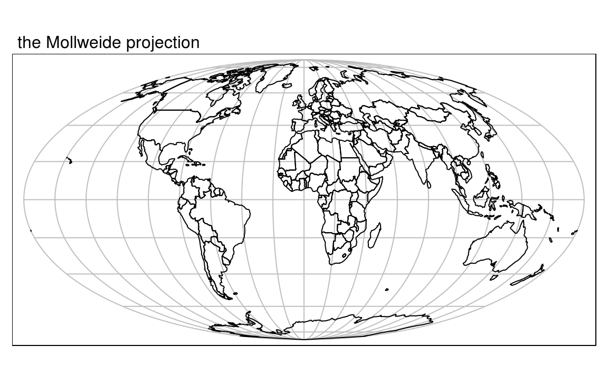
<p class="caption">(\#fig:mollproj)Mollweide projection of the world.</p>
</div>

On the other hand, when mapping the world, it is often desirable to have as little distortion as possible for all spatial properties (area, direction, distance).
One of the most popular projections to achieve this is the Winkel tripel projection (Figure \@ref(fig:wintriproj)).^[
This projection is used, among others, by the National Geographic Society.
]
`st_transform_proj()` from the **lwgeom** package which allows for coordinate transformations to a wide range of CRSs, including the Winkel tripel projection: 


```r
world_wintri = lwgeom::st_transform_proj(world, crs = "+proj=wintri")
```
<!-- plot(world_wintri$geom) -->
<!-- plot(world_wintri$geom, graticule = TRUE) -->

<div class="figure" style="text-align: center">

<p class="caption">(\#fig:wintriproj)Winkel tripel projection of the world.</p>
</div>

\BeginKnitrBlock{rmdnote}<div class="rmdnote">The two main functions for transformation of simple features coordinates are `sf::st_transform()` and `sf::sf_project()`. 
The `st_transform` function uses the GDAL interface to PROJ, while `sf_project()` (which works with two-column numeric matrices, representing points) and `lwgeom::st_transform_proj()` use the PROJ API directly.
The first one is appropriate for most situations, and provides a set of the most often used parameters and well defined transformations.
The second one allows for greater customization of a projection, which includes cases when some of the PROJ parameters (e.g., `+over`) or projection (`+proj=wintri`) is not available in `st_transform()`.</div>\EndKnitrBlock{rmdnote}


Moreover, PROJ parameters can be modified in most CRS definitions.
The below code transforms the coordinates to the Lambert azimuthal equal-area projection centered on longitude and latitude of `0` (Figure \@ref(fig:laeaproj1)).


```r
world_laea1 = st_transform(world, crs = "+proj=laea +x_0=0 +y_0=0 +lon_0=0 +lat_0=0")
```
<!-- plot(world_laea1$geom) -->
<!-- plot(world_laea1$geom, graticule = TRUE) -->

<div class="figure" style="text-align: center">
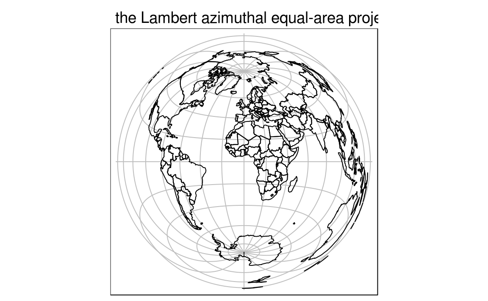
<p class="caption">(\#fig:laeaproj1)Lambert azimuthal equal-area projection of the world centered on longitude and latitude of 0.</p>
</div>

We can change the PROJ parameters, for example the center of the projection, using the `+lon_0` and `+lat_0` parameters. 
The code below gives the map centered on New York City (Figure \@ref(fig:laeaproj2)).


```r
world_laea2 = st_transform(world, crs = "+proj=laea +x_0=0 +y_0=0 +lon_0=-74 +lat_0=40")
```
<!-- plot(world_laea2$geom) -->
<!-- plot(world_laea2$geom, graticule = TRUE) -->

<div class="figure" style="text-align: center">
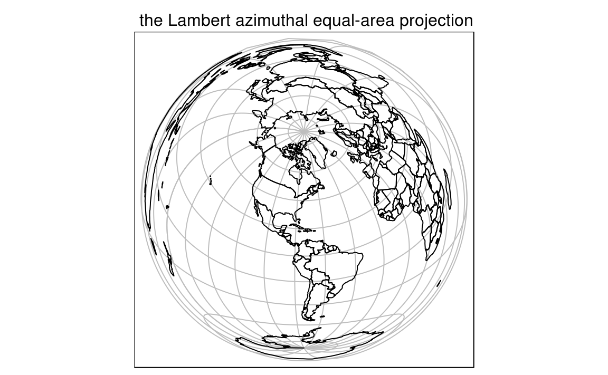
<p class="caption">(\#fig:laeaproj2)Lambert azimuthal equal-area projection of the world centered on New York City.</p>
</div>

More information on CRS modifications can be found in the [Using PROJ](http://proj4.org/usage/index.html) documentation.

<!-- https://github.com/r-spatial/lwgeom/issues/6 -->
<!-- ```{r} -->
<!-- # devtools::install_github("r-spatial/lwgeom") -->
<!-- library(lwgeom) -->
<!-- world_3 = lwgeom::st_transform_proj(world, crs = "+proj=wintri") -->
<!-- plot(world_3$geom) -->
<!-- ``` -->
<!-- http://bl.ocks.org/vlandham/raw/9216751/ -->

## Reprojecting raster geometries

The projection concepts described in the previous section apply equally to rasters.
However, there are important differences in reprojection of vectors and rasters:
transforming a vector object involves changing the coordinates of every vertex but this does not apply to raster data.
Rasters are composed of rectangular cells of the same size (expressed by map units, such as degrees or meters), so it is impossible to transform coordinates of pixels separately.
Raster reprojection involves creating a new raster object, often with a different number of columns and rows than the original.
The attributes must subsequently be re-estimated, allowing the new pixels to be 'filled' with appropriate values.
In other words, raster reprojection can be thought of as two separate spatial operations: a vector reprojection of cell centroids to another CRS (\@ref(reproj-vec-geom)), and computation of new pixel values through resampling (\@ref(aggregation-and-disaggregation)).
Thus in most cases when both raster and vector data are used, it is better to avoid reprojecting rasters and reproject vectors instead.

The raster reprojection process is done with `projectRaster()` from the **raster** package.
Like the `st_transform()` function demonstrated in the previous section, `projectRaster()` takes a geographic object (a raster dataset in this case) and a `crs` argument.
However, `projectRaster()` only accepts the lengthy `proj4string` definitions of a CRS rather than concise EPSG codes.

\BeginKnitrBlock{rmdnote}<div class="rmdnote">It is possible to use a EPSG code in a `proj4string` definition with `"+init=epsg:MY_NUMBER"`.
For example, one can use the `"+init=epsg:4326"` definition to set CRS to WGS84 (EPSG code of 4326).
The PROJ library automatically adds the rest of parameters and converts it into `"+init=epsg:4326 +proj=longlat +datum=WGS84 +no_defs +ellps=WGS84 +towgs84=0,0,0"`,</div>\EndKnitrBlock{rmdnote}

Let's take a look at two examples of raster transformation - using categorical and continuous data.
Land cover data are usually represented by categorical maps.
The `nlcd2011.tif` file provides information for a small area in Utah, USA obtained from [National Land Cover Database 2011](https://www.mrlc.gov/nlcd2011.php) in the NAD83 / UTM zone 12N CRS.


```r
cat_raster = raster(system.file("raster/nlcd2011.tif", package = "spDataLarge"))
crs(cat_raster)
#> CRS arguments:
#>  +proj=utm +zone=12 +ellps=GRS80 +towgs84=0,0,0,0,0,0,0 +units=m
#> +no_defs
```

In this region, 14 land cover classes were distinguished (a full list of NLCD2011 land cover classes can be found at [mrlc.gov](https://www.mrlc.gov/nlcd11_leg.php)):


```r
unique(cat_raster)
#>  [1] 11 21 22 23 31 41 42 43 52 71 81 82 90 95
```

When reprojecting categorical rasters, the estimated values must be the same as those of the original.
This could be done using the nearest neighbor method (`ngb`).
This method assigns new cell values to the nearest cell center of the input raster.
An example is reprojecting `cat_raster` to WGS84, a geographic CRS well suited for web mapping.
The first step is to obtain the proj4 definition of this CRS, which can be done using the [http://spatialreference.org](http://spatialreference.org/ref/epsg/wgs-84/) webpage. 
The final step is to reproject the raster with the `projectRaster()` function which, in the case of categorical data, uses the nearest neighbor method (`ngb`):


```r
wgs84 = "+proj=longlat +ellps=WGS84 +datum=WGS84 +no_defs"
cat_raster_wgs84 = projectRaster(cat_raster, crs = wgs84, method = "ngb")
```

Many properties of the new object differ from the previous one, including the number of columns and rows (and therefore number of cells), resolution (transformed from meters into degrees), and extent, as illustrated in Table \@ref(tab:catraster) (note that the number of categories increases from 14 to 15 because of the addition of `NA` values, not because a new category has been created --- the land cover classes are preserved).
<!-- freq(cat_raster_wgs84) -->
<!-- freq(cat_raster) -->


Table: (\#tab:catraster)Key attributes in the original ('cat_raster') and projected ('cat_raster_wgs84') categorical raster datasets.

CRS      nrow   ncol     ncell   resolution   unique_categories
------  -----  -----  --------  -----------  ------------------
NAD83    1359   1073   1458207      31.5275                  14
WGS84    1394   1111   1548734       0.0003                  15

Reprojecting numeric rasters (with `numeric` or in this case `integer` values) follows an almost identical procedure.
This is demonstrated below with `srtm.tif` in **spDataLarge** from [the Shuttle Radar Topography Mission (SRTM)](https://www2.jpl.nasa.gov/srtm/), which represents height in m above sea level (elevation) with the WGS84 CRS:


```r
con_raster = raster(system.file("raster/srtm.tif", package = "spDataLarge"))
crs(con_raster)
#> CRS arguments:
#>  +proj=longlat +datum=WGS84 +no_defs +ellps=WGS84 +towgs84=0,0,0
```


We will reproject this dataset into a projected CRS, but *not* with the nearest neighbor method which is appropriate for categorical data.
Instead we will use the bilinear method which computes the output cell value based on the four nearest cells in the original raster.
<!--
"Quadric and cubic polynomials are also popular interpolation functions for resampling with more complexity and improved accuracy" [@liu_essential_2009].
However, these interpolation methods are still unavailable in the **raster** package.
-->
The values in the projected dataset are the distance-weighted average of the values from these four cells:
the closer the input cell is to the center of the output cell, the greater its weight.
The following commands create a text string representing the Oblique Lambert azimuthal equal-area projection, and reproject the raster into this CRS, using the `bilinear` method:

<!-- nice link, but does not fit into the text here in my opinion
First, we need to obtain the proj4 definition of the existing projected CRS appropriate for this area or create a new one using the [Projection Wizard](http://projectionwizard.org/) online tool [@savric_projection_2016].
-->


```r
equalarea = "+proj=laea +lat_0=37.32 +lon_0=-113.04"
con_raster_ea = projectRaster(con_raster, crs = equalarea, method = "bilinear")
crs(con_raster_ea)
#> CRS arguments:
#>  +proj=laea +lat_0=37.32 +lon_0=-113.04 +ellps=WGS84
```

Raster reprojection on numeric variables also leads to small changes to values and spatial properties, such as the number of cells, resolution, and extent.
These changes are demonstrated in Table \@ref(tab:rastercrs)^[
Another minor change, that is not represented in Table \@ref(tab:rastercrs), is that the class of the values in the new projected raster dataset is `numeric`.
This is because the `bilinear` method works with continuous data and the results are rarely coerced into whole integer values.
This can have implications for file sizes when raster datasets are saved.
]:


Table: (\#tab:rastercrs)Key attributes original ('con_raster') and projected ('con_raster') continuous raster datasets.

CRS           nrow   ncol    ncell   resolution   mean
-----------  -----  -----  -------  -----------  -----
WGS84          457    465   212505      31.5275   1843
Equal-area     467    478   223226       0.0003   1842


\BeginKnitrBlock{rmdnote}<div class="rmdnote">Of course, the limitations of 2D Earth projections apply as much to vector as to raster data.
At best we can comply with two out of three spatial properties (distance, area, direction).
Therefore, the task at hand determines which projection to choose. 
For instance, if we are interested in a density (points per grid cell or inhabitants per grid cell) we should use an equal-area projection (see also chapter \@ref(location)).</div>\EndKnitrBlock{rmdnote}

There is more to learn about CRSs.
An excellent resource in this area, also implemented in R, is the website R Spatial.
Chapter 6 for this free online book is recommended reading --- see [rspatial.org/spatial/rst/6-crs.html](http://rspatial.org/spatial/rst/6-crs.html)

<!-- why new na? -->

<!-- res option in projectRaster? -->
<!-- note1: in most of the cases reproject vector, not raster-->
<!-- note2: equal area projections are the best for raster calculations -->
<!-- q: should we mentioned gdal_transform? -->

## Exercises

<!-- CRS CONVERSION -->
<!-- 1. vector reprojection exercise (e.g. modification of proj4) -->
1. Create a new object called `nz_wgs` by transforming `nz` object into the WGS84 CRS.
    - Create an object of class `crs` for both and use this to query their CRSs.
    - With reference to the bounding box of each object, what units does each CRS use?
    - Remove the CRS from `nz_wgs` and plot the result: what is wrong with this map of New Zealand and why?

1. Transform the `world` dataset to the transverse Mercator projection (`"+proj=tmerc"`) and plot the result.
What has changed and why?
Try to transform it back into WGS 84 and plot the new object.
Why does the new object differ from the original one?

1. Transform the continuous raster (`cat_raster`) into WGS 84 using the nearest neighbor interpolation method. 
What has changed?
How does it influence the results?

1. Transform the categorical raster (`cat_raster`) into WGS 84 using the bilinear interpolation method.
What has changed?
How does it influence the results?


<!--chapter:end:06-reproj.Rmd-->


# Geographic data I/O {#read-write}

## Prerequisites {-}

- This chapter requires the following packages:


```r
library(sf)
library(raster)
library(tidyverse)
library(spData)
```

## Introduction

This chapter is about reading and writing geographic data.
Geographic data *import* is an essential part of geocomputational software because without data real-world applications are impossible.
The skills taught in this book will enable you to *add value* to data meaning that, for others to benefit from the results, data *output* is also vital.
These two processes go hand-in-hand and are referred to as I/O --- short for input/output --- in Computer Science [@gillespie_efficient_2016].
Hence the title of this chapter.

Geographic data I/O is almost always part of a wider process.
It depends on knowing which datasets are *available*, where they can be *found* and how to *retrieve* them, topics covered in section \@ref(retrieving-data).
This section demonstrates how to access open access *geoportals* which collectively contain many terabytes of data.
There is a wide range of geographic file formats, each of which has pros and cons.
These are described in section \@ref(file-formats).
The process of actually reading and writing such file formats efficiently is not covered until sections \@ref(data-input) and \@ref(data-output) respectively.
The final section (\@ref(visual-outputs)) demonstrates methods for saving visual outputs (maps), in preparation for Chapter \@ref(adv-map) on visualization.

## Retrieving open data {#retrieving-data}

A vast and ever-increasing amount of spatial data is available on the internet, much of which is free to access and use (with appropriate credit given to its providers).
In some ways there is now *too much* data in the sense that there are often multiple places to access the same dataset, some of which may be poor quality.
In this context it vital know where to look.
Instead of attempting to provide a comprehensive guide to this data deluge this section some of the most important sources.
Various 'geoportals' (web services providing geospatial datasets such as [Data.gov](https://catalog.data.gov/dataset?metadata_type=geospatial)) are a good place to start, providing a wide range of data but often only for specific locations (as illustrated in the updated [Wikipedia page](https://en.wikipedia.org/wiki/Geoportal) on the topic).

Some global geoportals overcome this issue.
The [GEOSS portal](http://www.geoportal.org/) and the [Copernicus Open Access Hub](https://scihub.copernicus.eu/), for example, contain many raster datasets with global coverage.
A wealth of vector datasets can be accessed from the National Space Agency (NASA) [SEDAC](http://sedac.ciesin.columbia.edu/) portal and the European Union's [INSPIRE geoportal](http://inspire-geoportal.ec.europa.eu/), with global and regional coverage.

Most geoportals provide a graphical interface allowing datasets to be queried based on characteristics such spatial and temporal extent, the United States Geological Services' [EarthExplorer](https://earthexplorer.usgs.gov/) being a prime example.
*Exploring* datasets interactively on a browser is an effective way of understanding available layers.
*Downloading* data is best done with code, however, from reproducibility and efficiency perspectives.
Downloads can be initiated from the command line using a variety of techniques, primarily via URLs and APIs (see the [Sentinel API](https://scihub.copernicus.eu/twiki/do/view/SciHubWebPortal/APIHubDescription) for example).
Files hosted on static URLs can be downloaded with `download.file()`, as illustrated in the code chunk below which accesses US National Parks data from [catalog.data.gov/dataset/national-parks](https://catalog.data.gov/dataset/national-parks):


```r
download.file(url = "http://nrdata.nps.gov/programs/lands/nps_boundary.zip",
              destfile = "nps_boundary.zip")
unzip(zipfile = "nps_boundary.zip")
f = "temp/Current_Shapes/Data_Store/06-06-12_Posting/nps_boundary.shp"
usa_parks = st_read(dsn = f)
```

## Geographic data packages

A multitude of R packages have been developed for accessing geographic data, some of which are presented in Table \@ref(tab:datapackages)).
These provide interfaces to one or more spatial libraries or geoportals and aim make data access even quicker from the command line.

<!-- add sentinel2 package as soon as it is published on CRAN https://github.com/IVFL-BOKU/sentinel2-->

Table: (\#tab:datapackages)Selected R packages for spatial data retrieval.

Package name    Description                                                                                                  
--------------  -------------------------------------------------------------------------------------------------------------
getlandsat      Provides access to Landsat 8 data.                                                                           
osmdata         Download and import of OpenStreetMap data.                                                                   
raster          The `getData()` function downloads and imports administrative country, SRTM/ASTER elevation, WorldClim data. 
rnaturalearth   Functions to download Natural Earth vector and raster data, including world country borders.                 
rnoaa           An R interface to National Oceanic and Atmospheric Administration (NOAA) climate data.                       
rWBclimate      An access to the World Bank climate data.                                                                    

<!-- https://cdn.rawgit.com/Nowosad/Intro_to_spatial_analysis/05676e29/Intro_to_spatial_analysis.html#39 -->
<!-- Maybe add a section to Data I/O on where and how to retrieve data (with a focus on free data): osmdata (OpenStreetMap; maybe mention TomTom, HERE), Landsat (wrspathrow), Sentinel (mention Python API), AVHRR, RapidEye rgbif, letsR, etc. Of course, point to Transforming science through open data project (https://www.ropensci.org) -->
<!-- https://github.com/lbusett/MODIStsp -->

It should be emphasised that Table \@ref(tab:datapackages) represents only a small of available geographic data packages.
Other notable packages include **GSODR**, which provides Global Summary Daily Weather Data in R (see the package's [README](https://github.com/ropensci/GSODR) for an overview of weather data sources);
**tidycensus** and **tigris**, which provide socio-demographic vector data for the USA; and **hddtools**, which provides access to a range of hydrological datasets.

Each data package has its own syntax for accessing data.
This diversity is demonstrated in the subsequent code chunks, which show how to get data using three packages from Table \@ref(tab:datapackages).
Country borders are often useful and these can be accessed with the `ne_countries()` function from the **rnaturalearth** package as follows:


```r
library(rnaturalearth)
usa = ne_countries(country = "United States of America") # United States borders
class(usa)
#> [1] "SpatialPolygonsDataFrame"
#> attr(,"package")
#> [1] "sp"
# alternative way of accessing the data, with raster::getData()
# getData("GADM", country = "USA", level = 0)
```

By default **rnaturalearth** returns objects of class `Spatial`.
The result can be converted into an `sf` objects with `st_as_sf()` as follows:


```r
usa_sf = st_as_sf(usa)
```

A second example downloads a series of rasters containing global monthly precipitation sums with spatial resolution is ten minutes.
The result is a multilayer object of class `RasterStack`.


```r
library(raster)
worldclim_prec = getData(name = "worldclim", var = "prec", res = 10)
class(worldclim_prec)
#> [1] "RasterStack"
#> attr(,"package")
#> [1] "raster"
```

A third example uses the **osmdata** package [@R-osmdata] to find parks from the OpenStreetMap (OSM) database.
As illustrated in the code-chunk below, queries begin with the function `opq()` (short for OpenStreetMap query), the first argument of which is bounding box, or text string representing a bounding box (the city of Leeds in this case).
The result is passed to a function for selecting which OSM elements we're interested in (parks in this case), represented by *key-value pairs*, which in turn is passed to the function `osmdata_sf()` which does the work of downloading the data and converting it into a list of `sf` objects (see `vignette('osmdata')` for further details):


```r
library(osmdata)
parks = opq(bbox = "leeds uk") %>% 
  add_osm_feature(key = "leisure", value = "park") %>% 
  osmdata_sf()
```

OpenStreetMap is a vast global database of crowd-sourced data and it is growing daily.
Although the quality is not as spatially consistent as many official datasets, OSM data have many advantages: they are globally available free of charge and using crowd-source data can encourage 'citizen science' and contributions back to the digital commons.
Further examples of **osmdata** in action are provided in Chapters \@ref(transport),  \@ref(location) and \@ref(gis).

Sometimes, packages come with inbuilt datasets.
These can be accessed in four ways: by attaching the package (if the package uses 'lazy loading' as **spData** does), with `data(dataset)`, by referring to the dataset with `pkg::dataset` or with `system.file()` to access raw data files.
The following code chunk illustrates the latter two options using the `world` (already loaded by attaching its parent package with `library(spData)`):^[
For more information on data import with R packages see sections 5.5 and 5.6 of @gillespie_efficient_2016.
]


```r
world2 = spData::world
world3 = st_read(system.file("shapes/world.gpkg", package = "spData"))
```

## File formats

Spatial datasets are usually stored as files or in spatial databases.
File formats can either store vector or raster data, while spatial databases such as [PostGIS](https://trac.osgeo.org/postgis/wiki/WKTRaster) can store both (see also section \@ref(postgis)).
Today the variety of file formats may seem bewildering but there has been much consolidation and standardization since the beginnings of GIS software in the 1960s when the first widely distributed program ([SYMAP](https://news.harvard.edu/gazette/story/2011/10/the-invention-of-gis/)) for spatial analysis was created at Harvard University [@coppock_history_1991].

GDAL (which should be pronounced "goo-dal", with the double o making a reference to object-orientation), the Geospatial Data Abstraction Library, has resolved many issues associated with incompatibility between geographic file formats since its release in 2000.
GDAL provides a unified and high-performance interface for reading and writing of many raster and vector data formats.
Many open and proprietary GIS programs, including GRASS, ArcGIS and QGIS, use GDAL behind their GUIs for doing the legwork of ingesting and spitting-out geographic data in appropriate formats.
<!-- GDAL (it's great - you can read, convert, and very often (though not always) write) -->
<!-- GDAL info "it is possible to have smaller number of supported formats than there are on the GDAL webpage; you may need to recompile..." -->

GDAL provides access to more than 200 vector and raster data formats.
<!-- In the same time, they could differ in many ways. -->
<!-- Spatial data could be stored as a single file (e.g. GeoPackage), multiple files (e.g. ESRI Shapefile), or folders (ESRI ArcInfo Coverages). -->
<!-- way of storage (single file, multiple files, folders) -->
Table \@ref(tab:formats) presents some basic information about selected and often used spatial file formats.

<!-- simple features are missing from this table-->

Table: (\#tab:formats)Selected spatial file formats.

Name                Extension              Info                                                                                                                                                                                                                                                                                     Type                Model          
------------------  ---------------------  ---------------------------------------------------------------------------------------------------------------------------------------------------------------------------------------------------------------------------------------------------------------------------------------  ------------------  ---------------
ESRI Shapefile      .shp (the main file)   One of the most popular vector file formats. Consists of at least three files. The main files size cannot exceed 2 GB. It lacks support for mixed type. Column names are limited to 10 characters, and number of columns are limited at 255. It has poor support for Unicode standard.   Vector              Partially open 
GeoJSON             .geojson               Extends the JSON exchange format by including a subset of the simple feature representation.                                                                                                                                                                                             Vector              Open           
KML                 .kml                   XML-based format for spatial visualization, developed for use with Google Earth. Zipped KML file forms the KMZ format.                                                                                                                                                                   Vector              Open           
GPX                 .gpx                   XML schema created for exchange of GPS data.                                                                                                                                                                                                                                             Vector              Open           
GeoTIFF             .tiff                  GeoTIFF is one of the most popular raster formats. Its structure is similar to the regular `.tif` format, however, additionally stores  the raster header.                                                                                                                               Raster              Open           
Arc ASCII           .asc                   Text format where the first six lines represent the raster header, followed by the raster cell values arranged in rows and columns.                                                                                                                                                      Raster              Open           
R-raster            .gri, .grd             Native raster format of the R-package raster.                                                                                                                                                                                                                                            Raster              Open           
SQLite/SpatiaLite   .sqlite                SQLite is a standalone, relational database management system. It is used as a default database driver in GRASS GIS 7. SpatiaLite is the spatial extension of SQLite providing support for simple features.                                                                              Vector and raster   Open           
ESRI FileGDB        .gdb                   Collection of spatial and nonspatial objects created in the ArcGIS software. It allows storage of multiple feature classes and enables use of topological definitions. Limited access to this format is provided by GDAL with the use of the OpenFileGDB and FileGDB drivers.            Vector and raster   Proprietary    
GeoPackage          .gpkg                  Lightweight database container based on SQLite allowing an easy and platform-independent exchange of geodata                                                                                                                                                                             Vector and raster   Open           

An important development ensuring the standardization and open-sourcing of file formats was the founding of the Open Geospatial Consortium ([OGC](http://www.opengeospatial.org/)) in 1994.
Beyond defining the simple features data model (see section \@ref(intro-sf)), the OGC also coordinates the development of open standards, for example as used in file formats such as KML and GeoPackage.
Open file formats of the kind endorsed by the OGC have several advantages over proprietary formats: the standards are published, ensure transparency and open up the possibility for users to further develop and adjust the file formats to their specific needs.

ESRI' Shapefile is the most popular vector data exchange format.
However, it is not an open format (though its specification is open).
It was developed in the early 1990s and has a number of limitations.
First of all, it is a multi-file format, which consists of at least three files.
It only supports 255 columns, column names are restricted to ten characters and the file size limit is to 2GB.
Furthermore, Shapefile does not support all possible geometry types, for example, it is unable to distinguish between a polygon and a multipolygon.^[To learn more about ESRI Shapefile limitations and possible alternative file formats, visit http://switchfromshapefile.org/.]
Despite these limitations, a viable alternative had been missing for a long time. 
In the meantime, [GeoPackage](https://www.geopackage.org/) emerged, and seems to be a more than suitable replacement candidate for ESRI's Shapefile.
Geopackage is a format for exchanging geospatial information and an OGC standard. 
The GeoPackage standard describes the rules how to store geospatial information in a tiny SQLite container.
Hence, GeoPackage is a lightweight spatial database container, which allows the storage of vector and raster data but also of non-spatial data and extensions.
Aside from GeoPackage there are other geospatial data exchange formats worth checking out (Table \@ref(tab:formats)).

## Data Input (I) {#data-input}

Executing commands such as `sf::st_read()` (the main function we use for loading vector data) or `raster::raster()` (the main function used for loading raster data) silently sets off a chain of events that reads data from files.
<!-- transition is unclear, not sure what you would like to say -->
Moreover, there are many R packages containing a wide range of spatial data or providing simple access to different data sources.
All of them load the data into R or, more precisely, assign objects to your workspace, stored in RAM accessible from the [`.GlobalEnv`](http://adv-r.had.co.nz/Environments.html) of the R session.

### Vector data

Spatial vector data comes in a wide variety of file formats, most of which can be read-in via the **sf** function `st_read()`.
Behind the scenes this calls GDAL.
To find out which data formats **sf** supports, run `st_drivers()`. 
Here, we show only the first five drivers (see Table \@ref(tab:drivers)):


```r
sf_drivers = st_drivers()
head(sf_drivers, n = 5)
```


Table: (\#tab:drivers)Sample of available drivers for reading/writing vector data (it could vary between different GDAL versions).

name             long_name                       write   copy    is_raster   is_vector   vsi  
---------------  ------------------------------  ------  ------  ----------  ----------  -----
ESRI Shapefile   ESRI Shapefile                  TRUE    FALSE   FALSE       TRUE        TRUE 
GPX              GPX                             TRUE    FALSE   FALSE       TRUE        TRUE 
KML              Keyhole Markup Language (KML)   TRUE    FALSE   FALSE       TRUE        TRUE 
GeoJSON          GeoJSON                         TRUE    FALSE   FALSE       TRUE        TRUE 
GPKG             GeoPackage                      TRUE    TRUE    TRUE        TRUE        TRUE 

<!-- One of the major advantages of **sf** is that it is fast. -->
<!-- reference to the vignette -->
The first argument of `st_read()` is `dsn`, which should be a text string or an object containing a single text string.
The content of a text string could vary between different drivers.
In most cases, as with the ESRI Shapefile (`.shp`) or the `GeoPackage` format (`.gpkg`), the `dsn` would be a file name.
`st_read()` guesses the driver based on the file extension, as illustrated for a `.gpkg` file below:


```r
vector_filepath = system.file("shapes/world.gpkg", package = "spData")
world = st_read(vector_filepath)
#> Reading layer `world' from data source `/home/travis/R/Library/spData/shapes/world.gpkg' using driver `GPKG'
#> Simple feature collection with 177 features and 10 fields
#> geometry type:  MULTIPOLYGON
#> dimension:      XY
#> bbox:           xmin: -180 ymin: -90 xmax: 180 ymax: 83.6
#> epsg (SRID):    4326
#> proj4string:    +proj=longlat +datum=WGS84 +no_defs
```

For some drivers, `dsn` could be provided as a folder name, access credentials for a database, or a GeoJSON string representation (see the examples of the `st_read()` help page for more details).

Some vector driver formats can store multiple data layers.
By default, `st_read` automatically reads the first layer of the file specified in `dsn`, however, using the `layer` argument you can specify any other layer.

Naturally, some options are specific to certain drivers.^[
A list of supported vector formats and options can be found at http://gdal.org/ogr_formats.html.
]
For example, think of coordinates stored in a spreadsheet format (`.csv`).
To read in such files as spatial objects, we naturally have to specify the names of the columns (`X` and `Y` in our example below) representing the coordinates.
We can do this with the help of the `options` parameter.
To find out about possible options, please refer to the 'Open Options' section of the corresponding GDAL driver description.
For the comma-separated value (csv) format, visit http://www.gdal.org/drv_csv.html.


```r
cycle_hire_txt = system.file("misc/cycle_hire_xy.csv", package = "spData")
cycle_hire_xy = st_read(cycle_hire_txt, options = c("X_POSSIBLE_NAMES=X",
                                                    "Y_POSSIBLE_NAMES=Y"))
```

Instead of columns describing xy-coordinates, a single column can also contain the geometry information.
Well-known text (WKT), well-known binary (WKB), and the GeoJSON formats are examples of this.
For instance, the `world_wkt.csv` file has a column named `WKT` representing polygons of the world's countries.
We will again use the `options` parameter to indicate this.
Here, we will use `read_sf()` which does exactly the same as `st_read()` except it does not print the driver name to the console and stores strings as characters instead of factors.


```r
world_txt = system.file("misc/world_wkt.csv", package = "spData")
world_wkt = read_sf(world_txt, options = "GEOM_POSSIBLE_NAMES=WKT")
# the same as
world_wkt = st_read(world_txt, options = "GEOM_POSSIBLE_NAMES=WKT", 
                    quiet = TRUE, stringsAsFactors = FALSE)
```

\BeginKnitrBlock{rmdnote}<div class="rmdnote">Not all of the supported vector file formats store information about their coordinate reference system.
In these situations, it is possible to add the missing information using the `st_set_crs()` function.
Please refer also to section \@ref(crs-intro) for more information.</div>\EndKnitrBlock{rmdnote}

As a final example, we will show how `st_read()` also reads KML files.
A KML file stores geographic information in XML format - a data format for the creation of web pages and the transfer of data in an application-independent way [@nolan_xml_2014].
Here, we access a KML file from the web.
This file contains more than one layer.
`st_layers()` lists all available layers.
We choose the first layer `Placemarks` and say so with the help of the `layer` parameter in `read_sf()`.


```r
url = "https://developers.google.com/kml/documentation/KML_Samples.kml"
st_layers(url)
#> Driver: LIBKML 
#> Available layers:
#>               layer_name geometry_type features fields
#> 1             Placemarks                      3     11
#> 2      Styles and Markup                      1     11
#> 3       Highlighted Icon                      1     11
#> 4        Ground Overlays                      1     11
#> 5        Screen Overlays                      0     11
#> 6                  Paths                      6     11
#> 7               Polygons                      0     11
#> 8          Google Campus                      4     11
#> 9       Extruded Polygon                      1     11
#> 10 Absolute and Relative                      4     11
kml = read_sf(url, layer = "Placemarks")
```

### Raster data

Similar to vector data, raster data comes in many file formats with some of them supporting even multilayer files.
**raster**'s `raster()` command reads in a single layer.


```r
raster_filepath = system.file("raster/srtm.tif", package = "spDataLarge")
single_layer = raster(raster_filepath)
```

In case you want to read in a single band from a multilayer file use the `band` parameter to indicate a specific layer.


```r
multilayer_filepath = system.file("raster/landsat.tif", package = "spDataLarge")
band3 = raster(multilayer_filepath, band = 3)
```

If you want to read in all bands, use `brick()` or `stack()`.


```r

multilayer_brick = brick(multilayer_filepath)
multilayer_stack = stack(multilayer_filepath)
```

Please refer to section \@ref(raster-classes) for information on the difference between raster stacks and bricks.

<!-- ### Databases -->
<!-- postgis input example -->

## Data output (O) {#data-output}

<!--maybe we can come up with an intro which is a bit more compelling-->
Writing spatial data allows you to convert from one format to another and to save newly created objects.
Depending on the data type (vector or raster), object class (e.g `multipoint` or `RasterLayer`), and type and amount of stored information (e.g. object size, range of values) - it is important to know how to store spatial files in the most efficient way.
The next two sections will demonstrate how to do this.

<!-- should we add a note about recommended way to decide on a file name, for example "don't use spaces in the name", "create descriptive names" -->

### Vector data


The counterpart of `st_read()` is `st_write()`.
It allows you to write **sf** objects to a wide range of geographic vector file formats, including the most common such as `.geojson`, `.shp` and `.gpkg`.
Based on the file name, `st_write()` decides automatically which driver to use. 
The speed of the writing process depends also on the driver.
<!-- ref to the vignette -->


```r
st_write(obj = world, dsn = "world.gpkg")
#> Writing layer `world' to data source `world.gpkg' using driver `GPKG'
#> features:       177
#> fields:         10
#> geometry type:  Multi Polygon
```

**Note**: if you try to write to the same data source again, the function will fail:


```r
st_write(obj = world, dsn = "world.gpkg")
#> Updating layer `world' to data source `/home/travis/build/Robinlovelace/geocompr/world.gpkg' using driver `GPKG'
#> Warning in CPL_write_ogr(obj, dsn, layer, driver, as.character(dataset_options), : GDAL Error 1: Layer world already exists, CreateLayer failed.
#> Use the layer creation option OVERWRITE=YES to replace it.
#> Creating layer world failed.
#> Error in CPL_write_ogr(obj, dsn, layer, driver, as.character(dataset_options), : Layer creation failed.
```

<!-- ##   GDAL Error 1: Layer world.gpkg already exists, CreateLayer failed. -->
<!-- ## Use the layer creation option OVERWRITE=YES to replace it. -->

The error message provides some information as to why the function failed.
The `GDAL Error 1` statement makes clear that the failure occurred at the GDAL level.
Additionally, the suggestion to use `OVERWRITE=YES` provides a clue about how to fix the problem.
However, this is not a `st_write()` argument, it is a GDAL option.
Luckily, `st_write` provides a `layer_options` argument through which we can pass driver-dependent options:


```r
st_write(obj = world, dsn = "world.gpkg", layer_options = "OVERWRITE=YES")
```

Another solution is to use the `st_write()` argument `delete_layer`. Setting it to `TRUE` deletes already existing layers in the data source before the function attempts to write (note there is also a `delete_dsn` argument):


```r
st_write(obj = world, dsn = "world.gpkg", delete_layer = TRUE)
```

You can achieve the same with `write_sf()` since it is equivalent to (technically an *alias* for) `st_write()`, except that its defaults for `delete_layer` and `quiet` is `TRUE`.


```r
write_sf(obj = world, dsn = "world.gpkg")
```

<!-- how about saving multilayer gpkg? -->
The `layer_options` argument could be also used for many different purposes.
One of them is to write spatial data to a text file.
This can be done by specifying `GEOMETRY` inside of `layer_options`. 
It could be either `AS_XY` for simple point datasets (it creates two new columns for coordinates) or `AS_WKT` for more complex spatial data (one new column is created which contains the well-known-text representation of spatial objects).


```r
st_write(cycle_hire_xy, "cycle_hire_xy.csv", layer_options = "GEOMETRY=AS_XY")
st_write(world_wkt, "world_wkt.csv", layer_options = "GEOMETRY=AS_WKT")
```

### Raster data

The `writeRaster()` function saves `Raster*` objects to files on disk. 
The function expects input regarding output data type and file format, but also accepts GDAL options specific to a selected file format (see `?writeRaster` for more details).

The **raster** package offers nine data types when saving a raster: LOG1S, INT1S, INT1U, INT2S, INT2U, INT4S, INT4U, FLT4S, and FLT8S.^[
Using INT4U is not recommended as R does not support 32-bit unsigned integers.<!--recheck this info-->
]
The data type determines the bit representation of the raster object written to disk (\@ref(tab:datatypes)).
Which data type to use depends on the range of the values of your raster object.
The more values a data type can represent, the larger the file will get on disk.
Commonly, one would use LOG1S for bitmap (binary) rasters.
Unsigned integers (INT1U, INT2U, INT4U) are suitable for categorical data, while float numbers (FLT4S and FLTS8S) usually represent continuous data.
`writeRaster()` uses FLT4S as the default.
While this works in most cases, the size of the output file will be unnecessarily large if you save binary or categorical data.
Therefore, we would recommend to use the data type that needs the least storage space but is still able to represent all values (check the range of values with the `summary()` function).


Table: (\#tab:datatypes)Data types supported by the raster package.

Data type   Minimum value    Maximum value 
----------  ---------------  --------------
LOG1S       FALSE (0)        TRUE (1)      
INT1S       -127             127           
INT1U       0                255           
INT2S       -32,767          32,767        
INT2U       0                65,534        
INT4S       -2,147,483,647   2,147,483,647 
INT4U       0                4,294,967,296 
FLT4S       -3.4e+38         3.4e+38       
FLT8S       -1.7e+308        1.7e+308      

The file extension determines the output file when saving a `Raster*` object to disk.
For example, the `.tif` extension will create a GeoTIFF file:


```r
writeRaster(x = single_layer,
            filename = "my_raster.tif",
            datatype = "INT2U")
```

The `raster` file format (native to the `raster` package) is used when a file extension is invalid or missing. 
Some raster file formats come with additional options.
You can use them with the `options` [parameter](http://www.gdal.org/formats_list.html).
GeoTIFF files, for example, can be compressed using `COMPRESS`:
<!-- GeoTIFF files, for example, can be compressed using the `COMPRESS` option^[Find out about GeoTIFF options under http://www.gdal.org/frmt_gtiff.html.]: -->


```r
writeRaster(x = single_layer,
            filename = "my_raster.tif",
            datatype = "INT2U",
            options = c("COMPRESS=DEFLATE"),
            overwrite = TRUE)
```

Note that `writeFormats()` returns a list with all supported file formats on your computer.

<!-- ### Databases -->
<!-- postgis output example -->

## Visual outputs

R supports many different static and interactive graphics formats.
The most general method to save a static plot is to open a graphic device, create a plot, and close it, for example:


```r
png(filename = "lifeExp.png", width = 500, height = 350)
plot(world["lifeExp"])
dev.off()
```

Other available graphic devices include `pdf()`, `bmp()`, `jpeg()`, `png()`, and `tiff()`. 
You can specify several properties of the output plot, including width, height and resolution.

Additionally, several graphic packages provide their own functions to save a graphical output.
For example, the **tmap** package has the `tmap_save()` function.
You can save a `tmap` object to different graphic formats by specifying the object name and a file path to a new graphic file.


```r
library(tmap)
tmap_obj = tm_shape(world) +
  tm_polygons(col = "lifeExp")
tmap_save(tm  = tmap_obj, filename = "lifeExp_tmap.png")
```

<!-- Note about that the `plot` function do not create an object -->
<!-- ```{r} -->
<!-- a = plot(world["lifeExp"]) -->
<!-- ``` -->

On the other hand, you can save interactive maps created in the `mapview` package as an HTML file or image using the `mapshot()` function:

<!-- example doesn't work, problem with colors I guess -->

```r
library(mapview)
mapview_obj = mapview(world, zcol = "lifeExp", legend = TRUE)
mapshot(mapview_obj, file = "my_interactive_map.html")
```

## Exercises

1. List and describe three types of vector, raster, and geodatabase formats.

1. Name at least two differences between `read_sf()` and the more well-known function `st_read()`.

1. Read the `cycle_hire_xy.csv` file from the **spData** package (Hint: it is located in the `misc\` folder).
What is a geometry type of the loaded object? 

1. Download the borders of Germany using **rnaturalearth**, and create a new object called `germany_borders`.
Write this new object to a file of the GeoPackage format.

1. Download the global monthly minimum temperature with a spatial resolution of five minutes using the **raster** package.
Extract the June values, and save them to a file named `tmin_june.tif` file (hint: use `raster::subset()`).

1. Create a static map of Germany's borders, and save it to a PNG file.

1. Create an interactive map using data from the `cycle_hire_xy.csv` file. 
Export this map to a file called `cycle_hire.html`.

<!--chapter:end:07-read-write-plot.Rmd-->


# (PART) Extensions {-}

# Making maps with R {#adv-map}

## Prerequisites {-}

- This chapter requires the following packages that we have already been using:


```r
library(sf)
library(raster)
library(tidyverse)
library(spData)
library(spDataLarge)
```

- In addition it uses the following visualization packages:


```r
library(tmap)    # for static and interactive maps
library(leaflet) # for interactive maps
library(mapview) # for interactive maps
library(shiny)   # for web applications
```

## Introduction

A satisfying and important aspect of geographic research is producing and communicating the results in the form of maps.
Map making --- the art of Cartography --- is an ancient skill that involves precision, consideration of the map-reader and often an element of creativity.
Basic plotting of geographic data is straightforward in R with `plot()` (see section \@ref(basic-map)), and it is possible to create advanced maps using base R methods [@murrell_r_2016].

This chapter focuses on dedicated map-making packages, especially **tmap**, for reasons that are explained in section \@ref(static-maps).
There are a multitude of options but when learning a new skill (in this case map making), it makes sense to gain depth-of-knowledge in one package before branching out, a concept that also applies to the choice of programming language as we saw in Chapter \@ref(intro).
It is worth developing advanced map making skills not only because it is a fun activity that can produce beautiful results. 
Map making also has important practical applications.
A carefully crafted map can help ensure that time spent in the analysis phases of geocomputational projects --- for example using methods covered in chapters \@ref(spatial-class) to \@ref(reproj-geo-data) --- are communicated effectively [@brewer_designing_2015]:

> Amateur-looking maps can undermine your audience’s ability to understand important information and weaken the presentation of a professional data investigation.

<!-- Todo: consider adding footnote saying it's good to focus on visualization early as in R4DS but that we cover it later because there's a risk of getting distracted by pretty pictures to the detriment of good analysis. -->

Maps have been used for several thousand years for a wide variety of purposes.
Historic examples include maps of buildings and land ownership in the Old Babylonian dynasty more than 3000 years ago and Ptolemy's world map in his masterpiece *Geography* nearly 2000 years ago [@talbert_ancient_2014].
However, maps have historically been out of reach for everyday people.

Modern computing has the potential to change this.
Map making skills can also help meet research and public engagement objectives.
From a research perspective clear maps are often the best way to present the results of geocomputational research.
From policy and 'citizen science' perspectives, attractive and engaging maps can help change peoples' minds, based on the evidence.
Map making is therefore a critical part of geocomputation and its emphasis not only on describing, but also *changing* the world (see Chapter \@ref(intro)).

<!-- info about relation between efficiency and editability -->
<!-- intro to the chapter structure -->

## Static maps

Static maps are the most common type of visual output from geocomputation.
They are fixed images that can be included in printed outputs or published online.
The majority of maps contained in this book are static maps saved as `.png` files (interactive maps are covered in section \@ref(interactive-maps)).

The generic `plot()` function is often the fastest way to create static maps from vector and raster spatial objects, as demonstrated in sections \@ref(basic-map) and \@ref(basic-map-raster).
Sometimes the simplicity and speed of this approach is sufficient, especially during the development phase of a project:
when using R interactively to understand a geographic dataset, you will likely be the only person who sees them.
The base R approach is also extensible, with `plot()` offering dozens of arguments and the **grid** providing functions for low-level control of graphical outputs, --- see *R Graphics* [@murrell_r_2016], especially  Chapter [14](https://www.stat.auckland.ac.nz/~paul/RG2e/chapter14.html).
The focus of this section, however, is making static maps with **tmap**.

Why **tmap**?
It is a powerful and flexible map-making package with sensible defaults.
It has a concise syntax that allows for the creation of attractive maps with minimal code, that will be familiar to **ggplot2** users.
Furthermore, **tmap** has a unique capability to generate static and interactive maps using the same code via `tmap_mode()`.
It accepts a wider range of spatial classes (including `raster` objects) than alternatives such as **ggplot2**, as documented in vignettes [`tmap-nutshell`](https://cran.r-project.org/web/packages/tmap/vignettes/tmap-nutshell.html) and [`tmap-modes`](https://cran.r-project.org/web/packages/tmap/vignettes/tmap-modes.html) and an academic paper on the subject [@tennekes_tmap_2018].
This section teaches how to make static maps with **tmap**, emphasizing the important aesthetic and layout options.

### tmap basics

Like **ggplot2**, **tmap** is based on the idea of a 'grammar of graphics' [@wilkinson_grammar_2005].
This involves a separation between the input data and the aesthetics (how data are visualised): each input dataset can be 'mapped' in a range of different ways including location on the map (defined by data's `geometry`), color, and other visual variables.
The basic building block is `tm_shape()` (which defines input data, raster and vector objects), followed by one or more layer elements such as `tm_fill()` and `tm_dots()`.
This layering is demonstrated in the chunk below, which generates the maps presented in Figure \@ref(fig:tmshape):


```r
# Add fill layer to nz shape
tm_shape(nz) +
  tm_fill() 
# Add border layer to nz shape
tm_shape(nz) +
  tm_borders() 
# Add fill and border layers to nz shape
tm_shape(nz) +
  tm_fill() +
  tm_borders() 
```

<div class="figure" style="text-align: center">

<p class="caption">(\#fig:tmshape)New Zealand's shape plotted with fill (left), border (middle) and fill *and* border (right) layers added using **tmap** functions.</p>
</div>

The object passed to `tm_shape()` in this case is `nz`, an `sf` object representing the regions of New Zealand (see section \@ref(intro-sf) for more on `sf` objects).
Layers are added to represent `nz` visually, with `tm_fill()` and `tm_borders()` creating shaded areas (left panel) and border outlines (middle panel) in Figure \@ref(fig:tmshape), respectively.

This is an intuitive approach to map making:
the common task of *adding* new layers is undertaken by the addition operator `+`, followed by `tm_*()`.
The asterisk (\*) refers to a wide range of layer types which have self-explanatory names including `fill`, `borders` (demonstrated above), `bubbles`, `text` and `raster`
(see the help page [`tmap-element`](https://www.rdocumentation.org/packages/tmap/versions/2.0/topics/tmap-element) for a full list).
This layering is illustrated in the right panel of Figure \@ref(fig:tmshape), the result of adding a border *on top of* the fill layer:
note the `tm_borders()` call *after* `tm_fill() +` in the previous code chunk.

\BeginKnitrBlock{rmdnote}<div class="rmdnote">`qtm()` is a handy function for **q**uickly creating **t**map **m**aps (hence the snappy name).
It is concise and provides a good default visualization in many cases:
`qtm(nz)`, for example, is equivalent to `tm_shape(nz) + tm_fill() + tm_borders()`.
Further, layers can be added concisely using multiple `qtm()` calls, such as `qtm(nz) + qtm(nz_height)`.
The disadvantage is that it makes aesthetics of individual layers harder to control, explaining why we avoid teaching it in this chapter.</div>\EndKnitrBlock{rmdnote}

### Map objects {#map-obj}

A useful feature of **tmap** is its ability to store *objects* representing maps.
The code chunk below demonstrates this by saving the last plot in Figure \@ref(fig:tmshape) as an object of class `tmap` (note the use of `tm_polygons()` which condenses `tm_fill()  + tm_borders()` into a single function):


```r
map_nz = tm_shape(nz) + tm_polygons()
class(map_nz)
#> [1] "tmap"
```

`map_nz` can be plotted later, for example by adding additional layers (as shown below) or simply running `map_nz` in the console, which is equivalent to `print(map_nz)`.

New *shapes* can be added with `+ tm_shape(new_obj)`.
In this case `new_obj` represents a new spatial object to be plotted on top of preceding layers.
When a new shape is added in this way all subsequent aesthetic functions refer to it, until another new shape is added.
This syntax allows the creation of maps with multiple shapes and layers, as illustrated in the next code chunk which uses the function `tm_raster()` to plot a raster layer (with `alpha` set to make the layer semi-transparent):


```r
map_nz1 = map_nz +
  tm_shape(nz_elev) + tm_raster(alpha = 0.7)
```

Building on the previously created `map_nz` object, the preceding code creates a new map object `map_nz1` that contains another shape (`nz_eleve`) representing average elevation across New Zealand (see Figure \@ref(fig:tmlayers), left).
More shapes and layers can be added, as illustrated in the code chunk below which creates `nz_water`, representing New Zealand's [territorial waters](https://en.wikipedia.org/wiki/Territorial_waters), and adds the resulting lines to an existing map object.


```r
nz_water = st_union(nz) %>% st_buffer(22200) %>% 
  st_cast(to = "LINESTRING")
map_nz2 = map_nz1 +
  tm_shape(nz_water) + tm_lines()
```

There is no limit to the number of layers or shapes that can be added to `tmap` objects.
The same shape can even be used multiple times.
The final map illustrated in Figure \@ref(fig:tmlayers) is created by adding a layer representing high points (stored in the object `nz_height`) onto the previously created `map_nz2` object with `tm_dots()` (see `?tm_dots` and `?tm_bubbles` for details on **tmap**'s point plotting functions).
The resulting map, which has four layers, is illustrated in the right-hand panel of:


```r
map_nz3 = map_nz2 +
  tm_shape(nz_height) + tm_dots()
```

A useful and little known feature of **tmap** is that multiple map objects can be arranged in a single 'metaplot' with `tmap_arrange()`.
This is demonstrated in the code chunk below which plots `map_nz1` to `map_nz3`, resulting in Figure \@ref(fig:tmlayers).


```r
tmap_arrange(map_nz1, map_nz2, map_nz3)
#> Legend labels were too wide. The labels have been resized to 0.61, 0.43, 0.43, 0.43, 0.43. Increase legend.width (argument of tm_layout) to make the legend wider and therefore the labels larger.
#> Legend labels were too wide. The labels have been resized to 0.61, 0.43, 0.43, 0.43, 0.43. Increase legend.width (argument of tm_layout) to make the legend wider and therefore the labels larger.
#> Legend labels were too wide. The labels have been resized to 0.61, 0.43, 0.43, 0.43, 0.43. Increase legend.width (argument of tm_layout) to make the legend wider and therefore the labels larger.
```

<div class="figure" style="text-align: center">
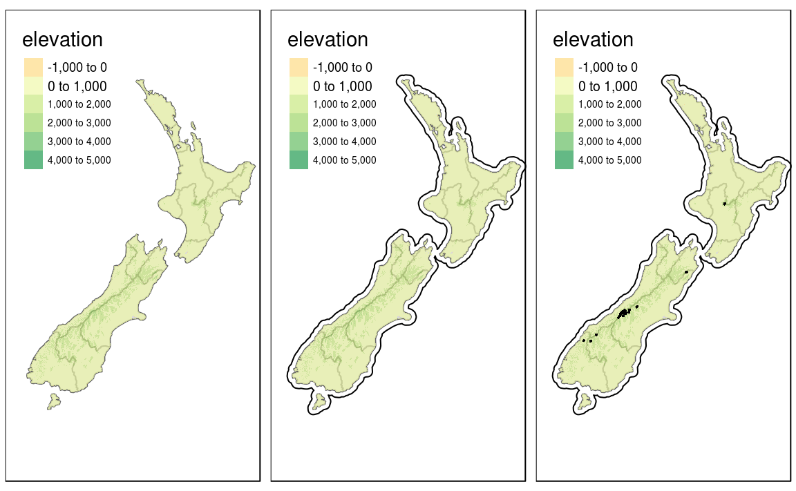
<p class="caption">(\#fig:tmlayers)Maps with additional layers added to the final map of Figure 9.1.</p>
</div>

Additional elements can also be added with the `+` operator.
Aesthetic settings, however, are controlled by arguments to layer functions.

### Aesthetics

The plots in the previous section demonstrate **tmap**'s default aesthetic settings.
Grey shades are used for `tm_fill()` and  `tm_bubbles()` layers and a continuous black line is used to represent lines created with `tm_lines()`.
Of course, these default values and other aesthetics can be overridden.
The purpose of this section is to show how.

There are two main types of map aesthetics: those that change with the data and those that are constant.
Unlike **ggplot2**, which uses the helper function `aes()` to represent variable aesthetics, **tmap** accepts aesthetic arguments that are either variable fields (based on column names) or constant values.^[
If there is a clash between a fixed value and a column name the column name takes precedence. This can be verified by running the next code chunk after running `nz$red = 1:nrow(nz)`.
]
The most commonly used aesthetics for fill and border layers include color, transparency, line width and line type, set with `col`, `alpha`, `lwd`, and `lty` arguments respectively.
The impact of setting these with fixed values is illustrated in Figure \@ref(fig:tmstatic).


```r
ma1 = tm_shape(nz) + tm_fill(col = "red")
ma2 = tm_shape(nz) + tm_fill(col = "red", alpha = 0.3)
ma3 = tm_shape(nz) + tm_borders(col = "blue")
ma4 = tm_shape(nz) + tm_borders(lwd = 3)
ma5 = tm_shape(nz) + tm_borders(lty = 2)
ma6 = tm_shape(nz) + tm_fill(col = "red", alpha = 0.3) +
  tm_borders(col = "blue", lwd = 3, lty = 2)
tmap_arrange(ma1, ma2, ma3, ma4, ma5, ma6)
```

<div class="figure" style="text-align: center">

<p class="caption">(\#fig:tmstatic)The impact of changing commonly used fill and border aesthetics to fixed values.</p>
</div>


Like base R plots, arguments defining aesthetics can also receive values that vary.
Unlike the base R code below (which generates the left panel in Figure \@ref(fig:tmcol)), **tmap** aesthetic arguments will not accept a numeric vector:


```r
plot(st_geometry(nz), col = nz$Land_area)  # works
tm_shape(nz) + tm_fill(col = nz$Land_area) # fails
#> Error: Fill argument neither colors nor valid variable name(s)
```

Instead `col` (and other aesthetics that can vary such as `lwd` for line layers and `size` for point layers) requires a character string naming an attribute associated with the geometry to be plotted.
Thus, one would achieve the desired result as follows (plotted in the right-hand panel of Figure \@ref(fig:tmcol)):


```r
tm_shape(nz) + tm_fill(col = "Land_area")
#> Some legend labels were too wide. These labels have been resized to 0.53, 0.53, 0.53, 0.53. Increase legend.width (argument of tm_layout) to make the legend wider and therefore the labels larger.
```

<div class="figure" style="text-align: center">
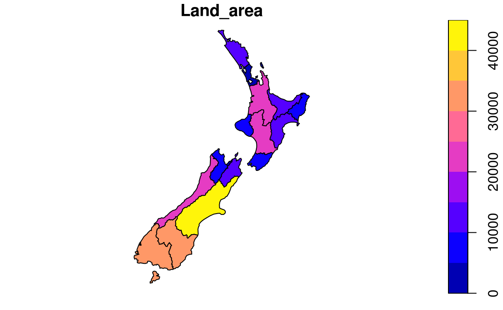
<p class="caption">(\#fig:tmcol)Comparison of base (left) and tmap (right) handling of a numeric color field.</p>
</div>

An important argument in functions defining aesthetic layers such as `tm_fill()` is `title`, which sets the title of the associated legend.
The following code chunk demonstrates this functionality by providing a more attractive name than the variable name `Land_area` (note the use of `expression()` to create superscript text):


```r
legend_title = expression("Area (km"^2*")")
map_nza = tm_shape(nz) +
  tm_fill(col = "Land_area", title = legend_title) + tm_borders()
```

### Color settings

Color settings are an important part of map design.
They can have a major impact on how spatial variability is portrayed as illustrated in Figure \@ref(fig:tmpal).
This shows four ways of coloring regions in New Zealand depending on median income, from left to right (and demonstrated in the code chunk below):

- The default setting uses 'pretty' breaks, described in the next paragraph
- `breaks` which allows you to manually set the breaks
- `n` which sets the number of bins into which numeric variables are categorized
- `palette` which defines the color scheme, for example `RdBu`


```r
breaks = c(0, 3, 4, 5) * 10000
tm_shape(nz) + tm_polygons(col = "Median_income")
tm_shape(nz) + tm_polygons(col = "Median_income", breaks = breaks)
tm_shape(nz) + tm_polygons(col = "Median_income", n = 10)
tm_shape(nz) + tm_polygons(col = "Median_income", palette = "RdBu")
```


```
#> Legend labels were too wide. The labels have been resized to 0.22, 0.22, 0.22, 0.22, 0.22, 0.22. Increase legend.width (argument of tm_layout) to make the legend wider and therefore the labels larger.
#> Legend labels were too wide. The labels have been resized to 0.33, 0.22, 0.22. Increase legend.width (argument of tm_layout) to make the legend wider and therefore the labels larger.
#> Legend labels were too wide. The labels have been resized to 0.22, 0.22, 0.22, 0.22, 0.22, 0.22, 0.22, 0.22, 0.22, 0.22. Increase legend.width (argument of tm_layout) to make the legend wider and therefore the labels larger.
#> Legend labels were too wide. The labels have been resized to 0.22, 0.22, 0.22, 0.22, 0.22, 0.22. Increase legend.width (argument of tm_layout) to make the legend wider and therefore the labels larger.
```

<div class="figure" style="text-align: center">
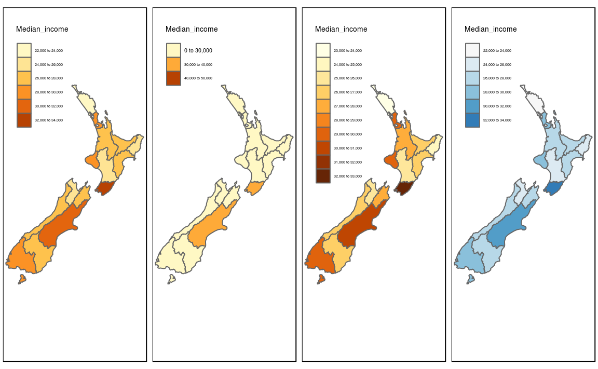
<p class="caption">(\#fig:tmpal)Illustration of settings that affect color settings. The results show (from left to right): default settings, manual breaks, n breaks, and the impact of changing the palette.</p>
</div>

Another way to change color settings is by altering color break (or bin) settings.
In addition to manually setting `breaks` **tmap** allows users to specify algorithms to automatically create breaks with the `style` argument.
Six of the most useful break styles are illustrated in Figure \@ref(fig:break-styles) and described in the bullet points below:

- `style = pretty`, the default setting, rounds breaks into whole numbers where possible and spaces them evenly
- `style = equal` divides input values into bins of equal range, and is appropriate for variables with a uniform distribution (not recommended for variables with a skewed distribution as the resulting map may end-up having little color diversity)
- `style = quantile` ensures the same number of observations fall into each category (with the potential down side that bin ranges can vary widely)
- `style = jenks` identifies groups of similar values in the data and maximizes the differences between categories
- `style = cont` (and `order`) present a large number of colors over continuous color field, and are particularly suited for continuous rasters (`order` can help visualize skewed distributions)
- `style = cat` was designed to represent categorical values and assures that each category receives a unique color


```
#> Legend labels were too wide. The labels have been resized to 0.37, 0.37, 0.37, 0.37, 0.37, 0.37. Increase legend.width (argument of tm_layout) to make the legend wider and therefore the labels larger.
#> Legend labels were too wide. The labels have been resized to 0.37, 0.37, 0.37, 0.37, 0.37. Increase legend.width (argument of tm_layout) to make the legend wider and therefore the labels larger.
#> Legend labels were too wide. The labels have been resized to 0.37, 0.37, 0.37, 0.37, 0.37. Increase legend.width (argument of tm_layout) to make the legend wider and therefore the labels larger.
#> Legend labels were too wide. The labels have been resized to 0.37, 0.37, 0.37, 0.37, 0.37. Increase legend.width (argument of tm_layout) to make the legend wider and therefore the labels larger.
```

<div class="figure" style="text-align: center">
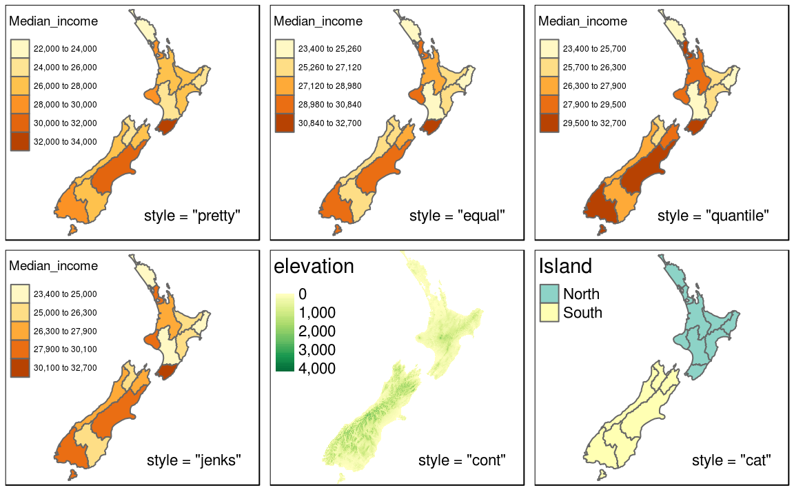
<p class="caption">(\#fig:break-styles)Illustration of different binning methods set using the style argument in tmap.</p>
</div>

\BeginKnitrBlock{rmdnote}<div class="rmdnote">Although `style` is an argument of **tmap** functions it in fact originates as an argument in `classInt::classIntervals()` --- see the help page of this function for details.</div>\EndKnitrBlock{rmdnote}

Palettes define the color ranges associated with the bins and  determined by the `breaks`, `n`, and `style` arguments described above.
The default color palette is specified in `tm_layout()` (see section \@ref(layouts) to learn more), however, it could be quickly changed using the `palette` argument.
It expects a vector of colors or a new color palette name, which can be selected interactively with `tmaptools::palette_explorer()`.
You can add a `-` as prefix to reverse the palette order.

There are three main groups of color palettes - categorical, sequential and diverging (Figure \@ref(fig:colpal)), and each of them serves a different purpose.
Categorical palettes consist of easily distinguishable colors and are most appropriate for categorical data without any particular order such as state names or land cover classes.
Colors should be intuitive: rivers should be blue, for example, and pastures green.
Avoid too many categories: maps with large legends and many colors can be uninterpretable.^[
`col = "MAP_COLORS"` can be used in maps with a large number of individual polygons (for example a map of individual countries) to create unique colors for adjacent polygons.
] 

The second group is sequential palettes.
These follow a gradient, for example from light to dark colors (light colors tend to represent lower values), and are appropriate for continuous (numeric) variables.
Sequential palettes can be single (`Blues` go from light to dark blue for example) or multi-color/hue (`YlOrBr` is gradient from light yellow to brown via orange, for example), as demonstrated in the code chunk below --- output not shown, run the code yourself to see the results!


```r
tm_shape(nz) + tm_polygons("Population", palette = "Blues")
tm_shape(nz) + tm_polygons("Population", palette = "YlOrBr")
```

The last group, diverging palettes, typically range between three distinct colors (purple-white-green in Figure \@ref(fig:colpal)) and are usually created by joining two single color sequential palettes with the darker colors at each end.
Their main purpose is to visualize the difference from an important reference point, e.g. a certain temperature, the median household income or the mean probability for a drought event.
The reference point's value can be adjusted in **tmap** using the `midpoint` argument.

<div class="figure" style="text-align: center">

<p class="caption">(\#fig:colpal)Examples of categorical, sequential and diverging palettes.</p>
</div>

There are two important principles for consideration when working with colors - perceptibility and accessibility.
Firstly, colors on maps should match our perception. 
This means that certain colors are viewed through our experience and also cultural lenses.
For example, green colors usually represent vegetation or lowlands and blue is connected with water or cool.
Color palettes should also be easy to understand to effectively convey information.
It should be clear which values are lower and which are higher, and colors should change gradually.
This property is not preserved in the rainbow color palette, therefore we suggest avoiding it in spatial data visualization [@borland_rainbow_2007].
Instead [the viridis color palettes](https://cran.r-project.org/web/packages/viridis/), also available in **tmap**, can be used.
Secondly, changes in colors should be accessible to the largest number of people.
Therefore, it is important to use colorblind friendly palettes as often as possible.^[See the "Color blindness simulator" options in `tmaptools::palette_explorer()`.]

### Layouts

The map layout refers to the combination of all map elements into a cohesive map.
Map elements include among others the objects to be mapped, the title, the scale bar, margins and aspect ratios, while the color settings covered in the previous section relate to the palette and break-points used to affect how the map looks.
Both may result in subtle changes that can have an equally large impact on the impression left by your maps.

Additional elements such as north arrows and scale bars have their own functions - `tm_compass()` and `tm_scale_bar()` (Figure \@ref(fig:na-sb)).


```r
map_nz + 
  tm_compass(type = "8star", position = c("left", "top")) +
  tm_scale_bar(breaks = c(0, 100, 200), size = 1)
```

<div class="figure" style="text-align: center">
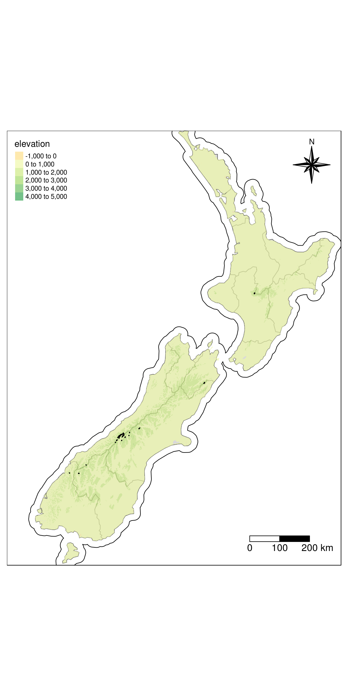
<p class="caption">(\#fig:na-sb)Map with additional elements - a north arrow and scale bar.</p>
</div>

**tmap** also allows a wide variety of layout settings to be changed, some of which are illustrated in Figure \@ref(fig:layout1), produced using the following code (see `args(tm_layout)` or `?tm_layout` for a full list):


```r
map_nz + tm_layout(title = "New Zealand")
map_nz + tm_layout(scale = 5)
map_nz + tm_layout(bg.color = "lightblue")
map_nz + tm_layout(frame = FALSE)
```

<div class="figure" style="text-align: center">

<p class="caption">(\#fig:layout1)Layout options specified by (from left to right) title, scale, bg.color and frame arguments.</p>
</div>

The other arguments in `tm_layout()` provide control over many more aspects of the map in relation to the canvas on which it is placed.
Some useful layout settings are listed below (see Figure \@ref(fig:layout2) for illustrations of a selection of these):

- Frame width (`frame.lwd`) and an option to allow double lines (`frame.double.line`).
- Margin settings including `outer.margin` and `inner.margin`.
- Font settings, controlled by `fontface` and `fontfamily`.
- Legend settings including binary options such as `legend.show` (whether or not to show the legend) `legend.only` (omit the map) and `legend.outside` (should the legend go outside the map?), as well as multiple choice settings such as `legend.position`.
- Default colors of aesthetic layers (`aes.color`), map attributes such as the frame (`attr.color`).
- Color settings controlling `sepia.intensity` (how yellowy the map looks) and `saturation` (a color-greyscale).


```
#> Legend labels were too wide. The labels have been resized to 0.33, 0.22, 0.22, 0.22, 0.22. Increase legend.width (argument of tm_layout) to make the legend wider and therefore the labels larger.
#> Legend labels were too wide. The labels have been resized to 0.33, 0.22, 0.22, 0.22, 0.22. Increase legend.width (argument of tm_layout) to make the legend wider and therefore the labels larger.
#> Legend labels were too wide. The labels have been resized to 0.33, 0.22, 0.22, 0.22, 0.22. Increase legend.width (argument of tm_layout) to make the legend wider and therefore the labels larger.
```

<div class="figure" style="text-align: center">

<p class="caption">(\#fig:layout2)Illustration of selected layout options.</p>
</div>

The impact of changing the color settings listed above is illustrated in Figure \@ref(fig:layout3) (see `?tm_layout` for a full list).


```
#> Legend labels were too wide. The labels have been resized to 0.33, 0.22, 0.22, 0.22, 0.22. Increase legend.width (argument of tm_layout) to make the legend wider and therefore the labels larger.
#> Legend labels were too wide. The labels have been resized to 0.33, 0.22, 0.22, 0.22, 0.22. Increase legend.width (argument of tm_layout) to make the legend wider and therefore the labels larger.
#> Legend labels were too wide. The labels have been resized to 0.33, 0.22, 0.22, 0.22, 0.22. Increase legend.width (argument of tm_layout) to make the legend wider and therefore the labels larger.
#> Legend labels were too wide. The labels have been resized to 0.33, 0.22, 0.22, 0.22, 0.22. Increase legend.width (argument of tm_layout) to make the legend wider and therefore the labels larger.
```

<div class="figure" style="text-align: center">

<p class="caption">(\#fig:layout3)Illustration of selected color-related layout options.</p>
</div>

<!-- Maybe reverse order and progress from the high- to the low-level control. Overall, this section reads a bit like a vignette. Is this the intention. -->
Beyond the low-level control over layouts and colors, **tmap** also offers high-level styles, using the `tm_style()` function (representing the second meaning of 'style' in the package).
Some styles such as `tm_style("cobalt")` result in stylized maps while others such as `tm_style("grey")` make more subtle changes, as illustrated in Figure \@ref(fig:tmstyles), created using code below (see `09-tmstyles.R`):


```r
map_nza + tm_style("bw")
map_nza + tm_style("classic")
map_nza + tm_style("cobalt")
map_nza + tm_style("col_blind")
```


```
#> Legend labels were too wide. The labels have been resized to 0.33, 0.22, 0.22, 0.22, 0.22. Increase legend.width (argument of tm_layout) to make the legend wider and therefore the labels larger.
#> Legend labels were too wide. The labels have been resized to 0.33, 0.22, 0.22, 0.22, 0.22. Increase legend.width (argument of tm_layout) to make the legend wider and therefore the labels larger.
#> Legend labels were too wide. The labels have been resized to 0.33, 0.22, 0.22, 0.22, 0.22. Increase legend.width (argument of tm_layout) to make the legend wider and therefore the labels larger.
#> Legend labels were too wide. The labels have been resized to 0.33, 0.22, 0.22, 0.22, 0.22. Increase legend.width (argument of tm_layout) to make the legend wider and therefore the labels larger.
```

<div class="figure" style="text-align: center">

<p class="caption">(\#fig:tmstyles)Selected tmap styles: bw, classic, cobalt and col_blind (from left to right).</p>
</div>

\BeginKnitrBlock{rmdnote}<div class="rmdnote">A preview of predefined styles can be generated by executing `tmap_style_catalogue()`.
This creates a folder called `tmap_style_previews` containing nine images.
Each image, from `tm_style_albatross.png` to `tm_style_white.png` shows a faceted map of the world in the corresponding style.
Note: `tmap_style_catalogue()` takes some time to run.</div>\EndKnitrBlock{rmdnote}

### Faceted maps

Faceted maps, also referred to as 'small multiples', are composed of many maps arranged side-by-side, and sometimes stacked vertically.
Facets enable the visualization of how spatial relationships change with respect to another variable, such as time.
The changing populations of settlements, for example, can be represented in a faceted map with each panel representing the population at a particular moment in time.
The time dimension could be represented via another *aesthetic* such as color.
However, this risks cluttering the map because it will involve multiple overlapping points (cities do not tend to move over time!).

Typically all individual facets in a faceted map contain the same geometry data repeated multiple times, once for each column in the attribute data (this is the default plotting method for `sf` objects, see \@ref(spatial-class)).
However, facets can also represent shifting geometries such as as the evolution of a point pattern over time.
This use case of faceted plot is illustrated in Figure \@ref(fig:urban-facet).

<!-- todo: describe data type (long) and nrow vs ncol -->


```r
urb_1970_2030 = urban_agglomerations %>% 
  filter(year %in% c(1970, 1990, 2010, 2030))
tm_shape(world) + tm_polygons() + 
  tm_shape(urb_1970_2030) + tm_symbols(col = "black", border.col = "white",
                                       size = "population_millions") +
  tm_facets(by = "year", nrow = 2, free.coords = FALSE)
```

<div class="figure" style="text-align: center">
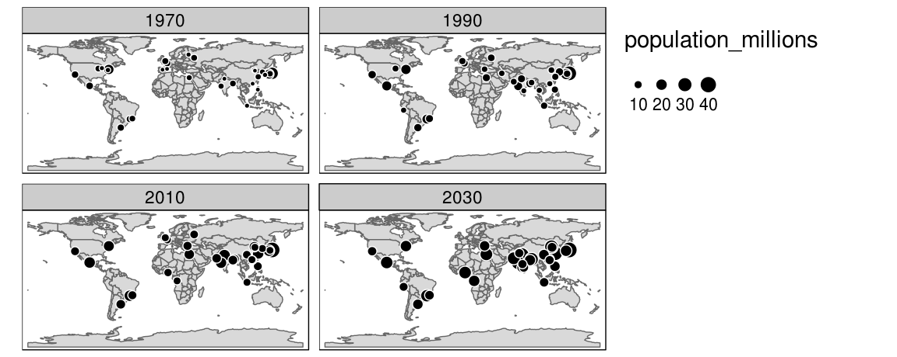
<p class="caption">(\#fig:urban-facet)Faceted map showing the top 30 largest 'urban agglomerations' from 1970 to 2030 based on population projects by the United Nations.</p>
</div>

The preceding code chunk demonstrates key features of faceted maps created with **tmap**:

- Shapes that do not have a facet variable are repeated (the countries in `world` in this case).
- The `by` argument which varies depending on a variable (`year` in this case).
- `nrow`/`ncol` setting specifying the number of rows and columns that facets should be arranged into.
- The `free.coords`-parameter specifying if each map has its own bounding box.

In addition to their utility for showing changing spatial relationships, faceted maps are also useful as the foundation for animated maps (see \@ref(animated-maps)).

### Inset maps

An inset map is a smaller map rendered within or next to the main map. 
It could serve many different purposes, including providing a context (Figure \@ref(fig:insetmap1)) or bringing some non-contiguous regions closer to ease their comparison (Figure \@ref(fig:insetmap2)).
They could be also used to focus on a smaller area in more detail or to cover the same area as the map but representing a different topic.

In the example below, we create a map of the central part of the New Zealand's Southern Alps.
Our inset map will show where the main map is in relation to the whole New Zealand.
The first step is to define the area of interest, which can be done by creating a new spatial object, `nz_region`.
<!--# mapview::mapview(nz_height, native.crs = TRUE) or mapedit??-->


```r
nz_region = st_bbox(c(xmin = 1340000, xmax = 1450000,
                      ymin = 5130000, ymax = 5210000)) %>% 
  st_as_sfc() %>% 
  st_set_crs(st_crs(nz_height))
```

In the second step, we create a base map showing the New Zealand's Southern Alps area. 
This is a place where the most important message is stated. 


```r
nz_height_map = tm_shape(nz_elev, bbox = tmaptools::bb(nz_region)) +
  tm_raster(style = "cont", palette = "YlGn", legend.show = TRUE) +
  tm_shape(nz_height) + tm_symbols(shape = 2, col = "red", size = 1) +
  tm_scale_bar(position = c("left", "bottom"))
```

The third step consists of the inset map creation. 
It gives a context and helps to locate the area of interest. 
Importantly, this map needs to clearly indicate the location of the main map, for example by stating its borders.


```r
nz_map = tm_shape(nz) + tm_polygons() +
  tm_shape(nz_height) + tm_symbols(shape = 2, col = "red", size = 0.1) + 
  tm_shape(nz_region) + tm_borders(lwd = 3) 
```

Finally, we combine the two maps.
A viewport from the **grid** package can be used by stating a center location (`x` and `y`) and a size (`width` and `height`) of the inset map.


```r
library(grid)
nz_height_map
print(nz_map, vp = viewport(0.8, 0.27, width = 0.5, height = 0.5))
```

<div class="figure" style="text-align: center">
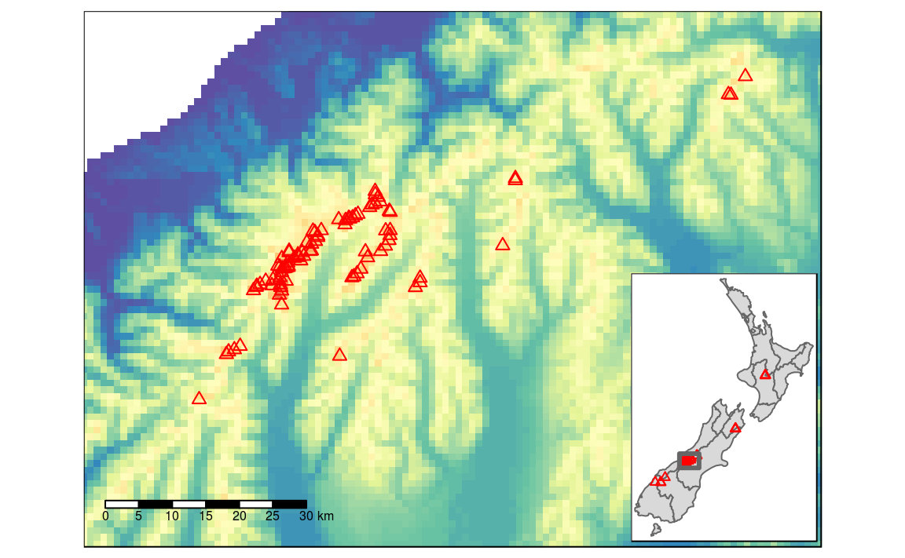
<p class="caption">(\#fig:insetmap1)Inset map providing a context - location of the central part of the Southern Alps in New Zealand.</p>
</div>

Inset map can be save to file either by using a graphic device (see section \@ref(visual-outputs)) or the `tmap_save()` function and its arguments - `insets_tm` and `insets_vp`.

Inset maps are also used to create one map of non-contiguous areas.
Probably, the most often used example is a map of United States, which consists of the contiguous United States, Hawaii and Alaska.
It is very important to find the best projection for each individual inset in these type of cases (see section \@ref(reproj-geo-data) to learn more).
We can use US National Atlas Equal Area for the map of the contiguous United States by putting its EPSG code in the `projection` argument of `tm_shape()`.


```r
us_states_map = tm_shape(us_states, projection = 2163) + tm_polygons() + 
  tm_layout(frame = FALSE)
```

The rest of our objects, `hawaii` and `alaska`, already have proper projections, therefore we just need to create two separate maps:


```r
hawaii_map = tm_shape(hawaii) + tm_polygons() + 
  tm_layout(title = "Hawaii", frame = FALSE, bg.color = NA, 
            title.position = c("left", "bottom"))
alaska_map = tm_shape(alaska) + tm_polygons() + 
  tm_layout(title = "Alaska", frame = FALSE, bg.color = NA)
```

The final map is created by combining and arranging these three maps:


```r
us_states_map
print(hawaii_map, vp = viewport(x = 0.4, y = 0.1, width = 0.2, height = 0.1))
print(alaska_map, vp = viewport(x = 0.15, y = 0.15, width = 0.3, height = 0.3))
```

<div class="figure" style="text-align: center">

<p class="caption">(\#fig:insetmap2)Map of the United States.</p>
</div>

The code presented above is very compact and allows for creation of many similar maps, however the map do not represent sizes and locations of Hawaii and Alaska well.
You can see an alternative approach in the [`vignettes/us-map.Rmd`](https://github.com/Robinlovelace/geocompr/blob/master/vignettes/us-map.Rmd) file in the book's GitHub repo, which tries to mitigate these issues.

<!-- extended info about using tm_layout to show legend in main plot and remove it in the others -->
The main goal of this section is to present how to generate and arrange inset maps.
The next step is to use the knowledge from the previous sections to improve the map style or to add another data layers.
Moreover, the same skills can be applied to combine maps and plots.

## Animated maps

Faceted maps, described in \@ref(faceted-maps), provide a way of showing how spatial relationships vary but the approach has disadvantages.
Facets become tiny when many of them are squeezed into a single plot, potentially hiding *any* spatial relationships.
Furthermore the fact that each facet is separated by space on the screen or page means that subtle differences between facets can be hard to detect.

With an increasing proportion of communication happening via digital screens, animated maps are becoming more popular.
Animated maps can even be useful for paper reports: you can always link readers to a web-page containing an animated (or interactive) version of a printed map to help make it come alive.

Figure \@ref(fig:urban-animated) is a simple example of an animated map.
Unlike the faceted plot it does not squeeze multiple maps into a single screen and allows the reader to see how the spatial distribution of the worlds most populous agglomerations evolve over time (see the book's website for the animated version).

<div class="figure" style="text-align: center">

<p class="caption">(\#fig:urban-animated)Animated map showing the top 30 largest 'urban agglomerations' from 1950 to 2030 based on population projects by the United Nations.</p>
</div>


The animated map illustrated in Figure \@ref(fig:urban-animated) can be created using the same **tmap** techniques that generates faceted maps, demonstrated in section \@ref(faceted-maps).
There are two differences, however, related to arguments in `tm_facets()`:

- `along = "year"` is used instead of `by = "year"`
- `free.coords = FALSE`, which maintains the map extent for each map iteration.

These additional arguments are demonstrated in the subsequent code chunk:


```r
urb_anim = tm_shape(world) + tm_polygons() + 
  tm_shape(urban_agglomerations) + tm_dots(size = "population_millions") +
  tm_facets(along = "year", free.coords = FALSE)
```

The resulting `urb_anim` represents a set of separate maps for each year.
The final stage is to combine them and save the result as a `.gif` file with `tmap_animation()`.
The following command creates the animation illustrated in Figure \@ref(fig:urban-animated), with a few elements missing, that we will add-in during the exercises:


```r
tmap_animation(urb_anim, filename = "urb_anim.gif", delay = 25)
```

Another illustration of the power of animated maps is provided in Figure \@ref(fig:animus).
This shows the development of states in United States, which first formed in the East and then incrementally to the West and finally into the interior.
Code to reproduce this map can be found in the script `09-usboundaries.R`.


<div class="figure" style="text-align: center">

<p class="caption">(\#fig:animus)Animated map showing population growth and state formation and boundary changes in the United States, 1790-2010.</p>
</div>

## Interactive maps

Static and animated maps can breathe life into geographic datasets.
Interactive maps can take reader participation to a whole new level, providing results with a life of their own that can be explored in myriad ways.
Interactivity can take many forms, including the appearance of popup messages when users click or mouse-over geographic features and maps dynamically linked to non-geographic plots.^[
A good example of such a dynamically linked visualization is a map of Nigeria linked to a bar chart of fertility rates by Kyle Walker which can be found online.
<!-- A good example of such a dynamically linked visualization is a map of Nigeria linked to a bar chart of fertility rates by Kyle Walker, published on [Twitter](https://twitter.com/kyle_e_walker/status/985948444966768641) and (for the source code) as a GitHub [Gist](https://gist.github.com/walkerke/5fe9a198a30270e2fcb8120a7fc8242a). -->
]

The most important type of interactivity, however, is the display of geographic data on an interactive or 'slippy' web maps.
The release of the **leaflet** package in 2015 revolutionized interactive web map creation from within R and a number of packages have built on these foundations adding new features (e.g. **leaflet.extras**) and making the creation of web maps as simple as creating static maps (e.g. **mapview** and **tmap**).
This section illustrates each approach in the opposite order.
We will explore how to make slippy maps with **tmap** (the syntax of which we have already learned), **mapview** and finally **leaflet** (which provides low level control over interactive maps).

A unique feature of **tmap** mentioned in section \@ref(static-maps) is its ability to create static and interactive maps using the same code.
Maps can be viewed interactively at any point by switching to view mode, using the command `tmap_mode("view")`.
This is demonstrated in the code below, which creates an interactive map of New Zealand based on the `tmap` object `map_nz`, created in section \@ref(map-obj), and illustrated in Figure \@ref(fig:tmview):


```r
tmap_mode("view")
map_nz
```


```
#> tmap mode set to interactive viewing
#> [1] 8
```

<div class="figure" style="text-align: center">
preserveb1adb43840827a27
<p class="caption">(\#fig:tmview)Interactive map of New Zealand created with tmap in view mode.</p>
</div>

Now that the interactive mode has been 'turned on', all maps produced with **tmap** will launch (another way to create interactive maps is with the `tmap_leaflet` function) .
Notable features of this interactive mode include the ability to specify the basemap using the `basemaps` argument in the function `tm_view()` (also see `?tm_basemap`), as demonstrated below (the result, a map of New Zealand with an interactive topographic basemap, is not shown):


```r
basemap = leaflet::providers$OpenTopoMap
map_nz +
  tm_view(basemaps = basemap)
```

An impressive and little-known feature of **tmap**'s view mode is that it also works with faceted plots.
The argument `sync` in `tm_facets()` can be used in this case to produce multiple maps with synchronized zoom and pan settings, as illustrated in Figure \@ref(fig:sync) which was produced by the following code:


```r
world_coffee = left_join(world, coffee_data, by = "name_long")
facets = c("coffee_production_2016", "coffee_production_2017")
tm_shape(world_coffee) + tm_polygons(facets) + 
  tm_facets(nrow = 1, sync = TRUE)
```

<div class="figure" style="text-align: center">

<p class="caption">(\#fig:sync)Faceted interactive maps of global coffee producing in 2016 and 2017 in 'sync', demonstrating tmap's view mode in action.</p>
</div>

Switch **tmap** back to plotting mode with the same function:


```r
tmap_mode("plot")
#> tmap mode set to plotting
```

If you are not proficient with **tmap**, the quickest way to create an interactive maps may be with **mapview**.
The following 'one liner' is a reliable way to interactively explore a wide range of spatial data formats:


```r
mapview::mapview(nz)
```

<div class="figure" style="text-align: center">

<p class="caption">(\#fig:mapview)Illustration of mapview in action.</p>
</div>

**mapview** has a concise syntax yet is powerful. By default, it provides some standard GIS functionality such as mouse position information, attribute queries (via pop-ups), scale bar, zoom-to-layer buttons.
It offers advanced controls including the ability to 'burst' datasets into multiple layers and the addition of multiple layers with `+` followed by the name of a geographic object. Additionlaly, it provides automatic coloring of attributes (via argument `zcol`). In essence, it can be considered a data-driven **leaflet** API (see below for more information about **leaflet**). Given that **mapview** always expects a spatial object (sf, sp, raster) as its first argument, it works well at the end of piped expressions. Consider the following example where **sf** is used to intersect lines and polygons and then visualised with **mapview**.


```r
trails %>%
  st_transform(st_crs(franconia)) %>%
  st_intersection(franconia[franconia$district == "Oberfranken", ]) %>%
  st_collection_extract("LINE") %>%
  mapview(color = "red", lwd = 3, layer.name = "trails") +
  mapview(franconia, zcol = "district", burst = TRUE) +
  breweries
```

<div class="figure" style="text-align: center">

<p class="caption">(\#fig:mapview2)Using mapview at the end of a sf based pipe expression.</p>
</div>

One important thing to keep in mind is that **mapview** layers are added via the `+` operator (similar to **ggplot2**). This is a frequent [gotcha](https://en.wikipedia.org/wiki/Gotcha_(programming)) in piped workflows where the main binding operator is `%>%`.

For further information on **mapview** see the package's website at [r-spatial.github.io/mapview/](https://r-spatial.github.io/mapview/articles/).

There are other ways to create interactive maps with R not demonstrated here due to space constraints.
The **googleway** package, for example, provides an interactive mapping interface that is flexible and extensible with `google_map()`.
The command `google_map(key = key) %>% add_polygons(st_transform(nz, 4326))` plots an interactive map of New Zealand (it assumes a Google API key is saved as `key`).
Many other functions are provided by the package, providing an R interface to a wide range of mapping services including routing, traffic visualization and geocoding (see the [`googleway-vignette`](https://cran.r-project.org/web/packages/googleway/vignettes/googleway-vignette.html) for details).

Last but not least is **leaflet** which is the most mature and widely used interactive mapping package in R.
**leaflet** provides a relatively low level interface to the Leaflet JavaScript library and many of its arguments can be understood by reading the documentation of the original JavaScript library (see [leafletjs.com](http://leafletjs.com/reference-1.3.0.html)).

Leaflet maps are created with `leaflet()`, the result of which is a `leaflet` map object which can be piped to other **leaflet** functions.
This allows multiple map layers and control settings to be added interactively, as demonstrated in the code below which generates Figure \@ref(fig:leaflet) (see [rstudio.github.io/leaflet/](https://rstudio.github.io/leaflet/) for details).


```r
pal = colorNumeric("RdYlBu", domain = cycle_hire$nbikes)
leaflet(data = cycle_hire) %>% 
  addProviderTiles(providers$Stamen.TonerLite) %>% 
  addCircles(col = ~pal(nbikes), opacity = 0.9) %>% 
  addPolygons(data = lnd, fill = FALSE) %>% 
  addLegend(pal = pal, values = ~nbikes) %>% 
  setView(lng = -0.1, 51.5, zoom = 12) %>% 
  addMiniMap()
```

<div class="figure" style="text-align: center">
preserve52e9413d78e06239
<p class="caption">(\#fig:leaflet)The leaflet package in action, showing cycle hire points in London.</p>
</div>

## Mapping applications

The interactive web maps demonstrated in section \@ref(interactive-maps) can go far.
Careful selection of layers to display, base-maps and pop-ups can be used to communicate the main results of many projects involving geocomputation.
But the web mapping approach to interactivity has limitations:

- Although the map is interactive in terms of panning, zooming and clicking, the code is static, meaning the user interface is fixed.
- All map content is generally static in a web map, meaning that web maps cannot scale to handle large datasets easily.
- Additional layers of interactivity, such a graphs showing relationships between variables and 'dashboards' are difficult to create using the web-mapping approach.

Overcoming these limitations involves going beyond static web mapping and towards geospatial frameworks and map servers.
Products in this field include [GeoDjango](https://docs.djangoproject.com/en/2.0/ref/contrib/gis/) (which extends the Django web framework and is written in [Python](https://github.com/django/django)), [MapGuide](https://www.osgeo.org/projects/mapguide-open-source/) (a framework for developing web applications, largely written in [C++](https://trac.osgeo.org/mapguide/wiki/MapGuideArchitecture)) and [GeoServer](http://geoserver.org/) (a mature and powerful map server written in [Java](https://github.com/geoserver/geoserver)).
Each of these (particularly GeoServer) is scalable, enabling maps to be served to thousands of people daily --- assuming there is sufficient public interest in your maps!
The bad news is that such server-side solutions require much skilled developer time to set-up and maintain, often involving teams of people with roles such as a dedicated geospatial database administrator ([DBA](http://wiki.gis.com/wiki/index.php/Database_administrator)).

The good news is that web mapping applications can now be rapidly created using **shiny**, a package for converting R code into interactive web applications.
This is thanks to its support for interactive maps via functions such as `renderLeaflet()`, documented on the [Shiny integration](https://rstudio.github.io/leaflet/shiny.html) section of RStudio's **leaflet** website.
This section gives some context, teaches the basics of **shiny** from a web mapping perspective and culminates in a full-screen mapping application in less than 100 lines of code.

The way **shiny** works is well documented at [shiny.rstudio.com](https://shiny.rstudio.com/).
The two key elements of a **shiny** app reflect the duality common to most web application development: 'front end' (the bit the user sees) and 'back end' code.
In **shiny** apps these elements are typically created in objects named `ui` and `server` within an R script named `app.R`, that lives in an 'app folder'.
This allows web mapping applications to be represented in a single file, such as the [`coffeeApp/app.R`](https://github.com/Robinlovelace/geocompr/blob/master/coffeeApp/app.R) file in the book's GitHub repo.

\BeginKnitrBlock{rmdnote}<div class="rmdnote">In **shiny** apps these are often split into `ui.R` (short for user interface) and `server.R` files, naming conventions used by [`shiny-server`](https://github.com/rstudio/shiny-server), a server-side Linux application for serving shiny apps on public-facing websites.
`shiny-server` also serves apps defined by a single `app.R` file in an 'app folder'.</div>\EndKnitrBlock{rmdnote}

Before considering large apps it is worth seeing a minimal example, named 'lifeApp', in action.^[
The word 'app' in this context refers to 'web application' and should not be confused with smartphone apps, the more common meaning of the word.
]
The code below defines and launches --- with the command `shinyApp()` --- a lifeApp, which provides an interactive slider allowing users to make countries appear with progressively lower levels of life expectancy (see Figure \@ref(fig:lifeApp)):


```r
library(shiny)    # for shiny apps
library(leaflet)  # renderLeaflet function
library(spData)   # loads the world dataset 
ui = fluidPage(
  sliderInput(inputId = "life", "Life expectancy", 49, 84, value = 80),
      leafletOutput(outputId = "map")
  )
server = function(input, output) {
  output$map = renderLeaflet({
    leaflet() %>% addProviderTiles("OpenStreetMap.BlackAndWhite") %>%
      addPolygons(data = world[world$lifeExp < input$life, ])})
}
shinyApp(ui, server)
```

<div class="figure" style="text-align: center">

<p class="caption">(\#fig:lifeApp)Screenshot showing minimal example of a web mapping application created with **shiny**.</p>
</div>

The **user interface** (`ui`) of lifeApp is created by `fluidPage()`.
This contains input and output 'widgets' --- in this case, a `sliderInput()` (many other `*Input()` functions are available) and a `leafletOutput()`.
These are arranged row-wise by default, explaining why the slider interface is placed directly above the map in Figure \@ref(fig:lifeApp) (see `?column` for adding content column-wise).

The **server side** (`server`) is a function with `input` and `output` arguments.
`output` is a list of objects containing elements generated by `render*()` function --- `renderLeaflet()` which in this example generates `output$map`.
Inputs elements such as `input$life` referred to in the server must relate to elements that exist in the `ui` --- defined by `inputId = "life"` in the code above.
The function `shinyApp()` combines both the `ui` and `server` elements and serves the results interactively via a new R process.
When you move the slider in the map shown in Figure \@ref(fig:lifeApp), you are actually causing R code to re-run, although this is hidden from view in the user interface.

Building on this basic example and knowing where to find help (see `?shiny`), the best way forward now may be to stop reading and start programming!
The recommended next step is to open the previously mentioned [`coffeeApp/app.R`](https://github.com/Robinlovelace/geocompr/blob/master/coffeeApp/app.R) script in an IDE of choice, modify it and re-run it repeatedly.
The example contains some of the components of a web mapping application implemented in **shiny** and should 'shine' a light on how they behave.

The `coffeeApp/app.R` script contains **shiny** functions that go beyond those demonstrated in the simple 'lifeApp' example.
These include `reactive()` and `observe()` (for creating outputs that respond to the user interface --- see `?reactive`) and `leafletProxy()` (for modifying a `leaflet` object that has already been created).
Such elements are critical to the creation of web mapping applications implemented in **shiny**.
A range of 'events' can be programmed including advanced functionality such as drawing new layers or subsetting data, as described in the shiny section of RStudio's **leaflet** [website.](https://rstudio.github.io/leaflet/shiny.html)

<div class="rmdnote">
<p>There are a number of ways to run a <strong>shiny</strong> app. For RStudio users the simplest way is probably to click on the ‘Run App’ button located in the top right of the source pane when an <code>app.R</code>, <code>ui.R</code> or <code>server.R</code> script is open. <strong>shiny</strong> apps can also be initiated by using <code>runApp()</code> with the first argument being the folder containing the app code and data: <code>runApp(&quot;coffeeApp&quot;)</code> in this case (which assumes a folder named <code>coffeeApp</code> containing the <code>app.R</code> script is in your working directory). You can also launch apps from a Unix command line with the command <code>Rscript -e 'shiny::runApp(&quot;coffeeApp&quot;)'</code>.</p>
</div>

Experimenting with apps such as `coffeeApp` will build not only your knowledge of web mapping applications in R but your practical skills.
Changing the contents of `setView()`, for example, will change the starting bounding box that the user sees when the app is initiated.
Such experimentation should not be done at random, but with reference to relevant documentation, starting with `?shiny`, and motivated by a desire to solve problems such as those posed in the exercises.

**shiny** used in this way can make prototyping mapping applications faster and more accessible than ever before (deploying **shiny** apps is a separate topic beyond the scope of this chapter).
Even if your applications are eventually deployed using different technologies, **shiny** undoubtedly allows web mapping applications to be developed in relatively few lines of code (60 in the case of coffeeApp).
That does not stop shiny apps getting rather large.
The Propensity to Cycle Tool (PCT) hosted at [pct.bike](http://www.pct.bike/), for example, is a national mapping tool funded by the UK's Department for Transport.
The PCT is used by dozens of people each day and has multiple interactive elements based on more than 1000 lines of [code](https://github.com/npct/pct-shiny/blob/master/regions_www/m/server.R) [@lovelace_propensity_2017].

While such apps undoubtedly take time and effort to develop, **shiny** provides a framework for reproducible prototyping that should aid the development process.
One potential problem with the ease of developing prototypes with **shiny** is the temptation to start programming too early, before the purpose of the mapping application has been envisioned in detail.
For that reason, despite advocating **shiny**, we recommend starting with the longer established technology of a pen and paper as the first stage for interactive mapping projects.
This way your prototype web applications should be limited not by technical considerations but by your motivations and imagination.

<div class="figure" style="text-align: center">
<iframe src="https://bookdown.org/robinlovelace/coffeeapp/?showcase=0" width="576" height="400px"></iframe>
<p class="caption">(\#fig:coffeeApp)coffeeApp, a simple web mapping application for exploring global coffee production in 2016 and 2017.</p>
</div>

## Other mapping packages

**tmap** provides a powerful interface for creating a wide range of static maps (section \@ref(static-maps)) and also supports interactive maps (section \@ref(interactive-maps)).
But there are many other options for creating maps in R.
The aim of this section is to provide a taster of some of these and pointers for additional resources: map making is a surprisingly active area of R package development so there is more to learn than can be covered here.

The most mature option is to use `plot()` methods provided by core spatial packages **sf** and **raster**, covered in sections \@ref(basic-map) and \@ref(basic-map-raster) respectively.
What we have not mentioned in those sections was that plot methods for raster and vector objects can be combined when the results draw onto the same plot area (elements such as keys in **sf** plots and multi-band rasters will interfere with this).
This behavior is illustrated in the subsequent code chunk which generates Figure \@ref(fig:nz-plot).
`plot()` has many other options which can be explored by following links in the `?plot` help page and the **sf** vignette [`sf5`](https://cran.r-project.org/web/packages/sf/vignettes/sf5.html).


```r
g = st_graticule(nz, lon = c(170, 175), lat = c(-45, -40, -35))
plot(nz_water, graticule = g, axes = TRUE, col = "blue")
raster::plot(nz_elev / 1000, add = TRUE)
plot(st_geometry(nz), add = TRUE)
```

<div class="figure" style="text-align: center">

<p class="caption">(\#fig:nz-plot)Map of New Zealand created with plot(). The legend to the right refers to elevation (1000 m above sea level).</p>
</div>

Since version [2.3.0](https://www.tidyverse.org/articles/2018/05/ggplot2-2-3-0/), the **tidyverse** plotting package **ggplot2** has supported `sf` objects with `geom_sf()`.
The syntax is similar to that used by **tmap**:
an initial `ggplot()` call is followed by one or more layers, that are added with `+ geom_*()`, where `*` represents a layer type such as `geom_sf()` (for sf objects) or `geom_points()` (for points).

**ggplot2** plots graticules by default.
The default settings for the graticules can be overridden using `scale_x_continuous()` and `scale_y_continuous()`.
Other notable features include the use of unquoted variable names encapsulated in `aes()` to indicate which aesthetics vary and switching data sources using the `data` argument, as demonstrated in the code chunk below which creates Figure \@ref(fig:nz-gg):


```r
library(ggplot2)
g1 = ggplot() + geom_sf(data = nz, aes(fill = Median_income)) +
  geom_sf(data = nz_height) +
  scale_x_continuous(breaks = c(170, 175))
g1
```

<div class="figure" style="text-align: center">
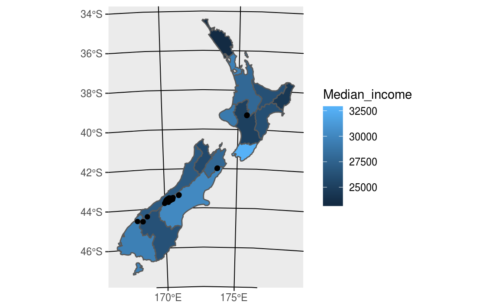
<p class="caption">(\#fig:nz-gg)Map of New Zealand created with ggplot2.</p>
</div>

An advantage of **ggplot2** is that it has a strong user-community and many add-on packages.
Good additional resources can be found in the open source [ggplot2 book](https://github.com/hadley/ggplot2-book) [@wickham_ggplot2_2016] and in the descriptions of the multitude of '**gg**packages' such as **ggrepel** and **tidygraph**.

Another benefit of maps based on **ggplot2** is that they can easily be given a level of interactivity when printed using the function `ggplotly()` from the **plotly** package.
Try `plotly::ggplotly(g1)` for example, and compare the result with other **plotly** mapping functions described at [blog.cpsievert.me](https://blog.cpsievert.me/2018/03/30/visualizing-geo-spatial-data-with-sf-and-plotly/).


At the same time, **ggplot2** has a few drawbacks.
The `geom_sf()` function is not always able to create a desired legend to use from the spatial [data](https://github.com/tidyverse/ggplot2/issues/2037).
Raster objects are also not natively supported in **ggplot2** and need to be converted into a data frame before plotting.

We have covered mapping with **sf**, **raster** and **ggplot2** packages first because these packages are highly flexible, allowing for the creation of a wide range of static maps.
<!-- Many other static mapping packages are more specific. -->
Before we cover mapping packages for plotting a specific type of map (in the next paragraph), it is worth considering alternatives to the packages already covered for general-purpose mapping (Table \@ref(tab:map-gpkg)).


Table: (\#tab:map-gpkg)Selected general-purpose mapping packages.

package       title                                                            
------------  -----------------------------------------------------------------
cartography   Thematic Cartography                                             
ggplot2       Create Elegant Data Visualisations Using the Grammar of Graphics 
googleway     Accesses Google Maps APIs to Retrieve Data and Plot Maps         
ggspatial     Spatial Data Framework for ggplot2                               
leaflet       Create Interactive Web Maps with Leaflet                         
mapview       Interactive Viewing of Spatial Data in R                         
plotly        Create Interactive Web Graphics via 'plotly.js'                  
rasterVis     Visualization Methods for Raster Data                            
tmap          Thematic Maps                                                    

Table \@ref(tab:map-gpkg) shows a range of mapping packages are available, and there are many others not listed in this table.
Of note is **cartography**, which generates a range of unusual maps including choropleth, 'proportional symbol' and 'flow' maps, each of which is documented in the vignette [`cartography`](https://cran.r-project.org/web/packages/cartography/vignettes/cartography.html).

Several R packages also allows for plotting specific map types (Table \@ref(tab:map-spkg)).
They prepare cartograms, create line maps, transform polygons into regular or hexagonal grids, and visualize complex data on grids representing geographic topologies.


Table: (\#tab:map-spkg)Selected specific-purpose mapping packages, with associated metrics.

package     title                                                    
----------  ---------------------------------------------------------
cartogram   Create Cartograms with R                                 
geogrid     Turn Geospatial Polygons into Regular or Hexagonal Grids 
geofacet    'ggplot2' Faceting Utilities for Geographical Data       
linemap     Line Maps                                                

All of the aforementioned packages, however, have different approaches for data preparation and map creation.
In the next paragraph, we focus solely on the **cartogram** package.
Therefore, we suggest to read the [linemap](https://github.com/rCarto/linemap), [geogrid](https://github.com/jbaileyh/geogrid) and [geofacet](https://github.com/hafen/geofacet) documentations to learn more about them.

A cartogram is a map in which the geometry is proportionately distorted to represent a mapping variable. 
Creation of this type of map is possible in R with **cartogram**, which allows for creating continuous and non-contigous area cartograms.
It is not a mapping package per se, but it allows for construction of distorted spatial objects that could be plotted using any generic mapping package.

The `cartogram_cont()` function creates continuous area cartograms.
It accepts an `sf` object and name of the variable (column) as inputs.
Additionally, it is possible to modify the `intermax` argument - maximum number of iterations for the cartogram transformation.
For example, we could represent median income in New Zeleand's regions as a continuous cartogram (the right-hand panel of Figure \@ref(fig:cartomap1)) as follows:


```r
library(cartogram)
nz_carto = cartogram_cont(nz, "Median_income", itermax = 5)
tm_shape(nz_carto) + tm_polygons("Median_income")
```


```
#> Legend labels were too wide. The labels have been resized to 0.66, 0.66, 0.66, 0.66, 0.66, 0.66. Increase legend.width (argument of tm_layout) to make the legend wider and therefore the labels larger.
#> Legend labels were too wide. The labels have been resized to 0.66, 0.66, 0.66, 0.66, 0.66, 0.66. Increase legend.width (argument of tm_layout) to make the legend wider and therefore the labels larger.
```

<div class="figure" style="text-align: center">
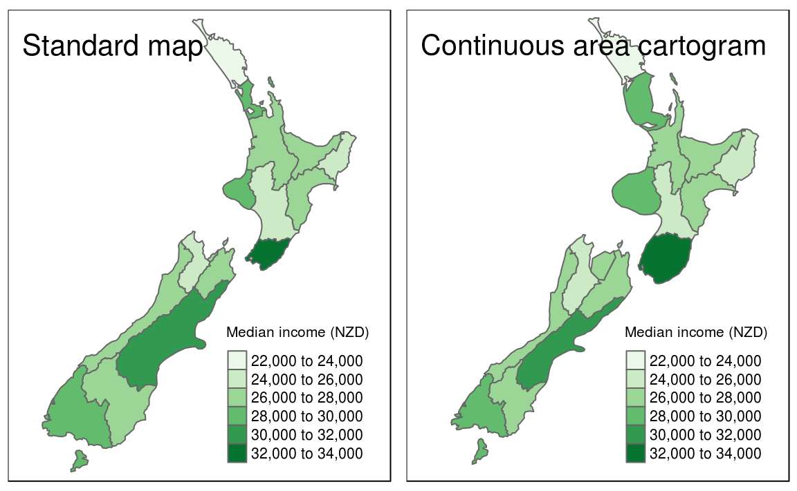
<p class="caption">(\#fig:cartomap1)Comparison of standard map (left) and continuous area cartogram (right).</p>
</div>

**cartogram** also offers creation of non-contiguous area cartograms using  `cartogram_ncont()` and Dorling cartograms using `cartogram_dorling()`.
Non-contiguous area cartograms are created by scaling down each region based on the provided weighting variable.
Dorling cartograms consist of circles with their area proportional to the weighting variable.
The code chunk below demonstrates creation of non-contiguous area and Dorling cartograms of US states' population (Figure \@ref(fig:cartomap2)):


```r
us_states2163 = st_transform(us_states, 2163)
us_states2163_ncont = cartogram_ncont(us_states2163, "total_pop_15")
us_states2163_dorling = cartogram_dorling(us_states2163, "total_pop_15")
```

<div class="figure" style="text-align: center">
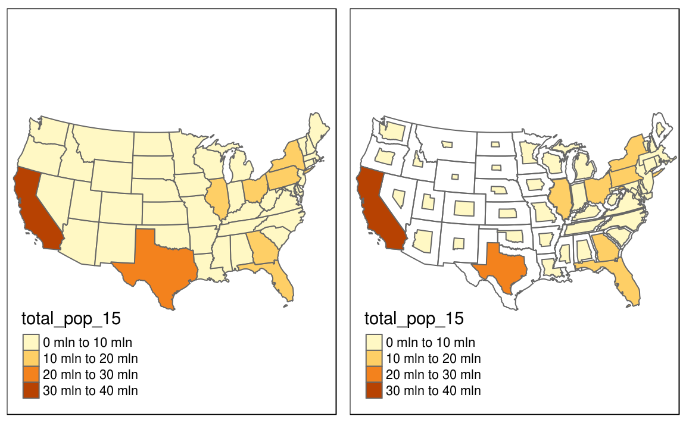
<p class="caption">(\#fig:cartomap2)Comparison of non-continuous area cartogram (top) and Dorling cartogram (bottom).</p>
</div>

## Exercises

For these exercises we will create a new object, `africa`, using the `world` and `worldbank_df` datasets from the **spData** package (see chapter \@ref(attr) to learn more about attribute operations) as follows:


```r
africa = world %>% 
  filter(continent == "Africa", !is.na(iso_a2)) %>% 
  left_join(worldbank_df, by = "iso_a2") %>% 
  dplyr::select(name, subregion, gdpPercap, HDI, pop_growth) %>% 
  st_transform("+proj=aea +lat_1=20 +lat_2=-23 +lat_0=0 +lon_0=25")
#> Warning: Column `iso_a2` joining factor and character vector, coercing into
#> character vector
```

We will also use `zion` and `nlcd` datasets from **spDataLarge**:


```r
zion = st_read((system.file("vector/zion.gpkg", package = "spDataLarge")))
```

1. Create a map showing the geographic distribution of the Human Development Index (`HDI`) across Africa with 
-base graphics (hint: use `plot()`) and
-**tmap** (hint: use `tm_shape(africa) + ...`).
    - Name two advantages of each approach
    - What three other mapping packages could be used to show the same data?
    - Name an advantage of each
    - Bonus: create three more maps of Africa using the three packages mentioned previously
1. Extend the map of Africa created with **tmap** for the previous exercise so the legend has three bins: "High" (`HDI` above 0.7), "Medium" (`HDI` between 0.55 and 0.7) and "Low" (`HDI` below 0.55).
    - Bonus: improve the map aesthetics, for example by changing the legend title, class labels and color palette.

1. Represent `africa`'s subregions on the map. 
Change the default color palette and legend title.
Next, combine this map and the map created in the previous exercise into a single plot.

1. Create a land cover map of the Zion National Park.
    - Change the default colors to match your perception of the land cover categories
    - Add a scale bar and north arrow and change the position of both to improve the map's aesthetic appeal
    - Bonus: Add an inset map of the Zion National Park's location in the context of the Utah state. (Hint: an object representing Utah can be subsetted from the `us_states` dataset.) 

1. Create facet maps of countries in Eastern Africa:
    - with one facet showing HDI and the other representing population growth (hint: using variables `HDI` and `pop_growth` respectively)
    - with a 'small multiple' per country <!-- animated map, interactive map -->

1. Building on the previous facet map examples, create animated maps of East Africa:
    - showing first the spatial distribution of HDI scores then population growth
    - showing each country in order

1. Create an interactive map of Africa:
    - with **tmap**
    - with **mapview**
    - with **leaflet**
    - bonus: for each approach add a legend (if not automatically provided) and a scale bar
1. Sketch on paper ideas for a web mapping app that could be used to make transport or land-use policies more evidence based:
    - In the city you live in, for a couple of users per day
    - In the country you live in, for dozens of users per day
    - Worldwide for hundreds of users per day and large data serving requirements
1. How would app design, deployment and project management decisions change as the scale of map deployment increases?
1. Update the code in `coffeeApp/app.R` so that instead of centering on Brazil the user can select which country to focus on:
    - Using `textInput()`
    - Using `selectInput()`
1. Reproduce Figure \@ref(fig:tmshape) and the 1st and 6th panel of Figure \@ref(fig:break-styles) as closely as possible using the **ggplot2** package.

1. Join `us_states` and `us_states_df` together and calculate a poverty rate for each state using the new dataset.
Next, construct a continuous area cartogram based on total population. 
Finally, create and compare two maps of the poverty rate: (1) a standard choropleth map and (2) a map using the created cartogram boundaries.
What is the information provided by the first and the second map?
How do they differ from each other?

1. Visualize population growth in Africa. 
Next, compare it with the maps of a hexagonal and regular grid created using the **geogrid** package.


<!--chapter:end:08-mapping.Rmd-->


# Bridges to GIS software {#gis}

## Prerequisites {-}

- This chapter requires the following packages:


```r
library(sf)
library(raster)
library(dplyr)
library(spData)
library(RQGIS)
library(RSAGA)
library(rgrass7)
library(tmap)
```

## Introduction

An important feature of R is that users must use the command-line interface (CLI) to interact with the computer:
you type commands and hit `Enter` to execute them interactively.
The most popular open-source GIS software packages, by contrast, feature a prominent graphical user interface (GUI):
you *can* interact with QGIS, SAGA and gvSIG by typing into (dockable) command-lines, but most users interact with such programs by 'pointing and clicking their way through life' as Gary Sherman puts it below [@sherman_desktop_2008]:^[
<!-- Should the commented-out mega-footnote go in a vignette? (todo, RL) -->
<!-- yes, we should shorten the footnote or put it somewhere into the text. I just rewrote it to make clearer what was meant. At least this was what I gathered. -->
GRASS GIS and PostGIS are popular in academia and industry and can be seen as products which buck this trend as they are built around the command-line.
<!-- In [2008](http://gama.fsv.cvut.cz/~landa/publications/2008/gis-ostrava-08/paper/landa-grass-gui-wxpython.pdf) GRASS developers added a sophisticated GUI, shifting the emphasis slightly away from its CLI. -->
<!-- However, GRASS lacks a sophisticated and feature-rich IDE such as RStudio that supports 'CLI newbies'.  -->
<!-- On the other hand, PostGIS is the spatial extension of the popular PostgreSQL open source database, and therefore not really a dedicated GIS.  -->
<!-- This is also highlighted by the fact that PostGIS lacks any geovisualization capabilities and its description of 'legacy GIS' on its [website](http://workshops.boundlessgeo.com/postgis-intro/introduction.html). -->
<!-- Similar to GRASS, PostgreSQGL provides a (partial) GUI called [pgAdmin](https://www.pgadmin.org/) to facilitate the editing and administration of the database.  -->
<!-- To make it clear, though PostGIS provides spatial functions, its main purpose is the handling of spatial objects in a relational database management system. -->
<!-- Therefore, frequently users store their spatial data in PostGIS, and interact with it through a dedicated GIS software such as QGIS. Of course, you can also use R to access data from PostGIS (**sf**, **rgdal**, **rpostgis**). -->
<!-- In summary,  a typical workflow would be: perform a large spatial query with PostGIS, then load the result into a further application (QGIS, R) for further geoprocessing.    -->
]

> With the advent of 'modern' GIS software, most people want to point and
click their way through life. That’s good, but there is a tremendous amount
of flexibility and power waiting for you with the command line. Many times
you can do something on the command line in a fraction of the time you
can do it with a GUI.

Gary Sherman is well-qualified to comment on this matter as the creator of QGIS, the world's premier open source GUI-based GIS!

The 'CLI vs GUI' debate is often adversarial and polarized but it does not have to be: both options are great if well chosen in accordance with your needs and tasks.
The advantages of a good CLI such as that provided by R are numerous. 
Among others, a CLI:

- Facilitates the automation of repetitive tasks. 
- Ensures transparency and reproducibility (which also is the backbone of good scientific practice), and therefore is the preferred option for doing Geographic Data Science.
- Encourages extending existing software by making it easy to modify, enhance and implement new functions.
- Professional and advanced technical skills will certainly enhance your career prospects, and are in dire need across a wide range of disciplines.
- Is fun, but admittedly that is a subjective argument.

On the other hand, GUI-based GIS systems (particularly QGIS) are also advantageous.
For instance, think of:

- The really user-friendly graphical interface which spares the user from programming and facilitates interactive geographic data exploration and interactive map production.
- Digitizing and all related tools (trace, snap, topological rules, etc.).^[Note that there is also the **mapedit** package but its intention is to allow the quick editing of a few spatial features, and not professional, large-scale cartographic digitizing.]
- Georeferencing with ground control points and orthorectification. 
The process of locating control points, choosing the right transformation model, and evaluating the registration error are inherently interactive, and thus unsuitable to be done with R, or any other programming language.
- Stereoscopic mapping (e.g., LiDAR and structure from motion).
- The built-in geodatabase management system often integrated in Desktop GIS (ArcMap, GRASS GIS) and all related advantages such as object-oriented relational data modeling, topology, fast (spatial) querying, among others.

Another advantage of GIS software is that they provide access to hundreds of 'geoalgorithms' (computational recipes to solve geographic problems --- see Chapter \@ref(algorithms)), many of which are unavailable from the R command line.
The good news is that such geoalgorithms can be accessed from the R command via 'GIS bridges', hence the title of (and motivation for) this chapter.^[
An early use of the term 'bridge' referred the coupling of R with GRASS [@neteler_open_2008].
Roger Bivand elaborated on this in his talk "Bridges between GIS and R", delivered at the 2016 GEOSTAT summer school (see slides at http://spatial.nhh.no/misc/).
<!-- The resulting slides can be found on Roger's personal website at [http://spatial.nhh.no/misc](http://spatial.nhh.no/misc/?C=M;O=D) in the file -->
<!-- `geostat_talk16.zip`. -->
]

The R language was originally designed as an interface to and extension of other languages, especially C and FORTRAN, to enable access to statistical algorithms in a user-friendly and intuitive read-evaluate-print loop (REPL) [@chambers_extending_2016].
R was not originally intended to be a GIS.
This makes the breadth of R's geospatial capabilities astonishing to many who are unaware of its ability to replicate established GIS software for many operations on spatial data.
There are some domains where R can now outperform desktop GIS including spatial statistical modeling, online interactive visualization and the generation of animated or faceted maps.

Instead of implementing existing GIS algorithms in R, it makes sense to avoid 'reinventing the wheel' by taking advantage of R's ability to interface with other languages (especially C++, which is used for much low-level and high-performance GIS work).
Using compiled code for new geoprocessing functionality (particularly with the help of the excellent **Rcpp** package) could form the basis of new R packages, building on the success of **sf** [@pebesma_simple_2018].
However, there is already a wide range of algorithms that can be accessed via R's interfaces to dedicated GIS software.
It makes sense to understand these before moving to develop your own optimized algorithms.
For this reason this chapter focuses on 'bridges' to the mature GIS products [QGIS](http://qgis.org/) (via the package **RQGIS**), [SAGA](http://www.saga-gis.org/) (**RSAGA**) and [GRASS](https://grass.osgeo.org/) (**rgrass7**) from within R (Table \@ref(tab:gis-comp)).
Obviously, we here focus on open-source software solutions, however, there is also a bridge to the commercial GIS leader [ArcGIS](https://www.arcgis.com) through the **RPyGeo** package.
And the so-called [R-ArcGIS bridge](https://github.com/R-ArcGIS/r-bridge) allows to use R from within ArcGIS.
As a final note, we would like to point out that aside from interfaces to desktop GIS there are also interfaces to geospatial libraries such as [GDAL](www.gdal.org) (**gdalUtils**, **rgdal**, **sf**) and [GEOS](https://trac.osgeo.org/geos/) (**rgeos**, **sf**). 
By the end of the chapter you should have a working knowledge of the functionality such packages open up, and a more nuanced understanding of the  'CLI vs GUI' debate.
As mentioned in Chapter \@ref(intro), doing GIS at the command-line makes it more reproducible, in-line with the principles of Geographic Data Science.


Table: (\#tab:gis-comp)Comparison between three open-source GIS. Hybrid refers to the support of vector and raster operations.

GIS     first release   no. functions   support 
------  --------------  --------------  --------
GRASS   1984            >500            hybrid  
QGIS    2002            >1000           hybrid  
SAGA    2004            >600            hybrid  

## (R)QGIS {#rqgis}

QGIS is one of the most popular open-source GIS [Table \@ref(tab:gis-comp); @graser_processing_2015]. 
Its main advantage lies in the fact that it provides a unified interface to several other open-source GIS.
This means that you have access to GDAL, GRASS and SAGA through QGIS [@graser_processing_2015]. 
To run all these geoalgorithms (frequently more than 1000 depending on your set up) outside of the QGIS GUI, QGIS provides a Python API.
**RQGIS** establishes a tunnel to this Python API through the **reticulate** package. 
Basically, functions `set_env()` and `open_app()` are doing this. 
Note that it is optional to run `set_env()` and `open_app()` since all functions depending on their output will run them automatically if needed.
Before running **RQGIS** you have to make sure to have installed QGIS and all its (third-party) dependencies such as SAGA and GRASS.
To install **RQGIS** a number of dependencies are required, as described in the [`install_guide`](https://cran.r-project.org/web/packages/RQGIS/vignettes/install_guide.html) vignette, which covers installation on Windows, Linux and Mac.
Please install the long-term release of QGIS, i.e. 2.18, since **RQGIS** so far does not support QGIS 3.


```r
devtools::install_github("jannes-m/RQGIS") # use dev version (for now)
library(RQGIS)
set_env(dev = FALSE)
#> $`root`
#> [1] "C:/OSGeo4W64"
#> $qgis_prefix_path
#> [1] "C:/OSGeo4W64/apps/qgis-ltr"
#> $python_plugins
#> [1] "C:/OSGeo4W64/apps/qgis-ltr/python/plugins"
```

Leaving the `path`-argument of `set_env()` unspecified will search the computer for a QGIS installation.
Hence, it is faster to specify explicitly the path to your QGIS installation.
Subsequently, `open_app` sets all paths necessary to run QGIS from within R, and finally creates a so-called QGIS custom application (see [http://docs.qgis.org/testing/en/docs/pyqgis_developer_cookbook/intro.html#using-pyqgis-in-custom-applications](http://docs.qgis.org/testing/en/docs/pyqgis_developer_cookbook/intro.html#using-pyqgis-in-custom-applications)).


```r
open_app()
```

We are now ready for some QGIS geoprocessing from within R! 
First, we will union polygons.
Unfortunately, in our example this will produce so-called sliver polygons.
These are tiny polygons that are the result when the input polygons slightly overlap which frequently occurs with real-world data.
In a third step, we will get rid off the sliver polygons.

For the uninion, we use again the incongruent polygons we have already encountered in section \@ref(spatial-aggr).
Both polygon datasets are available in the **spData** package, and for both we would like to use a geographic CRS (see also Chapter \@ref(reproj-geo-data)).


```r
data("incongruent", "aggregating_zones")
incongruent = st_transform(incongruent, 4326)
aggregating_zones = st_transform(aggregating_zones, 4326)
```

Now we need a QGIS geoalgorithm that unions polygons.
`find_algorithms()` searches all QGIS geoalgorithms with the help of regular expressions.
Assuming that the short description of the function contains the word "union", we can run:


```r
find_algorithms("union", name_only = TRUE)
#> [1] "qgis:union"        "saga:fuzzyunionor" "saga:union"   
```

If you also want to have a short description for each geoalgorithm, set the `name_only`-parameter to `FALSE`.
If one has no clue at all what the name of a geoalgorithm might be, one can leave the `search_term`-argument empty which will return a list of all available QGIS geoalgorithms.
You can also find the algorithms in the [QGIS online documentation](https://docs.qgis.org/2.18/en/docs/user_manual/processing_algs/index.html).

The next step is to find out how `qgis:union` can be used.
`open_help()` opens the online help of the geoalgorithm in question.
`get_usage()` returns all function parameters and default values. 


```r
alg = "qgis:union"
open_help(alg)
get_usage(alg)
#>ALGORITHM: Union
#>	INPUT <ParameterVector>
#>	INPUT2 <ParameterVector>
#>	OUTPUT <OutputVector>
```

Finally, we can let QGIS do the work.
Note that the workhorse function `run_qgis()` accepts R named arguments, i.e., you can specify the parameter names as returned by `get_usage()` in `run_qgis()` as you would do in any other regular R function.
Note also that `run_qgis()` accepts spatial objects residing in R's global environment as input (here: `aggregating_zones` and `incongruent`). 
But of course, you could also specify paths to spatial vector files stored on disk.
Setting the `load_output` to `TRUE` automatically loads the QGIS output as an **sf**-object into R.


```r
union = run_qgis(alg, INPUT = incongruent, INPUT2 = aggregating_zones, 
                 OUTPUT = file.path(tempdir(), "union.shp"),
                 load_output = TRUE)
#> $`OUTPUT`
#> [1] "C:/Users/geocompr/AppData/Local/Temp/RtmpcJlnUx/union.shp"
```

Note that the QGIS union operation merges the two input layers into one layer by using the intersection and the symmetrical difference of the two input layers (which by the way is also the default when doing a union operation in GRASS and SAGA).
This is **not** the same as `st_union(incongruent, aggregating_zones)` (see Exercises)!
The QGIS output contains empty geometries and multipart polygons.
Empty geometries might lead to problems in subsequent geoprocessing tasks which is why they will be deleted.
`st_dimension()` returns `NA` if a geometry is empty, and can therefore be used as a filter. 


```r
# remove empty geometries
union = union[!is.na(st_dimension(union)), ]
```

Next we convert multipart polygons into single part polygons (also known as explode geometries or casting).
This is necessary for the deletion of sliver polygons later on.


```r
# multipart polygons to single polygons
single = st_cast(union, "POLYGON")
```

One way to identify slivers is to find polygons with comparatively very small areas, here, e.g., 25000 m^2^ (see left panel of Figure \@ref(fig:sliver-fig)). 


```r
# find polygons which are smaller than 25000 m^2
x = 25000
units(x) = "m^2"
single$area = st_area(single)
sub = dplyr::filter(single, area < x)
```

The next step is to find a function that makes the slivers disappear.
Assuming the function or its short description contains the word "sliver", we can run:


```r
find_algorithms("sliver", name_only = TRUE)
#> [1] "qgis:eliminatesliverpolygons"
```

This returns only one geoalgorithm whose parameters can be accessed with the help of `get_usage()` again.


```r
alg = "qgis:eliminatesliverpolygons"
get_usage(alg)
#>ALGORITHM: Eliminate sliver polygons
#>	INPUT <ParameterVector>
#>	KEEPSELECTION <ParameterBoolean>
#>	ATTRIBUTE <parameters from INPUT>
#>	COMPARISON <ParameterSelection>
#>	COMPARISONVALUE <ParameterString>
#>	MODE <ParameterSelection>
#>	OUTPUT <OutputVector>
#>	...
```

Conveniently, the user has not to specify each single parameter.
In case a parameter is left unspecified, `run_qgis()` will automatically use the corresponding default value as argument if available.
To find out about the default values, run `get_args_man()`.  

To finally get rid off the slivers, we specify that all polygons with an area less or equal to 25000 m^2^ should be joined to that neighboring polygon with the largest area (see right panel of Figure \@ref(fig:sliver-fig)).


```r
clean = run_qgis("qgis:eliminatesliverpolygons",
                 INPUT = single,
                 ATTRIBUTE = "area",
                 COMPARISON = "<=",
                 COMPARISONVALUE = 25000,
                 OUTPUT = file.path(tempdir(), "clean.shp"),
                 load_output = TRUE)
#> $`OUTPUT`
#> [1] "C:/Users/geocompr/AppData/Local/Temp/RtmpcJlnUx/clean.shp"
```

<div class="figure" style="text-align: center">

<p class="caption">(\#fig:sliver-fig)Sliver polygons colored in blue (left panel). Cleaned polygons (right panel).</p>
</div>

Other notes:

- Leaving the output parameter(s) unspecified, saves the resulting QGIS output to a temporary folder created by QGIS.
`run_qgis` prints these paths to the console after successfully running the QGIS engine.
- If the output consists of multiple files and you have set `load_output` to `TRUE`, `run_qgis` will return a list with each element corresponding to one output file.

To learn more about **RQGIS** please refer to @muenchow_rqgis:_2017. 

## (R)SAGA {#rsaga}

The System for Automated Geoscientific Analyses (SAGA; Table \@ref(tab:gis-comp)) provides the possibility to execute SAGA modules via the command line interface (saga_cmd.exe under Windows and just saga_cmd under Linux) (see also [https://sourceforge.net/p/saga-gis/wiki/Executing%20Modules%20with%20SAGA%20CMD/](https://sourceforge.net/p/saga-gis/wiki/Executing%20Modules%20with%20SAGA%20CMD/)).
In addition, there is a Python interface (SAGA Python API).
**RSAGA** uses the former to run SAGA from within R.

Though SAGA is a hybrid GIS, its main focus has been on raster processing, and here particularly on digital elevation models (soil properties, terrain attributes, climate parameters). 
Hence, SAGA is especially good at the fast processing of large (high-resolution) raster datasets [@conrad_system_2015]. 
Therefore, we will introduce **RSAGA** with a raster use case from @muenchow_geomorphic_2012.
Specifically, we would like to compute the SAGA wetness index from a digital elevation model.
First of all, we need to make sure that **RSAGA** will find SAGA on the computer when called.
For this, all **RSAGA** functions using SAGA in the background make use of `rsaga.env()`. 
Usually, `rsaga.env()` will detect SAGA automatically by searching several likely directories (see its help for more information).


```r
library(RSAGA)
rsaga.env()
```

However, it is possible to have 'hidden' SAGA in a location `rsaga.env()` does not search automatically. 
`linkSAGA` searches your computer for a valid SAGA installation. 
If it finds one, it adds the newest version to the PATH environment variable thereby making sure that `rsaga.env()` runs successfully.
It is only necessary to run the next code chunk if `rsaga.env()` was unsuccessful (see previous code chunk).


```r
library(link2GI)
saga = linkSAGA()
rsaga.env()
```

Secondly, we need to write the digital elevation model to a SAGA-format. 
Note that calling `data(landslides)` attaches two object to the global environment - `dem`, a digital elevation model in the form of a `list`, and `landslides`, a `data.frame` containing observations representing the presence or absence of a landslide:

<!-- The following examples only work with SAGA < 2.3. We have informed the package maintainer to update SAGA -->


```r
data(landslides)
write.sgrd(data = dem, file = file.path(tempdir(), "dem"), header = dem$header)
```
 
The organization of SAGA is modular.
Libraries contain so-called modules, i.e., geoalgorithms.
To find out which libraries are available, run:


```r
rsaga.get.libraries()
```

We choose the library `ta_hydrology` (`ta` is the abbreviation for terrain analysis).
Subsequently, we can access the available modules of a specific library (here: `ta_hydrology`) as follows:


```r
rsaga.get.modules(libs = "ta_hydrology")
```

`rsaga.get.usage()` prints the function parameters of a specific geoalgorithm, e.g., the `SAGA Wetness Index`, to the console.


```r
rsaga.get.usage(lib = "ta_hydrology", module = "SAGA Wetness Index")
```

Finally, you can run SAGA from within R using **RSAGA**'s geoprocessing workhorse function `rsaga.geoprocessor()`. 
The function expects a parameter-argument list in which you have specified all necessary parameters.


```r
params = list(DEM = file.path(tempdir(), "dem.sgrd"),
              TWI = file.path(tempdir(), "twi.sdat"))
rsaga.geoprocessor(lib = "ta_hydrology", module = "SAGA Wetness Index", 
                   param = params)
```

To facilitate the access to the SAGA interface, **RSAGA** frequently provides user-friendly wrapper-functions with meaningful default values (see **RSAGA** documentation for examples, e.g., `?rsaga.wetness.index`).
So the function call for calculating the 'SAGA Wetness Index' becomes as simple as:


```r
rsaga.wetness.index(in.dem = file.path(tempdir(), "dem"), 
                    out.wetness.index = file.path(tempdir(), "twi"))
```

Of course, we would like to inspect our result visually (Figure \@ref(fig:saga-twi)). 
To load and plot the SAGA output file, we use the **raster** package. 

<div class="figure" style="text-align: center">

<p class="caption">(\#fig:saga-twi)SAGA wetness index of Mount Mongón, Peru.</p>
</div>


```r
library(raster)
twi = raster::raster(file.path(tempdir(), "twi.sdat"))
# shown is a version using tmap
plot(twi, col = RColorBrewer::brewer.pal(n = 9, name = "Blues"))
```


You can find a much more extended version of the presented example in the RSAGA vignette `vignette("RSAGA-landslides")`.
This example includes statistical geocomputing, i.e., it uses a GIS to derive terrain attributes as predictors for a non-linear Generalized Additive Model (GAM) to predict spatially landslide susceptibility [@muenchow_geomorphic_2012].
The term statistical geocomputation emphasizes the strength of combining R's data science power with the geoprocessing power of a GIS which is at the very heart of building a bridge from R to GIS.

## GRASS through **rgrass7**  {#rgrass}

The U.S. Army - Construction Engineering Research Laboratory (USA-CERL) created the core of the Geographical Resources Analysis Support System (GRASS) [Table \@ref(tab:gis-comp); @neteler_open_2008] from 1982 to 1995. 
Academia continued this work since 1997.
Similar to SAGA, GRASS focused on raster processing in the beginning while only later, since GRASS 6.0, adding advanced vector functionality [@bivand_applied_2013].

We will introduce **rgrass7** with one of the most interesting problems in GIScience - the traveling salesman problem. 
Suppose a traveling salesman would like to visit 24 customers. 
Additionally, he would like to start and finish his journey at home which makes a total of 25 locations while covering the shortest distance possible.
There is a single best solution to this problem, however, to find it, is even for modern computers (mostly) impossible [@longley_geographic_2015].
In our case, the number of possible solutions correspond to `(25 - 1)! / 2`, i.e., the factorial of 24 divided by 2 (since we do not differentiate between forward or backward direction).
Even if one iteration can be done in a nanosecond this still corresponds to 9837145 years. 
Luckily, there are clever, almost optimal solutions which run in a tiny fraction of this inconceivable amount of time.
GRASS GIS provides one of these solutions (for more details see [v.net.salesman](https://grass.osgeo.org/grass75/manuals/v.net.salesman.html)). 
In our use case, we would like to find the shortest path between the first 25 bicycle stations (instead of customers) on London's streets (and we simply assume that the first bike station corresponds to the home of our traveling salesman).


```r
data("cycle_hire", package = "spData")
points = cycle_hire[1:25, ]
```

Aside from the cycle hire points data, we will need the OpenStreetMap data of London.
We download it with the help of the **osmdata** package (see also section \@ref(retrieving-data)).
We constrain the download of the street network (in OSM language called "highway") to  the bounding box of the cycle hire data, and attach the corresponding data as an `sf`-object.
`osmdata_sf` returns a list with several spatial objects (points, lines, polygons, etc.).
Here, we will only keep the line objects.
OpenStreetMap objects come with a lot of columns, `streets` features almost 500.
In fact, we are only interested the geometry column.
Nevertheless, we are keeping one attribute column, otherwise we later on run into trouble when trying to provide `writeVECT()` only with a geometry object (see further below and `?writeVECT` for more details).
Remember that the geometry column is sticky, hence, even though we are just selecting one attribute, the geometry column will be also returned (see section \@ref(intro-sf)).
<!-- To learn more about how to use the **osmdata**-package, please refer to [https://ropensci.github.io/osmdata/](https://ropensci.github.io/osmdata/). -->


```r
library(sf)
library(osmdata)
b_box = sf::st_bbox(cycle_hire)
london_streets = opq(b_box) %>%
  add_osm_feature(key = "highway") %>%
  osmdata_sf() %>%
  `[[`("osm_lines")
london_streets = dplyr::select(london_streets, osm_id)
```

As a convenience to the reader, one can attach `london_streets` to the global environment using `data("london_streets", package = "spDataLarge")`. 


Now that we have the data, we can go on and initiate a GRASS session, i.e., we have to create a GRASS geodatabase.
The GRASS geodatabase system is based on SQLite.
Consequently, different users can easily work on the same project, possibly with different read/write permissions.
However, one has to set up this geodatabase (also from within R), and users used to a GIS GUI popping up by one click might find this process a bit intimidating in the beginning.
First of all, the GRASS database requires its own directory, and contains a location (see the [GRASS GIS Database](https://grass.osgeo.org/grass75/manuals/grass_database.html) help pages at [grass.osgeo.org](https://grass.osgeo.org/grass75/manuals/index.html) for further information).
The location in turn simply contains the geodata for one project. 
Within one location several mapsets can exist, and typically refer to different users. 
PERMANENT is a mandatory mapset, and created automatically.
It stores the projection, the spatial extent and the default resolution for raster data.
In order to share spatial data with all users of a project, the database owner can add spatial data to the PERMANENT mapset.
Please refer to @neteler_open_2008 and the [GRASS GIS quick start](https://grass.osgeo.org/grass75/manuals/helptext.html) for more information on the GRASS geodatabase system.

You have to set up a location and a mapset if you want to use GRASS from within R.
First of all, we need to find out if and where GRASS7 is installed on the computer.


```r
library(link2GI)
link = findGRASS() 
```

`link` is a `data.frame` which contains in its rows the GRASS 7 installations on your computer. 
Here, we will use a GRASS7 installation.
If you have not installed GRASS7 on your computer, we recommend that you do so now.
Assuming that we have found a working installation on your computer, we use the corresponding path in `initGRASS`. 
Additionally, we specify where to store the geodatabase (gisDbase), name the location `london`, and use the PERMANENT mapset.


```r
library(rgrass7)
# find a GRASS7 installation, and use the first one
ind = grep("7", link$version)[1]
# next line of code only necessary if we want to use GRASS as installed by 
# OSGeo4W. Among others, this adds some paths to PATH, which are also needed
# for running GRASS.
link2GI::paramGRASSw(link[ind, ])
grass_path = 
  ifelse(test = !is.null(link$installation_type) && 
           link$installation_type[ind] == "osgeo4W",
         yes = file.path(link$instDir[ind], "apps/grass", link$version[ind]),
         no = link$instDir)
initGRASS(gisBase = grass_path,
          # home parameter necessary under UNIX-based systems
          home = tempdir(),
          gisDbase = tempdir(), location = "london", 
          mapset = "PERMANENT", override = TRUE)
```

Subsequently, we define the projection, the extent and the resolution.


```r
execGRASS("g.proj", flags = c("c", "quiet"), 
          proj4 = sf::st_crs(london_streets)$proj4string)
b_box = sf::st_bbox(london_streets) 
execGRASS("g.region", flags = c("quiet"), 
          n = as.character(b_box["ymax"]), s = as.character(b_box["ymin"]), 
          e = as.character(b_box["xmax"]), w = as.character(b_box["xmin"]), 
          res = "1")
```

Once you are familiar how to set up the GRASS environment, it becomes tedious to do so over and over again.
Luckily, `linkGRASS7()` of the **link2GI** packages lets you do it with one line of code.
The only thing you need to provide is a spatial object which determines the projection and the extent of the geodatabase.
First, `linkGRASS7()` finds all GRASS installations on your computer.
Since we have set `ver_select` to `TRUE`, we can interactively choose one of the found GRASS-installations.
If there is just one installation, the `linkGRASS7()` automatically chooses this one.
Secondly, `linkGRASS7()` establishes a connection to GRASS7.
 

```r
link2GI::linkGRASS7(london_streets, ver_select = TRUE)
```

Before we can use GRASS geoalgorithms, we need to add data to GRASS's spatial database.
Luckily, the convenience function `writeVECT()` does this for us.
(Use `writeRast()` in the case of raster data.)
In our case we add the street and cycle hire point data while using only the first attribute column, and name them also `london_streets` and `points`. 
Note that we are converting the **sf**-objects into objects of class `Spatial*`.
In time, **rgrass7** will also work with **sf**-objects.

<!-- in time we can also use sf- and raster-objects with rgrass7, Roger has already implemented this in the rgrass7 developer version -->


```r
writeVECT(SDF = as(london_streets, "Spatial"), vname = "london_streets")
writeVECT(SDF = as(points[, 1], "Spatial"), vname = "points")
```

To perform our network analysis, we need a topological clean street network.
GRASS's `v.clean` takes care of the removal of duplicates, small angles and dangles, among others. 
Here, we break lines at each intersection to ensure that the subsequent routing algorithm can actually turn right or left at an intersection, and save the output in a GRASS object named `streets_clean`.
Probably a few of our cycling station points do not exactly lie on a street segment.
However, to find the shortest route between them, we need to connect them to the nearest streets segment.
`v.net`'s connect-operator does exactly this. 
We save its output in `streets_points_con`.


```r
execGRASS(cmd = "v.clean", input = "london_streets", output = "streets_clean",
          tool = "break", flags = "overwrite")
execGRASS(cmd = "v.net", input = "streets_clean", output = "streets_points_con", 
          points = "points", operation = "connect", threshold = 0.001,
          flags = c("overwrite", "c"))
```

The resulting clean dataset serves as input for the `v.net.salesman`-algorithm, which finally finds the shortest route between all cycle hire stations.
`center_cats` requires a numeric range as input.
This range represents the points for which a shortest route should be calculated. 
Since we would like to calculate the route for all cycle stations, we set it to `1-25`.
To access the GRASS help page of the traveling salesman algorithm, run `execGRASS("g.manual", entry = "v.net.salesman")`.


```r
execGRASS(cmd = "v.net.salesman", input = "streets_points_con",
          output = "shortest_route", center_cats = paste0("1-", nrow(points)),
          flags = c("overwrite"))
```

To visualize our result, we import the output layer into R, convert it into an sf-object , just keep the geometry and visualize it with the help of the **mapview** package (Figure \@ref(fig:grass-mapview)).

<div class="figure" style="text-align: center">

<p class="caption">(\#fig:grass-mapview)Shortest route between 24 cycle hire station on the OSM street network of London.</p>
</div>


```r
route = readVECT("shortest_route") %>%
  st_as_sf() %>%
  st_geometry()
mapview::mapview(route, map.types = "OpenStreetMap.BlackAndWhite", lwd = 7) +
  points
```

Further notes:

- Please note that we have used GRASS's geodatabase (based on SQLite) which allows faster processing. 
That means we have only exported spatial data in the beginning.
Then we created new objects but only imported the final result back into R.
To find out which datasets are currently available, run `execGRASS("g.list", type = "vector,raster", flags = "p")`.
- Of course, we could have also accessed an already existing GRASS geodatabase from within R.
Prior to importing data into R, you might want to perform some (spatial) subsetting.
Use `v.select` and `v.extract` for vector data. 
`db.select` lets you select subsets of the attribute table of a vector layer without returning the corresponding geometry.
- You can start R also from within a running GRASS session [for more information please refer to @bivand_applied_2013 and this [wiki](https://grasswiki.osgeo.org/wiki/R_statistics/rgrass7)].
- Refer to the excellent [GRASS online help](https://grass.osgeo.org/grass75/manuals/) or `execGRASS("g.manual", flags = "i")` for more information on each available GRASS geoalgorithm.
- If you would like to use GRASS 6 from within R, use the R package **spgrass6**.

## When to use what?

To recommend a single R-GIS interface is hard since the usage depends on personal preferences, the tasks at hand and your familiarity with different GIS software packages which in turn probably depends on your field of study.
As mentioned previously, SAGA is especially good at the fast processing of large (high-resolution) raster datasets, and frequently used by hydrologists, climatologists and soil scientists [@conrad_system_2015].
GRASS GIS, on the other hand, is the only GIS presented here supporting a topologically based spatial database which is especially useful for network analyses but also simulation studies (see further below).
QGIS is much more user-friendly compared to GRASS- and SAGA-GIS, especially for first-time GIS users, and probably the most popular open-source GIS.
Therefore, **RQGIS** is an appropriate choice for most use cases.
Its main advantages are:

- A unified access to several GIS, and therefore the provision of >1000 geoalgorithms (Table \@ref(tab:gis-comp)).
Of course, this includes duplicated functionality, e.g., you can perform overlay-operations using QGIS-, SAGA- or GRASS-geoalgorithms.
- The automatic data format conversions. 
For instance, SAGA uses `.sdat` grid files and GRASS uses its own database format but QGIS will handle the corresponding conversions for you on the fly.
- **RQGIS** can also handle spatial objects residing in R as input for geoalgorithms, and loads QGIS output automatically back into R if desired.
- Its convenience functions to support the access of the online help, R named arguments and automatic default value retrieval.
Please note that **rgrass7** inspired the latter two features.

By all means, there are use cases when you certainly should use one of the other R-GIS bridges.
Though QGIS is the only GIS providing a unified interface to several GIS software packages, it only provides access to a subset of the corresponding third-party geoalgorithms (for more information please refer to @muenchow_rqgis:_2017).
Therefore, to use the complete set of SAGA and GRASS functions, stick with **RSAGA** and **rgrass7**. 
When doing so, make advantage of **RSAGA**'s numerous user-friendly functions.
Note also, that **RSAGA** offers native R functions for geocomputation such as `multi.local.function`, `pick.from.grid` and many more.
**RSAGA** supports much more SAGA versions than (R)QGIS.
Finally, if you need topological correct data and/or geodatabase-management functionality such as multi-user access, we recommend the usage of GRASS. 
In addition, if you would like to run simulations with the help of a geodatabase [@krug_clearing_2010], use **rgrass7** directly since **RQGIS** always starts a new GRASS session for each call.

Please note that there are a number of further GIS software packages that have a scripting interface but for which there is no dedicated R package that accesses these: gvSig, OpenJump, Orfeo Toolbox and TauDEM.

## A short note on further spatial APIs

There are many further interfaces to other spatial software packages aside from the interfaces to Desktop GIS software presented in detail in this chapter.
This includes interfaces to spatial libraries (section \@ref(gdal)), spatial databases (section \@ref(postgis)) and web mapping services (see chapter \@ref(adv-map)).
In this section we will only have a short glance at two selected examples.
Hopefully, this will give an impression of all the spatial power and flexibility that is readily available on our fingertips.

### Spatial library API - GDAL {#gdal}

GDAL is especially known for its support for numerous spatial drivers (data formats).
In fact, there is barely a geospatial software that is not using GDAL in the background for importing and exporting geographic data.
But GDAL offers more than I/O functions, e.g., geoprocessing tools for vector and raster data (for an overview have a look at http://www.gdal.org/pages.html).
One can easily access these tools via the command line. 
In the code chunk below `linkGDAL()` searches the computer for a working GDAL installation and adds the path of the executable files to the PATH variable. 
This allows us to easily run GDAL via system calls.
For example, `ogrinfo` gives back meta information of vector data.


```r
link2GI::linkGDAL()
cmd = paste("ogrinfo -ro -so -al", 
            system.file("shape/nc.shp", package = "sf"))
system(cmd)
#>INFO: Open of `C:/Users/geocompr/Documents/R/win-library/3.5/sf/shape/nc.shp'
#>    using driver `ESRI Shapefile' successful.
#>
#>Layer name: nc
#>Metadata:
#> DBF_DATE_LAST_UPDATE=2016-10-26
#>Geometry: Polygon
#>Feature Count: 100
#>Extent: (-84.323853, 33.881992) - (-75.456978, 36.589649)
#>Layer SRS WKT:
#>GEOGCS["GCS_North_American_1927",
#>    DATUM["North_American_Datum_1927",
#>        SPHEROID["Clarke_1866",6378206.4,294.9786982]],
#>    PRIMEM["Greenwich",0],
#>    UNIT["Degree",0.017453292519943295],
#>    AUTHORITY["EPSG","4267"]]
#>AREA: Real (24.15)
#>PERIMETER: Real (24.15)
#>CNTY_: Real (24.15)
#>CNTY_ID: Real (24.15)
#>NAME: String (80.0)
#>FIPS: String (80.0)
#>FIPSNO: Real (24.15)
#>CRESS_ID: Integer (9.0)
#>BIR74: Real (24.15)
#>SID74: Real (24.15)
#>NWBIR74: Real (24.15)
#>BIR79: Real (24.15)
#>SID79: Real (24.15)
#>NWBIR79: Real (24.15)
```

This is of course a very simple example, and we could have achieved the same using `rgdal::ogrInfo()`.
Still, it shows how we can use GDAL via the command-line from within R independently of other packages, and nothing stops us from using more advanced and/or not already implemented GDAL utilities in R.
Note also that the **RSAGA** package uses the command line interface to use SAGA geoalgorithms from within R (see section \@ref(rsaga)). 
TauDEM (http://hydrology.usu.edu/taudem/taudem5/index.html) and the Orfeo Toolbox (https://www.orfeo-toolbox.org/) are further examples for offering a command line interface. 
At the time of writing it appears that there is only a developer version of an R/TauDEM interface on R-Forge (https://r-forge.r-project.org/R/?group_id=956)).
In any case, you now have the tools to build an interface yourself.

Please keep in mind that the **sf** package already brings most of the power provided by GDAL, GEOS and PROJ to R.
Instead of using the command-line interface to access the functionality of these external dependencies, **sf** uses an **Rcpp** interface.
This is an even better approach since it circumvents the command-line and allows a direct access to GDAL/GEOS/PROJ all of which are written in either C++ or C.

### Spatial database API - PostgreSQL/PostGIS {#postgis}

Spatial database management systems (spatial DBMS) allow to store spatial and non-spatial data in a structured way (as opposed to loose collections of data somewhere stored on disk) and to relate tables (entities) to each other explicitly via unique identifiers (primary and foreign keys) and implicitly via space (think for instance of a spatial join). 
Geographic data tends to become big quite quickly.
Databases are especially useful for large data and querying it efficiently spatially and non-spatially.
Additionally, spatial DBMS provide multi-user access and topology support.
The most important open source spatial database is probably the combination of PostgreSQL with its spatial extension PostGIS [@obe_postgis_2015].^[SQlLite/SpatiaLite are certainly also important but implicitly we have already introduced this approach since GRASS is using SQLite in the background (see section \@ref(rgrass)).]

From within R, one can easily query data from a (spatial) DBMS which is needed for a specific analysis. 
Hence, it is not necessary to attach several gigabyte of geographic data to R's global environment which most likely would crash the R session anyway.
To give you an idea how to work with R and PostGIS in tandem, we present SQL queries from "1.4 Hello real word" of the book **PostGIS in Action, Second Edition** published with Manning [@obe_postgis_2015].^[We are thankful to Manning Publications and Regina Obe as well as Leo Hsu for giving us permission to reproduce their example here.]

The subsequent code requires a working internet connection since we are accessing a PostgreSQL/PostGIS database which is living in the [QGIS Cloud](https://qgiscloud.com/).^[QGIS Cloud lets you store geographic data and maps in the cloud. 
In the background it uses QGIS Server and PostgreSQL/PostGIS.
This way, the reader can follow the PostGIS example without the need to have PostgreSQL/PostGIS installed on a local machine.
We are thankful to the QGIS Cloud team for hosting our PostGIS example.]


```r
library(RPostgreSQL)
conn = dbConnect(drv = PostgreSQL(), dbname = "rtafdf_zljbqm",
                 host = "db.qgiscloud.com",
                 port = "5432", user = "rtafdf_zljbqm", 
                 password = "d3290ead")
```

The first thing to find out is which tables can be found in the database.


```r
dbListTables(conn)
#>[1] "spatial_ref_sys" "topology"        "layer"           "restaurants"    
#>[5] "highways" 
```

We are only interested in the `restaurants` and the `highways` tables.
The former represents the locations of fast-food restaurants in the US and the latter are principal US highways.
To find out about attributes available in a table, we can run:


```r
dbListFields(conn, "highways")
#>[1] "qc_id"        "wkb_geometry" "gid"          "feature"     
#>[5] "name"         "state"   
```

The first query will select `US Route 1` in Maryland (`MD`).
Note that `st_read()` allows to read spatial data from a database if it is provided with an open connection to a database and a query.
Additionally, `st_read()` needs to know which column represents the geometry (here: `wkb_geometry`).


```r
query = paste(
  "SELECT *",
  "FROM highways",
  "WHERE name = 'US Route 1' AND state = 'MD';")
us_route = st_read(conn, query = query, geom = "wkb_geometry")
```

This results in an **sf**-object named `us_route` of type `sfc_MULTILINESTRING`.
The next step is to add a 20-mile buffer around the selected highway (Figure \@ref(fig:postgis)).


```r
query = paste(
  "SELECT ST_Union(ST_Buffer(wkb_geometry, 1609 * 20))::geometry",
  "FROM highways",
  "WHERE name = 'US Route 1' AND state = 'MD';")
buf = st_read(conn, query = query)
```

Note that this was a spatial query using functions (`ST_Union()`, `ST_Buffer()`) you should be already familiar with since you find them also in the **sf**-package though here they are written in lowercase characters (`st_union()`, `st_buffer()`).
In fact, function names of the **sf** package largely follow the PostGIS naming conventions.^[By the way, the prefix `st` stands for space/time.]
The last query will find all Hardee restaurants (`HDE`) within the buffer zone (Figure \@ref(fig:postgis)).


```r
query = paste(
  "SELECT r.wkb_geometry",
  "FROM restaurants r",
  "WHERE EXISTS (",
  "SELECT gid",
  "FROM highways",
  "WHERE",
  "ST_DWithin(r.wkb_geometry, wkb_geometry, 1609 * 20) AND",
  "name = 'US Route 1' AND",
  "state = 'MD' AND",
  "r.franchise = 'HDE');"
)
hardees = st_read(conn, query = query)
```

Please refer to @obe_postgis_2015 for a detailed explanation of the spatial SQL query.
Finally, it is good practice to close the database connection as follows:^[
It is important to close the connection here because QGIS Cloud (free version) allows only ten concurrent connections.
]


```r
RPostgreSQL::postgresqlCloseConnection(conn)
```


<div class="figure" style="text-align: center">

<p class="caption">(\#fig:postgis)Visualization of the output of previous PostGIS commands showing the highway (black line), a buffer (light yellow) and three restaurants (lightblue points) within the buffer.</p>
</div>

Unlike PostGIS, **sf** only supports spatial vector data. 
To query and manipulate raster data stored in a PostGIS database, use the **rpostgis** package [@bucklin_rpostgis_2018] and/or use command-line tools such as `rastertopgsql` which comes as part of the PostGIS installation. 

Of course, this subsection was only a very brief introduction to PostgreSQL/PostGIS.
Nevertheless, we would like to encourage the practice of storing geographic and non-geographic data in a spatial DBMS while only attaching those subsets to R's global environment which are needed for further (geo-)statistical analysis.
Please refer to @obe_postgis_2015 for a much more detailed description of the here presented SQL queries and a much more comprehensive introduction to PostgreSQL/PostGIS in general.
PostgreSQL/PostGIS is a formidable choice as an open source spatial database.
But the same is true for the lightweight SQLite/SpatiaLite database engine and GRASS which uses SQLite in the background (see section \@ref(rgrass)).

As a final note, if your data is even getting to big for PostgreSQL/PostGIS and you require massive spatial data management and query performance, then the logical next step is to use large-scale geographic querying on distributed computing systems, as for example, provided by GeoMesa (http://www.geomesa.org/) or GeoSpark [http://geospark.datasyslab.org/; @huang_geospark_2017].

## Exercises

1. Create two overlapping polygons (`poly_1` and `poly_2`) with the help of the **sf**-package (see Chapter \@ref(spatial-class)). 

1. Union `poly_1` and `poly_2` using `st_union()` and `qgis:union`.
What is the difference between the two union operations? 
How can we use the **sf** package to obtain the same result as QGIS?

1. Calculate the intersection of `poly_1` and `poly_2` using:

    - **RQGIS**, **RSAGA** and **rgrass7**
    - **sf**

1. Attach `data(dem, package = "RQGIS")` and `data(random_points, package = "RQGIS")`.
Select randomly a point from `random_points` and find all `dem` pixels that can be seen from this point (hint: viewshed).
Visualize your result.
For example, plot a hillshade, and on top of it the digital elevation model, your viewshed output and the point.
Additionally, give `mapview` a try.

1. Use `gdalinfo` via a system call for a raster file stored on disk of your choice.

1. Query all Californian highways from the PostgreSQL/PostGIS database living in the QGIS Cloud introduced in this chapter.


<!--chapter:end:09-gis.Rmd-->


# Scripts, algorithms and functions {#algorithms}

## Prerequisites {-}

This chapter primarily uses base R. The **sf** package must also be installed.
The chapter assumes you have an understanding of the geographic data classes introduced in Chapter \@ref(spatial-class), and have already imported the datasets needed for your work (see Chapter \@ref(read-write)).

## Introduction {#intro-algorithms}

Chapter \@ref(intro) established that geocomputation is not only about using existing tools, but developing new ones, "in the form of shareable R scripts and functions".
The aim of this chapter is to teach how to create these vital components of reproducible code.
After reading it and engaging with the exercises you should be able to go beyond 'one-off' uses to create workflows that can be used many times, by many people, on multiple input datasets.
Programming --- as opposed to working in a trail-and-error, fix-and-forget manner --- is hard.
It requires practice [@abelson_structure_1996]:

> To appreciate programming as an intellectual activity in its own right you must turn to computer programming; you must read and write computer programs -- many of them.

The rewards can be great, however.
In addition to the advantages of reproduciblity, learning elements programming can yield many rewards (this chapter does not teach programming itself, for that look elsewhere, including resources cited in this chapter).
They can lead to an appreciation of the low-level code underlying the 'geoalgorithms' discussed in Chapter (\@ref(gis)) and the skills needed to create new, high performance ones.

Scripts are the basis of reproducible R code, a topic covered in section \@ref(scripts).
Algorithms are recipes for modifying inputs using a series of steps, resulting in an output, as described in section \@ref(geographic-algorithms).
To ease sharing and reproducibility algorithms can be placed into functions.
That is the topic of section \@ref(functions).

<!-- This chapter provides illustrative examples and directs the reader to established resources, to avoid reinventing the wheel. -->
<!-- The approach taken in this chapter was partly inspired by @xiao_gis_2016, who advocates explanations that are neither highly theoretical (as many academic papers are) -->
<!-- , with dozens of lines of non-reproducible psuedo-code and equations -->
<!-- nor entirely focussed on implementations via a GUI or CLI in a particular sofware package (as the first part of this book is, with its focus on implementations in various R packages). -->
<!-- The focus of this chapter is on understanding, using reproducible code and clear explanation. -->
The example of finding the centroid of a polygon will be used to tie these concepts together.
Of course, you already know how to do the with `st_centroid()` having read Chapter \@ref(geometric-operations).
We use this example because it highlights how seemingly simple operations are the result of comparatively complex code, affirming the following observation [@wise_gis_2001]:

> One of the most intriguing things about spatial data problems is that things which appear to be trivially easy to a human being can be surprisingly difficult on a computer.

The example also reflects a secondary aim of the chapter which, following @xiao_gis_2016, is "not to duplicate what is available out there, but to show how things out there work".
<!-- This chapter takes a similar approach and is therefore the most low-level and potentially advanced (in terms of the code, not application) so far. -->

## Scripts

If functions distributed in packages are the building blocks of R code, scripts are the glue that holds them together, in a logical order, to create reproducible workflows.
To programming novices scripts may sound intimidating but they are simply plain text files, typically saved with an extension representing the language they contain.
R scripts are generally saved with a `.R` extension and named to reflect what they do.
An example is `10-hello.R`, a script file stored in the `code` folder of the book's repository, which contains the following two lines of code:


```r
# Aim: provide a minimal R script
print("Hello geocompr")
```

The lines of code may not be particularly exciting but they demonstrate the point: scripts do not need to be complicated.
Saved scripts can be called and executed in their entirety with `source()`, as demonstrated below which shows how the comment is ignored but the instruction is executed:


```r
source("code/10-hello.R")
#> [1] "Hello geocompr"
```

There are no strict rules on what can and cannot go into script files and nothing to prevent you from saving broken, non-reproducible code.^[
Lines of code that do not contain valid R should be commented to prevent errors, as with line 1 of the `10-hello.R` script.
]
There are, however, some conventions worth following:

- Write the script in order: just like the script of a film, scripts should have a clear order such as 'setup', 'data processing' and 'save results' (roughly equivalent to 'beginning', 'middle' and 'end' in a film).
- Comment the script sufficiently for others (and your future self) to understand it but not too much. At a minimum a comment should state the purpose of the script (see Figure \@ref(fig:codecheck)) and (for long scripts) divide it into sections (e.g. with `Ctl+Shift+R` in RStudio which creates comments ending in `----` that can be 'folded' in the editor).
- Above all scripts should be reproducible: self-contained scripts that will work on any computer are more useful than scripts that only run on your computer, on a good day. This involves attaching required packages at the beginning, reading-in data from persistent sources (e.g. from a reliable website or API) and ensuring that previous steps have been taken.^[
Prior steps can be referred to with a comment or with an if statement such as `if(!exists("x")) source("x.R")` (which would run the script file `x.R` if the object `x` is missing).
]

It is hard to enforce reproducibility in R scripts, but there are tools that can help.
By default RStudio 'code-checks' R scripts and underlines faulty code with a red wavy line, as illustrated below:

<div class="figure" style="text-align: center">

<p class="caption">(\#fig:codecheck)Illustration of 'code checking' in RStudio. This example, from the script 10-centroid-alg.R, highlights an unclosed curly bracket on line 11.</p>
</div>


\BeginKnitrBlock{rmdnote}<div class="rmdnote">A useful tool for reproducibility is the **reprex** package.
Its main function `reprex()` tests of lines of R code to check if they are reproduible, and provides markdown output to facilitate communication on sites such as GitHub.
See [reprex.tidyverse.org/](http://reprex.tidyverse.org/) for details.</div>\EndKnitrBlock{rmdnote}

The contents of this section apply to any type of R script.
A particular consideration with scripts for geocomputation is that they tend to have external dependencies, such as the QGIS dependency to run code in Chapter \@ref(gis), and require input data in a specific format.
Such dependencies should be mentioned as comments in the script or elsewhere in the project of which it is a part, as illustrated in the script [`10-centroid-alg.R`](https://github.com/Robinlovelace/geocompr/blob/master/code/10-centroid-alg.R).
The work undertaken by this script is demonstrated in the reproducible example below, which works on a pre-requisite object named `poly_mat`, a square with sides 9 units in length (the meaning of this will become apparent in the next section):^[
This example shows that `source()` works with URLs (a shortened version is used here), assuming you have an internet connection.
If you do not, the same script can be called with `source("code/10-centroid-alg.R")`, assuming you are running R from the root directory of the `geocompr` folder, which can downloaded from https://github.com/Robinlovelace/geocompr.
]


```r
poly_mat = cbind(
  x = c(0, 0, 9, 9, 0),
  y = c(0, 9, 9, 0, 0)
)
source("https://git.io/10-centroid-alg.R") # short url
```


```
#> [1] "The area is: 81"
#> [1] "The coordinates of the centroid are: 4.5, 4.5"
```


## Geographic algorithms

Algorithms can be understood as the computing equivalent of a cooking recipe.
They are a complete set of instructions which, when undertaken on the input (ingredients), result in useful (tasty) outputs.
Before diving into a concrete case study, a brief history will show how they relate to scripts (covered in section \@ref(scripts)) and functions (which can be used to generalize algorithms, as we'll see in section \@ref(functions)).

The word algorithm originated in 9^th^ Century Baghdad with the publication of *Hisab al-jabr w’al-muqabala*, an early maths textbook.
The book was translated into Latin and became so popular that the author's last name [al-Khwārizmī](https://en.wikipedia.org/wiki/Muhammad_ibn_Musa_al-Khwarizmi) "was immortalized as a scientific term: Al-Khwarizmi
<!-- [sic] -->
became Alchoarismi, Algorismi and, eventually, algorithm" [@bellos_alex_2011].
<!-- ^[ -->
<!-- The book's title was also influential, forming the basis of the word *algebra*. -->
<!-- ] -->
In the computing age algorithm refers to a series of steps that solves a problem, resulting in a pre-defined output.
Inputs must be formally defined in a suitable data structure [@wise_gis_2001].
Algorithms often start as flow charts or psuedocode showing the aim of the process before being implemented in code.
To ease usability, common algorithms are often packaged inside functions, which may hide some or all of the steps taken (unless you look at the function's source code, see section \@ref(functions)).

Geoalgorithms such, as those we encountered in Chapter \@ref(gis), are algorithms that take geographic data in and, generally, return geographic results (alternative terms for the same thing include *GIS algorithms* and *geometric algorithms*).
That may sound simple but it is a deep subject with an entire academic field --- *Computational Geometry*, a branch of computer science --- dedicated to their study [@berg_computational_2008].

An example is an algorithm that finds the centroid of a polygon.
There are many approaches to centroid calculation, some of which work only on specific types of [spatial data](https://en.wikipedia.org/wiki/Centroid).
For the purposes of this section, we choose an approach that is easy to visualize: breaking the polygon into many triangles and finding the centroid of each of these, an approach discussed by @kaiser_algorithms_1993 alongside other centroid algorithms.
It helps to further break-down this approach into discrete tasks before writing any code (subsequently referred to as step 1 to step 4, these could also be presented as a schematic diagram or pseudocode):

1. Divide the polygon into contiguous triangles
2. Find the centroid of each triangle
3. Find the area of each triangle
4. Find the area-weighted mean of triangle centroids
<!-- 5. Return the result -->

These steps may sound straightforward, but converting words into working code requires some work and plenty of trial-and-error, even when the inputs are constrained.^[
The algorithm will only work for *convex polygons*, which contain no internal angles greater than 180° --- no star shapes allowed.
]
The simplest data structure of a polygon is a matrix of x and y coordinates in which each row represents a vertex tracing the polygon's border in order where the first and last rows are identical [@wise_gis_2001].
In this case we'll create a polygon with 5 vertices in base R, building on an example from *GIS Algorithms* [@xiao_gis_2016 see [github.com/gisalgs](https://github.com/gisalgs/geom) for Python code], as illustrated in Figure \@ref(fig:polymat):


```r
x_coords = c(10, 0, 0, 12, 20, 10)
y_coords = c(0, 0, 10, 20, 15, 0)
poly_mat = cbind(x_coords, y_coords)
```

Now we have an example dataset we are ready to undertake step 1 outlined above.
The code below shows how this can be done by creating a single triangle (`T1`), that demonstrates the method; it also demonstrates step 2 by calculating its centroid based on the [formula](https://math.stackexchange.com/q/1702595/)
$1/3(a + b + c)$ where $a$ to $c$ are coordinates representing the triangle's vertices:


```r
O = poly_mat[1, ] # create a point representing the origin
T1 = rbind(O, poly_mat[2:3, ], O) # create 'triangle matrix'
C1 = (T1[1, ] + T1[2, ] + T1[3, ]) / 3 # find centroid
```

<div class="figure" style="text-align: center">
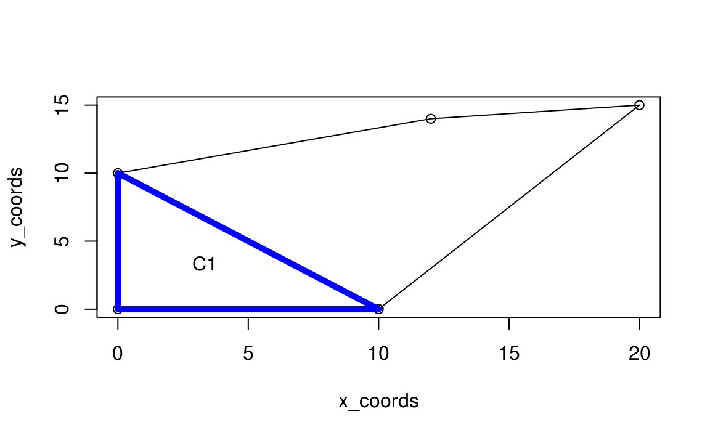
<p class="caption">(\#fig:polymat)Illustration of polygon centroid calculation problem.</p>
</div>

Step 3 is to find the area of each triangle, so a *weighted mean* accounting for the disproportionate impact of large triangles is accounted for. 
The formula to calculate the area of a triangle is as follows [@kaiser_algorithms_1993]:

$$
\frac{Ax ( B y − C y ) + B x ( C y − A y ) + C x ( A y − B y )}
{ 2 }
$$

Where $A$ to $C$ are the triangle's three points and $x$ and $y$ refer to the x and y dimensions.
A translation of this formula into R code that works with the data in the matrix representation of a triangle `T1` is as follows (the function `abs()` ensures a positive result):
<!-- Note: we could replace this code chunk with the function definition if space is an issue (RL) -->


```r
abs(T1[1, 1] * (T1[2, 2] - T1[3, 2]) +
  T1[2, 1] * (T1[3, 2] - T1[1, 2]) +
  T1[3, 1] * (T1[1, 2] - T1[2, 2]) ) / 2
#> [1] 50
```

This code chunk outputs the correct result.^[
The result can be verified using the formula for the area of a triangle whose base is horizontal, as is the case for T1 (see Figure \@ref(fig:polycent)):
area is half of the base width times its height or $A = B * H / 2$.
In this case $10 * 10 / 2 = 50$.
]
The problem is that code is clunky and must by re-typed we want to run it on another triangle matrix.
To make the code more generalizable, we will see how it can be converted into a function in the next section (\@ref(functions)).

Step 4 requires steps 2 and 3 to be undertaken not just on one triangle (as demonstrated above) but on all triangles.
This requires *iteration* to create all triangles representing the polygon, illustrated in Figure \@ref(fig:polycent).
`lapply()` and `vapply()` are used to iterate over each triangle here because they provide a concise solution in base R:^[
See `?lapply` for documentation.
Alternative functions for iteration include `map()` from the **purrr** package or a `for()` loop (see Chapter \@ref(location)).
`do.call()` is used in the code chunk as a base R equivalent of `dplyr::bind_rows()`:
it coerces the list elements into a single matrix. 
]


```r
i = 2:(nrow(poly_mat) - 2)
T_all = lapply(i, function(x) {
  rbind(O, poly_mat[x:(x + 1), ], O)
})

C_list = lapply(T_all,  function(x) (x[1, ] + x[2, ] + x[3, ]) / 3)
C = do.call(rbind, C_list)

A = vapply(T_all, function(x) {
  abs(x[1, 1] * (x[2, 2] - x[3, 2]) +
        x[2, 1] * (x[3, 2] - x[1, 2]) +
        x[3, 1] * (x[1, 2] - x[2, 2]) ) / 2
  }, FUN.VALUE = double(1))
```

<div class="figure" style="text-align: center">
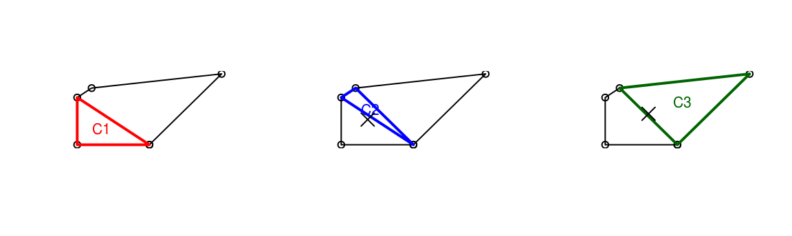
<p class="caption">(\#fig:polycent)Illustration of iterative centroid algorithm with triangles. The 'x' represents the area-weighted centroid in iterations 2 and 3.</p>
</div>

We are now in a position to complete step 4 to calculate the total area with `sum(A)` and the centroid coordinates of the polygon with `weighted.mean(C[, 1], A)` and `weighted.mean(C[, 2], A)` (exercise for alert readers: verify these commands work).
To demonstrate the link between algorithms and scripts the contents of this section have been condensed into `10-centroid-alg.R`.
We saw at the end of section \@ref(scripts) how this script can calculate the centroid of a square.
The great thing about *scripting* the algorithm is that it works on the new `poly_mat` object (see exercises below to verify these results with reference to `st_centroid()`):


```r
source("code/10-centroid-alg.R")
#> [1] "The area is: 245"
#> [1] "The coordinates of the centroid are: 8.83, 9.22"
```

<!-- We have succefully duplicated a small part of **sf**'s functionality (with a major caveat mentioned in the next paragraph). -->
The example above shows that low-level geographic operations *can* be developed from first principles with base R.
It also shows that if a tried-and-tested solution already exists, it may not be worth re-inventing the wheel:
if our aim was simply to find the centroid of a polygon it would have been quicker to represent `poly_mat` as an **sf** object and use the pre-existing `sf::st_centroid()` function instead.
However, the great benefit of writing algorithms from 1^st^ principles is that you will understand every step of the process, something that cannot be guaranteed when using other peoples' code.
A further consideration is performance: R is slow compared with low level languages such as C++ for number crunching (see section \@ref(software-for-geocomputation)) and optimization is difficult.
Still, if the aim is to develop new methods computational efficiency should not be a primary consideration, as encapsulated in the saying "premature optimization is the root of all evil (or at least most of it) in programming" [@knuth_computer_1974].

Algorithm development is hard.
This should be apparent from the amount of work that has gone into developing a centroid algorithm in base R that is just one, rather inefficient, approach to the problem with limited real-world applications (in the real world convex polygons are uncommon).
The experience should lead to an appreciation of low-level geographic libraries such as GEOS (which underlies `sf::st_centroid()`) and CGAL (the Computational Geometry Algorithms Library) which not only run fast but work on a wide range of input geometry types.
A great advantage of the open source nature of such libraries is that their source code is readily available for study, comprehension and (for those with the skills and confidence) modification.^[
The CGAL function `CGAL::centroid()` is in fact composed of 7 sub-functions as described at https://doc.cgal.org/latest/Kernel_23/group__centroid__grp.html allowing it to work on a wide range of input data types, whereas the solution we created works only on a very specific input data type.
The source code underlying GEOS function `Centroid::getCentroid()` can be found at https://github.com/libgeos/geos/search?q=getCentroid.
]

## Functions

Like algorithms functions take an input and return an output.
The difference is that functions are 'first class' objects in R and are more flexible than scripts.
We can, for example, create function that undertakes step 2 of our centroid generation algorithm as follows:


```r
t_centroid = function(x) {
  (x[1, ] + x[2, ] + x[3, ]) / 3
}
```

The above example demonstrates two key components of [functions](http://adv-r.had.co.nz/Functions.html):
1) the function *body*, the code inside the curly brackets that define what the function does with the inputs; and 2) the *formals*, the list of arguments the function works with --- `x` in this case (the third component, the environment, is beyond the scope of this section).
By default, functions return the last object that has been calculated (the coordinates of the centroid in the case of `t_centroid()`).^[
You can also explicitly set the output of a function by adding `return(output)` into the body of the function, where `output` is the result to be returned.
]


The function now works on any inputs you pass it, as illustrated in the below command which calculates the area of the 1^st^ triangle from the example polygon in the previous section (see Figure \@ref(fig:polycent)):


```r
t_centroid(T1)
#> x_coords y_coords 
#>     3.33     3.33
```

We can also create a function to calculate a triangle's area, which we will name `t_area()`:
<!-- We can use the function to find the area of a triangle with a base 3 units wide and a height of 1, for example, as follows: -->


```r
t_area = function(x) {
  abs(
    x[1, 1] * (x[2, 2] - x[3, 2]) +
    x[2, 1] * (x[3, 2] - x[1, 2]) +
    x[3, 1] * (x[1, 2] - x[2, 2])
  ) / 2
}
```

Note that after the function's creation, a triangle's area can be calculated in a single line of code, avoiding duplication of verbose code:
functions are a mechanism for *generalizing* code.
The newly created function `t_area()` takes any object `x`, assumed to have the same dimensions as the 'triangle matrix' data structure we've been using, and returns its area, as illustrated on `T1` as follows:


```r
t_area(T1)
#> [1] 50
```

We can test the generalizability of the function by using it to find the area of a new triangle matrix, which has a height of 1 and a base of 3:


```r
t_new = cbind(x = c(0, 3, 3, 0),
              y = c(0, 0, 1, 0))
t_area(t_new)
#>   x 
#> 1.5
```

A useful feature of functions is that they are modular.
Providing you know what the output will be, one function can be used as the building block of another.
Thus, the functions `t_centroid()` and `t_area()` can be used as sub-components of a larger function to do the work of the script `10-centroid-alg.R`: calculate the area of any convex polygon.
The code chunk below creates the function `poly_centroid()` to mimick the behaviour of `sf::st_centroid()`:


```r
poly_centroid = function(x) {
  i = 2:(nrow(x) - 2)
  T_all = T_all = lapply(i, function(x) {
    rbind(O, poly_mat[x:(x + 1), ], O)
  })
  C_list = lapply(T_all, t_centroid)
  C = do.call(rbind, C_list)
  A = vapply(T_all, t_area, FUN.VALUE = double(1))
  c(weighted.mean(C[, 1], A), weighted.mean(C[, 2], A))
}
```


```r
poly_centroid(poly_mat)
#> [1] 8.83 9.22
```

Functions such as `poly_centroid()` can further be built-on to provide different types of output.
To return the result as an object of class `sfg`, for example, a 'wrapper' function can be used to modify the output of `poly_centroid()` before returning the result:


```r
poly_centroid_sfg = function(x) {
  centroid_coords = poly_centroid(x)
  sf::st_point(centroid_coords)
}
```

We can verify that the output is the same as the output from `sf::st_centroid()` as follows:


```r
poly_sfc = sf::st_polygon(list(poly_mat))
identical(poly_centroid_sfg(poly_mat), sf::st_centroid(poly_sfc))
#> [1] TRUE
```

<!-- RL: I've commented-out the rest of this section as I think it distracts from the core content -->
<!-- An important concept to consider when developing your own function is *type stability*. -->
<!-- Functions are type stable if they always return objects of the same class and, generally, this means returning objects of the same type as the input object. -->
<!-- To illustrate this concept in practice we will create a type stable version `poly_centroid()` that always takes a matrix with 2 columns as an input and always returns a matrix with 2 columns representing x and y coordinates: -->

<!-- ```{r} -->
<!-- poly_centroid_type_stable = function(x) { -->
<!--   stopifnot(is.matrix(x) & ncol(x) == 2) -->
<!--   centroid_coords = poly_centroid(x) -->
<!--   return(matrix(centroid_coords, ncol = 2)) -->
<!-- } -->
<!-- ``` -->

<!-- The first line of the function is an example of 'defensive programming': -->
<!-- it checks the input is in the right format (a matrix with 2 columns) before proceeding. -->
<!-- Such checks can ensure that the code is robust and does not silently fail. -->
<!-- We can verify it works with `matrix(centroid_coords, ncol = 2)`. -->
<!-- To see the input data type check working we can try running the function on a matrix with 3 columns: -->

<!-- ```{r, warning=FALSE} -->
<!-- poly_mat3 = cbind(1:nrow(poly_mat), poly_mat) -->
<!-- poly_centroid(poly_mat3) -->
<!-- ``` -->

<!-- ```{r, eval=FALSE} -->
<!-- poly_centroid_type_stable(poly_mat3) -->
<!-- #> Error in poly_centroid_type_stable(poly_mat3) :  -->
<!-- #>   is.matrix(x) & ncol(x) == 2 is not TRUE  -->
<!-- ``` -->


## Exercises {#ex-algorithms}

1. Read the script `10-centroid-alg.R` in the `code` folder of the book's GitHub repo.
    - Which of the best practices covered in section \@ref(scripts) does it follow?
    - Create a version of the script on your computer in an IDE such as RStudio (preferably by typing-out the script line-by-line, in your own coding style and with your own comments, rather than copy-pasting --- this will help you learn how to type scripts) and, using the example of a square polygon (e.g. created with `poly_mat = cbind(x = c(0, 0, 9, 9, 0), y = c(0, 9, 9, 0, 0))`) execute the script line-by-line.
    - What changes could be made to the script to make it more reproducible?
    <!-- - Answer: The script could state that it needs a an object called `poly_mat` to be present and, if none is present, create an example dataset at the outset for testing. -->
<!-- 1. Check-out the script `10-earthquakes.R` in the `code` folder of the book's GitHub [repo](https://github.com/Robinlovelace/geocompr/blob/master/code/10-earthquakes.R). -->
<!--     - Try to reproduce the results: how many significant earthquakes were there last month? -->
<!--     - Modify the script so that it provides a map with all earthquakes that happened in the past hour. -->
<!-- change line 10 to: -->
<!-- u = "https://earthquake.usgs.gov/earthquakes/feed/v1.0/summary/significant_hour.geojson" -->
    - How could the documentation be improved?
  <!-- It coud document the source of the data better - e.g. with `data from https://earthquake.usgs.gov/earthquakes/feed/v1.0/geojson.php` -->
1. In section \@ref(geographic-algorithms) we calculated that the area and geographic centroid of the polygon represented by `poly_mat` was 245 and 8.8, 9.2, respectively.
    - Reproduce the results on your own computer with reference to the script `10-centroid-alg.R`, an implementation of this algorithm (bonus: type out the commands - try to avoid copy-pasting).
    <!-- Todo: add link to that script file (RL) -->
    - Are the results correct? Verify them by converting `poly_mat` into an `sfc` object (named `poly_sfc`) with `st_polygon()` (hint: this function takes objects of class `list()`) and then using `st_area()` and `st_centroid()`.
<!-- We can verify the answer by converting `poly_mat` into a simple feature collection as follows, which shows the calculations match: -->

1. It was stated that the algorithm we created only works for *convex hulls*. Define convex hulls (see Chapter \@ref(geometric-operations)) and test the algorithm on a polygon that is *not* a convex hull.
     - Bonus 1: Think about why the method only works for convex hulls and note changes that would need to be made to the algorithm for other types of shape to be calculated.
<!-- The algorithm would need to be able to have negative as well as positive area values. -->
     - Bonus 2: Building on the contents of `10-centroid-alg.R`, write an algorithm only using base R functions that can find the total length of linestrings represented in matrix form.
<!-- Todo: add example of matrix representing a linestring, demonstrate code to verify the answer, suggest alternative functions to decompose as a bonus. -->
1. In section \@ref(functions) we created a different versions of the `poly_centroid()` function that generated outputs of class `sfg` (`poly_centroid_sfg()`) and type-stable `matrix` outputs (`poly_centroid_type_stable()`). Further extend the function by creating a version (e.g. called `poly_centroid_sf()`) that is type stable (only accepts inputs of class `sf`) *and* returns `sf` objects (hint: you may need to convert the object `x` into a matrix with the command `sf::st_coordinates(x)`.
    - Verify it works by running `poly_centroid_sf(sf::st_sf(sf::st_sfc(poly_sfc)))`
    - What error message do you get when you try to run `poly_centroid_sf(poly_mat)`?
    


<!--chapter:end:10-algorithms.Rmd-->


# Statistical learning for geographic data {#spatial-cv}

## Prerequisites {-}

This chapter assumes proficiency with spatial data, for example gained by studying the contents and working-through the exercises in chapters \@ref(spatial-class) to \@ref(reproj-geo-data).
A familiarity with generalized linear regression and machine learning is highly recommended [for example from @zuur_mixed_2009;@james_introduction_2013].

The chapter uses the following packages:^[
Package **kernlab**, **pROC**, **RSAGA** and **spDataLarge** must also be installed although these do not need to be attached.
]


```r
library(sf)
library(raster)
library(mlr)
library(tidyverse)
library(parallelMap)
```

Required data will be attached in due course.

## Introduction {#intro-cv}

Statistical learning is concerned with the use of statistical and computational models for identifying patterns in data and predicting from these patterns.
Due to its origins, statistical learning is one of R's great strengths (see section \@ref(software-for-geocomputation)).^[
Moreover, applying statistical techniques to geographic data has been an active topic of research for many decades, within the overlapping fields of Geostatistics and Spatial Statistics [@diggle_modelbased_2007; @gelfand_handbook_2010] and the vibrant sub-field of point pattern analysis [@baddeley_spatial_2015].
]

Statistical learning combines and blends methods from both statistics and machine learning that learn from data.
Roughly, one can distinguish statistical learning into supervised and unsupervised techniques, both of which are used throughout a vast range of disciplines including economics, physics, medicine, biology, ecology and geography [@james_introduction_2013].

This chapter focuses on supervised techniques, as opposed to unsupervised techniques such as clustering.
Response variables can be binary (such as landslide occurrence), categorical (land use), integer (species richness count) or numeric (soil acidity measured in pH).
Supervised techniques model the relationship between such responses --- which are known for a sample of observations --- and one or more predictors.

<!-- For this we can use techniques from the field of statistics or from the field of machine learning.
Which to use depends on the primary aim: statistical inference or prediction.
Statistical regression techniques are especially useful if the aim is statistical inference.
These techniques also allow predictions of unseen data points but this is usually only of secondary interest to statisticians.
Statistical inference, on the other hand, refers among others to a predictor's significance, its importance for a specific model, its relationship with the response and the uncertainties associated with the estimated coefficients.
To trust the p-values and standard errors of such models we need to perform a thorough model validation testing if one or several of the underlying model assumptions (heterogeneity, independence, etc.) have been violated [@zuur_mixed_2009].
By contrast, statistical inference is impossible with machine learning [@james_introduction_2013].
-->
<!-- The primary aim of machine learning is to make good predictions, whereas the field of statistics is more focussed on the underlying theory [e.g. @zuur_mixed_2009] -->

The primary aim of machine learning is to make good predictions.
It is increasingly appealing in the age of 'big data' because it makes few assumptions about input variables and can scale to handle problems that involve large datasets.
Machine learning is conducive to tasks such as the prediction of future customer behavior, recommendation services (music, movies, what to buy next), face recognition, autonomous driving, text classification and predictive maintenance (infrastructure, industry).

<!-- ^[In this case we do not have too worry too much about possible model misspecifications since we explicitly do not want to do statistical inference.] -->

This chapter is based on a case study: the (spatial) prediction of landslides.
This application links to the applied nature of geocomputation, defined in Chapter \@ref(intro), and illustrates how machine learning borrows from the field of statistics when the sole aim is prediction.
Therefore, this chapter first introduces modeling and cross-validation concepts with the help of a Generalized Linear Model [GLM; @zuur_mixed_2009].
Building on this the chapter implements a more typical machine learning algorithm, namely a Support Vector Machine (SVM).
The models' **predictive performance** will be assessed using spatial cross-validation (CV), which accounts for the fact that geographic data is special.

CV determines a model's ability to generalize to new data, by splitting a dataset (repeatedly) into training and test sets.
It uses the training data to fit the model, and checks its performance when predicting to the test data.
CV helps to detect overfitting since models that predict the training data too closely (noise) will tend to perform poorly on the test data.

Randomly splitting spatial data can lead to training points that are neighbors in space with test points.
Due to spatial autocorrelation, test and training datasets would not be independent in this scenario, with the consequence that CV fails to detect a possible overfitting.
Spatial CV alleviates this problem and is the **central** theme in this chapter.

## Case study: Landslide susceptibility {#case-landslide}

The case study is based on a dataset of landslide locations in Southern Ecuador, illustrated in Figure \@ref(fig:lsl-map) and described in detail in @muenchow_geomorphic_2012.
A subset of the dataset used in that paper is provided in the **RSAGA** package, which can be loaded as follows:


```r
data("landslides", package = "RSAGA")
```

This should load three objects: a `data.frame` named `landslides`, a `list` named `dem`, and an `sf` object named `study_area`.
`landslides` contains a factor column `lslpts` where `TRUE` corresponds to an observed landslide 'initiation point', with the coordinates stored in columns `x` and `y`.^[
The landslide initiation point is located in the scarp of a landslide polygon. See @muenchow_geomorphic_2012 for further details.
]

There are 175 landslide points and 1360 non-landslide, as shown by `summary(landslides)`.
The 1360 non-landslide points were sampled randomly from the study area, with the restriction that they must fall outside a small buffer around the landslide polygons.

To make the number of landslide and non-landslide points balanced, let us sample 175 from the 1360 non-landslide points.^[The `landslides` dataset has been used in classes and summer schools.
To show how predictive performance of different algorithms changes with an unbalanced and highly spatially autocorrelated response variable, 1360 non-landslide points were randomly selected, i.e. much more absences than presences.
However, especially a logistic regression with a log-link, as used in this chapter, expects roughly the same number of presences and absences in the response.]


```r
# select non-landslide points
non_pts = filter(landslides, lslpts == FALSE)
# select landslide points
lsl_pts = filter(landslides, lslpts == TRUE)
# randomly select 175 non-landslide points
set.seed(11042018)
non_pts_sub = sample_n(non_pts, size = nrow(lsl_pts))
# create smaller landslide dataset (lsl)
lsl = bind_rows(non_pts_sub, lsl_pts)
```

`dem` is a digital elevation model consisting of two elements:
`dem$header`, a `list` which represents a raster 'header' (see section \@ref(raster-data)), and `dem$data`, a matrix with the altitude of each pixel.
`dem` can be converted into a `raster` object with:

<!-- Idea: could create a function to do this -->


```r
dem = raster(
  dem$data, 
  crs = dem$header$proj4string,
  xmn = dem$header$xllcorner, 
  xmx = dem$header$xllcorner + dem$header$ncols * dem$header$cellsize,
  ymn = dem$header$yllcorner,
  ymx = dem$header$yllcorner + dem$header$nrows * dem$header$cellsize
  )
```

To model landslide susceptibility, we need some predictors.
Terrain attributes are frequently associated with landsliding [@muenchow_geomorphic_2012], and these can be computed from the digital elevation model (`dem`) using R-GIS bridges (see Chapter \@ref(gis)).
We leave it as an exercise to the reader to compute the following terrain attribute rasters and extract the corresponding values to our landslide/non-landslide dataframe (see exercises; we also provide the resulting dataframe via the **spDataLarge** package, see further below):

- `slope`: slope angle (°).
- `cplan`: plan curvature (rad m^−1^) expressing the convergence or divergence of a slope and thus water flow.
- `cprof`: profile curvature (rad m^-1^) as a measure of flow acceleration, also known as downslope change in slope angle.
- `elev`: elevation (m a.s.l.) as the representation of different altitudinal zones of vegetation and precipitation in the study area.
- `log10_carea`: the decadic logarithm of the catchment area (log10 m^2^) representing the amount of water flowing towards a location.

As a convenience to the reader, the dataframe containing the landslide points with the corresponding terrain attributes is also available in the **spDataLarge** package along with the a terrain attribute raster stack from which the values were extracted.
Hence, if you have not computed the predictors yourself, attach the corresponding data before running the code of the remaining chapter:


```r
# attach landslide points with terrain attributes
data("lsl", package = "spDataLarge")
# attach terrain attribute raster stack
data("ta", package = "spDataLarge")
```

The first three rows of `lsl` look like this (rounded to two significant digits):


```r
lsl %>%
  mutate_at(vars(-one_of("x", "y", "lslpts")), funs(signif(., 2))) %>%
  head(3)
#>        x       y lslpts slope  cplan  cprof elev log10_carea
#> 1 715078 9558647  FALSE    37  0.021 0.0087 2500         2.6
#> 2 713748 9558047  FALSE    42 -0.024 0.0068 2500         3.1
#> 3 712508 9558887  FALSE    20  0.039 0.0150 2100         2.3
```


<div class="figure" style="text-align: center">

<p class="caption">(\#fig:lsl-map)Landslide initiation points (red) and points unaffected by landsliding (blue) in Southern Ecuador.</p>
</div>

## Conventional modeling approach in R {#conventional-model}

Before introducing the **mlr** package, an umbrella-package providing a unified interface to dozens of learning algorithms (section \@ref(spatial-cv-with-mlr)), it is worth taking a look at the conventional modeling interface in R.
This introduction to supervised statistical learning provides the basis for doing spatial CV, and contributes to a better grasp on the **mlr** approach presented subsequently.

Supervised learning involves predicting a response variable as a function of predictors (section \@ref(intro-cv)). 
In R, modeling functions are usually specified using formulas (see `?formula` and the detailed [Formulas in R Tutorial](https://www.datacamp.com/community/tutorials/r-formula-tutorial) for details of R formulas).
The following command specifies and runs a generalized linear model:


```r
fit = glm(lslpts ~ slope + cplan + cprof + elev + log10_carea,
          family = binomial(),
          data = lsl)
```

It is worth understanding each of the three input arguments:

- A formula, which specifies landslide occurrence (`lslpts`) as a function of the predictors.
- A family, which specifies the type of model, in this case `binomial` because the response is binary (see `?family`).
- The dataframe which contains the response and the predictors.

The results of this model can be printed as follows (`summary(fit)` provides a more detailed account of the results):


```r
class(fit)
#> [1] "glm" "lm"
fit
#> 
#> Call:  glm(formula = lslpts ~ slope + cplan + cprof + elev + log10_carea, 
#>     family = binomial(), data = lsl)
#> 
#> Coefficients:
#> (Intercept)        slope        cplan        cprof         elev  
#>    1.97e+00     9.30e-02    -2.57e+01    -1.43e+01     2.41e-05  
#> log10_carea  
#>   -2.12e+00  
#> 
#> Degrees of Freedom: 349 Total (i.e. Null);  344 Residual
#> Null Deviance:	    485 
#> Residual Deviance: 361 	AIC: 373
```

The model object `fit`, of class `glm`, contains the coefficients defining the fitted relationship between response and predictors.
It can also be used for prediction.
This is done with the generic `predict()` method, which in this case calls the function `predict.glm()`.
Setting `type` to `response` returns the predicted probabilities (of landslide occurrence) for each observation in `lsl`, as illustrated below (see `?predict.glm`):


```r
pred_glm = predict(object = fit, type = "response")
head(pred_glm)
#>      1      2      3      4      5      6 
#> 0.3327 0.4755 0.0995 0.1480 0.3486 0.6766
```

Spatial predictions can be made by applying the coefficients to the predictor rasters. 
This can be done manually or with `raster::predict()`.
In addition to a model object (`fit`), this function also expects a raster stack with the predictors named as in the model's input dataframe (Figure \@ref(fig:lsl-susc)).


```r
# attaching ta, a raster brick containing the predictors
data("ta", package = "spDataLarge")
# making the prediction
pred = raster::predict(object = ta, model = fit,
                       type = "response")
```


<div class="figure" style="text-align: center">
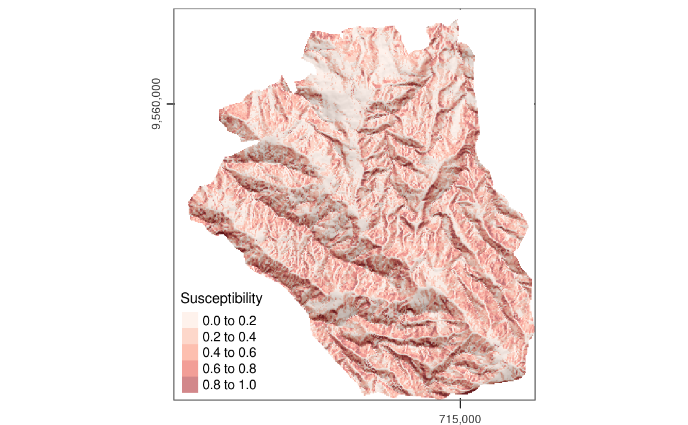
<p class="caption">(\#fig:lsl-susc)Spatial prediction of landslide susceptibility using a GLM.</p>
</div>

Here, when making predictions we neglect spatial autocorrelation since we assume that on average the predictive accuracy remains the same with or without spatial autocorrelation structures.
However, it is possible to include spatial autocorrelation structures into models [@zuur_mixed_2009;@blangiardo_spatial_2015;@zuur_beginners_2017] as well as into predictions [kriging approaches,  see e.g., @goovaerts_geostatistics_1997;@hengl_practical_2007;@bivand_applied_2013].
This is, however, beyond the scope of this book.
<!--
Nevertheless, we give the interested reader some pointers where to look it up:

1. The predictions of regression kriging combines the predictions of a regression with the kriging of the regression's residuals [@bivand_applied_2013]. 
2. One can also add a spatial correlation (dependency) structure to a generalized least squares model  [`nlme::gls()`; @zuur_mixed_2009; @zuur_beginners_2017].  
3. Finally, there are mixed-effect modeling approaches.
Basically, a random effect imposes a dependency structure on the response variable which in turn allows for observations of one class to be more similar to each other than to those of another class [@zuur_mixed_2009]. 
Classes can be, for example, bee hives, owl nests, vegetation transects or an altitudinal stratification.
This mixed modeling approach assumes normal and independent distributed random intercepts.^[Note that for spatial predictions one would usually use the population intercept.]
This can even be extended by using a random intercept that is normal and spatially dependent.
For this, however, you will have to resort most likely to Bayesian modeling approaches since frequentist software tools are rather limited in this respect especially for more complex models [@blangiardo_spatial_2015; @zuur_beginners_2017]. 
-->

Spatial prediction maps are one very important outcome of a model.
Even more important is how good the underlying model is at making them since a prediction map is useless if the model's predictive performance is bad.
The most popular measure to assess the predictive performance of a binomial model is the Area Under the Receiver Operator Characteristic Curve (AUROC).
This is a value between 0.5 and 1.0 with 0.5 indicating no and 1.0 indicating a perfect discrimination of the two classes. 
Thus, the higher the AUROC the better is our model at making predictions.
In the following we compute the receiver operator characteristic with the help of `roc()` by providing it with the response variable and the predicted values. 
`auc()` returns the area under the curve.


```r
pROC::auc(pROC::roc(lsl$lslpts, fitted(fit)))
#> Area under the curve: 0.826
```

An AUROC of 0.83 represents a good fit.
However, this is an overoptimistic estimation since we have computed it on the complete dataset. 
To derive a biased-reduced assessment we have to use cross-validation and in the case of spatial data should make use of spatial CV.

## Introduction to (spatial) cross-validation {#intro-cv} 
Cross-validation belongs to the family of resampling methods [@james_introduction_2013].
The basic idea is to split (repeatedly) a dataset into training and test sets whereby the training data is used to fit a model which then is applied to the test set.
Comparing the predicted values with the known response values from the test set (using a performance measure such as the AUROC in the binomial case) gives a bias-reduced assessment of the model's capability to generalize the learned relationship to independent data.
For example, a 100-repeated 5-fold cross-validation means to randomly split the data into five partitions (folds) with each fold being used once as a test set (see upper row of Figure \@ref(fig:partitioning)). 
This guarantees that each observation is used once in one of the test sets, and requires the fitting of five models.
Subsequently, this procedure is repeated 100 times.
Of course, the data splitting will differ in each repetition.
<!--if the error is calc. on the fold-level. most often its calc. on the repetition level. maybe worth noting.
talk about this in person
-->
Overall, this sums up to 500 models whereas the mean performance measure (AUROC) of all models is the model's overall predictive power.

However, geographic data is special.
As we saw in Chapter \@ref(transport), the 'first law' of geography states that points close to each other are, generally, more similar than points further away [@miller_toblers_2004].
This means these points are not statistically independent because training and test points in conventional CV are often too close to each other (see first row of \@ref(fig:partitioning)).
'Training' observations near the 'test' observations can provide a kind of 'sneak preview':
information that should be unavailable to the training dataset.
<!-- "folds" only for the repetition split, "partitions" or "subsets" for splitting within a fold
talk about this in person
-->
To alleviate this problem 'spatial partitioning' is used to split the observations into spatially disjointed subsets (using the observations' coordinates in a *k*-means clustering; @brenning_spatial_2012; second row of Figure \@ref(fig:partitioning)).
This partitioning strategy is the **only** difference between spatial and conventional CV.
As a result spatial CV leads to a bias-reduced assessment of a model's predictive performance, and hence helps to avoid overfitting.
<!-- Alex suggested to remove this: 
It is important to note that spatial CV reduces the bias introduced by spatial autocorrelation but does not completely remove it. 
This is because there are still a few points in the test and training data which are still neighbors (@brenning_spatial_2012; see second row of \@ref(fig:partitioning)).
-->

<div class="figure" style="text-align: center">

<p class="caption">(\#fig:partitioning)Spatial visualization of selected test and training observations for cross-validation of one repetition. Random (upper row) and spatial partitioning (lower row).</p>
</div>

## Spatial CV with **mlr**

There are dozens of packages for statistical learning, as described for example in the [CRAN machine learning task view](https://CRAN.R-project.org/view=MachineLearning).
Getting acquainted with each of these packages, including how to undertake cross-validation and hyperparameter tuning, can be a time-consuming process.
Comparing model results from different packages can be even more laborious.
The **mlr** package was developed to address these issues.
It acts as a 'meta-package', providing a unified interface to popular supervised statistical learning techniques including classification, regression, survival analysis and clustering [@bischl_mlr:_2016]
<!-- .^[ -->
<!-- We will solely focus on supervised learning techniques in this chapter. -->
<!-- ] -->
The standardized **mlr** interface is based on eight 'building blocks'.
As illustrated in Figure \@ref(fig:building-blocks), these have a clear order.

<div class="figure" style="text-align: center">

<p class="caption">(\#fig:building-blocks)Basic building blocks of the **mlr** package. Source: [openml.github.io](http://openml.github.io/articles/slides/useR2017_tutorial/slides_tutorial_files/ml_abstraction-crop.png). Permission to reuse this figure was kindly granted.</p>
</div>

The **mlr** modeling process consists of three main stages.
First, a **task** specifies the data (including response and predictor variables) and the model type (such as regression or classification).
Second, a **learner** defines the specific learning algorithm that is applied to the created task.
Third, the **resampling** approach assesses the predictive performance of the model, i.e. its ability to generalize to new data (see also section \@ref(intro-cv)).

### Generalized linear model {#glm}

To implement a GLM in **mlr** we must create a **task** containing the landslide data.
Since the response is binary (two-category variable) we create a classification task with `makeClassifTask()` (for regression tasks use `makeRegrTask()`, see `?makeClassifTask` for other task types).
The first essential argument of these `make*()` functions is `data`.
The `target` argument expects the name of a response variable and `positive` determines which of the two factor levels of the response variable indicate the landslide initiation point (in our case this is `TRUE`).
All other variables of the `lsl` dataset will serve as predictors except for the coordinates (see the result of `getTaskFormula(task)` for the model formula).
For spatial CV the `coordinates` parameter is used (see section \@ref(intro-cv) and Figure \@ref(fig:partitioning)) which expects the coordinates as a xy-dataframe.


```r
library(mlr)
# coordinates needed for the spatial partitioning
coords = lsl[, c("x", "y")]
# select response and predictors to use in the modeling
data = dplyr::select(lsl, -x, -y)
coords = lsl[, c("x", "y")]
# create task
task = makeClassifTask(data = data, target = "lslpts",
                       positive = "TRUE", coordinates = coords)
```

`makeLearner()` determines the statistical learning method to use.
All classification **learners** start with `classif.` and all regression learners with `regr.` (see `?makeLearners` for details). 
`listLearners()` helps to find out about all available learners and from which package **mlr** imports them (Table \@ref(tab:lrns)). 
For a specific task, we can run:


```r
listLearners(task, warn.missing.packages = FALSE) %>%
  dplyr::select(class, name, short.name, package) %>%
  head
```


Table: (\#tab:lrns)Sample of available learners for binomial tasks in the **mlr** package.

class                 name                       short.name    package 
--------------------  -------------------------  ------------  --------
classif.binomial      Binomial Regression        binomial      stats   
classif.featureless   Featureless classifier     featureless   mlr     
classif.fnn           Fast k-Nearest Neighbour   fnn           FNN     
classif.gausspr       Gaussian Processes         gausspr       kernlab 
classif.knn           k-Nearest Neighbor         knn           class   
classif.ksvm          Support Vector Machines    ksvm          kernlab 

This yields all learners able to model two-class problems (landslide yes or no).
We opt for the binomial classification method used in section \@ref(conventional-model) and implemented as `classif.binomial` in **mlr**.
Additionally, we must specify the link-function, `logit` in this case, which is also the default of the `binomial()` function.
`predict.type` determines the type of the prediction with `prob` resulting in the predicted probability for landslide occurrence between 0 and 1 (this corresponds to `type = response` in `predict.glm`).


```r
lrn = makeLearner(cl = "classif.binomial",
                  link = "logit",
                  predict.type = "prob",
                  fix.factors.prediction = TRUE)
```

To find out from which package the specified learner is taken and how to access the corresponding help pages, we can run:


```r
getLearnerPackages(lrn)
helpLearner(lrn)
```

<!--
Having specified a learner and a task, we can train our model which basically executes the `glm()` command in the background for our task. 


```r
mod = train(learner = lrn, task = task)
mlr_fit = getLearnerModel(mod)
```


`getLearnerModel()` extracts the used model which shows that **mlr** passed all specified parameters to the `glm` function in the background as also proved by following code:


```r
fit = glm(lslpts ~ ., family = binomial(link = "logit"), data = data)
identical(fit$coefficients, mlr_fit$coefficients)
#> [1] TRUE
```
-->

The set-up steps for modeling with **mlr** may seem tedious. 
But remember this single interface provides access to the 150+ learners shown by `listLearners()`; it would be far more tedious to learn the interface for each learner!
Further advantages are simple parallelization of resampling techniques and the ability to tune machine learning hyperparameters (see section \@ref(svm)).
Most importantly, (spatial) resampling in **mlr** is straightforward, requiring only two more steps: specifying a resampling method and running it.
We will use a 100-repeated 5-fold spatial CV: five partitions will be chosen based on the provided coordinates in our `task` and the partitioning will be repeated 100 times:[^13]

[^13]: 

    Note that package **sperrorest** initially implemented spatial cross-validation in R [@brenning_spatial_2012].
    In the meantime, its functionality was integrated into the **mlr** package which is the reason why we are using **mlr** [@schratz_performance_nodate].The **caret** package is another umbrella-package [@kuhn_applied_2013] for streamlined modeling in R, however, so far it does not provide spatial CV which is why we refrain from using it for spatial data.


```r
perf_level = makeResampleDesc(method = "SpRepCV", folds = 5, reps = 100)
```

To execute the spatial resampling, we run `resample()` using the specified learner, task, resampling strategy and of course the performance measure, here the AUROC.
This takes some time (around 10 seconds on a modern laptop) because it computes the AUROC for 500 models. 
Setting a seed ensures the reprocubility of the obtained result and will ensure the same spatial partitioning when re-running the code.

<!-- I just thought it might be worth showing the differences between an error on the fold level and repetition level but aggregating to the rep level is not a one-liner in mlr -->


```r
set.seed(012348)
sp_cv = mlr::resample(learner = lrn, task = task,
                      resampling = perf_level, 
                      measures = mlr::auc)
```


<!-- sp_cv and conv_cv have been saved in spatialcv.Rdata. I needed to run the modeling outside of the book since knitr sets its own seed and I am not sure if this actually helps to make sure that the same partitions are used in the cv.
I really don't understand why I have to load spatialcv.Rdata here a third time...-->

The output of the preceding code chunk is a bias-reduced assessment of the model's predictive performance, as illustrated in the following code chunk  (required input data is saved in the file `spatialcv.Rdata` in the book's GitHub repo):


```r
# summary statistics of the 500 models
summary(sp_cv$measures.test$auc)
#>    Min. 1st Qu.  Median    Mean 3rd Qu.    Max. 
#>   0.686   0.757   0.789   0.780   0.795   0.861
# mean AUROC of the 500 models
mean(sp_cv$measures.test$auc)
#> [1] 0.78
```

To put these results in perspective let us compare them with AUROC values from a 100-repeated 5-fold non-spatial cross-validation (Figure \@ref(fig:boxplot-cv); the code for the non-spatial cross-validation is not shown here but will be explored in the exercise section).
As expected, the spatially cross-validated result yields lower AUROC values on average than the conventional cross-validation approach, underlining the over-optimistic predictive performance due to spatial autocorrelation of the latter.

<div class="figure" style="text-align: center">

<p class="caption">(\#fig:boxplot-cv)Boxplot showing the difference in AUROC values between spatial and conventional 100-repeated 5-fold cross-validation.</p>
</div>

### Spatial tuning of machine-learning hyperparameters {#svm}

Section \@ref(intro-cv) introduced machine learning as part of statistical learning.
To recap, we adhere to the following definition of machine learning by [Jason Brownlee](https://machinelearningmastery.com/linear-regression-for-machine-learning/):

> Machine learning, more specifically the field of predictive modeling is primarily concerned with minimizing the error of a model or making the most accurate predictions possible, at the expense of explainability.
In applied machine learning we will borrow, reuse and steal algorithms from many different fields, including statistics and use them towards these ends.

In section \@ref(glm) a GLM was used to predict landslide susceptibility.
This section introduces support vector machines (SVM) for the same purpose.
In short, SVMs search for the best possible 'hyperplanes' to separate classes (in a classification case) and estimate 'kernels' with specific hyperparameters to allow for non-linear boundaries between classes [@james_introduction_2013].
Hyperparameters should not be confused with coefficients of parametric models, which are sometimes also referred to as parameters.^[
For a detailed description of the difference between coefficients and hyperparameters, see the 'machine mastery' blog post on the subject.
<!-- For a more detailed description of the difference between coefficients and hyperparameters, see the [machine mastery blog](https://machinelearningmastery.com/difference-between-a-parameter-and-a-hyperparameter/). -->
]
Coefficients can be estimated from the data while hyperparameters are set before the learning begins.
Optimal hyperparameters are usually determined within a defined range with the help of cross-validation methods.
This is called hyperparameter tuning.

Some SVM implementations such as that provided by **kernlab** allow hyperparameters to be tuned automatically, usually based on random sampling (see upper row of Figure \@ref(fig:partitioning)).
This works for non-spatial data but is of less use for spatial data where 'spatial tuning' should be undertaken.

Before defining spatial tuning we will set-up the **mlr** building blocks, introduced in section \@ref(glm), for the SVM.
The classification task remains the same, hence we can simply resue the `task` object created in section \@ref(glm).
Learners implementing SVM can be found using `listLearners()` as follows:


```r
lrns = listLearners(task, warn.missing.packages = FALSE)
filter(lrns, grepl("svm", class)) %>% 
  dplyr::select(class, name, short.name, package)
#>            class                                 name short.name package
#> 6   classif.ksvm              Support Vector Machines       ksvm kernlab
#> 9  classif.lssvm Least Squares Support Vector Machine      lssvm kernlab
#> 17   classif.svm     Support Vector Machines (libsvm)        svm   e1071
```

Of the options illustrated above, we will use `ksvm()` from the **kernlab** package [@karatzoglou_kernlab_2004].
To allow for non-linear relationships we use the popular radial basis function (or Gaussian) kernel which is also the default of `ksvm()`.


```r
lrn_ksvm = makeLearner("classif.ksvm",
                        predict.type = "prob",
                        kernel = "rbfdot")
```

The next stage is to specify a resampling strategy.
Again we will use a 100-repeated 5-fold spatial CV.

<!-- Instead of saying "outer resampling" we concluded to use "performance estimation level" and "tuning level" (inner) in our paper
# this is also what is shown in the nested CV figure so it would be more consistent -->


```r
# performance estimation level
perf_level = makeResampleDesc(method = "SpRepCV", folds = 5, reps = 100)
```

Note that this is the exact same code as used for the GLM in section \@ref(glm)), we have simply repeated it here as a reminder.

So far, the process has been identical to that described in section \@ref(glm).
The next step is new, however: to tune the hyperparameters.
Using the same data for the performance assessment and the tuning would potentially lead to overoptimistic results [@cawley_overfitting_2010].
This can be avoided using nested spatial CV.

<div class="figure" style="text-align: center">

<p class="caption">(\#fig:inner-outer)Visual representation of the hyperparameter tuning and performance estimation levels in spatial and non-spatial cross-validation. Permission for reusing the figure was kindly granted by Patrick Schratz [@schratz_performance_nodate].</p>
</div>

This means that we split each fold again into five spatially disjoint subfolds which are used to determine the optimal hyperparameters (`tune_level` object in the code chunk below; see Figure \@ref(fig:inner-outer) for a visual representation).
To find the optimal hyperparameter combination we here fit 50 models (`ctrl` object in the code chunk below) in each of these subfolds with randomly selected values for the hyperparameters C and Sigma.
The random selection of values C and Sigma is additionally restricted to a predefined tuning space (`ps` object).
The range of the tuning space was chosen with values recommended in the literature [@schratz_performance_nodate].

<!--
Questions Pat:
- why not using e1071 svm -> inner hyperparameter tuning also possible I guess...
## Because kernlab has more kernel options. Other than that there is no argument
- explanation correct?
## If you mean the paragraph above, yes
- trafo-function?
## is just a different approach of writing the limits. You could also directly write 2^{-15}. Makes it easier to see the limits at the first glance. Personal preference though
- 125,000 models
-->

<!--
talk in person (see also exercises):
- can I compare the mean AUROC of the GLM and the SVM when using the same seed? Or is seeding not strictly necessary? I mean, ok, the partitions vary a bit but overall...
-->


```r
# five spatially disjoint partitions
tune_level = makeResampleDesc("SpCV", iters = 5)
# use 50 randomly selected hyperparameters
ctrl = makeTuneControlRandom(maxit = 50)
# define the outer limits of the randomly selected hyperparameters
ps = makeParamSet(
  makeNumericParam("C", lower = -12, upper = 15, trafo = function(x) 2^x),
  makeNumericParam("sigma", lower = -15, upper = 6, trafo = function(x) 2^x)
  )
```

The next stage is to modify the learner `lrn_ksvm` in accordance with all the characteristics defining the hyperparameter tuning with `makeTuneWrapper()`.


```r
wrapped_lrn_ksvm = makeTuneWrapper(learner = lrn_ksvm, 
                                   resampling = tune_level,
                                   par.set = ps,
                                   control = ctrl, 
                                   show.info = TRUE,
                                   measures = mlr::auc)
```

The **mlr** is now set-up to fit 250 models to determine optimal hyperparameters for one fold.
Repeating this for each fold, we end up with 1250 (250 \* 5) models for each repetition.
Repeated 100 times means fitting a total of 125,000 models to identify optimal hyperparameters (Figure \@ref(fig:partitioning)).
These are used in the performance estimation, which requires the fitting of another 500 models (5 folds \* 100 repetitions; see Figure \@ref(fig:partitioning)). 
To make the performance estimation processing chain even clearer, let us write down the commands we have given to the computer:

1. Performance level (upper left part of Figure \@ref(fig:inner-outer)): split the dataset into five spatially disjoint (outer) subfolds.
1. Tuning level (lower left part of Figure \@ref(fig:inner-outer)): use the first fold of the performance level and split it again spatially into five (inner) subfolds for the hyperparameter tuning. 
Use the 50 randomly selected hyperparameters in each of these inner subfolds, i.e. fit 250 models.
1. Performance estimation: Use the best hyperparameter combination from the previous step (tuning level) and apply it to the first outer fold in the performance level to estimate the performance (AUROC).
1. Repeat steps 2 and 3 for the remaining four outer folds.
1. Repeat a 100 times steps 2 to 4.

The process of hyperparameter tuning and performance estimation is computationally intensive.
Model runtime can be reduced with parallelization, which can be done in a number of ways, depending on the operating system.
<!-- "cloud development is done on linux servers" is somehow a strange read that I cannot relate really. Maybe sth like: "Parallelilaztion and cloud-computing are most often done on Linux operating systems nowadays. This has some reasons, one of them that directly affects us is that only on Linux systems we can set a parallel seed in R that makes the parallel processes reproducible [this is still an assumption, I will check on that!]"-->

Before starting the parallelization, we ensure that the processing continues even if one of the models throws an error by setting `on.learner.error` to `warn`.
This avoids the process stopping just because of one failed model, which is desirable on large model runs.
To inspect the failed models once the processing is completed, we dump them:


```r
configureMlr(on.learner.error = "warn", on.error.dump = TRUE)
```

To start the parallelization, we set the `mode` to `multicore` which will use `mclapply()` in the background on a single machine in the case of a Unix-based operating system^[
See `?parallelStart` for further modes and github.com/berndbischl/parallelMap for more on the unified interface to popular parallelization back-ends.
]
Equivalenty, `parallelStartSocket()` enables parallelization under Windows. 
`level` defines the level at which to enable parallelization, with `mlr.tuneParams` determining that the hyperparameter tuning level should be parallelized (see lower left part of Figure \@ref(fig:inner-outer), `?parallelGetRegisteredLevels`, and the **mlr** [parallelization tutorial](https://mlr-org.github.io/mlr-tutorial/release/html/parallelization/index.html#parallelization-levels) for details).
We will use half of the available cores (set with the `cpus` parameter), a setting that allows possible other users to work on the same high performance computing cluster in case one is used (which was the case when we ran the code).
<!-- the partitions are created before the parallelization by the normal set.seed() call. mc.set.seed makes sure that the randomly chosen hyperparameters for the tuning are reproducible. These will first set within the parallelization.-->
Setting `mc.set.seed` to `TRUE` ensures that the randomly chosen hyperparameters during the tuning can be reproduced when running the code again.
Unfortunately, `mc.set.seed` is only available under Unix-based systems.


```r
library(parallelMap)
if (Sys.info()["sysname"] %in% c("Linux, Darwin")) {
parallelStart(mode = "multicore", 
              # parallelize the hyperparameter tuning level
              level = "mlr.tuneParams", 
              # just use half of the available cores
              cpus = round(parallel::detectCores() / 2),
              mc.set.seed = TRUE)
}

if (Sys.info()["sysname"] == "Windows") {
  parallelStartSocket(level = "mlr.tuneParams",
                      cpus =  round(parallel::detectCores() / 2))
}
```

Now we are set-up for computing the nested spatial CV.
Using a seed allows to recreate the exact same spatial partitions when re-running the code.
Specifying the `resample()` parameters follows the exact same procedure as presented when using a GLM, the only difference being the `extract` argument.
This allows the extraction of the hyperparameter tuning results which is important if we plan follow-up analyses on the tuning.
After the processing, it is good practice to explicitly stop the parallelization with `parallelStop()`.
Finally, we save the output object (`result`) to disk in case we would like to use it another R session.
Before running the subsequent code, be aware that it is time-consuming:
the 125,500 models took ~1/2hr on a server using 24 cores (see below).


```r
set.seed(12345)
result = mlr::resample(learner = wrapped_lrn_ksvm, 
                       task = task,
                       resampling = perf_level,
                       extract = getTuneResult,
                       measures = mlr::auc)
# stop parallelization
parallelStop()
# save your result, e.g.:
# saveRDS(result, "svm_sp_sp_rbf_50it.rds")
```

In case you do not want to run the code locally, we have saved a subset of the [results](https://github.com/Robinlovelace/geocompr/blob/master/extdata/spatial_cv_result.rds) in the book's GitHub repo.
They can be loaded as follows:


```r
result = readRDS("extdata/spatial_cv_result.rds")
```

Note that runtime depends on many aspects: CPU speed, the selected algorithm, the selected number of cores and the dataset.


```r
# Exploring the results
# runtime in minutes
round(result$runtime / 60, 2)
#> [1] 37.4
```

<!-- interestingly, running the code with 4 cores takes 41.67 minutes -->

Even more important than the runtime is the final aggregated AUROC: the model's ability to discriminate the two classes. 


```r
# final aggregated AUROC 
result$aggr
#> auc.test.mean 
#>         0.758
# same as
mean(result$measures.test$auc)
#> [1] 0.758
```

It appears that the GLM (aggregated AUROC was 0.78) is slightly better than the SVM in this specific case.
However, using more than 50 iterations in the random search would probably yield hyperparameters that result in models with a better AUROC [@schratz_performance_nodate].
On the other hand, increasing the number of random search iterations would also increase the total number of models and thus runtime

The estimated optimal hyperparameters for each fold at the performance estimation level can also be viewed.
The following command shows the best hyperparameter combination of the first fold of the first iteration (recall this results from the first 5 \* 50 model runs):


```r
# winning hyperparameters of tuning step, i.e. the best combination out of 50 *
# 5 models
result$extract[[1]]$x
#> $C
#> [1] 0.458
#> 
#> $sigma
#> [1] 0.023
```

The estimated hyperparameters have been used for the first fold in the first iteration of the performance estimation level which resulted in the following AUROC value:


```r
result$measures.test[1, ]
#>   iter   auc
#> 1    1 0.799
```

So far spatial CV has been used to assess the ability of learning algorithms to generalize to unseen data.
For spatial prediction, one would tune the hyperparameters on the complete dataset (see Chapter \@ref(eco)).

<!-- # maybe add a figure (boxplot) showing the differences between tuning and no tuning?-->

## Conclusions

Resampling methods are an important part of a data scientist's toolbox [@james_introduction_2013]. 
This chapter used cross-validation to assess predictive performance of various models.
As described in section \@ref(intro-cv), observations with spatial coordinates may not be statistically independent due to spatial autocorrelation, violating a fundamental assumption of cross-validation.
Spatial CV addresses this issue by reducing bias introduced by spatial autocorrelation. 

The **mlr** package facilitates (spatial) resampling techniques in combination with the most popular statistical learning techniques including linear regression, semi-parametric models such as generalized additive models and machine learning techniques such as random forests, SVMs, and boosted regression trees [@bischl_mlr:_2016;@schratz_performance_nodate].
Machine learning algorithms often require hyperparameter inputs, the optimal 'tuning' of which can require thousands of model runs which require large computational resources, consuming much time, RAM and/or cores.
**mlr** tackles this issue by enabling parallelization.

Machine learning overall, and its use to understand spatial data, is a large field and this chapter has provided the basics, but there is more to learn.
We recommend the following resources in this direction:

- The **mlr** tutorials on [Machine Learning in R](https://mlr-org.github.io/mlr-tutorial/release/html/) and [Handling of spatial Data](https://mlr-org.github.io/mlr-tutorial/release/html/handling_of_spatial_data/index.html).
- An academic paper on hyperparameter tuning [@schratz_performance_nodate].
- In case of spatio-temporal data, one should account for spatial and temporal autocorrelation when doing CV [@meyer_improving_2018].

## Exercises

1. Compute the following terrain attributes from the `dem` datasets loaded with `data("landslides", package = "RSAGA")` with the help of R-GIS bridges (see Chapter \@ref(gis)):
    - slope
    - plan curvature
    - profile curvature
    - catchment area
1. Extract the values from the corresponding output rasters to the `landslides` data frame (`data(landslides, package = "RSAGA"`) by adding new variables called `slope`, `cplan`, `cprof`, `elev` and `log_carea`. Keep all landslide initiation points and 175 randomly selected non-landslide points (see section \@ref(case-landslide) for details).
1. Use the derived terrain attribute rasters in combination with a GLM to make a spatial prediction map similar to that shown in Figure \@ref(fig:lsl-susc).
Running `data("study_mask", package = "spDataLarge")` attaches a mask of the study area.
1. Compute a 100-repeated 5-fold non-spatial cross-validation and spatial CV based on the GLM learner and compare the AUROC values from both resampling strategies with the help of boxplots (see Figure \@ref(fig:boxplot-cv)).
Hint: You need to specify a non-spatial task and a non-spatial resampling strategy.
<!-- @Patrick: talk in person; but I think this step is not necessary since spatial and non-spatial partitions must be different -->
<!-- Before running the spatial cross-validation for both tasks set a seed to make sure that both use the same partitions which in turn guarantees comparability.-->
1. Model landslide susceptibility using a quadratic discriminant analysis [QDA, @james_introduction_2013].
Assess the predictive performance (AUROC) of the QDA. 
What is the difference between the spatially cross-validated mean AUROC value of the QDA and the GLM?
<!-- so I think, setting a seed here makes sure that the same spatial partitions are used for both models, right?-->
Hint: Before running the spatial cross-validation for both learners set a seed to make sure that both use the same spatial partitions which in turn guarantees comparability.
1. Run the SVM without tuning the hyperparameters.
Use the `rbfdot` kernel with $\sigma$ = 1 and *C* = 1. 
Leaving the hyperparameters unspecified in **kernlab**'s `ksvm()` would otherwise initialize an automatic non-spatial hyperparameter tuning.
For a discussion on the need for (spatial) tuning of hyperparameters please refer to @schratz_performance_nodate.
<!-- Possibly adjust the exercise, random forests take forever-->
1. Model landslide susceptibility with the help of **mlr** using a random forest model as implemented by the **ranger** package.
Apply a nested spatial CV.
Parallelize the tuning level.
Use a random search with 50 iterations to find the optimal hyperparameter combination (here: `mtry` and `num.trees`).
The tuning space limits are 1 and 4 for `mtry`, and 1 and 10,000 for `num.trees`.
(warning: this might take a very long time).

<!--chapter:end:11-spatial-cv.Rmd-->


# (PART) Applications {-}

# Transport applications {#transport}

## Prerequisites {-}

- This chapter requires the following packages to be attached, all but the last two of which have been used previously:^[
**osmdata** and **nabor** must also be installed although these packages do not need to be attached.
]


```r
library(sf)
library(tidyverse)
library(spDataLarge)
library(stplanr)      # a package for transport data
library(tmap)         # a visualization package
```

## Introduction

In few other sectors is geographic space more tangible than transport.
The effort of moving (overcoming distance) is central to the 'first law' of geography, defined by Waldo Tobler in 1970 as follows [@miller_toblers_2004]: 

> Everything  is related  to  everything  else,  but  near  things  are more  related  than  distant  things

This 'law' is the basis for spatial autocorrelation and other key geographic concepts.
It applies  to phenomena as diverse as friendship networks and ecological diversity and can be explained by the costs of transport --- in terms of time, energy and money --- which constitute the 'friction of distance'.
From this perspective transport technologies are disruptive, changing geographic relationships between geographic entities including mobile humans and goods: "the purpose of transportation is to overcome space" [@rodrigue_geography_2013].

Transport is an inherently geospatial activity.
It involves traversing continuous geographic space between A and B, and infinite localities in between.
It is therefore unsurprising that transport researchers have long turned to geocomputational methods to understand movement patterns and that transport problems are a motivator of geocomputational methods.

This chapter provides an introduction to geographic analysis of transport systems.
We will explore how movement patterns can be understood at multiple geographic levels, including:

- **Areal units**: transport patterns can be understood with reference to zonal aggregates such as the main mode of travel (by car, bike or foot, for example) and average distance of trips made by people living in a particular zone.
- **Desire lines**: straight lines that represent 'origin-destination' data that records how many people travel (or could travel) between places (points or zones) in geographic space.
- **Routes**: these are circuitous (non-straight) routes, typically representing the 'optimal' path along the route network between origins and destinations along the desire lines defined in the previous bullet point.
- **Nodes**: these are points in the transport system that can represent common origins and destinations (e.g. with one centroid per zone) and public transport stations such as bus stops and rail stations.
- **Route networks**: these represent the system of roads, paths and other linear features in an area. They can be represented as geographic features (representing route segments) or structured as an interconnected graph.
Each can be assigned values representing the level of traffic on different parts of the network, referred to as 'flow' by transport modelers [@hollander_transport_2016].

Another key level is **agents**, mobile entities like you and me.
These can be represented computationally thanks to software such as [MATSim](http://www.matsim.org/), which captures the dynamics of transport systems using an agent-based modelling (ABM) approach at high spatial and temporal resolution [@horni_multi-agent_2016].
ABM is a powerful approach to transport research with great potential for integration with R's spatial classes [@thiele_r_2014; @lovelace_spatial_2016], but is outside the scope of this chapter.
Beyond geographic levels and agents, the basic unit of analysis in most transport models is the **trip**, a single purpose journey from an origin 'A' to a destination 'B' [@hollander_transport_2016].
Trips join-up the different levels of transport systems: they are usually represented as *desire lines* connecting *zone* centroids (*nodes*), they can be allocated onto the *route network* as *routes*, and are made by people who can be represented as *agents*.

Transport systems are dynamic systems adding additional complexity.
The purpose of geographic transport modeling can be interpreted as simplifying this complexity in a way that captures the essence of transport problems.
Selecting an appropriate level of geographic analysis can help simplify this complexity, to capture the essence of a transport system without losing its most important features and variables [@hollander_transport_2016].

Typically, models are designed to solve a particular problem.
For this reason, this chapter is based around a policy scenario that asks:
how to increase walking and cycling in the city of Bristol?
Both policies aim to prevent traffic jams, reduce carbon emissions, and promote a healthier life style, all of which makes the city greener and thus more attractive and enjoyable to live in.

The next chapter \@ref(location) demonstrates another application of Geocomputation:
prioritising the location of new bike shops.
There is a link between the chapters because bike shops may benefit from new cycling infrastructure, demonstrating an important feature of transport systems: they are closely linked to broader social, economic and land-use patterns.
This section ties-together the various strands that explored some geographic features of Bristol's transport system, covered in sections \@ref(transport-zones) to \@ref(route-networks).

<!-- Idea: make it about reducing CO2 emissions instead. Thoughts? + Multi-model - more complex -->

## A case study of Bristol {#bris-case}

The case study used for this chapter is located in Bristol, a city in the west of England, around 30 km east of the Welsh capital Cardiff.
An overview of the region's transport network is illustrated in Figure \@ref(fig:bristol), which shows a diversity of transport infrastructure, for cycling, public transport, and private motor vehicles.


<div class="figure" style="text-align: center">

<p class="caption">(\#fig:bristol)Bristol's transport network represented by colored lines for active (green), public (railways, black) and private motor (red) modes of travel. Blue border lines represent the inner city boundary and the larger Travel To Work Area (TTWA).</p>
</div>

Bristol is the 10^th^ largest city council in England, with a population of half a million people, although its travel catchment area is larger (see section \@ref(transport-zones)).
It has a vibrant economy with aerospace, media, financial service and tourism companies, alongside two major universities.
Bristol shows a high average income per capita but also contains areas of severe deprivation [@bristol_city_council_deprivation_2015].

In terms of transport, Bristol is well served by rail and road links, and has a relatively high level of active travel.
19% of its citizens cycle and 88% walk at least once per month according to the [Active People Survey](https://www.gov.uk/government/statistical-data-sets/how-often-and-time-spent-walking-and-cycling-at-local-authority-level-cw010#table-cw0103) (the national average is 15% and 81%, respectively).
8% of the population reported to cycle to work in the 2011 census, compared with only 3% nationwide.


Despite impressive walking and cycling statistics, the city has a major congestion problem.
Part of the solution is to continue to increase the proportion of trips made by cycling.
Cycling has a greater potential to replace car trips than walking because of the speed of this mode, around 3-4 times faster than walking (with typical [speeds](https://en.wikipedia.org/wiki/Bicycle_performance) of 15-20 km/h vs 4-6 km/h for walking).
There is an ambitious [plan](http://www.cyclingweekly.com/news/interview-bristols-mayor-george-ferguson-24114) to double the share of cycling by 2020.

In this policy context the aim of this chapter, beyond demonstrating how geocomputation with R can be used to support sustainable transport planning, is to provide evidence for decision-makers in Bristol to decide how best to increase the share of walking and cycling in particular in the city.
This high-level aim will be met via the following objectives:

- Describe the geographical pattern of transport behavior in the city.
- Identify key public transport nodes and routes along which cycling to rail stations could be encouraged, as the first stage in multi-model trips.
- Analyze travel 'desire lines' in the city to identify those with greatest potential for modal shift.
- Building on the desire-line level analysis, identify which routes would most benefit from having dedicated cycleways and improved provision for pedestrians. 

To get the wheels rolling on the practical aspects of this chapter, we begin by loading zonal data on travel patterns.
These zone-level data are small but often vital for gaining a basic understanding of a settlement's overall transport system.

## Transport zones

Although transport systems are primarily based on linear features and nodes --- including pathways and stations --- it often makes sense to start with areal data, to break continuous space into tangible units [@hollander_transport_2016].
Two zone types will typically be of particular interest: the study region and origin (typically residential areas) and destination (typically containing 'trip attractors' such as schools and shops) zones.
Often the geographic units of destinations are the geographic units that comprise the origins, but a different zoning system, such as '[Workplace Zones](https://data.gov.uk/dataset/workplace-zones-a-new-geography-for-workplace-statistics3)', may be appropriate to represent the increased density of trip destinations in central areas [@office_for_national_statistics_workplace_2014].

The simplest way to define a study area is often the first matching boundary returned by OpenStreetMap, which can be obtained using **osmdata** with a command such as `bristol_region = osmdata::getbb("Bristol", format_out = "sf_polygon")`. This results in an `sf` object representing the bounds of the largest matching city region, either a rectangular polygon of the bounding box or a detailed polygonal boundary.^[
In cases where the first match does not provide the right name, the country or region should be specified, for example `Bristol Tennessee` for a Bristol located in America.
]
For Bristol, UK, a detailed polygon is returned, representing the official boundary of Bristol (see the inner blue boundary in Figure \@ref(fig:bristol)) but there are a couple of issues with this approach:

- The first OSM boundary returned by OSM may not be the official boundary used by local authorities.
- Even if OSM returns the official boundary, this may be inappropriate for transport research because they bear little relation to where people travel.

Travel to Work Areas (TTWAs) address these issues by creating a zoning system analogous to hydrological watersheds.
TTWAs were first defined as contiguous zones within which 75% of the population travels to work [@coombes_efficient_1986], and this is the definition used in this chapter.
Because Bristol is a major employer attracting travel from surrounding towns, its TTWA is substantially larger than the city bounds (see Figure \@ref(fig:bristol)).
The polygon representing this transport-orientated boundary is stored in the object `bristol_ttwa`, provided by the **spDataLarge** package loaded at the beginning of this chapter.

The origin and destination zones used in this chapter are the same: officially defined zones of intermediate geographic resolution (their [official](https://www.ons.gov.uk/peoplepopulationandcommunity/populationandmigration/populationestimates/bulletins/annualsmallareapopulationestimates/2014-10-23) name is Middle layer Super Output Areas or MSOAs).
Each house around 8,000 people.
Such administrative zones can provide vital context to transport analysis, such as the type of people who might benefit most from particular interventions [e.g. @moreno-monroy_public_2017].

The geographic resolution of these zones is important: small zones with high geographic resolution are usually preferable but their high number in large regions can have consequences for processing (especially for origin-destination analysis in which the number of possibilities increases as a non-linear function of the number of zones) [@hollander_transport_2016].


<div class="rmdnote">
<p>Another issue with small zones is related to anonymity rules. To make it impossible to infer the identity of individuals in zones, detailed socio-demographic variables are often only available at low geographic resolution. Breakdowns of travel mode by age and sex, for example, are available at the Local Authority level in the UK, but not at the much higher Output Area level, each of which contains around 100 households — see <a href="https://www.ons.gov.uk/methodology/geography/ukgeographies/censusgeography">ons.gov.uk</a> for further details.</p>
</div>

The 102 zones used in this chapter are stored in `bristol_zones`, as illustrated in Figure \@ref(fig:zones).
Note the zones get smaller in densly populated areas: each houses a similar number of people.
`bristol_zones` contains no attribute data on transport, however, only the name and code of each zone:


```r
names(bristol_zones)
#> [1] "geo_code" "name"     "geometry"
```

To add travel data we will join a non geographic table on travel behavior to the zones, a common task described in section \@ref(vector-attribute-joining).
We will use travel derived from the UK's 2011 census question on travel to work, data stored in `bristol_od`, which was provided by the [ons.gov.uk](https://www.ons.gov.uk/help/localstatistics) data portal.
`bristol_od` is an orgin-destination (OD) dataset representing travel to work between zones from the UK's 2011 Census (see section \@ref(desire-lines)).
The first column is the ID of the zone of origin and the second column is the zone of destination.
`bristol_od` is provided at higher geographic resolution than `bristol_zones`, as can be seen from the number of rows in each:


```r
nrow(bristol_od)
#> [1] 2910
nrow(bristol_zones)
#> [1] 102
```

The results of the previous code chunk shows that there are more than 10 OD pairs for every zone, meaning we will need to aggregate the origin-destination data before it is joined with `bristol_zones`, as illustrated below (origin-destination data is described in section \@ref(desire-lines)):


```r
zones_attr = bristol_od %>% 
  group_by(o) %>% 
  summarize_if(is.numeric, sum) %>% 
  rename(geo_code = o)
```

The preceding chunk performed three main steps:

- Grouped the data by zone of origin (contained in the column `o`).
- Aggregated the variables in the `bristol_od` dataset *if* they were numeric, to find the total number of people living in each zone by mode of transport.^[
the `_if` affix requires a `TRUE`/`FALSE` question to be asked of the variables, in this case 'is it numeric?' and only variables returning true are summarized.
]
- Renamed the grouping variable `o` so it matches the ID column `geo_code` in the `bristol_zones` object.

The resulting object `zones_attr` is a data frame with rows representing zones and an ID variable.
We can verify that the IDs match those in the `zones` dataset using `%in%` operator as follows:


```r
summary(zones_attr$geo_code %in% bristol_zones$geo_code)
#>    Mode    TRUE 
#> logical     102
```

The results show that all 102 zones are present in the new object and that `zone_attr` is in a form that can be joined onto the zones.^[
It would also be important to check that IDs match in the opposite direction on real data.
This could be done by reversing the order of the ID's in the commend --- `summary(bristol_zones$geo_code %in% zones_attr$geo_code)` --- or by using `setdiff()` as follows: `setdiff(bristol_zones$geo_code, zones_attr$geo_code)`.
]
This is done using the joining function `left_join()` (note that `inner_join()` would produce here the same result):


```r
zones_joined = left_join(bristol_zones, zones_attr, by = "geo_code")
sum(zones_joined$all)
#> [1] 238805
names(zones_joined)
#> [1] "geo_code"   "name"       "all"        "bicycle"    "foot"      
#> [6] "car_driver" "train"      "geometry"
```

The result is `zones_joined`, which contains new columns representing the total number of trips originating in each zone in the study area (almost 1/4 of a million) and their mode of travel (by bicycle, foot, car and train).
The geographic distribution of trip origins is illustrated in the left-hand map in Figure \@ref(fig:zones).
This shows that most zones have between 0 and 4,000 trips originating from them in the study area.
More trips are made by people living near the center of Bristol and fewer on the outskirts.
Why is this? Remember that we are only dealing with trips within the study region:
low trip numbers in the outskirts of the region can be explained by the fact that many people in these peripheral zones will travel to other regions outside of the study area.
Trips outside the study region can be included in regional model by a special destination ID covering any trips that go to a zone not represented in the model [@hollander_transport_2016].
The data in `bristol_od`, however, simply ignores such trips: it is an 'intra-zonal' model.

In the same way that OD datasets can be aggregated to the zone of origin, they can also be aggregated to provide information about destination zones.
People tend to gravitate towards central places.
This explains why the spatial distribution represented in the right panel in Figure \@ref(fig:zones) is relatively uneven, with the most common destination zones concentrated in Bristol city center.
The result is `zones_od`, which contains a new column reporting the number of trip destinations by any mode, is created as follows:


```r
zones_od = bristol_od %>% 
  group_by(d) %>% 
  summarize_if(is.numeric, sum) %>% 
  dplyr::select(geo_code = d, all_dest = all) %>% 
  inner_join(zones_joined, ., by = "geo_code")
```

A simplified version of Figure \@ref(fig:zones) is created with the code below (see `12-zones.R` in the [`code`](https://github.com/Robinlovelace/geocompr/tree/master/code) folder of the book's GitHub repo to reproduce the figure and section \@ref(faceted-maps) for details on facetted maps with **tmap**):


```r
qtm(zones_od, c("all", "all_dest")) +
  tm_layout(panel.labels = c("Origin", "Destination"))
```

<div class="figure" style="text-align: center">

<p class="caption">(\#fig:zones)Number of trips (commuters) living and working in the region. The left map shows zone of origin of commute trips; the right map shows zone of destination (generated by the script 12-zones.R).</p>
</div>

## Desire lines

Unlike zones, which represent trip origins and destinations, desire lines connect the centroid of the origin and the destination zone, and thereby represent where people *desire* to go between zones.
They represent the quickest 'bee line' or 'crow flies' route between A and B that would be taken, if it were not for obstacles such as buildings and windy roads getting in the way (we will see how to convert desire lines into routes in the next section).

We have already loaded data representing desire lines in the dataset `bristol_od`.
This origin-destination (OD) data frame object represents the number of people traveling between the zone represented in `o` and `d`, as illustrated in Table \@ref(tab:od).
To arrange the OD data by all trips and then filter-out only the top 5, type (please refer to Chapter \@ref(attr) for a detailed description of non-spatial attribute operations):


```r
od_top5 = bristol_od %>% 
  arrange(desc(all)) %>% 
  top_n(5, wt = all)
```


Table: (\#tab:od)Sample of the origin-destination data stored in the data frame object `bristol_od`. These represent the top 5 most common desire lines between zones in the study area.

o           d             all   bicycle   foot   car_driver   train
----------  ----------  -----  --------  -----  -----------  ------
E02003043   E02003043    1493        66   1296           64       8
E02003047   E02003043    1300       287    751          148       8
E02003031   E02003043    1221       305    600          176       7
E02003037   E02003043    1186        88    908          110       3
E02003034   E02003043    1177       281    711          100       7

The resulting table provides a snapshot of Bristolian travel patterns in terms of commuting (travel to work).
It demonstrates that walking is the most popular mode of transport among the top 5 origin-destination pairs, that zone `E02003043` is a popular destination (Bristol city center, the destination of all the top 5 OD pairs), and that the *intrazonal* trips, from one part of zone `E02003043` to another (first row of table \@ref(tab:od)), constitute the most traveled OD pair in the dataset.
But from a policy perspective \@ref(tab:od) is of limited use:
aside from the fact that it contains only a tiny portion of the 2,910 OD pairs, it tells us little about *where* policy measures are needed.
What is needed is a way to plot this origin-destination data on the map.

The solution is to convert the non-geographic `bristol_od` dataset into geographical desire lines that can be plotted on a map.
The geographic representation of the *interzonal* OD pairs (in which the destination is different from the origin) presented in Table \@ref(tab:od) are displayed as straight black lines in \@ref(fig:desire).
These are clearly more useful from a policy perspective.
The conversion from `data.frame` to `sf` class is done by the **stplanr** function `od2line()`, which matches the IDs in the first two columns of the `bristol_od` object to the `zone_code` ID column in the geographic `zones_od` object.^[
Note that the operation emits a warning because `od2line()` works by allocating the start and end points of each origin-destination pair to the *centroid* of its zone of origin and destination.
<!-- This represents a straight line between the centroid of zone `E02003047` and the centroid of `E02003043` for the second origin-destination pair represented in Table \@ref(tab:od), for example. -->
For real-world use one would use centroid values generated from projected data or, preferably, use *population-weighted* centroids [@lovelace_propensity_2017].
]


```r
od_intra = filter(bristol_od, o == d)
od_inter = filter(bristol_od, o != d)
desire_lines = od2line(od_inter, zones_od)
```

The first two lines of the preceding code chunk split the `bristol_od` dataset into two mutually exclusive objects, `od_intra` (which only contains OD pairs representing intrazone trips) and `od_inter` (which represents interzonal travel).
The third line generates a geographic object `desire_lines` (of class `sf`) that allows a subsequent geographic visualization of interzone trips.
An illustration of the results is presented in Figure \@ref(fig:desire), a simplified version of which is created with the following command (see the code in `12-desire.R` to reproduce the figure exactly and Chapter \@ref(adv-map) for details on visualisation with **tmap**):


```r
qtm(desire_lines, lines.lwd = "all")
```

<div class="figure" style="text-align: center">

<p class="caption">(\#fig:desire)Desire lines representing trip patterns in the Bristol Travel to Work Area. The four black lines represent the object the top 5 desire lines illustrated in Table 7.1.</p>
</div>

The map shows that the city center dominates transport patterns in the region, suggesting policies should be prioritized there, although a number of peripheral sub-centers can also be seen.
Next it would be interesting to have a look at the distribution of interzonal modes, e.g. between which zones is cycling the least or the most common means of transport. <!-- maybe an idea for an exercise? -->
<!-- These include Bradley Stoke to the North and Portishead to the West. -->

## Routes

From a geographical perspective routes are desire lines that are no longer straight:
the origin and destination points are the same, but the pathway to get from A to B is more complex.
Desire lines contain only two vertices (their beginning and end points) but routes can contain hundreds of vertices if they cover a large distance or represent travel patterns on an intricate road network (routes on simple grid-based road networks require relatively few vertices).
Routes are generated from desire lines --- or more commonly origin-destination pairs --- using routing services which either run locally or remotely.

**Local routing** can be advantageous in terms of speed of execution and control over the weighting profile for different modes of transport.
Disadvantages include the difficulty of representing complex networks locally; temporal dynamics (e.g. due to traffic); and the need for specialized software such as 'pgRouting' and PostGIS (an issue that developers of packages **stplanr** and **dodgr** seek to resolve  see section \@ref(route-networks)).

**Remote routing** services, by contrast, use a web API to send queries about origins and destinations and return results generated on a powerful server running specialised software.
This gives remote routing services various advantages, including that they usually:

- update regularly
- have global coverage
- and run on specialist hardware and software set-up for the job

<!-- , explaining this section's focus on online routing services. -->

Disadvantages of remote routing services include speed (they rely on data transfer over the internet) and price (the Google routing API, for example, has a limit of 2500 free queries per day).
The **googleway** package provides an interface to Google's routing API
<!-- Todo: add link to Mark's presentation on dodgr vs Google routing costs (RL) -->
Free (but rate limited) routing service include [OSRM](http://project-osrm.org/) and [openrouteservice.org](https://openrouteservice.org/).

Instead of routing *all* desire lines generated in the previous section, which would be time and memory-consuming, we will focus on the desire lines of policy interest.
The benefits of cycling trips are greatest when they replace car trips.
Clearly not all car trips can realistically be replaced by cycling, but 5 km Euclidean distance (or around 6-8 km of route distance) is easily accessible within 30 minutes for most people.
Based on this reasoning
<!-- Todo: add references supporting this (RL) -->
we will only route desire lines along which a high (300+) number of car trips take place that are up to 5 km in distance.
This routing is done by the **stplanr** function `line2route()` which takes straight lines in `Spatial` or `sf` objects, and returns 'bendy' lines representing routes on the transport network in the same class as the input.


```r
desire_lines$distance = as.numeric(st_length(desire_lines))
desire_carshort = dplyr::filter(desire_lines, car_driver > 300 & distance < 5000)
```


```r
route_carshort = line2route(desire_carshort, route_fun = route_osrm)
```

`st_length()` determines the length of a linestring, and falls into the distance relations category (see also section \@ref(distance-relations)).
Subsequently, we apply a simple attribute filter operation (see section \@ref(vector-attribute-subsetting)) before letting the OSRM service do the routing on a remote server.
Note that the routing only works with a working internet connection.

We could keep the new `route_carshort` object separate from the straight line representation of the same trip in `desire_carshort` but, from a data management perspective, it makes more sense to combine them: they represent the same trip.
The new route dataset contains `distance` (referring to route distance this time) and `duration` fields (in seconds) which could be useful.
However, for the purposes of this chapter we are only interested in the geometry, from which route distance can be calculated.
The following command makes use of the ability of simple features objects to contain multiple geographic columns:


```r
desire_carshort$geom_car = st_geometry(route_carshort)
```

This allows plotting the desire lines along which many short car journeys take place alongside likely routes traveled by cars by referring to each geometry column separately (`desire_carshort$geometry` and `desire_carshort$geom_car` in this case).
Making the width of the routes proportional to the number of car journeys that could potentially be replaced provides an effective way to prioritize interventions on the road network [@lovelace_propensity_2017].

<!-- The code below results in Figure \@ref(fig:routes), demonstrating along which routes people are driving short distances^[ -->
<!-- In this plot the origins of the red routes and black desire lines are not identical. -->
<!-- This is because zone centroids rarely lie on the route network: instead the route originate from the transport network node nearest the centroid. -->
<!-- Note also that routes are assumed to originate in the zone centroids, a simplifying assumption which is used in transport models to reduce the computational resources needed to calculate the shortest path between all combinations of possible origins and destinations [@hollander_transport_2016]. -->
<!-- ]: -->


Plotting the results on an interactive map, with `mapview::mapview(desire_carshort)` for example, shows that many short car trips take place in and around Bradley Stoke.
This should come as no surprise: according to its [Wikipedia](https://en.wikipedia.org/wiki/Bradley_Stoke), entry Bradley Stoke is "Europe's largest new town built with private investment", suggesting limited public transport provision.
The excessive number of short car journeys in this area can also be understood in terms of the car-orientated transport infrastructure surrounding this northern 'edge city' which includes "major transport nodes such as junctions on both the M4 and M5 motorways" [@tallon_bristol_2007].

There are many benefits of converting travel desire lines into likely routes of travel from a policy perspective, primary among them the ability to understand what it is about the surrounding environment that makes people travel by a particular mode.
We discuss future directions of research building on the routes in section \@ref(future-directions-of-travel).
For the purposes of this case study, suffice to say that the roads along which these short car journeys travel should be prioritized for investigation to understand how they can be made more conducive to sustainable transport modes.
One option would be to add new public transport nodes to the network.
Such nodes are described in the next section.

## Nodes

Nodes in geographic transport data are zero dimensional features (points) among the predominantly one dimensional features (lines) that comprise the network.
There are two types of transport nodes:

1. Nodes not directly on the network such as zone centroids  --- covered in the next section --- or individual origins and destinations such as houses and workplaces.
2. Nodes that are a part of transport networks, representing individual pathways, intersections between pathways (junctions) and points for entering or exiting a transport network such as bus stops and train stations.

From a mathematical perspective transport networks can be represented as graphs, in which each segment is connected (via edges representing geographic lines) to one or more other edges in the network.
The first type of node can be connected to the network with "centroid connectors", new route segments joining nodes outside the network with one or more nearby nodes on the network [@hollander_transport_2016].
The location of these connectors should be chosen carefully because they can lead to over-estimates of traffic volumes in their immediate surroundings [@jafari_investigation_2015].
The second type of nodes are nodes on the graph, each of which is connected by one or more straight 'edges' that represent individual segments on the network.
We will see how transport networks can be represented as mathematical graphs in section \@ref(route-networks).

Public transport stops are particularly important nodes that can be represented as either type of node: a bus stop that is part of a road, or a large rail station that is represented by its pedestrian entry point hundreds of meters from railway tracks.
We will use railway stations to illustrate public transport nodes, in relation to the research question of increasing cycling in Bristol.
These stations are provided by **spDataLarge** in `bristol_stations`.

A common barrier preventing people from switching away from cars for commuting to work is that the distance from home to work is too far to walk or cycle.
Public transport can reduce this barrier by providing a fast and high-volume option for common routes into cities.
From an active travel perspective public transport 'legs' of longer journeys divide trips into three: 

<!-- Add image to show this if needs be (RL) -->
- The origin leg, typically from residential areas to public transport stations.
- The public transport leg, which typically goes from the station nearest a trip's origin to the station nearest its destination.
- The destination leg, from the station of alighting to the destination.

Building on the analysis conducted in section \@ref(desire-lines), public transport nodes can be used to construct three-part desire lines for trips that can be taken by bus and (the mode used in this example) rail.
The first stage is to identify the desire lines with most public transport travel, which in our case is easy because our previously created dataset `desire_lines` already contains a variable describing the number of trips by train (the public transport potential could also be estimated using public transport routing services such as [OpenTripPlanner](http://www.opentripplanner.org/)).
To make our approach easy to follow we will select just the top three desire lines in terms of rails use:


```r
desire_rail = top_n(desire_lines, n = 3, wt = train)
```

The challenge now is to 'break-up' each of these lines into three pieces, representing travel via public transport nodes.
This can be done by converting a desire line into a multiline object consisting of three line geometries representing origin, public transport and destination legs of the trip.
This operation can be divided into three stages: matrix creation (of origins, destinations and the 'via' points representing rail stations), identification of nearest neighbors and conversion to multilines.
These are undertaken by `line_via()`.
This **stplanr** function takes input lines and points and returns a copy of the desire lines (see [`12-line-via.Rmd`](https://github.com/Robinlovelace/geocompr/blob/master/vignettes/12-line-via.Rmd)) in the book's repo and `?line_via` for details on how this works).
The output is the same as the input line, except it has new geometry columns representing the journey via public transport nodes, as demonstrated below:


```r
ncol(desire_rail)
#> [1] 9
desire_rail = line_via(desire_rail, bristol_stations)
ncol(desire_rail)
#> [1] 12
```

As illustrated in Figure \@ref(fig:stations), the initial `desire_rail` lines now have three additional geometry list-columns representing travel from home to the origin station, from there to the destination, and finally from the destination station to the destination.
In this case the destination leg is very short (walking distance) but the origin legs may be sufficiently far to justify investment in cycling infrastructure to encourage people to cycle to the stations on the outward leg of peoples' journey to work in the residential areas surrounding the three origin stations in Figure \@ref(fig:stations).

<div class="figure" style="text-align: center">

<p class="caption">(\#fig:stations)Station nodes (red dots) used as intermediary points that convert straight desire lines with high rail usage (black) into three legs: to the origin station (red) via public transport (grey) and to the destination (a very short blue line).</p>
</div>

## Route networks

The data used in this section was downloaded using **osmdata**.
To avoid having to request the data from OSM repeatedly, we will use the `bristol_ways` object, which contains point and line data for the case study area (see `?bristol_ways`):


```r
summary(bristol_ways)
#>      highway        maxspeed         ref                geometry   
#>  cycleway:1262   30 mph : 834   A38    : 202   LINESTRING   :4619  
#>  rail    : 813   20 mph : 456   M5     : 138   epsg:4326    :   0  
#>  road    :2544   40 mph : 332   A432   : 131   +proj=long...:   0  
#>                  70 mph : 323   A4018  : 120                       
#>                  50 mph : 137   A420   : 114                       
#>                  (Other): 470   (Other):1697                       
#>                  NA's   :2067   NA's   :2217
```

The above code chunk loaded a simple feature object representing around 3,000 segments on the transport network.
This an easily manageable dataset size (transport datasets can be large but it's best to start small).

As mentioned, route networks can usefully be represented as mathematical graphs, with nodes on the network connected by edges.
A number of R packages have been developed for dealing with such graphs, notably **igraph**.
One can manually convert a route network into an `igraph` object, but the geographic attributes will be lost.
To overcome this issue `SpatialLinesNetwork()` was developed in the **stplanr** package to represent route networks simultaneously as graphs *and* a set of geographic lines.
This function is demonstrated below using a subset of the `bristol_ways` object used in previous sections.


```r
ways_freeway = bristol_ways %>% filter(maxspeed == "70 mph") 
ways_sln = SpatialLinesNetwork(ways_freeway)
slotNames(ways_sln)
#> [1] "sl"          "g"           "nb"          "weightfield"
weightfield(ways_sln)
#> [1] "length"
class(ways_sln@g)
#> [1] "igraph"
```

The output of the previous code chunk shows that `ways_sln` is a composite object with various 'slots'.
These include: the spatial component of the network (named `sl`), the graph component (`g`) and the 'weightfield', the edge variable used for shortest path calculation (by default segment distance).
`ways_sln` is of class `sfNetwork`, defined by the S4 class system.
This means that each component can be accessed using the `@` operator, which is used below to extract its graph component and process it using the **igraph** package, before plotting the results in geographic space.
In the example below the 'edge betweeness', meaning the number of shortest paths passing through each edge, is calculated (see `?igraph::betweenness` for further details).
The results demonstrate that each graph edge represents a segment: the segments near the center of the road network have the greatest betweeness scores.

<!-- Todo (optional): make this section use potential cycle routes around Stokes Bradley not freeway data (RL) -->

```r
g = ways_sln@g
e = igraph::edge_betweenness(ways_sln@g)
plot(ways_sln@sl$geometry, lwd = e / 500)
```

<div class="figure" style="text-align: center">

<p class="caption">(\#fig:unnamed-chunk-23)Illustration of a small route network, with segment thickness proportional to its betweeness, generated using the **igraph** package and described in the text.</p>
</div>


One can also find the shortest route between origins and destinations using this graph representation of the route network.
This is can be done with `sum_network_routes()` from **stplanr**, which undertakes 'local routing' (see section \@ref(routes)).
The code below finds the shortest path between two nodes on the network ---
'shortest' with reference to the `weightfield` slot of `ways_sln` (route distance by default
--- and returns a linestring (plot not shown):^[
To select nodes by geographic location the **stplanr** function `find_network_nodes()` can be used.
]


```r
path = sum_network_routes(ways_sln, 1, 20, "length")
```

```r
plot(st_geometry(path), col = "red", lwd = 10)
plot(ways_sln@sl$geometry, add = TRUE)
```

## Prioritizing new infrastructure

This chapter's final practical section demonstrates the policy-relevance of geocomputation for transport applications by identifying locations where new transport infrastructure may be needed.
Clearly the types of analysis presented here would need to be extended and complimented by other methods to be used in real-world applications, as discussed in section \@ref(future-directions-of-travel).
However each stage could be useful on its own, and feed-into wider analyses.
To summarize, these were: identifying short but car-dependent commuting routes (generated from desire lines)in section \@ref(routes); creating desire lines representing trips to rail stations in section \@ref(nodes); and analysis of transport systems at the route network using graph theory in section \@ref(route-networks).

The final code chunk of this chapter combines these strands of analysis.
It adds the car-dependent routes in `route_carshort` with a newly-created object, `route_rail` and creates a new column representing the amount of travel along the centroid-to-centroid desire lines they represent:


```r
route_rail = desire_rail %>% 
  st_set_geometry("leg_orig") %>% 
  line2route(route_fun = route_osrm) %>% 
  st_set_crs(4326)
```


```r
route_cycleway = rbind(route_rail, route_carshort)
route_cycleway$all = c(desire_rail$all, desire_carshort$all)
```


The results of the preceding code are visualized in Figure \@ref(fig:cycleways), which shows routes with high levels of car dependency and highlights opportunities for cycling rail stations (the subsequent code chunk creates a simple version of the figure --- see `code/12-cycleways.R` to reproduce the figure exactly).
The method has some the limitations: in reality people do not travel to zone centroids or always use the shortest route algorithm for a particular mode.
However the results demonstrate routes along which cycle paths could be prioritized from car dependency and public transport perspectives.


```r
qtm(route_cycleway, lines.lwd = "all")
```

<div class="figure" style="text-align: center">
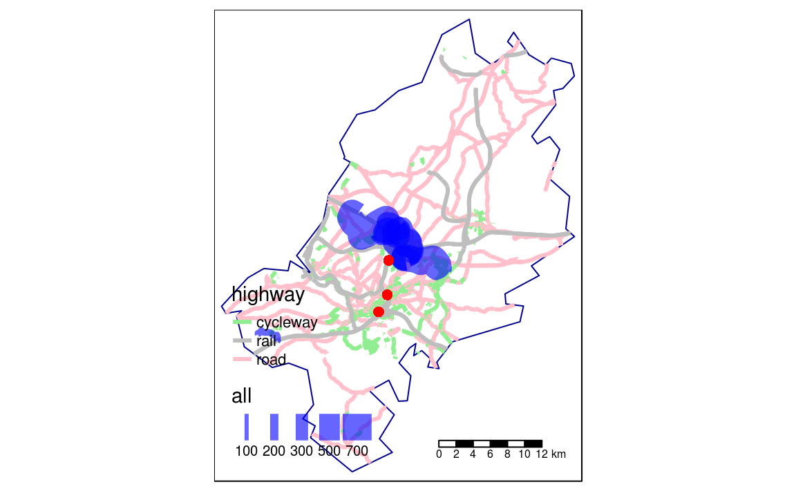
<p class="caption">(\#fig:cycleways)Potential routes along which to prioritise cycle infrastructure in Bristol, based on access key rail stations (red dots) and routes with many short car journeys (north of Bristol surrounding Stoke Bradley). Line thickness is proportional to number of trips.</p>
</div>

<!-- Much more work is needed to create a realistic strategic cycle network but the analysis shows that R can be used to create a transparent and reproducible evidence base for transport applications. -->
The results may look more attractive in an interactive map, but what do they mean?
The routes highlighted in Figure \@ref(fig:cycleways) suggest that transport systems are intimately linked to the wider economic and social context.
The example of Stoke Bradley is a case in point:
its location, lack of public transport services and active travel infrastructure help explain why it is so highly car-dependent.
The wider point is that car dependency has a spatial distribution which has implications for sustainable transport policies [@hickman_transitions_2011].

## Future directions of travel

This chapter provides a taster of the possibilities of using geocomputation for transport research.
It has explored some key geographic elements that make-up a city's transport system using open data and reproducible code.
The results could help plan where investment is needed.

Transport systems operate at multiple interacting levels, meaning that geocomputational methods have great potential to generate insights into how they work.
There is much more that could be done in this area: it would be possible to build on the foundations presented in this chapter in many directions.
Transport is the fastest growing source of greenhouse gas emissions in many countries, and is set to become "the largest GHG emitting sector, especially in developed countries" (see  [EURACTIV.com](https://www.euractiv.com/section/agriculture-food/opinion/transport-needs-to-do-a-lot-more-to-fight-climate-change/)).
Because of the highly unequal distribution of transport-related emissions across society, and the fact that transport (unlike food and heating) is not essential for well-being, there is great potential for the sector to rapidly decarbonize through demand reduction, electrification of the vehicle fleet and the uptake of active travel modes such as walking and cycling.
Further exploration of such 'transport futures' at the local level represents promising direction of travel for transport-related geocomputational research.

<!-- Something on lines, routes, route networks (RL) -->
Methodologically the foundations presented in this chapter could be extended by including more variables in the analysis.
Characteristics of the route such as speed limits, busyness and the provision of protected cycling and walking paths could be linked to 'mode-split' (the proportion of trips made by different modes of transport).
By aggregating OpenStreetMap data using buffers and spatial data methods presented in Chapters \@ref(attr) and \@ref(spatial-operations), for example, it would be possible to detect the presence of green space in close proximity to transport routes.
Using R's statistical modelling capabilities this could then be used to predict current and future levels of cycling, for example.

This type of analysis underlies the Propensity to Cycle Tool (PCT), a publicly accessible (see [www.pct.bike](http://www.pct.bike/)) mapping tool developed in R that is being used to prioritize investment in cycling across England [@lovelace_propensity_2017].
Similar tools could be used to encourage evidence-based transport policies related to other topics such as air pollution and public transport access around the world.

<!-- One growing area of interest surrounds the simulation of individual people and vehicles on the road network using techniques such as spatial microsimulation and agent-based modelling (ABM). -->
<!-- R has the capability to model people in zones, and interface with ABM software such as NetLogo. -->
<!-- Combined with its geographical capabilities, demonstrated in this book, R would seem an appropriate language for such developments to take place. -->
<!-- Of course this should be done in ways that build-on and extend existing work in the area. -->
<!-- R's 'ecological niche' in transport modelling software could be around the integration of detailed geographic and advanced statistical analysis methods with techniques already used in transport research. -->

## Exercises {#ex-transport}

1. What is the total distance of cycleways that would be constructed if all the routes presented in Figure \@ref(fig:cycleways) were to be constructed?
    - Bonus: find two ways of arriving at the same answer.


1. What proportion of trips represented in the `desire_lines` are accounted for in the `route_cycleway` object?
    - Bonus: what proportion of trips cross the proposed routes?
    - Advanced: write code that would increase this proportion.


1. The analysis presented in this chapter is designed for teaching how geocomputation methods can be applied to transport research. If you were to do this 'for real' for local government or a transport consultancy what top 3 things would you do differently?
<!-- Higher level of geographic resolution. -->
<!-- Use cycle-specific routing services. -->
<!-- Identify key walking routes. -->
<!-- Include a higher proportion of trips in the analysis -->
1. Clearly the routes identified in Figure \@ref(fig:cycleways) only provide part of the picture. How would you extend the analysis to incorporate more trips that could potentially be cycled?
1. Imagine that you want to extend the scenario by creating key *areas* (not routes) for investment in place-based cycling policies such as car-free zones, cycle parking points and reduced car parking strategy. How could raster data assist with this work? 
    - Bonus: develop a raster layer that divides the Bristol region into 100 cells (10 by 10) and provide a metric related to transport policy, such as number of people trips that pass through each cell by walking or the average speed limit of roads (from the `bristol_ways` dataset).

<!--chapter:end:12-transport.Rmd-->


# Geomarketing {#location}

## Prerequisites {-}

- This chapter requires the following packages (**ggmap** must also be installed):


```r
library(sf)
library(raster)
library(tidyverse)
library(osmdata)
library(spDataLarge)
```

- Required data will be downloaded in due course.
As a convenience to the reader and to ensure easy reproducibility we have made available the downloaded data in the **spDataLarge** package.

## Introduction

This chapter demonstrates how the skills learned in Part I can be applied to a particular domain: geomarketing (sometimes also referred to as location analysis or location intelligence).
This is a broad field of research and commercial application.
A typical example is where to locate a new shop.
The aim here is to attract most visitors and, ultimately, make most profit.
There are also many non-commercial applications that can use the technique for public benefit, for example where to locate new health services [@tomintz_geography_2008].

People are fundamental to location analysis, in particular where they are likely to spend their time and other resources.
Interestingly, ecological concepts and models are quite similar to those used for store location analysis.
Animals and plants can best meet their needs in certain 'optimal' locations, based on variables that change over space (@muenchow_review_2018<!--; see also chapter \@ref(eco)-->) .
This is one of the great strengths of geocomputation and GIScience in general.
Concepts and methods are transferable to other fields.
<!-- add reference!! -->
Polar bears, for example, prefer northern latitudes where temperatures are lower and food (seals and sea lions) is plentiful.
Similarly, humans tend to congregate certain places, creating economic niches (and high land prices) analogous to the ecological niche of the Arctic.
The main task of location analysis is to find out where such 'optimal locations' are for specific services, based on available data.
Typical research questions include:

- Where do target groups live and which areas do they frequent?
- Where are competing stores or services located?
- How many people can easily reach specific stores?
- Do existing services over or under-exploit the market potential?
- What is the market share of a company in a specific area?

This chapter demonstrates how geocomputation can answer such questions based on a hypothetical case study based on real data.

## Case study: bike shops in Germany {#case-study}

Imagine you are starting a chain of bike shops in Germany.
The stores should be placed in urban areas with as many potential customers as possible.
Additionally, a hypothetical survey (invented for this chapter not for commercial use!) suggests that single young males (aged 20 to 40) are most likely to buy your products: this is the *target audience*.
You are in the lucky position to have sufficient capital to open a number of shops.
But where should they be placed?
Consulting companies (employing geomarketing analysts) would happily charge high rates to answer such questions.
Luckily, we can do so ourselves with the help of open data and open source software.
The following sections will demonstrate how the techniques learned during the first chapters of the book can be applied to undertake the following steps:

- Tidy the input data from the German census (section \@ref(tidy-the-input-data)).
- Convert the tabulated census data into raster objects (section \@ref(create-census-rasters)).
- Identify metropolitan areas with high population densities (section \@ref(define-metropolitan-areas)).
- Download detailed geographic data (from OpenStreetMap, with **osmdata**) for these areas (section \@ref(points-of-interest)).
- Create rasters for scoring the relative desirability of different locations using map algebra (section \@ref(identifying-suitable-locations)).

Although we have applied these steps to a specific case study, they could be generalized to many scenarios of store location or public service provision.

## Tidy the input data

The German government provides gridded census data at either 1 km or 100 m resolution.
The following code chunk downloads, unzips and reads-in the 1 km data.


```r
download.file("https://tinyurl.com/ybtpkwxz", 
              destfile = "census.zip", mode = "wb")
unzip("census.zip") # unzip the files
census_de = readr::read_csv2(list.files(pattern = "Gitter.csv"))
```

As a convenience to the reader, the corresponding data has been put into **spDataLarge** and can be accessed as follows


```r
data("census_de", package = "spDataLarge")
```

The `census_de` object is a data frame containing 13 variables for more than 300,000 grid cells across Germany.
For our work we only need a subset of these: Easting (`x`) and Northing (`y`), number of inhabitants (population; `pop`), mean average age (`mean_age`), proportion of women (`women`) and average household size (`hh_size`).
These variables are selected and renamed from German into English in the code chunk below and summarized in Table \@ref(tab:census-desc). 
Further, `mutate_all()` is used to convert values -1 and -9 (meaning unknown) to `NA`.


```r
# pop = population, hh_size = household size
input = dplyr::select(census_de, x = x_mp_1km, y = y_mp_1km, pop = Einwohner,
                      women = Frauen_A, mean_age = Alter_D,
                      hh_size = HHGroesse_D)
# set -1 and -9 to NA
input_tidy = mutate_all(input, funs(ifelse(. %in% c(-1, -9), NA, .)))
```


Table: (\#tab:census-desc)Categories for each variable in Census data from 'Datensatzbeschreibung...xlsx' located in the downloaded file census.zip. See Figure 13.1 for their spatial distribution.

 class    Population    % female    Mean age    Household size 
-------  ------------  ----------  ----------  ----------------
   1        3-250         0-40        0-40           1-2       
   2       250-500       40-47       40-42          2-2.5      
   3       500-2000      47-53       42-44          2.5-3      
   4      2000-4000      53-60       44-47          3-3.5      
   5      4000-8000       >60         >47            >3.5      
   6        >8000                                              

## Create census rasters
 
After the preprocessing, the data can be converted into a raster stack or brick (see sections \@ref(raster-classes) and \@ref(raster-subsetting)).
`rasterFromXYZ()` makes this really easy.
It requires an input data frame where the first two columns represent coordinates on a regular grid.
All the remaining columns (here: `pop`, `women`, `mean_age`, `hh_size`) will serve as input for the raster brick layers (Figure \@ref(fig:census-stack); see also `code/13-location-jm.R`).


```r
input_ras = rasterFromXYZ(input_tidy, crs = st_crs(3035)$proj4string)
```


```r
input_ras
#> class : RasterBrick
#> dimensions : 868, 642, 557256, 4 (nrow, ncol, ncell, nlayers)
#> resolution : 1000, 1000 (x, y)
#> extent : 4031000, 4673000, 2684000, 3552000 (xmin, xmax, ymin, ymax)
#> coord. ref. : +proj=laea +lat_0=52 +lon_0=10
#> names       :  pop, women, mean_age, hh_size 
#> min values  :  127,     0,        0,       0 
#> max values  : 8000,     3,        3,       3 
```

\BeginKnitrBlock{rmdnote}<div class="rmdnote">Note that we are using an equal-area projection (EPSG:3035; Lambert Equal Area Europe), i.e. a projected CRS where each grid cell has the same area, here 1000 x 1000 square meters. 
Since we are using mainly densities such as the number of inhabitants or the portion of women per grid cell, it is of utmost importance that the area of each grid cell is the same to avoid 'comparing apples and oranges'.
Be careful with geographic CRS where grid cell areas constantly decrease in poleward directions (see also sections \@ref(crs-intro) and \@ref(reproj-geo-data)). </div>\EndKnitrBlock{rmdnote}

<div class="figure" style="text-align: center">

<p class="caption">(\#fig:census-stack)Gridded German census data of 2011. See Table 13.1 for a description of the classes.</p>
</div>

<!-- find out about new lines in headings + blank cells-->
The next stage is to reclassify the values of the rasters stored in `input_ras` in accordance with the survey mentioned in section \@ref(case-study), using the **raster** function `reclassify()`, which was introduced in section \@ref(local-operations).
In the case of the population data we convert the classes into a numeric data type using class means. 
Raster cells are assumed to have a population of 127 if they have a value of 1 (cells in 'class 1' contain between 3 and 250 inhabitants) and 375 if they have a value of 2 (containing 250 to 500 inhabitants), and so on (see Table \@ref(tab:census-desc)).
A cell value of 8000 inhabitants was chosen for 'class 6' because these cells contain more than 8000 people.
Of course, these are approximations of the true population, not precise values.^[
The potential error introduced during this reclassification stage will be explored in the exercises.
]
However, the level of detail is sufficient to delineate metropolitan areas (see next section).

In contrast to the `pop` variable, representing absolute estimates of the total population, the remaining variables were re-classified as weights corresponding with weights used in the survey.
Class 1 in the variable `women`, for instance, represents areas in which 0 to 40% of the population is female;
these are reclassified with a comparatively high weight of 3 because the target demographic is predominantly male.
Similarly, the classes containing the youngest people and highest proportion of single households are reclassified to have high weights.


```r
rcl_pop = matrix(c(1, 1, 127, 2, 2, 375, 3, 3, 1250, 
                   4, 4, 3000, 5, 5, 6000, 6, 6, 8000), 
                 ncol = 3, byrow = TRUE)
rcl_women = matrix(c(1, 1, 3, 2, 2, 2, 3, 3, 1, 4, 5, 0), 
                   ncol = 3, byrow = TRUE)
rcl_age = matrix(c(1, 1, 3, 2, 2, 0, 3, 5, 0),
                 ncol = 3, byrow = TRUE)
rcl_hh = rcl_women
rcl = list(rcl_pop, rcl_women, rcl_age, rcl_hh)
```

Note that we have made sure that the order of the reclassification matrices in the list is the same as for the elements of `input_ras`.
For instance, the first element corresponds in both cases to the population.
Subsequently, the `for`-loop applies the reclassification matrix to the corresponding raster layer.
Finally, the code chunk below ensures the `reclass` layers have the same name as the layers of `input_ras`.


```r
reclass = input_ras
for (i in 1:raster::nlayers(reclass)) {
  reclass[[i]] = reclassify(x = reclass[[i]], rcl = rcl[[i]], right = NA)
}
names(reclass) = names(input_ras)
```


```r
reclass
#> ... (full output not shown)
#> names       :  pop, women, mean_age, hh_size 
#> min values  :  127,     0,        0,       0 
#> max values  : 8000,     3,        3,       3
```


## Define metropolitan areas

We define metropolitan areas as pixels of 20 km^2^ inhabited by more than 500,000 people.
Pixels at this coarse resolution can rapidly be created using `aggregate()`, as introduced in section \@ref(aggregation-and-disaggregation).
The command below uses the argument `fact = 20` to reduce the resolution of the result twenty-fold (recall the original raster resolution was 1 km^2^):


```r
pop_agg = aggregate(reclass$pop, fact = 20, fun = sum)
```

The next stage is to keep only cells with more than half a million people.


```r
pop_agg = pop_agg[pop_agg > 500000, drop = FALSE] 
```

Plotting this reveals eight metropolitan regions (Fig. \@ref(fig:metro-areas)).
Each region consists of one or more raster cells.
It would be nice if we could join all cells belonging to one region.
**raster**'s `clump()` command does exactly that.
Subsequently, `rasterToPolygons()` converts the raster object into spatial polygons, and `st_as_sf()` converts it into an `sf`-object.


```r
polys = pop_agg %>% 
  clump %>%
  rasterToPolygons %>%
  st_as_sf
```

`polys` now features a column named `clumps` which indicates to which metropolitan region each polygon belongs and which we will use to dissolve the polygons into coherent single regions (see also section \@ref(geometry-unions)):


```r
metros = polys %>%
  group_by(clumps) %>%
  summarize
```

Given no other column as input, `summarize()` only dissolves the geometry.

<!-- maybe a good if advanced exercise
This requires finding the nearest neighbors (`st_intersects()`), and some additional processing.
Do not worry too much about the following code.
There is probably a better way to do it. 
Nevertheless, it finds all pixels belonging to one region in a generic way.
We use this information to assign each polygon (pixel) to a region.
Subsequently, we can use the region information to dissolve the pixels into region polygons.


```r
# dissolve on spatial neighborhood
nbs = st_intersects(polys, polys)
# nbs = over(polys, polys, returnList = TRUE)

fun = function(x, y) {
  tmp = lapply(y, function(i) {
  if (any(x %in% i)) {
   union(x, i)
  } else {
   x
    }
  })
  Reduce(union, tmp)
}
# call function recursively
fun_2 = function(x, y) {
  out = fun(x, y)
  while (length(out) < length(fun(out, y))) {
    out = fun(out, y)
  }
  out
}

cluster = map(nbs, ~ fun_2(., nbs) %>% sort)
# just keep unique clusters
cluster = cluster[!duplicated(cluster)]
# assign the cluster classes to each pixel
for (i in seq_along(cluster)) {
  polys[cluster[[i]], "region_id"] = i
}
# dissolve pixels based on the the region id
polys = group_by(polys, region_id) %>%
  summarize(pop = sum(layer, na.rm = TRUE))
# polys_2 = aggregate(polys, list(polys$region_id), sum)
plot(polys[, "region_id"])

# Another approach, can be also be part of an excercise

coords = st_coordinates(polys_3) %>% 
  as.data.frame
ls = split(coords, f = coords$L2)
ls = lapply(ls, function(x) {
  dplyr::select(x, X, Y) %>%
    as.matrix %>%
    list %>%
    st_polygon
})
metros = do.call(st_sfc, ls)
metros = st_set_crs(metros, 3035)
metros = st_sf(data.frame(region_id = 1:9), geometry = metros)
st_intersects(metros, metros)
plot(metros[-5,])
st_centroid(metros) %>%
  st_coordinates
```
-->


<div class="figure" style="text-align: center">

<p class="caption">(\#fig:metro-areas)The aggregated population raster (resolution: 20 km) with the identified metropolitan areas (golden polygons) and the corresponding names.</p>
</div>

The resulting eight metropolitan areas suitable for bike shops (Fig. \@ref(fig:metro-areas); see also `code/13-location-jm.R` for creating the figure) are still missing a name.
A reverse geocoding approach can settle this problem.
Given a coordinate, reverse geocoding finds the corresponding address.
Consequently, extracting the centroid coordinate of each metropolitan area can serve as an input for a reverse geocoding API.
The **ggmap** package makes use of the one provided by Google.^[
Google allows each user to access its services on a free basis for a maximum of 2500 queries a day.
]
`ggmap::revgeocode()` only accepts geographical coordinates (latitude/longitude), therefore, the first requirement is to bring the metropolitan polygons into an appropriate coordinate reference system (Chapter \@ref(reproj-geo-data)).


```r
metros_wgs = st_transform(metros, 4326)
coords = st_centroid(metros_wgs) %>%
  st_coordinates() %>%
  round(4)
#> Warning in st_centroid.sf(metros_wgs): st_centroid assumes attributes are
#> constant over geometries of x
#> Warning in st_centroid.sfc(st_geometry(x), of_largest_polygon =
#> of_largest_polygon): st_centroid does not give correct centroids for
#> longitude/latitude data
```

Additionally, `ggmap::revgeocode()` only accepts one coordinate at a time, which is why we iterate over each coordinate of `coords` via a loop (`map_dfr()`).
`map_dfr()` does exactly the same as `lapply()` except for returning a `data.frame` instead of a `list`.^[
For more on `lapply()` see @grolemund_r_2016 and @wickham_splitapplycombine_2011.
]
Sometimes, Google's reverse geocoding API is unable to find an address returning `NA`.
Usually, trying the same coordinate again returns an address at the second or third attempt (see `while()-loop`).
However, if ten attempts have already failed, this is a good indication that the requested information is indeed unavailable.
Since we aim to be good cyberspace citizens, we try not to overburden the server with too many queries within a short amount of time by letting the loop sleep between one and four seconds after each iteration before accessing the reverse geocoding API again.
Choosing `more` as `revgeocode()`'s `output` option will give back a `data.frame` with several columns referring to the location including the address, locality and various administrative levels.


```r
# reverse geocoding to find out the names of the metropolitan areas
metro_names = map_dfr(1:nrow(coords), function(i) {
  add = ggmap::revgeocode(coords[i, ], output = "more")
  x = 9
  while (is.na(add$address) & x > 0) {
    add = ggmap::revgeocode(coords[i, ], output = "more")
    # just try three times
    x = x - 1
  }
  # give the server a bit time
  Sys.sleep(sample(seq(1, 4, 0.1), 1))
  # return the result
  add
})
```

Though the `while`-loop helps to make the reverse geocoding more successful, it sometimes might still fail or even give back results slightly differing from those we here have produced here.
Therefore, to make sure that the reader uses the exact same results, we have put them into **spDataLarge**:


```r
# attach metro_names from spDataLarge
data("metro_names", package = "spDataLarge")
```


Table: (\#tab:metro-names)Result of the reverse geocoding.

locality            country 
------------------  --------
Hamburg             Germany 
Berlin              Germany 
Wülfrath            Germany 
Leipzig             Germany 
Frankfurt am Main   Germany 
Nürnberg            Germany 
Stuttgart           Germany 
München             Germany 

Overall, we are satisfied with the `locality` column serving as metropolitan names (Table \@ref(tab:metro-names)) apart from one exception, namely Wülfrath.
Hence, we replace Wülfrath with the corresponding name in the `administrative_area_level_2` column, that is Düsseldorf (Fig. \@ref(fig:metro-areas)).
Umlauts like `ü` might lead to trouble further on, for example when determining the bounding box of a metropolitan area with `opq()` (see further below), which is why we replace them.


```r
metro_names = 
  dplyr::select(metro_names, locality, administrative_area_level_2) %>%
  # replace Wülfrath and umlaut ü
  mutate(locality = ifelse(locality == "Wülfrath",
                           administrative_area_level_2,
                           locality),
         locality = gsub("ü", "ue", locality)) %>%
  pull(locality)
```

## Points of interest

The **osmdata** package provides easy-to-use access to OSM data (see also section \@ref(retrieving-data)).
Instead of downloading shops for the whole of Germany, we restrict the query to the defined metropolitan areas, reducing computational load and providing shop locations only in areas of interest.
The subsequent code chunk does this using a number of functions including:

- `map()` (the **tidyverse** equivalent of `lapply()`), which iterates through all eight metropolitan names which subsequently define the bounding box in the OSM query function `opq()` (see section \@ref(retrieving-data)).
<!-- Alternatively, we could have provided the bounding box in the form of coordinates ourselves. -->
- `add_osm_feature()` to specify OSM elements with a key value of `shop` (see [wiki.openstreetmap.org](http://wiki.openstreetmap.org/wiki/Map_Features) for a list of common key:value pairs).
- `osmdata_sf()`, which converts the the OSM data into spatial objects (of class `sf`).
- `while()`, which tries repeatedly (three times in this case) to download the data if it fails first time.^[
As with Google's reverse geocode API, the OSM-download will sometimes fail at the first attempt.
]
Before running this code: please consider it will download almost 2GB of data.
To save time and resources we have output into **spDataLarge** and should already be available in your environment as an object called `shops`.


```r
shops = map(metro_names, function(x) {
  message("Downloading shops of: ", x, "\n")
  # give the server a bit time
  Sys.sleep(sample(seq(5, 10, 0.1), 1))
  query = opq(x) %>%
    add_osm_feature(key = "shop")
  points = osmdata_sf(query)
  # request the same data again if nothing has been downloaded
  iter = 2
  while (nrow(points$osm_points) == 0 & iter > 0) {
    points = osmdata_sf(query)
    iter = iter - 1
  }
  points = st_set_crs(points$osm_points, 4326)
})
```

It is highly unlikely that there are no shops in any of our defined metropolitan areas.
The following `if` condition simply checks if there is at least one shop for each region.
If not, we would try to download the shops again for this/these specific region/s.


```r
# checking if we have downloaded shops for each metropolitan area
ind = map(shops, nrow) == 0
if (any(ind)) {
  message("There are/is still (a) metropolitan area/s without any features:\n",
          paste(metro_names[ind], collapse = ", "), "\nPlease fix it!")
}
```

To make sure that each list element (an `sf` data frame) comes with the same columns, we only keep the `osm_id` and the `shop` columns with the help of another `map` loop.
This is not a given since OSM contributors are not equally meticulous when collecting data.
Finally, we `rbind` all shops into one large `sf` object.


```r
# select only specific columns
shops = map(shops, dplyr::select, osm_id, shop)
# putting all list elements into a single dataframe
shops = do.call(rbind, shops)
```

It would have been easier to simply use `map_dfr()`. 
Unfortunately, so far it does not work in harmony with `sf` objects.
Please note that the `shops` object is also available in the `spDataLarge` package:


```r
data("shops", package = "spDataLarge")
```

The only thing left to do is to convert the spatial point object into a raster (see section \@ref(rasterization)).
The `sf` object, `shops`, is converted into a raster having the same parameters (dimensions, resolution, CRS) as the `reclass` object.
Importantly, the `count()` function is used here to calculate the number shops in each cell.

\BeginKnitrBlock{rmdnote}<div class="rmdnote">If the `shop` column were used instead of the `osm_id` column, we would have retrieved fewer shops per grid cell. 
This is because the `shop` column contains `NA` values, which the `count()` function omits when rasterizing vector objects.</div>\EndKnitrBlock{rmdnote}

The result of the subsequent code chunk is therefore an estimate of shop density (shops/km^2^).
`st_transform()` is used before `rasterize()` to ensure the CRS of both inputs match.


```r
shops = st_transform(shops, proj4string(reclass))
# create poi raster
poi = rasterize(x = shops, y = reclass, field = "osm_id", fun = "count")
```

As with the other raster layers (population, women, mean age, household size) the `poi` raster is reclassified into four classes (see section \@ref(create-census-rasters)). 
Defining class intervals is an arbitrary undertaking to a certain degree.
One can use equal breaks, quantile breaks, fixed values or others.
Here, we choose the Fisher-Jenks natural breaks approach which minimizes within-class variance, the result of which provides an input for the reclassification matrix.


```r
# construct reclassification matrix
int = classInt::classIntervals(values(poi), n = 4, style = "fisher")
int = round(int$brks)
rcl_poi = matrix(c(int[1], rep(int[-c(1, length(int))], each = 2), 
                   int[length(int)] + 1), ncol = 2, byrow = TRUE)
rcl_poi = cbind(rcl_poi, 0:3)  
# reclassify
poi = reclassify(poi, rcl = rcl_poi, right = NA) 
names(poi) = "poi"
```

## Identifying suitable locations

The only steps that remain before combining all the layers are to add POI and delete the population from the raster stack.
The reasoning for the latter is twofold.
First of all, we have already delineated metropolitan areas, that is areas where the population density is above average compared to the rest of Germany.
Secondly, though it is advantageous to have many potential customers within a specific catchment area, the sheer number alone might not actually represent the desired target group.
For instance, residential tower blocks are areas with a high population density but not necessarily with a high purchasing power for expensive cycle components.
This is achieved with the complimentary functions `addLayer()` and `dropLayer()`:


```r
# add poi raster
reclass = addLayer(reclass, poi)
# delete population raster
reclass = dropLayer(reclass, "pop")
```

In common with other data science projects, data retrieval and 'tidying' have consumed much of the overall workload so far.
With clean data the final step, calculating a final score by summing up all raster layers, can be accomplished in a single line.


```r
# calculate the total score
result = sum(reclass)
```

For instance, a score greater than 9 might be a suitable threshold indicating raster cells where a bike shop could be placed (Figure \@ref(fig:bikeshop-berlin); see also `code/13-location-jm.R`).

<div class="figure" style="text-align: center">
preservef76b13982e0a015a
<p class="caption">(\#fig:bikeshop-berlin)Suitable areas (i.e. raster cells with a score > 9) in accordance with our hypothetical survey for bike stores in Berlin.</p>
</div>

## Discussion and next steps

The presented approach is a typical example of the normative usage of a GIS [@longley_geographic_2015].
We combined survey data with expert-based knowledge and assumptions (definition of metropolitan areas, defining class intervals, definition of a final score threshold).
It should be clear that this approach is not suitable for scientific knowledge advancement but is a very applied way of information extraction.
This is to say, we can only suspect based on common sense that we have identified areas suitable for bike shops.
However, we have no proof that this is in fact the case.

A few other things remained unconsidered but might improve the analysis:

- We used equal weights when calculating the final scores.
But is, for example, the household size as important as the portion of women or the mean age?
- We used all points of interest. 
Maybe it would be wiser to use only those which might be interesting for bike shops such as do-it-yourself, hardware, bicycle, fishing, hunting, motorcycles, outdoor and sports shops (see the range of shop values available on the  [OSM Wiki](http://wiki.openstreetmap.org/wiki/Map_Features#Shop)).
- Data at a better resolution may change and improve the output. For example, there is also population data at a finer resolution (100 m; see exercises).
- We have used only a limited set of variables. 
For example, the [INSPIRE geoportal](http://inspire-geoportal.ec.europa.eu/discovery/) might contain much more data of possible interest to our analysis (see also section \@ref(retrieving-data).
The bike paths density might be another interesting variable as well as the purchasing power or even better the retail purchasing power for bikes.
- Interactions remained unconsidered, such as a possible interaction between the portion of men and single households.
However, to find out about such an interaction we would need customer data.

In short, the presented analysis is far from perfect.
Nevertheless, it should have given you a first impression and understanding of how to obtain, and deal with spatial data in R within a geomarketing context.

Finally, we have to point out that the presented analysis would be merely the first step of finding suitable locations.
So far we have identified areas, 1 by 1 km in size, potentially suitable for a bike shop in accordance with our survey.
We could continue the analysis as follows:

- Find an optimal location based on number of inhabitants within a specific catchment area.
For example, the shop should be reachable for as many people as possible within 15 minutes of traveling bike distance (catchment area routing).
Thereby, we should account for the fact that the further away the people are from the shop, the more unlikely it becomes that they actually visit it (distance decay function).
- Also it would be a good idea to take into account competitors. 
That is, if there already is a bike shop in the vicinity of the chosen location, one has to distribute possible customers (or sales potential) between the competitors [@huff_probabilistic_1963; @wieland_market_2017].
- We need to find suitable and affordable real estate (accessible, parking spots, frequency of passers-by, big windows, etc.).

## Exercises

1. We have used `raster::rasterFromXYZ()` to convert a `input_tidy` into a raster brick. Try to achieve the same with the help of the `sp::gridded()` function.
<!--
input = st_as_sf(input, coords = c("x", "y"))
# use the correct projection (see data description)
input = st_set_crs(input, 3035)
# convert into an sp-object
input = as(input, "Spatial")
gridded(input) = TRUE
# convert into a raster stack
input = stack(input)
-->

1. Download the csv file containing inhabitant information for a 100 m cell resolution (https://www.zensus2011.de/SharedDocs/Downloads/DE/Pressemitteilung/DemografischeGrunddaten/csv_Bevoelkerung_100m_Gitter.zip?__blob=publicationFile&v=3).
Please note that the unzipped file has a size of 1.23 GB.
To read it into R you can use `readr::read_csv`.
This takes 30 seconds on my machine (16 GB RAM)
`data.table::fread()` might be even faster, and returns an object of class `data.table()`.
Use `as.tibble()` to convert it into a tibble.
Build an inhabitant raster, aggregate it to a cell resolution of 1 km, and compare the difference with the inhabitant raster (`inh`) we have created using class mean values.

1. Suppose our bike shop predominantly sold electric bikes to older people. 
Change the age raster accordingly, repeat the remaining analyses and compare the changes with our original result.

<!--chapter:end:13-location.Rmd-->


# References {-}

<!--chapter:end:references.Rmd-->

